# 1. Хранение данных и внутреннее устройство

[← Оглавление](../README.md) · [Раздел 2 →](02-query-pipeline.md)

Вопросы 1–10 и дополнительный 1а. Практика: [`01_scan_vs_seek_demo.sql`](../sql/01_scan_vs_seek_demo.sql), [`06_heap_forwarded_records.sql`](../sql/06_heap_forwarded_records.sql), [`10_index_maintenance_audit.sql`](../sql/10_index_maintenance_audit.sql), [`14_row_overflow_lob_demo.sql`](../sql/14_row_overflow_lob_demo.sql).

---

## 1. Страница и экстент

> **Кратко.** Страница — минимальная единица ввода-вывода и хранения, **8 КБ** (8 192 байта). Экстент — **8 подряд идущих страниц = 64 КБ**, единица выделения места.

**Страница** состоит из трёх частей:

| Часть | Что хранит |
|---|---|
| Заголовок, 96 байт | ID страницы, тип, объём свободного места, ссылки на предыдущую и следующую страницу уровня B-дерева |
| Строки данных | Заполняются сверху вниз. Одна строка in-row — не больше **8 060 байт** |
| Массив смещений (slot array) | В конце страницы, растёт снизу вверх: по 2 байта на строку, смещение до неё от начала страницы |

Основные типы страниц:
- данные (IN_ROW_DATA): строки кучи и листья кластерного индекса;
- индексные: корень и промежуточные уровни B-деревьев;
- ROW_OVERFLOW_DATA: вынесенные столбцы переменной длины;
- LOB: `varchar(max)`, `xml` и т.п.;
- служебные карты: PFS (свободное место), GAM/SGAM (выделение экстентов), IAM (какие экстенты принадлежат объекту).

**Если строка не помещается в 8 060 байт**, движок целиком выносит колонки переменной длины: значения `(n)`-типов уходят на страницы ROW_OVERFLOW_DATA (в строке остаётся указатель 24 байта), значения `(max)`-типов — в LOB_DATA. `(max)`-значения по умолчанию лежат в строке, пока помещаются. Каждое вынесенное значение — лишние чтения, поэтому `SELECT *` по таблице с большими колонками дороже, чем выборка нужных столбцов. Подробно — [вопрос 1а](#1а-row_overflow_data-и-lob_data-куда-уезжают-большие-значения). В PostgreSQL аналог — TOAST: сжатие и вынос в `pg_toast_*`, начиная примерно с 2 КБ.

**Экстенты** бывают двух видов. Смешанные (mixed) делят до 8 объектов: так маленькая таблица не занимает сразу 64 КБ. Однородные (uniform) целиком принадлежат одному объекту.

Логические и физические чтения, а также метрики `SET STATISTICS IO` считаются **в страницах**. 1 000 000 логических чтений ≈ 7,6 ГБ данных, прошедших через память.

---

## 1а. ROW_OVERFLOW_DATA и LOB_DATA: куда уезжают большие значения

> **Формулировка вопроса.** Что происходит, если строка таблицы не помещается в 8 060 байт или значение колонки больше 8 000 байт? Чем отличаются единицы распределения IN_ROW_DATA, ROW_OVERFLOW_DATA и LOB_DATA? Как хранится большое значение (например, 1 МБ) и как всё это влияет на производительность?

> **Кратко.**
> - У каждой таблицы и индекса до трёх **единиц распределения** (allocation units): **IN_ROW_DATA** (обычные страницы со строками), **ROW_OVERFLOW_DATA** (вынесенные колонки ограниченной длины) и **LOB_DATA** (большие объекты).
> - Если строка больше 8 060 байт, движок **целиком** выносит одну или несколько колонок переменной длины, начиная с самой широкой. В строке вместо каждой остаётся указатель.
> - **Куда уедет колонка, решает её тип, а не размер:** `varchar(n)`, `nvarchar(n)`, `varbinary(n)`, `sql_variant` — в ROW_OVERFLOW (указатель 24 байта); `(max)`-типы и `xml` — в LOB (корень в строке 24–72 байта).
> - `(max)`-значения по умолчанию лежат **в строке**, пока влезают. Большое значение хранится в LOB **деревом** страниц, а не цепочкой.
> - Цена — лишние, часто случайные чтения, которые видны как `lob logical reads`.

### Три единицы распределения

| Единица | Что хранит | Когда появляется |
|---|---|---|
| **IN_ROW_DATA** | Строки данных и индексов. Одна строка — не больше **8 060 байт** | Всегда |
| **ROW_OVERFLOW_DATA** | Значения колонок **ограниченной** переменной длины (`varchar(n)`, `nvarchar(n)`, `varbinary(n)`, `sql_variant`, CLR UDT), вынесенные из строки. Каждое значение ≤ 8 000 байт | Сумма колонок строки > 8 060 байт |
| **LOB_DATA** | `varchar(max)`, `nvarchar(max)`, `varbinary(max)`, `xml`, `text`, `ntext`, `image` | Значение не поместилось в строку (> 8 000 байт или строке не хватило места), либо таблица настроена хранить такие значения вне строки |

У одной строки могут одновременно быть указатели и в ROW_OVERFLOW, и в LOB.

### Механизм ROW_OVERFLOW

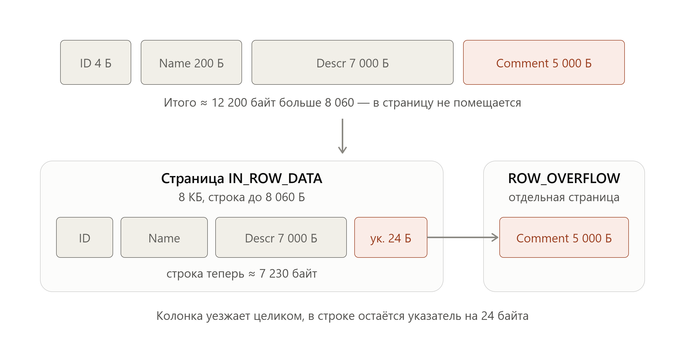

1. **Проверяется строка целиком**, а не отдельная колонка. Колонка на 5 000 байт сама по себе никуда не уедет. Перенос начинается, только если **сумма** колонок строки превысила 8 060 байт.
2. **Колонка переносится целиком.** Значение не режется на часть «в строке» и «хвост на другой странице». Любое значение `(n)`-типа не больше 8 000 байт и всегда помещается на одну overflow-страницу.
3. **Какую колонку вынести, решает движок.** Выносится самая широкая колонка переменной длины, затем следующая, пока строка не поместится. Указать вручную нельзя. Колонки фиксированной длины (`int`, `char(n)`, `datetime2`…) вынести нельзя: если они одни дают больше 8 060 байт, `CREATE TABLE`/`INSERT` завершится ошибкой.
4. **Обратный переезд.** Если при UPDATE строка уменьшилась, значение может вернуться в строку, если выросла — снова уехать. «Пульсирующие» данные нагружают журнал и фрагментируют таблицу.

### Механизм LOB

- **`(max)`-типы и `xml` по умолчанию хранятся в строке**, если значение ≤ 8 000 байт и вся строка помещается в 8 060. Короткий комментарий в `nvarchar(max)` лежит на обычной странице IN_ROW_DATA, как и в `nvarchar(n)`.
- Если значение большое или строке не хватает места, оно **целиком** уходит в **LOB_DATA** (не в ROW_OVERFLOW!). В строке остаётся **корень** размером 24–72 байта (до пяти прямых ссылок).
- `EXEC sp_tableoption N'dbo.T', 'large value types out of row', 1;` — `(max)`-значения всегда хранятся вне строки, даже короткие; в строке остаётся указатель 16 байт. Это полезно, если большая колонка читается редко, а сама таблица сканируется часто: строки становятся узкими. Уже существующие значения переезжают только при следующем UPDATE.
- **Старые `text`, `ntext`, `image`**, наоборот, по умолчанию **всегда** вне строки. Держать их в строке позволяет опция `'text in row'`. Эти типы устарели, вместо них используют `(max)`.

### Куда попадёт значение

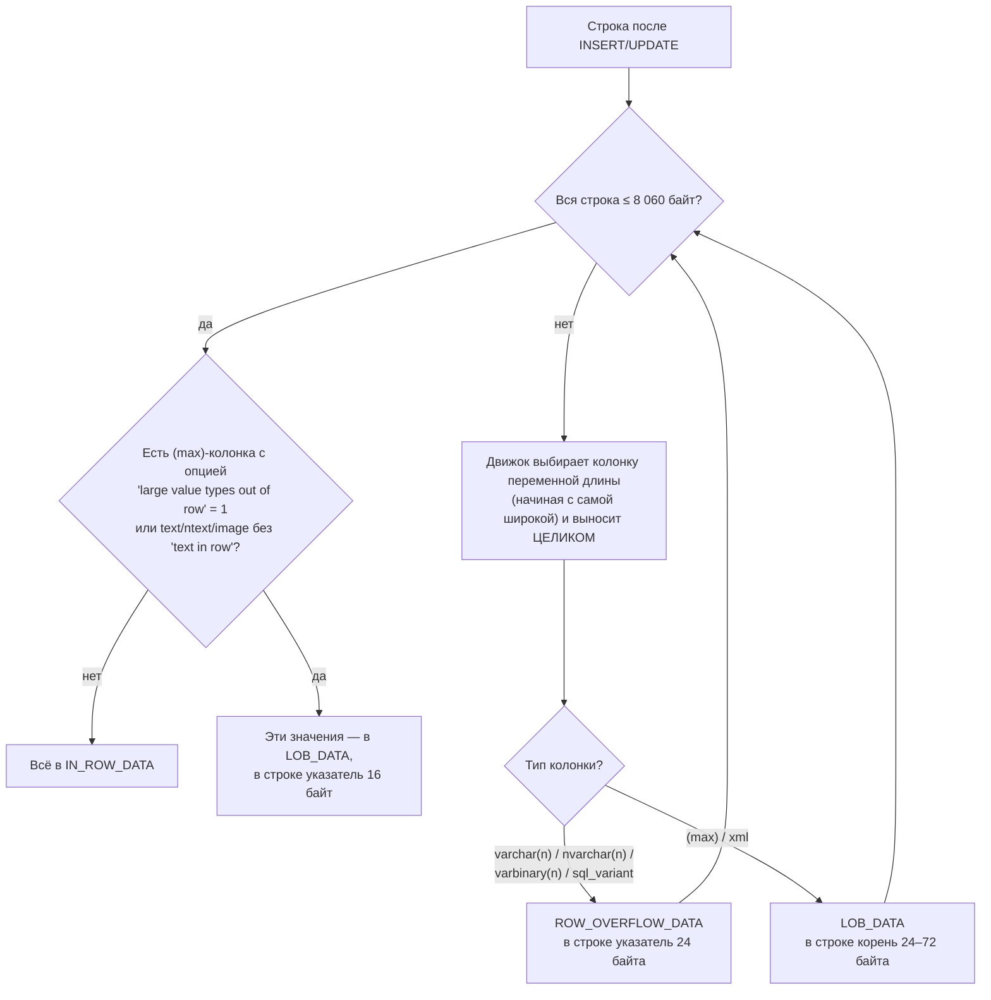
```mermaid
flowchart TD
    A["Строка после INSERT/UPDATE"] --> B{"Вся строка ≤ 8 060 байт?"}
    B -- да --> C{"Есть (max)-колонка с опцией<br/>'large value types out of row' = 1<br/>или text/ntext/image без 'text in row'?"}
    C -- нет --> IR["Всё в IN_ROW_DATA"]
    C -- да --> L1["Эти значения — в LOB_DATA,<br/>в строке указатель 16 байт"]
    B -- нет --> W["Движок выбирает колонку переменной длины<br/>(начиная с самой широкой) и выносит ЦЕЛИКОМ"]
    W --> T{"Тип колонки?"}
    T -- "varchar(n) / nvarchar(n) /<br/>varbinary(n) / sql_variant" --> RO["ROW_OVERFLOW_DATA<br/>в строке указатель 24 байта"]
    T -- "(max) / xml" --> LOB["LOB_DATA<br/>в строке корень 24–72 байта"]
    RO --> B
    LOB --> B
```

### Частые заблуждения

| Утверждение | Как на самом деле |
|---|---|
| «Часть значения останется в строке, а то, что больше лимита, уедет на отдельную страницу» | Нет. В ROW_OVERFLOW колонка уезжает **целиком**. Большое LOB-значение тоже хранится целиком вне строки; в строке только корень со ссылками |
| «Лимит — 8 090 байт» | Лимит строки **8 060** байт. Из 8 192 байт страницы 96 уходят на заголовок, остальное — на строки и массив смещений |
| «LOB всегда сразу уезжает на отдельную страницу» | Нет. `(max)` лежит в строке, пока помещается. Всегда вне строки хранятся только `text/ntext/image` (по умолчанию) и `(max)` с опцией `large value types out of row` |
| «Строка больше 8 060 — значит, это LOB, а не ROW_OVERFLOW» | Решает **тип** вынесенной колонки: `(n)` → ROW_OVERFLOW, `(max)` → LOB. Большой размер строки только запускает вынос |
| «Значение больше 8 000 байт может оказаться в ROW_OVERFLOW» | Нет. Такое значение физически может храниться только в `(max)`-типе (у `nvarchar(n)` максимум — 4 000 символов = 8 000 байт), а значит только в LOB |

Правило для запоминания:
- **ROW_OVERFLOW** — «много средних колонок не влезли вместе»;
- **LOB** — «не влезло значение `(max)`-колонки» (само значение больше 8 000 байт или ему не хватило места в строке).

### Как хранится значение размером 1 МБ: дерево, а не цепочка

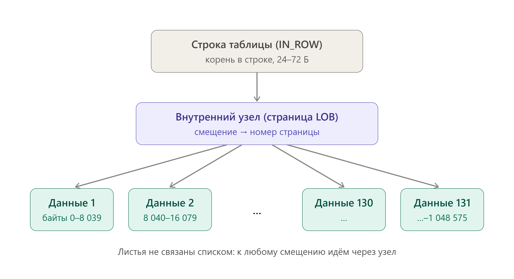

1. Значение режется на куски, которые помещаются на страницу данных (≈ 8 000 байт). Для 1 048 576 байт это около **131 страницы**. Для `nvarchar(max)` 1 МБ — примерно 524 тысячи символов по 2 байта.
2. Корень в строке таблицы хранит только несколько прямых ссылок (до пяти). Значения примерно **до 40 КБ** обходятся без промежуточного уровня: корень сразу указывает на страницы данных.
3. Для 1 МБ прямых ссылок не хватает, поэтому создаётся **внутренний узел** — отдельная LOB-страница со списком пар «до какого смещения → какая страница». Одна такая страница вмещает сотни ссылок, так что для 1 МБ хватает одного узла. Для значений в сотни мегабайт и гигабайты у дерева появляются ещё уровни.
4. Страницы выделяются из экстентов по мере записи. Физически они могут лежать подряд, а могут быть разбросаны по файлу: логический порядок держится на дереве, а не на расположении.

**Почему дерево, а не список.** Чтобы прочитать фрагмент из середины (`SUBSTRING(col, 300000, 100)`) или частично обновить значение (`UPDATE … SET col.WRITE(@chunk, @offset, @len)`), не нужно читать все предыдущие страницы. Достаточно пройти путь «корень → узел → нужный лист» — это 2–3 чтения вместо ~75 при связном списке.

Небольшие LOB-фрагменты разных строк могут лежать вместе на одной «смешанной» LOB-странице (`TEXT_MIX_PAGE`), чтобы не тратить по 8 КБ на каждые 500 байт. Большие значения получают собственные страницы; узлы дерева — это `TEXT_TREE_PAGE`.

### Влияние на производительность

- **Лишние чтения.** Вынесенную колонку читают отдельным переходом по указателю на другую страницу. Такие чтения часто случайные. В `SET STATISTICS IO` они показаны отдельно как `lob logical reads` / `lob physical reads`: overflow-страницы считаются там вместе с LOB.
- **Не выбирается — не читается.** Если запрос не обращается к вынесенным колонкам, их страницы не читаются. Ещё одна причина не писать `SELECT *`.
- **Узкие строки — больше строк на страницу.** Вынос редко используемых больших значений (`large value types out of row` или отдельная таблица) ускоряет сканы основной таблицы.
- **Пульсирующие UPDATE** гоняют значения между IN_ROW и ROW_OVERFLOW: журнал, фрагментация.
- **Память под Sort/Hash.** Ширину колонок переменной длины оптимизатор оценивает не по данным, а по объявлению: примерно как половину объявленного размера, для `(max)` — порядка 4 000 байт. Лишние широкие колонки в запросе с сортировкой раздувают memory grant ([вопрос 49](05-plans-operators.md#49-memory-grant)).
- **Индексы.** Колонки `(max)` не могут быть ключом индекса, но могут быть в `INCLUDE`. Для строк переменной длины в ключе действуют лимиты 900 и 1 700 байт ([вопрос 5](#5-включённые-столбцы-include-и-ключевые-столбцы)).
- **Обслуживание.** `ALTER INDEX … REBUILD WITH (ONLINE = ON)` для таблиц с LOB-колонками поддерживается с SQL Server 2012. `REORGANIZE` по умолчанию уплотняет и LOB-страницы (`LOB_COMPACTION = ON`).

### Как проверить

```sql
-- Сколько страниц в каждой единице распределения (по всем секциям)
SELECT OBJECT_SCHEMA_NAME(ps.object_id) + N'.' + OBJECT_NAME(ps.object_id) AS table_name,
       ps.index_id,
       SUM(ps.in_row_data_page_count)       AS in_row_pages,
       SUM(ps.row_overflow_used_page_count) AS row_overflow_pages,
       SUM(ps.lob_used_page_count)          AS lob_pages
FROM sys.dm_db_partition_stats ps
WHERE OBJECTPROPERTY(ps.object_id, 'IsUserTable') = 1
GROUP BY ps.object_id, ps.index_id
HAVING SUM(ps.row_overflow_used_page_count) > 0 OR SUM(ps.lob_used_page_count) > 0
ORDER BY row_overflow_pages DESC, lob_pages DESC;

-- Детально по одной таблице: строка на каждую единицу распределения
SELECT index_id, alloc_unit_type_desc, page_count, record_count, avg_record_size_in_bytes
FROM sys.dm_db_index_physical_stats(DB_ID(), OBJECT_ID(N'dbo.T'), NULL, NULL, 'DETAILED')
WHERE index_level = 0;
```

`row_overflow_used_page_count > 0` означает, что часть строк не поместилась в 8 060 байт и какие-то колонки ограниченной длины вынесены. `lob_used_page_count > 0` означает, что есть вынесенные `(max)`-значения. Это может быть и при маленьких строках, если значения большие.

### Применительно к 1С

- **Строка неограниченной длины** хранится как `nvarchar(max)`, **ХранилищеЗначения** — как `varbinary(max)`. Короткие значения лежат прямо в строке таблицы, в LOB уходят только большие.
- **ROW_OVERFLOW** появляется в «широких» справочниках, документах и табличных частях с множеством длинных строковых реквизитов ограниченной длины, если фактически заполненные значения в сумме превышают 8 060 байт.
- **Объект читается целиком.** При получении объекта (`ПолучитьОбъект()`, открытие формы) платформа читает все его реквизиты, включая большие ХранилищаЗначения. Поэтому файлы и большие двоичные данные держат не в самом документе или справочнике, а в отдельном справочнике или регистре сведений, как присоединённые файлы в БСП. Тогда основная таблица остаётся узкой.
- **Поля неограниченной длины** нельзя эффективно сравнивать, группировать и сортировать. В запросах используют `ВЫРАЗИТЬ(Поле КАК СТРОКА(150))` и не выбирают такие поля без необходимости ([вопрос 73](08-1c-specifics.md#73-точка-от-составного-типа-и-выразить)).

> ⚠️ **Уточнение к исходному ответу.** В разборе встречался пример: таблица `(ID int, A nvarchar(4000), B nvarchar(max))`, в `A` 7 000 байт, в `B` 3 000 байт, и утверждалось, что вынесена будет `B`. Документированное правило другое: выносится **самая широкая** колонка переменной длины. По нему первой кандидаткой была бы `A` (7 000 байт → ROW_OVERFLOW), после чего `B` поместилась бы в строке. Как именно поступит ваша версия SQL Server, проверьте блоком 4 скрипта [`14_row_overflow_lob_demo.sql`](../sql/14_row_overflow_lob_demo.sql): он показывает, в какой единице распределения появились страницы.

Все эксперименты на данных — [`14_row_overflow_lob_demo.sql`](../sql/14_row_overflow_lob_demo.sql).

---

## 2. Куча и таблица с кластерным индексом. RID и ключ кластеризации

> **Кратко.** Куча (heap) — таблица без кластерного индекса: страницы без порядка и без дерева. Строку в ней адресует физический **RID = файл:страница:слот**. В кластерной таблице листовой уровень B-дерева **и есть таблица**, строки упорядочены по ключу, а адресом строки служит **значение ключа кластеризации**.

| | Куча | Кластерная таблица |
|---|---|---|
| Порядок строк | Нет (куда нашлось место) | По ключу кластерного индекса |
| Структура | Набор страниц + IAM | B-дерево, листья = данные |
| Указатель в НК-индексах | RID (физический) | Ключ кластеризации (логический) |
| Дочитывание строки | **RID Lookup** — сразу на страницу | **Key Lookup** — спуск по кластерному B-дереву (2–4 чтения) |
| Строка выросла и не влезла | Переезжает, остаётся **forwarding pointer** (вопрос 9) | **Page split**, НК-индексы не трогаются |
| Полный просмотр | Table Scan | Clustered Index Scan |

Если кластерный индекс не уникальный, SQL Server добавляет к повторяющимся ключам скрытый 4-байтовый **uniquifier**. Иначе указатель в НК-индексах не был бы однозначным.

**Когда куча оправдана:**
- staging-таблицы массовой загрузки (грузим быстро, индексы строим потом);
- крошечные таблицы на 1–2 страницы;
- таблицы, которые всегда читаются целиком.

Большие постоянные таблицы с обновлениями почти всегда делают кластерными. В 1С у всех объектных таблиц кластерный индекс есть, а кучами бывают временные таблицы `#tt` без `ИНДЕКСИРОВАТЬ ПО`.

---

## 3. Устройство B-дерева

> **Кратко.** B-дерево (точнее, B⁺-дерево) сбалансировано: путь от корня до любого листа одинаковый, поэтому поиск среди миллионов строк стоит 3–4 чтения страниц. Корень и промежуточные уровни хранят **ключи-разделители** и ссылки на страницы ниже. **Листья** хранят данные (у кластерного) или ключ + указатель (у некластерного). Листья одного уровня связаны двусвязным списком, поэтому диапазон читается «подряд».

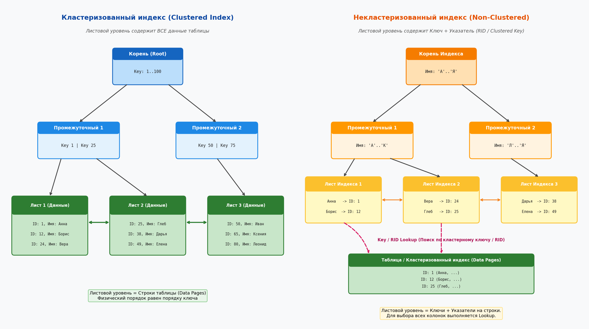

| | Кластерный индекс | Некластерный индекс |
|---|---|---|
| Сколько на таблицу | Один | Много (до 999) |
| Что в листьях | Вся строка, все столбцы | Ключ индекса + INCLUDE-столбцы + указатель (ключ кластеризации или RID) |
| Если нужны другие столбцы | — | Key Lookup / RID Lookup |

Как выглядит поиск `WHERE ID = 50`: корень говорит «50…99 — на странице X», промежуточная страница говорит «50…74 — на странице Y», на листе Y находится строка. Итого 3 логических чтения. Как дерево растёт при вставках и когда у него появляется новый уровень — [пошаговая визуализация page split](#пошаговая-визуализация-page-split) в вопросе 7.

---

## 4. Почему ключ кластерного индекса есть в каждом некластерном и к чему это приводит

> **Кратко.** У строки кластерной таблицы нет постоянного физического адреса: при page split она переезжает. Поэтому некластерный индекс ссылается на неё **логически, по ключу кластеризации**, и хранит этот ключ в каждой своей записи.

**Плюсы:**
- page split в кластерном индексе не требует правки некластерных индексов;
- ключ кластеризации «бесплатно» покрывает запросы. Индекс `IX(CustomerID)` покрывает `SELECT OrderID, CustomerID … WHERE CustomerID = @c`, если `OrderID` — ключ кластера. В статистике такого индекса ключ кластера виден последней строкой вектора плотности.

**Минусы:**
- **широкий ключ кластеризации раздувает все индексы**. `uniqueidentifier` (16 байт) или составной ключ из строк копируется в каждую запись каждого НК-индекса. Отсюда меньше строк на страницу, больше уровней, больше чтений и памяти;
- `UPDATE` ключа кластеризации дорог: строку нужно переместить и поправить все НК-индексы;
- если на куче сначала построить НК-индексы, а потом добавить кластерный, **все НК-индексы перестроятся** (RID заменится на ключ). Поэтому кластерный индекс создают первым.

Хороший ключ кластеризации: **узкий, уникальный, неизменяемый, монотонно растущий**. Классика — `int/bigint IDENTITY`.

> 1С: в ссылочных таблицах кластерный ключ — `_IDRRef` (binary(16), GUID). Он узкий и неизменяемый, но не монотонный, поэтому вставки идут в случайные страницы.


### Ключ кластеризации в индексе: неявно или явно

SQL Server добавляет ключ кластеризации в некластерный индекс по-разному — в зависимости от того, что объявлено при создании индекса:

| Ситуация | Что делает SQL Server |
|---|---|
| Столбцы ключа кластеризации **не указаны** в индексе | Добавляет их **сам, неявно**. В **неуникальном** индексе — в конец ключа, на всех уровнях дерева (так строки индекса становятся уникальными). В **уникальном** — только в листья, как указатель на строку |
| Столбцы ключа кластеризации **уже указаны** в индексе (в любом порядке, в ключе или в `INCLUDE`) | Ничего не добавляет и не дублирует: указатель на строку уже есть |

**SSMS показывает только объявленные столбцы.** Неявно добавленный ключ кластеризации окно свойств индекса не показывает никогда: у индекса по `A` вы увидите один столбец, хотя физически в нём лежит и ключ кластеризации.

Как убедиться, что неявный ключ на месте:

```sql
CREATE TABLE dbo.T (Id int NOT NULL PRIMARY KEY CLUSTERED, A int NOT NULL, B int NOT NULL);
CREATE INDEX IX_T_A ON dbo.T (A);                     -- в свойствах индекса только A

SELECT Id, A FROM dbo.T WHERE A = 5;   -- Index Seek по IX_T_A БЕЗ Key Lookup: Id лежит в индексе
SELECT B     FROM dbo.T WHERE A = 5;   -- Index Seek + Key Lookup: B в индексе нет

DBCC SHOW_STATISTICS (N'dbo.T', N'IX_T_A') WITH DENSITY_VECTOR;
-- Columns: A
--          A, Id      ← неявно добавленный ключ кластеризации (неуникальный индекс)
```

**Зачем объявлять ключ кластеризации явно**, если сервер добавит его сам? Так делает, например, платформа 1С: индекс по наименованию справочника — это `_Description + _IDRRef`, индекс регистра сведений по реквизиту — `Реквизит + Период + Измерения` ([вопрос 77](08-1c-specifics.md#77-как-индексы-объектов-1с-отображаются-в-индексы-субд)). Причины две:
1. **Уникальность.** Значения поля могут повторяться, а «поле + ключ кластеризации» — нет. Индекс можно объявить `UNIQUE`, и порядок строк в нём однозначный. Это нужно, например, для порционного чтения динамических списков: они продолжают с «последней прочитанной строки».
2. **Свой порядок столбцов.** Неявный ключ встаёт в конец в порядке кластерного индекса. Явное перечисление позволяет поставить столбцы как нужно: например, период **перед** измерениями.

---

## 5. Включённые столбцы (INCLUDE) и ключевые столбцы

> **Кратко.** Ключевые столбцы хранятся **на всех уровнях** дерева и определяют сортировку, по ним возможен **Seek**. Столбцы из `INCLUDE` лежат **только в листьях**, не сортируются и нужны, чтобы индекс **покрывал** запрос без Key Lookup. По ним возможна только остаточная фильтрация (Predicate).

| | Ключевые | INCLUDE |
|---|---|---|
| Где хранятся | Все уровни | Только листья |
| Сортировка / Seek | Да | Нет (только Predicate после чтения) |
| Годятся для | WHERE, JOIN, ORDER BY, GROUP BY | Столбцы из SELECT |
| Ограничения | Некластерный индекс: до **1 700 байт** и **32 столбцов** ключа (SQL Server 2016+). Кластерный: до 900 байт. LOB-типы нельзя | Почти без ограничений, можно `varchar(max)` |
| Влияние на размер | Утолщают все уровни дерева | Утолщают только листья |

```sql
-- Запрос: SELECT City, PostalCode FROM Person.Address WHERE StateProvinceID = @id;
CREATE INDEX IX_Address_State
ON Person.Address (StateProvinceID)          -- ключ: по нему ищем
INCLUDE (City, PostalCode);                  -- только чтобы не ходить в таблицу
```

Правило: столбец идёт **в ключ**, если по нему фильтруют, соединяют или сортируют. **В INCLUDE** — если его только выводят.

> ⚠️ **Расхождение в источниках.** В одном из ответов указан лимит «900 байт и 16 столбцов» для любого ключа. Это устаревшие цифры (до SQL Server 2016). Сейчас 900 байт остаются только у кластерного индекса.

---

## 6. Покрывающий индекс

> **Кратко.** Индекс **покрывает запрос**, если в нём (в ключе, в INCLUDE или неявно в ключе кластеризации) есть **все столбцы, которые запросу нужны**: из SELECT, WHERE, JOIN, ORDER BY. Тогда план — один Index Seek/Scan без Nested Loops + Key Lookup. «Покрывающий» — свойство пары «индекс + запрос», а не индекса самого по себе.

```text
До:                                         После (INCLUDE):
SELECT                                      SELECT
└─ Nested Loops (Inner Join)                └─ Index Seek (NonClustered)   100%
   ├─ Index Seek (IX_...)                     logical reads: 2–3
   └─ Key Lookup (Clustered)  ← 50–98% стоимости
      Number of Executions = число строк
```

В текстовом плане Key Lookup виден как `Clustered Index Seek … LOOKUP`, в XML — как `Lookup="true"`. В PostgreSQL покрытие даёт **Index Only Scan**.

Добавить в запрос ещё один столбец, которого нет в индексе, — и Key Lookup вернётся. Поэтому `SELECT *` почти никогда не бывает покрыт.

---

## 7. Фрагментация индекса

> **Кратко.** **Внутренняя** — пустое место внутри страниц: низкая плотность, больше страниц на те же данные, больше чтений и памяти. **Внешняя (логическая)** — порядок страниц в файле не совпадает с логическим порядком ключа, и последовательное упреждающее чтение превращается в прыжки. Обе в основном возникают из-за **page split** и удалений.

| Операция | Влияние внутренней | Влияние внешней |
|---|---|---|
| Точечный Index Seek | Почти нет (спуск 3–4 страницы) | Почти нет |
| Range scan / Index Scan / Table Scan | Больше страниц → больше чтений | Хуже read-ahead, больше random I/O (особенно на HDD) |
| Оптимизатор | Учитывает число страниц → стоимость скана растёт | Порядок страниц не учитывает |

**Как проверять:**
- `sys.dm_db_index_physical_stats` (режим `SAMPLED`/`DETAILED`);
- `avg_fragmentation_in_percent` — внешняя фрагментация;
- `avg_page_space_used_in_percent` — плотность.

**Как лечить** (классический ориентир):
- 10–30% → `ALTER INDEX … REORGANIZE`: онлайн, уплотняет листья, статистику **не** обновляет;
- больше 30% → `ALTER INDEX … REBUILD`: пересобирает дерево, заново применяет FILLFACTOR, обновляет статистику индекса с FULLSCAN.

На SSD внешняя фрагментация почти не влияет на скорость, важнее плотность страниц. Не стоит ежедневно перестраивать всё подряд: регулярный REBUILD часто «помогает» лишь потому, что заодно обновляет статистику и сбрасывает планы.

**Page split и Fill Factor.** Когда строка не помещается на страницу, выделяется новая страница, часто в другом месте файла, и на неё переезжает примерно половина строк. В родителя добавляется разделитель (если родитель полон, делится и он, вплоть до корня — дерево растёт на уровень). Всё это полностью журналируется и держит латчи. **Fill Factor** задаёт заполнение листьев **только при CREATE/REBUILD** (REORGANIZE уплотняет по сохранённому значению). При обычных INSERT/UPDATE страница заполняется до 100%.

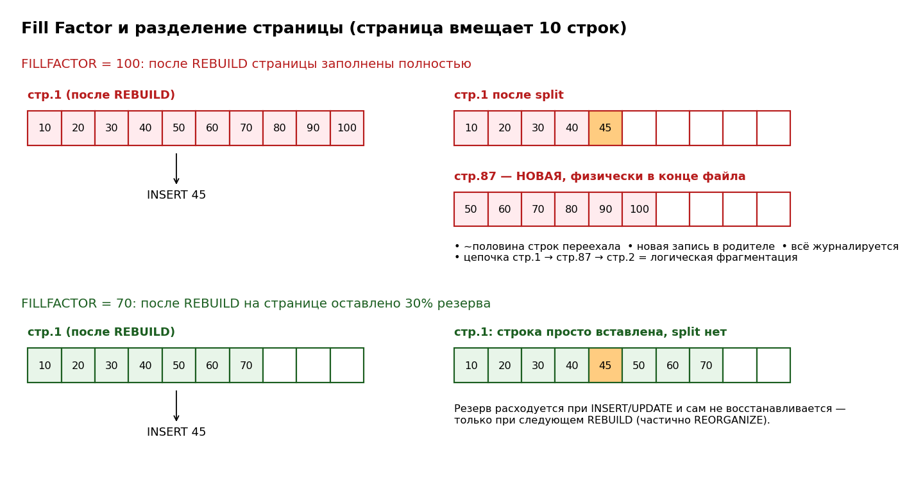

| Характер ключа | Рекомендуемый FILLFACTOR |
|---|---|
| Монотонно растущий (IDENTITY, дата вставки) | 100 (0): вставки в конец, резерв в середине не пригодится |
| Случайный (GUID), составной, вставки в середину | 90 → 80, подбирать по наблюдениям |
| Удлиняющиеся UPDATE строк переменной длины | Резерв помогает даже при монотонном ключе |
| Справочники, только чтение | 100 |

Ниже 70 опускаться почти никогда не стоит: при FILLFACTOR = 50 индекс вдвое больше. `PAD_INDEX = ON` применяет тот же процент к промежуточным уровням. «Плохие» разделения с переносом строк ловятся в Extended Events (`transaction_log`, операция `LOP_DELETE_SPLIT`). Счётчик `Page Splits/sec` учитывает и дешёвые выделения в конце индекса.

#### Пошаговая визуализация page split

Упрощённая модель: на странице 4 строки, а не сотни. Анимация сменяет шаг каждые 6 секунд. Если нужно рассмотреть шаг подробнее, раскройте блок с кадрами под анимацией. Интерактивная версия с кнопками «Назад / Далее» — [`interactive/page-split.html`](../interactive/page-split.html): скачайте и откройте в браузере или опубликуйте через GitHub Pages.

**Split листовой страницы.** Fill Factor действует только сразу после REBUILD. Страница делится пополам, листья перелинковываются, в родителя добавляется новая запись. Точечный поиск не дорожает, а чтение диапазона начинает прыгать по файлу. В конце показан «хороший» split при вставке в конец индекса.

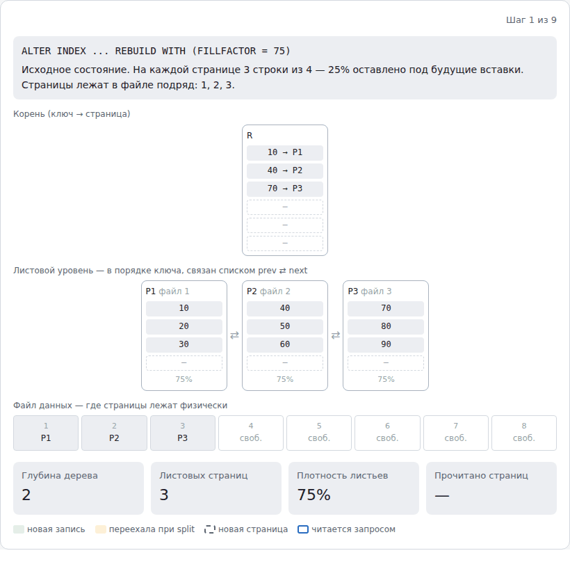

<details>
<summary>Все 9 шагов по кадрам</summary>

**Шаг 1. `ALTER INDEX … REBUILD WITH (FILLFACTOR = 75)`** — после REBUILD на каждой странице 3 строки из 4, страницы лежат в файле подряд.

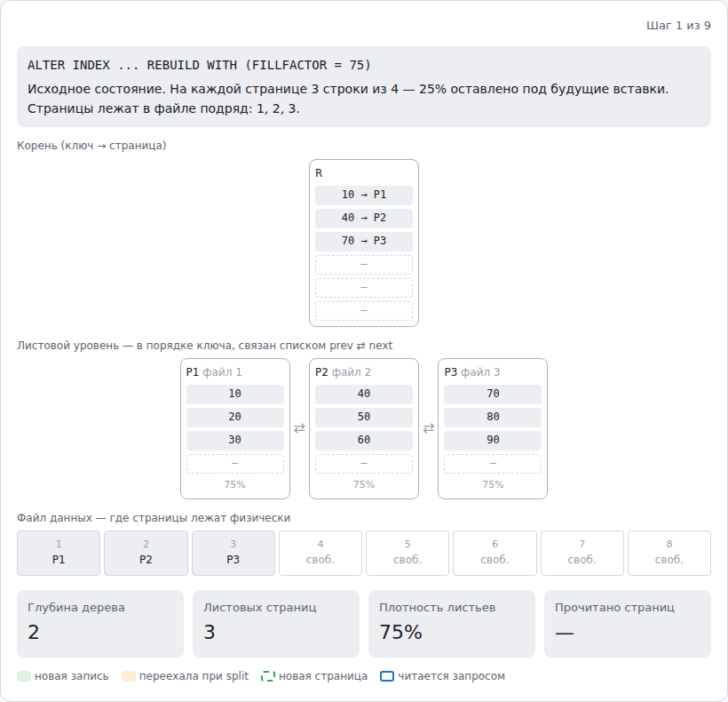

**Шаг 2. `INSERT 45`** — есть свободный слот — строка просто вставляется, split нет; резерв Fill Factor израсходован и сам не восстановится.

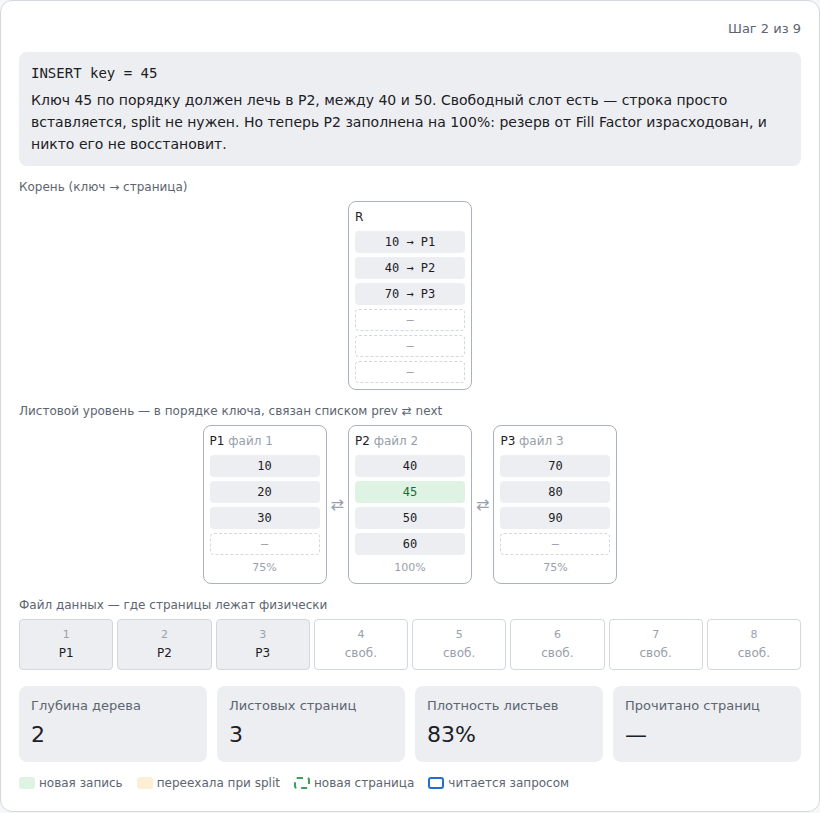

**Шаг 3. `INSERT 55`** — P2 полна → **page split**: новая P4 (место 7 в файле), 50 и 60 переезжают, в корень добавляется 50 → P4.

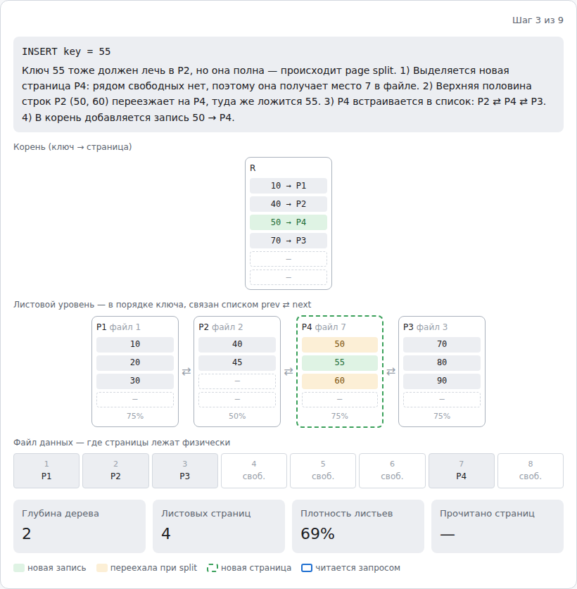

**Шаг 4. `INSERT 42, 47`** — P2 снова заполняется до 100%: Fill Factor при обычных вставках не действует.

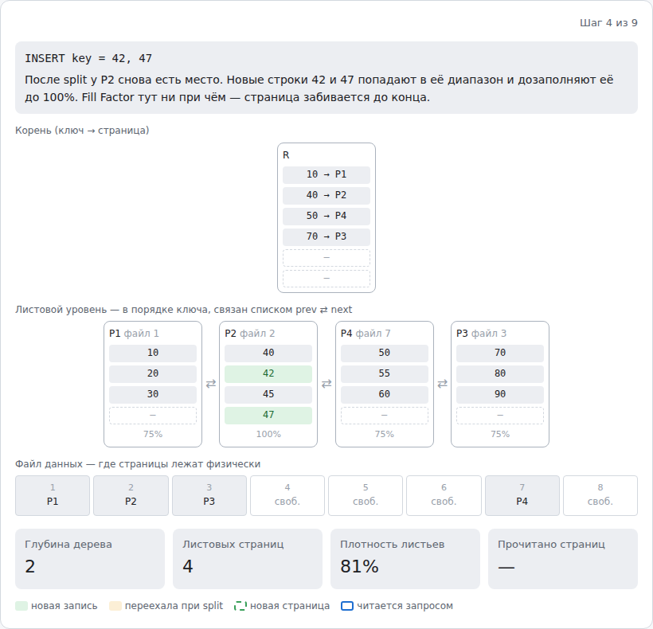

**Шаг 5. `INSERT 48`** — ещё один split, сразу в транзакции INSERT: новая P5 (место 8), 45 и 47 переезжают.

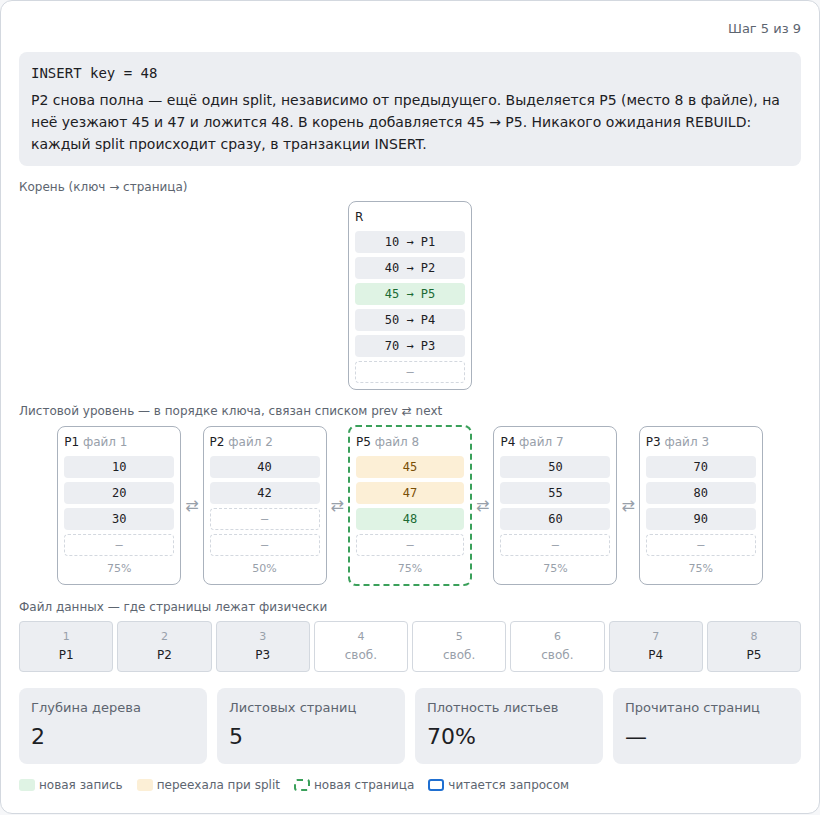

**Шаг 6. `SELECT … WHERE key = 47`** — точечный поиск: корень → P5, **2 чтения**, как и до split.

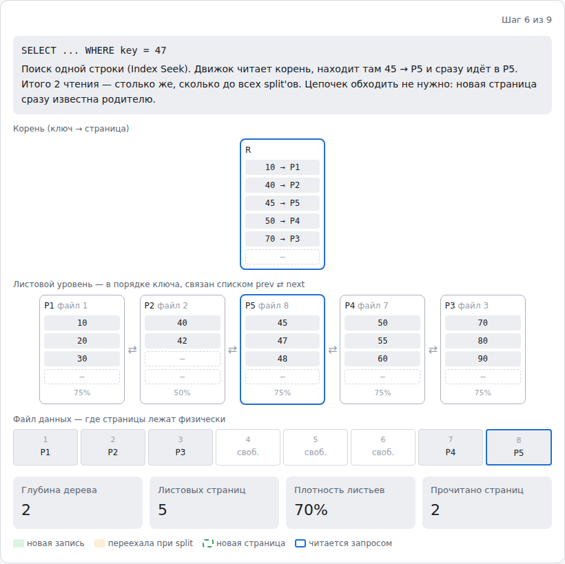

**Шаг 7. `SELECT … WHERE key BETWEEN 40 AND 60`** — диапазон: P2 → P5 → P4, 3 страницы на 9 строк, в файле прыжки 2 → 8 → 7 — **логическая фрагментация**.

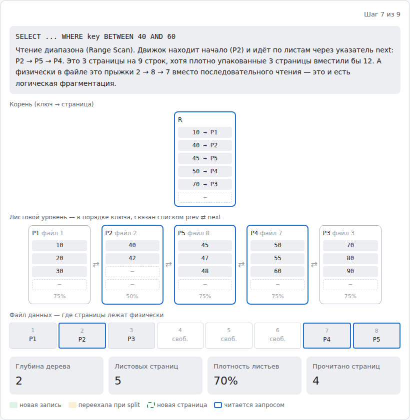

**Шаг 8. `INSERT 95`** — вставка в конец индекса ложится в последний свободный слот P3.

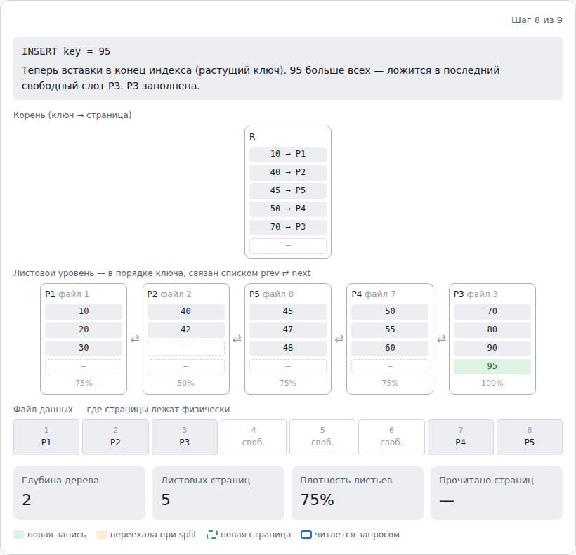

**Шаг 9. `INSERT 99`** — P3 полна, но ключ больше всех: новая P6 только с этой строкой, ничего не переезжает — **«хороший» split** растущего ключа.

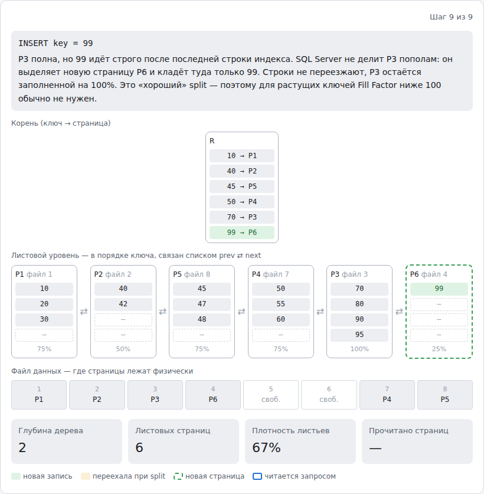

</details>

**Каскадный split и рост глубины дерева.** Если в родителе нет места для записи о новой странице, делится и он. Split корня добавляет дереву уровень, и точечный поиск становится на одно чтение дороже для всего индекса.


<details>
<summary>Все 7 шагов по кадрам</summary>

**Шаг 1. `Исходное состояние`** — 2 уровня, в корне 3 записи из 4, поиск — 2 чтения.


**Шаг 2. `INSERT 45`** — строка помещается в P2, split нет.

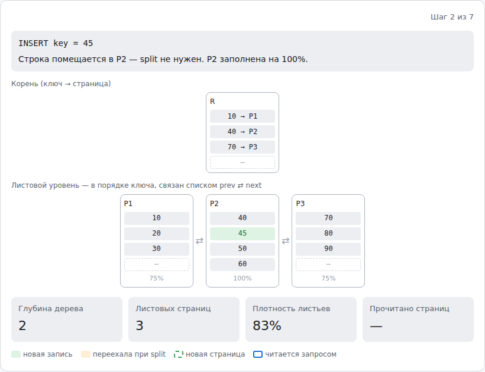

**Шаг 3. `INSERT 55`** — split листа, в корень добавляется 50 → P4 — корень заполнен.

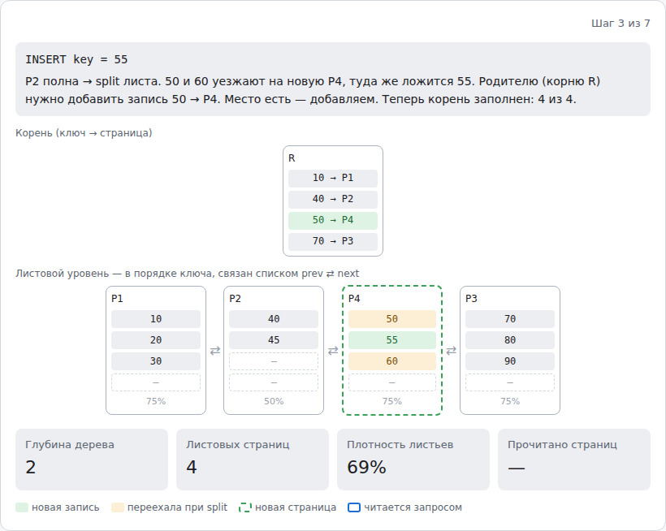

**Шаг 4. `INSERT 42, 47`** — P2 и корень полны: следующая вставка в диапазон P2 запустит каскад.

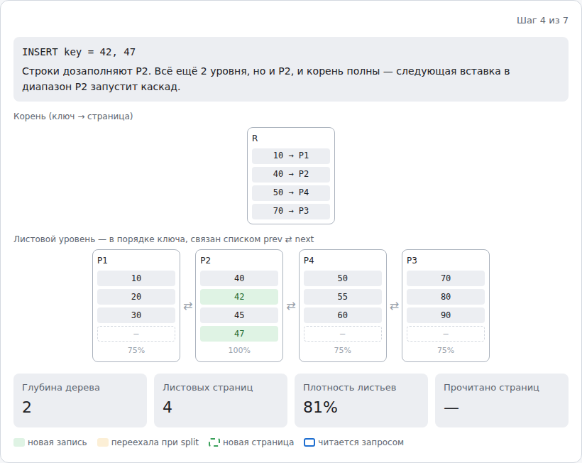

**Шаг 5. `INSERT 48, шаг 1`** — split листа: 45 и 47 уезжают на P5, но записи 45 → P5 в корне нет места.

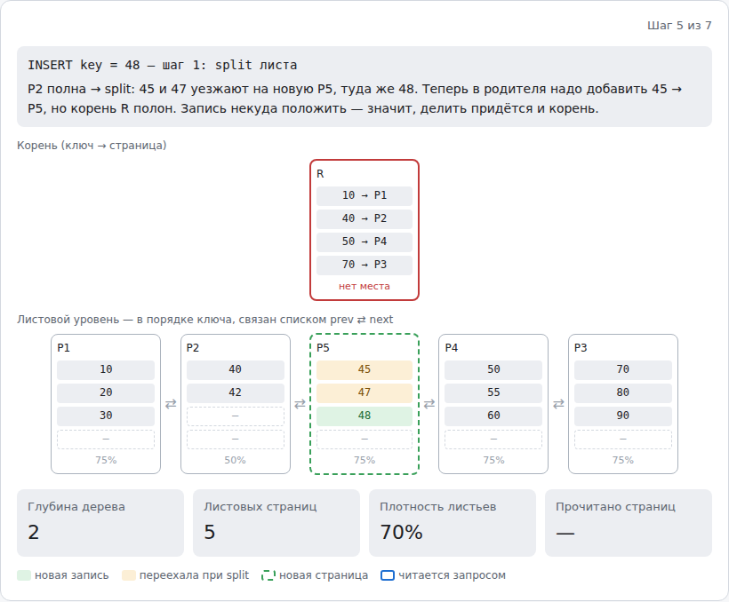

**Шаг 6. `INSERT 48, шаг 2`** — **split корня**: половина записей уезжает на R2, создаётся новый корень R0 — дерево на уровень глубже, всё внутри одного INSERT.

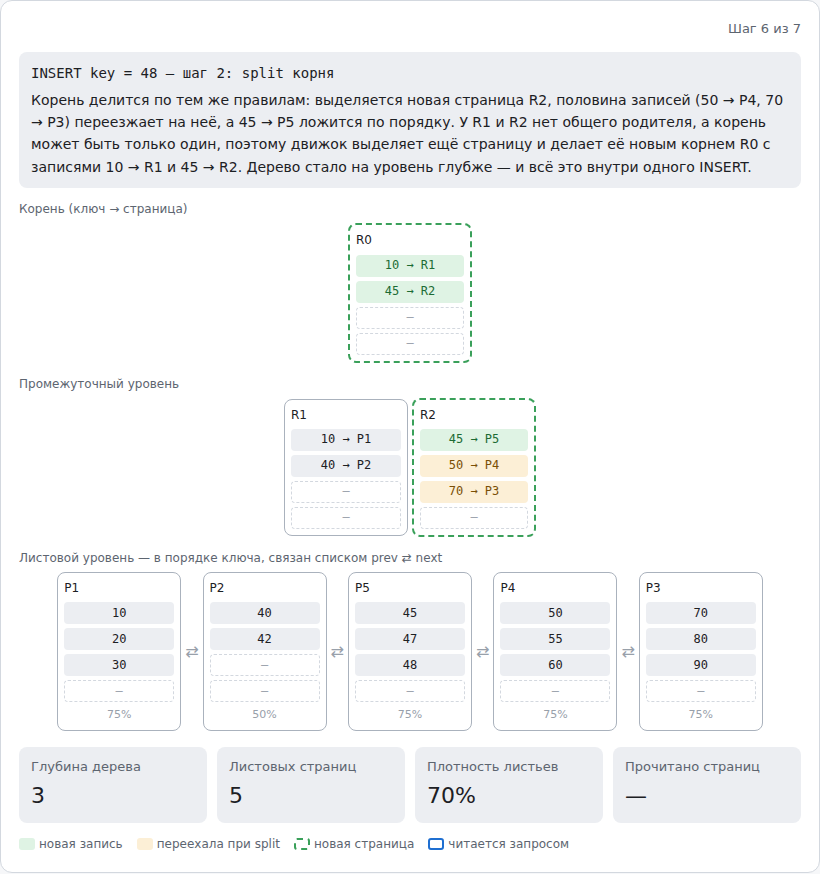

**Шаг 7. `SELECT … WHERE key = 47`** — поиск проходит 3 уровня: R0 → R2 → P5, **3 чтения вместо 2**.

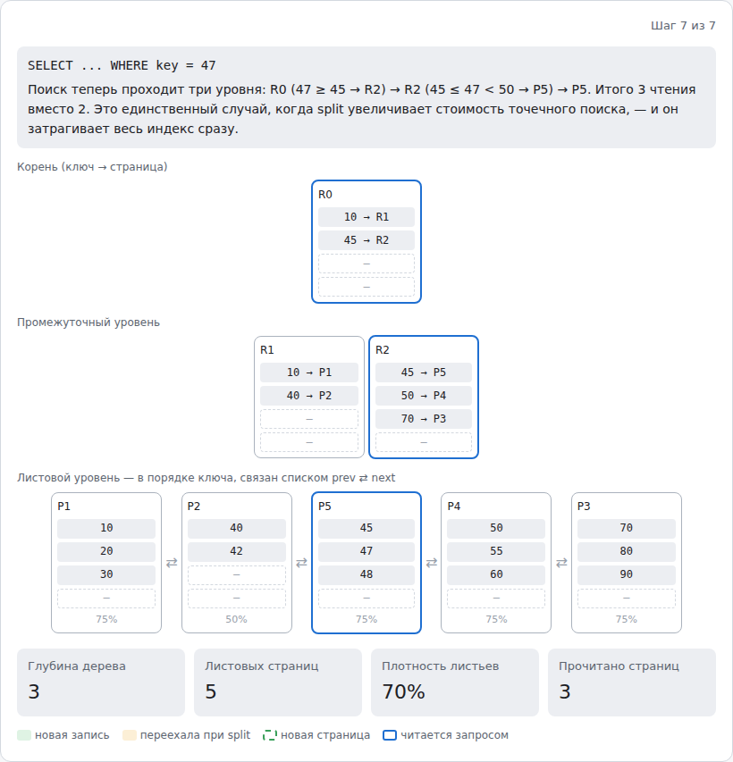

</details>

Выводы:
- обычный split («плохой») переносит примерно половину строк, полностью журналируется и держит латчи. Результат — полупустые страницы и логическая фрагментация;
- при монотонно растущем ключе split в конце индекса ничего не переносит, поэтому резерв Fill Factor таким индексам не нужен;
- на точечный поиск split почти не влияет, пока не увеличится глубина дерева. Страдают сканы диапазонов (больше страниц, прыжки по файлу) и запись;
- каскад до корня случается редко, но добавляет уровень всему индексу.

---

## 8. Буферный пул. Логические и физические чтения

> **Кратко.** Буферный пул — область ОЗУ, где кэшируются 8-КБ страницы данных и индексов. **Логическое чтение** — страница найдена в пуле. **Физическое** — промах, страницу читают с диска. **Read-ahead** — упреждающее фоновое чтение при сканах.

**Как работает пул:**
- кадры по 8 КБ, поиск страницы через хеш-таблицу по (файл, страница);
- изменения пишутся в страницу в памяти, она становится **грязной** (dirty);
- на диск грязные страницы сбрасывают checkpoint и lazy writer;
- при нехватке памяти вытесняются давно не использованные страницы (LRU-подобный алгоритм).

**Почему при оптимизации смотрят на логические чтения:**
- физические чтения зависят от «прогретости» кэша: первый запуск медленный, второй быстрый;
- логические чтения детерминированы и показывают **реальный объём работы**, их удобно сравнивать «до/после» (`SET STATISTICS IO ON`);
- тяжёлый запрос вытесняет из пула чужие полезные страницы, и потом медленнее работают другие. Отсюда ожидания `PAGEIOLATCH_*` у всех.

---

## 9. ★ Forwarded records в куче

> **Кратко.** Если в **куче** строка после UPDATE выросла и не помещается на своей странице, она переезжает на другую страницу. На старом месте остаётся **forwarding pointer** (заглушка с новым адресом), в самой строке — обратный указатель. Так сделано, чтобы не переписывать RID во всех некластерных индексах.

**Чем вредно:**
- каждое обращение по старому RID — это **два чтения** вместо одного (страница-заглушка + новая страница);
- Table Scan и RID Lookup превращаются в прыжки по файлу (random I/O);
- куча распухает, в буферный пул уходят лишние страницы.

**Как увидеть:** `sys.dm_db_index_physical_stats(... 'DETAILED')` → `forwarded_record_count`; `sys.dm_db_index_operational_stats` → `forwarded_fetch_count`.

**Как лечить:** `ALTER TABLE … REBUILD` (перестроит и все НК-индексы) или создать **кластерный индекс**: тогда вместо переадресации будет обычный page split. Пример целиком — [`06_heap_forwarded_records.sql`](../sql/06_heap_forwarded_records.sql).

---

## 10. ★ Порядок столбцов и селективность в составном индексе

> **Кратко.** Индекс `(A, B, C)` отсортирован сначала по A, внутри A по B, внутри (A, B) по C. **Seek возможен только по левому префиксу**: сначала равенства по ведущим столбцам, затем максимум **один диапазон**. Всё правее диапазона становится остаточным предикатом. Без условия на A индекс годится только для Scan.

| Условие при индексе `(A, B, C)` | Что будет |
|---|---|
| `A = 1` | Seek по A |
| `A = 1 AND B = 2` | Seek по A, B |
| `A = 1 AND B > 2 AND C = 3` | Seek по A и диапазону B, **C — в Predicate** |
| `B = 2` | Seek невозможен → Index Scan + Predicate |
| `A > 1 AND B = 2` | Seek по диапазону A, B — в Predicate |

**Правило проектирования:** сначала столбцы с равенством, затем столбец с диапазоном. Среди равенств впереди ставят те, что есть в **большинстве** запросов.

**Про селективность ведущего столбца.** Она важна по трём причинам:
1. **Гистограмма строится только по первому столбцу** индекса. У остальных столбцов — только плотность, то есть оценки по ним грубее.
2. Индекс с низкоселективным ведущим столбцом (`IsDeleted`, `Пол`) бесполезен для запросов, где этого столбца нет, и сам по себе почти ничего не отсекает.
3. Узкий индекс по селективному столбцу подходит большему числу запросов.

Но если запрос всегда содержит равенства **по обоим** столбцам, Seek по `(IsDeleted, UserID)` и по `(UserID, IsDeleted)` стоит одинаково: в обоих случаях дерево сразу приводит к нужным строкам.

> ⚠️ **Уточнение к источникам.** Правило «самый селективный столбец всегда первым» — упрощение. Решает то, **какие запросы** должны использовать индекс (левый префикс) и какие условия там равенства, а какие диапазоны. SQL Server не умеет skip scan (пропуск ведущего столбца), поэтому столбец, которого нет в части запросов, лучше не ставить первым.

Как тот же принцип левого префикса позволяет индексу заменить сортировку и хеш-агрегацию в `ORDER BY` / `GROUP BY` — [вопрос 50а](05-plans-operators.md#50а-выполнение-запросов-с-order-by-и-с-агрегацией-операторы-и-роль-индексов).

> 1С: индексы таблиц итогов регистров накопления и регистров сведений строятся по измерениям **в порядке их следования в конфигураторе** (таблица движений регистра накопления — по периоду и регистратору, [вопрос 77](08-1c-specifics.md#77-как-индексы-объектов-1с-отображаются-в-индексы-субд)). Отбор по второму-третьему измерению без первого или после диапазона по периоду превращается в Predicate с большим `Actual Rows Read`.

---

[← Оглавление](../README.md) · [Раздел 2 →](02-query-pipeline.md)
