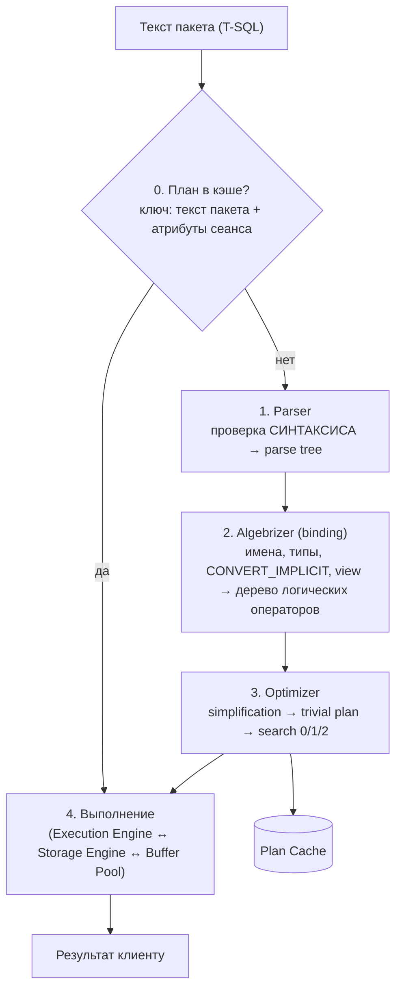
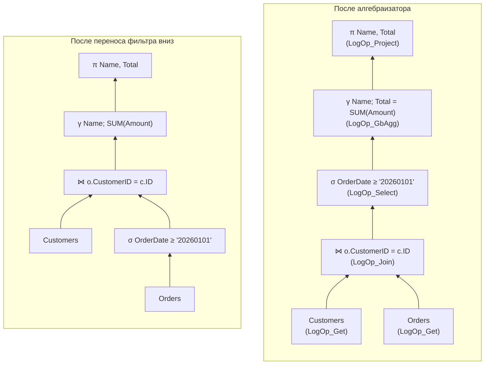
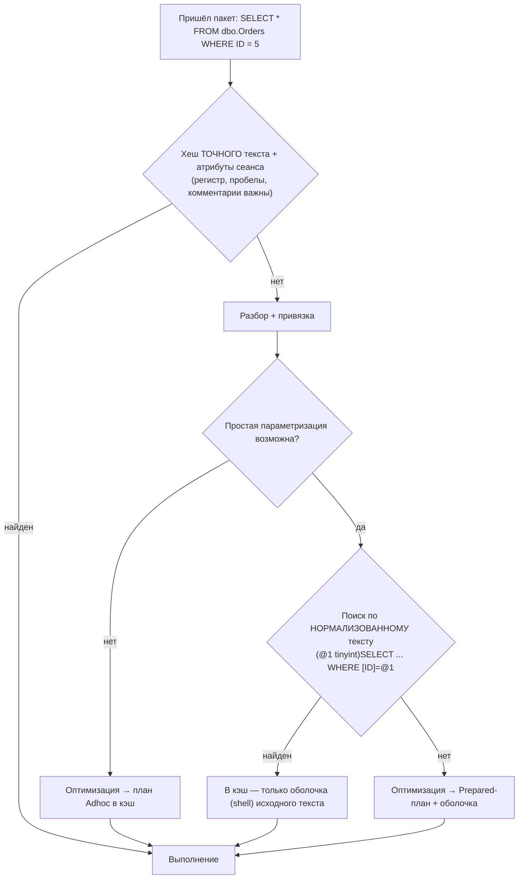

# 2. Путь запроса: от текста до результата

[← Раздел 1](01-storage.md) · [Оглавление](../README.md) · [Раздел 3 →](03-optimizer.md)

Вопросы 11–17. Практика: [`07_plan_cache_top_queries.sql`](../sql/07_plan_cache_top_queries.sql).

---

## 11. Этапы обработки запроса

> **Кратко.** Сначала **поиск готового плана в кэше**. Если плана нет, дальше идут **разбор (parser)** → **привязка (algebrizer)** → **оптимизация** → **выполнение**. Если план найден, всё до выполнения пропускается.



| Этап | Что проверяет / делает | Результат |
|---|---|---|
| Parser | Синтаксис, грамматику. Существование объектов **не** проверяет | Дерево разбора (parse tree) |
| Algebrizer | Разрешение имён, типы, неявные преобразования, раскрытие view и `*`, проверку группировки | Алгебраизированное дерево логических операторов |
| Optimizer | Упрощение, trivial plan, стоимостной перебор с использованием статистики | Физический план, кэшируется |
| Execution | Выполняет итераторы плана, читает страницы через буферный пул | Результат |


*Дерево разбора для `SELECT name, price FROM products WHERE price > 100 ORDER BY name` повторяет грамматику SQL. Имена в нём пока просто строки.*

---

## 12. Этап привязки (algebrizer)

> **Кратко.** Парсер проверяет только **грамматику** текста. Алгебраизатор (algebrizer; в SQL Server 2000 он назывался normalizer) проверяет **смысл**: существуют ли таблицы и столбцы, совместимы ли типы, корректна ли группировка. Затем он переводит запрос из декларативного SQL в **дерево операций реляционной алгебры** — выборка (σ), проекция (π), соединение (⋈), группировка (γ). Внутри SQL Server это операторы `LogOp_Get`, `LogOp_Select`, `LogOp_Join`, `LogOp_GbAgg`, `LogOp_Project`, уже с привязанными объектами и выведенными типами. Это дерево описывает, **что** вычислить, но не **как**: способы соединения и доступа выбирает оптимизатор.

### Парсер и алгебраизатор: грамматика и смысл

Синтаксически правильный запрос может быть бессмысленным. Для парсера `SELECT Amount FROM Orders` — это ключевые слова и идентификаторы на своих местах. Существуют ли таблица `Orders` и столбец `Amount`, он не знает. Это проверяет алгебраизатор. По номеру ошибки видно, на каком этапе запрос упал:

| Этап | Что проверяет | Типичные ошибки |
|---|---|---|
| Парсер | Ключевые слова, скобки, запятые, порядок предложений | `Msg 102: Incorrect syntax near …` |
| Алгебраизатор | Существование объектов, принадлежность столбцов, типы, группировку | `Msg 208: Invalid object name`, `Msg 207: Invalid column name`, `Msg 209: Ambiguous column name`, `Msg 8120: Column … is invalid in the select list because it is not contained in … GROUP BY` |

```sql
SELEC CustomerID FROM dbo.Orders;                               -- 102: парсер (опечатка в SELECT)
SELECT CustomerID FROM dbo.NoSuchTable;                         -- 208: алгебраизатор, нет таблицы
SELECT NoSuchColumn FROM dbo.Orders;                            -- 207: нет столбца
SELECT ID FROM dbo.Orders o JOIN dbo.Customers c
    ON c.ID = o.CustomerID;                                     -- 209: ID есть в обеих таблицах
SELECT CustomerID, Amount FROM dbo.Orders GROUP BY CustomerID;  -- 8120: Amount не сгруппирован

SET PARSEONLY ON;  SELECT Foo FROM NoSuchTable;  SET PARSEONLY OFF;  -- ошибок нет: синтаксис верный
SET NOEXEC ON;     SELECT Foo FROM NoSuchTable;  SET NOEXEC OFF;     -- 208: ошибка привязки
```

### Что делает алгебраизатор

1. **Разрешает имена**: таблицы, столбцы, алиасы, синонимы, схемы. Определяет, к какой таблице относится каждый столбец. Столбец без алиаса, который есть в двух таблицах соединения, — ошибка 209.
2. **Выводит типы** каждого выражения (например, `Amount * 1.1` получает тип `decimal` с определённой точностью). Там, где типы различаются, по правилам **приоритета типов** вставляет `CONVERT_IMPLICIT`, который потом виден в планах. Если в `varchar_col = N'ABC'` приводится **столбец**, проблема с индексом закладывается уже здесь ([вопрос 27](03-optimizer.md#27-неявное-преобразование-типов)).
3. **Проверяет агрегаты и группировку.** В SELECT при GROUP BY допустимы только сгруппированные столбцы и агрегатные функции (ошибка 8120).
4. **Раскрывает представления** и inline TVF в их определения, дальше работа идёт с базовыми таблицами. `*` раскрывается в список столбцов.
5. **Работает в логическом порядке** предложений: FROM → ON → JOIN → WHERE → GROUP BY → HAVING → SELECT → DISTINCT → ORDER BY → TOP. Поэтому алиас из SELECT нельзя использовать в WHERE, а в ORDER BY можно.

### Что такое реляционная алгебра

Реляционная алгебра — математическая модель работы с таблицами. Её предложил Эдгар Кодд в 1970 году вместе с реляционной моделью данных. Таблица в ней называется **отношением**: это множество строк (кортежей) с одинаковым набором атрибутов. Над отношениями определён небольшой набор операций:

| Операция | Обозначение | Смысл | Аналог в SQL | Логический оператор SQL Server |
|---|---|---|---|---|
| Выборка (селекция) | σ | Оставить строки, удовлетворяющие условию | `WHERE`, `HAVING` | `LogOp_Select` |
| Проекция | π | Оставить нужные столбцы, вычислить выражения | список `SELECT` | `LogOp_Project` |
| Соединение | ⋈ | Склеить строки двух таблиц по условию | `JOIN` | `LogOp_Join`, `LogOp_LeftOuterJoin`… |
| Декартово произведение | × | Все комбинации строк | `CROSS JOIN` | `LogOp_Join` без условия |
| Объединение / разность / пересечение | ∪ − ∩ | Теоретико-множественные операции | `UNION`, `EXCEPT`, `INTERSECT` | `LogOp_Union`, `LogOp_UnionAll`… |
| Группировка с агрегацией (расширение) | γ | Свернуть строки в группы | `GROUP BY` + `SUM`, `COUNT`… | `LogOp_GbAgg` |
| Чтение отношения | — | Источник данных, лист дерева | таблица в `FROM` | `LogOp_Get` |

Главное свойство этих операций — **замкнутость**: на вход подаются отношения и на выходе тоже получается отношение. Поэтому операции можно вкладывать друг в друга, и любой запрос записывается как **дерево операций**. В листьях стоят таблицы, в узлах — операции, корень выдаёт результат.

SQL не совпадает с «чистой» алгеброй, поэтому СУБД используют её расширенный вариант:
- таблица SQL — **мультимножество**: дубликаты разрешены, их убирают явно (`DISTINCT`);
- есть **NULL** и трёхзначная логика (TRUE / FALSE / UNKNOWN);
- **порядок** (`ORDER BY`) и `TOP` в алгебре отношений не определены: результат упорядочивается только на выходе.

### Зачем превращать SQL в такое дерево

SQL — **декларативный** язык: он описывает, *что* нужно получить, но не говорит, *в каком порядке и какими действиями*. К тому же порядок записи (SELECT → FROM → WHERE → GROUP BY) не совпадает с логическим порядком выполнения (FROM → WHERE → GROUP BY → SELECT). Дерево операторов показывает, какие операции и в какой логической последовательности нужно применить. Оптимизатору удобно работать именно с ним по двум причинам:

1. Для реляционной алгебры доказаны **правила эквивалентности**. По ним оптимизатор получает много разных, но эквивалентных деревьев:
   - фильтр можно опустить ниже соединения;
   - соединения можно переставлять: A ⋈ B = B ⋈ A, (A ⋈ B) ⋈ C = A ⋈ (B ⋈ C);
   - проекцию можно выполнить раньше.
   
   Правила действуют не всегда: например, фильтр по правой таблице LEFT JOIN нельзя просто опустить ниже соединения, это меняет смысл ([вопрос 23](03-optimizer.md#23-упрощение-simplification)).
2. Для каждого варианта дерева можно выбрать **физическую реализацию** операций и оценить стоимость ([вопросы 24–25](03-optimizer.md#24--memo-и-группы-в-модели-cascades)).

**Пример.**

```sql
SELECT c.Name, SUM(o.Amount) AS Total
FROM dbo.Customers c
JOIN dbo.Orders o ON o.CustomerID = c.ID
WHERE o.OrderDate >= '20260101'
GROUP BY c.Name;
```

После алгебраизатора получается логическое дерево. Данные идут снизу вверх, от таблиц к корню. Слева — дерево в том порядке, как записан запрос. Справа — эквивалентное дерево, которое строит оптимизатор уже на этапе упрощения: фильтр по дате применяется к `Orders` **до** соединения, поэтому соединяется меньше строк.



Это те же деревья в текстовой записи:

```text
После алгебраизатора                    После переноса фильтра
π  Name, Total                          π  Name, Total
└─ γ  Name; Total = SUM(Amount)         └─ γ  Name; Total = SUM(Amount)
   └─ σ  OrderDate >= '20260101'           └─ ⋈  o.CustomerID = c.ID
      └─ ⋈  o.CustomerID = c.ID               ├─ Customers
         ├─ Customers                         └─ σ  OrderDate >= '20260101'
         └─ Orders                               └─ Orders
```

Сравните с [деревом разбора в вопросе 11](#11-этапы-обработки-запроса): там узлы повторяют **грамматику** текста (список SELECT, FROM, WHERE), а здесь — **операции над данными** в порядке их логического выполнения.

### От логических операторов к физическим

Дерево алгебраизатора состоит из **логических** операторов: «соединение», «агрегация», «фильтр». Как именно они будут выполняться, в нём ещё не решено. Способ выполнения выбирает оптимизатор, когда подбирает каждому логическому оператору физический ([вопрос 25](03-optimizer.md#25--логические-и-физические-операторы)):
- логический **Inner Join** → физический **Nested Loops**, **Hash Match** или **Merge Join**;
- логический **Aggregate** → **Stream Aggregate** или **Hash Match (Aggregate)**;
- логическое чтение таблицы → **Table Scan**, **Clustered Index Scan** или **Index Seek**.

В готовом плане у каждого оператора есть оба свойства: `Logical Operation` и `Physical Operation` в SSMS, `LogicalOp` и `PhysicalOp` в XML. Первое показывает, какую операцию реляционной алгебры выполняет узел, второе — каким алгоритмом она реализована.

Увидеть логическое дерево на тестовом сервере можно так: `OPTION (RECOMPILE, QUERYTRACEON 3604, QUERYTRACEON 8605)`. Вывод — дерево узлов `LogOp_…` с отступами на вкладке Messages. Флаги недокументированные.

**Отложенное разрешение имён.** В процедуре несуществующая таблица при `CREATE PROCEDURE` не вызывает ошибку: это сделано ради `#temp`, которые создаются внутри. Привязка таких инструкций выполняется при первом выполнении, и это одна из причин перекомпиляций.

> ⚠️ **Расхождение в источниках.** В одном из ответов сказано, что алгебраизатор вычисляет «хеш запроса», по которому ищется план в кэше. **Это неверно.** Для ad hoc поиск в кэше идёт **до** разбора, по хешу **текста пакета** (вопрос 13). `query_hash` — отпечаток логической структуры для **анализа** в DMV, в поиске плана он не участвует.

---

## 13. Кэш планов: когда план берётся из кэша, а когда компилируется

> **Кратко.** Кэш планов — область ОЗУ со скомпилированными планами. Он очищается при перезапуске. Ключ поиска: **текст пакета** (для ad hoc и prepared) или **object_id** (для процедур) **плюс атрибуты сеанса** (база, SET-опции, пользователь при неуточнённой схеме, язык, формат даты). Совпало всё — план переиспользуется. Нет — компиляция.



| Хранилище | Что там | Ключ |
|---|---|---|
| `CACHESTORE_SQLCP` | Ad hoc и prepared (`sp_executesql`) | Текст пакета (для prepared — вместе со строкой объявления параметров) + атрибуты |
| `CACHESTORE_OBJCP` | Процедуры, функции, триггеры | `object_id` + `database_id` + атрибуты |

**Три идентификатора, которые легко перепутать:**

| | Из чего | Зачем |
|---|---|---|
| `sql_handle` | Текст пакета | Достать текст через `sys.dm_exec_sql_text` |
| `plan_handle` | sql_handle + атрибуты ключа | Конкретный план. У одного текста может быть несколько планов |
| `query_hash` | Логическая структура без литералов | Анализ: найти запросы, отличающиеся только константами |

**Когда компиляция с нуля:**
- запроса нет в кэше (первый вызов, перезапуск);
- план вытеснен при нехватке памяти;
- кэш очищен (`DBCC FREEPROCCACHE`, `ALTER DATABASE SCOPED CONFIGURATION CLEAR PROCEDURE_CACHE`, некоторые изменения конфигурации);
- **перекомпиляция** (вопрос 14).

**Ловушка ARITHABORT.** У SSMS по умолчанию `ARITHABORT ON`, у многих драйверов (и у сервера 1С) — `OFF`. Текст одинаковый, а ключи кэша разные. В SSMS вы получаете **свой** план и не видите «плохой» план приложения. Проверяйте `sys.dm_exec_plan_attributes(plan_handle)` → `set_options`.

---

## 14. Перекомпиляция и её причины

> **Кратко.** Перекомпиляция — план найден в кэше, но перед выполнением признан **некорректным** (изменилась схема или SET-опции) или **неоптимальным** (изменилась статистика, превышен порог изменений). Такой план отбрасывается и строится заново, причём у процедур — на уровне отдельной инструкции.

| Группа | Причины |
|---|---|
| Корректность | Изменение схемы: ALTER TABLE, создание/удаление индекса, изменение процедуры. Изменение SET-опций. `sp_recompile` |
| Оптимальность | Обновление статистики по таблицам плана. Накопление изменений данных выше порога (recompilation threshold) |
| Явно | `OPTION (RECOMPILE)` (план не кэшируется), `EXEC … WITH RECOMPILE`, `CREATE PROCEDURE … WITH RECOMPILE` |
| Временные таблицы | Отложенная компиляция инструкций с `#temp`, созданной в той же процедуре. Порог изменений у `#temp` маленький: 6 строк, затем 500, затем 500 + 20% |
| Смешение DDL и DML | `CREATE INDEX` на `#temp` посреди процедуры после её заполнения |

**Как видеть:** Extended Events `sql_statement_recompile` (поле `recompile_cause`), в Profiler — `SP:Recompile` / `SQL:StmtRecompile`. Высокий CPU при небольшом числе чтений часто означает компиляции.

**Как снижать число лишних перекомпиляций:**
- DDL для `#temp` (включая индексы) выполнять в начале процедуры;
- `OPTION (KEEP PLAN)` повышает порог для `#temp`, `OPTION (KEEPFIXED PLAN)` отключает перекомпиляцию из-за статистики;
- табличные переменные (не вызывают перекомпиляций, но статистики у них нет — вопрос 38);
- не держать `OPTION (RECOMPILE)` в запросах, вызываемых тысячи раз в секунду.

---

## 15. Ad hoc, параметризованный запрос и хранимая процедура

> **Кратко.** **Ad hoc** — значения вписаны в текст, план ищется по точному тексту: каждое новое значение даёт новый план. **Параметризованный** (`sp_executesql`, prepared) — текст неизменный, значения отдельно, план общий. **Процедура** — план по `object_id`, самый надёжный повтор. У двух последних есть parameter sniffing.

| | Ad hoc | Параметризованный | Процедура |
|---|---|---|---|
| `objtype` в `sys.dm_exec_cached_plans` | Adhoc | Prepared | Proc |
| Хранилище | SQLCP | SQLCP | OBJCP |
| Критерий повтора | Посимвольное совпадение пакета | Текст + **объявление параметров** | object_id |
| Засорение кэша | Высокое (одноразовые планы) | Низкое | Минимальное |
| Parameter sniffing | Нет (каждое значение со своим планом) | Да | Да |

```sql
-- ad hoc
SELECT OrderID FROM dbo.Orders WHERE ClientID = 42;
-- параметризованный
EXEC sp_executesql N'SELECT OrderID FROM dbo.Orders WHERE ClientID = @c', N'@c int', @c = 42;
-- процедура
EXEC dbo.GetClientOrders @c = 42;
```

**Ловушки:**
- `N'@p nvarchar(10)'` и `N'@p nvarchar(20)'` — **разные ключи**. Драйвер, объявляющий длину параметра по длине значения, плодит планы;
- много строк с одинаковым `query_hash` и разными `sql_handle` в `sys.dm_exec_query_stats` означает, что приложение не параметризует запросы (запрос 3 в [`07_plan_cache_top_queries.sql`](../sql/07_plan_cache_top_queries.sql)).

**Средства против засорения кэша ad hoc-планами:**
- **optimize for ad hoc workloads**: при первом выполнении кэшируется заглушка около 300 байт, полный план — только при повторе;
- **PARAMETERIZATION FORCED** (вопрос 16);
- исправить приложение, то есть передавать параметры.

> 1С отправляет запросы как `sp_executesql` с `@P1, @P2…` (в трассе это RPC:Completed). Повторное использование идёт по схеме «текст + объявление параметров». Если текст меняется (другое число элементов в `В (&Массив)`, другие имена `#tt`), это другой план.

---

## 16. Простая и принудительная параметризация

> **Кратко.** **SIMPLE** (по умолчанию) — сервер сам заменяет литералы параметрами только в «безопасных» запросах, где план не зависит от значения. Обычно это однотабличные запросы с **trivial plan**. **FORCED** (включается на базу) — параметризуются почти все литералы почти во всех запросах. Кэш перестаёт засоряться, но возвращается **риск parameter sniffing**.

| | SIMPLE | FORCED |
|---|---|---|
| Включение | По умолчанию | `ALTER DATABASE … SET PARAMETERIZATION FORCED` или TEMPLATE plan guide на отдельный запрос |
| Какие запросы | Простые, с тривиальным планом (поиск по уникальному ключу). JOIN, агрегаты, TOP, IN, подзапросы и выбор между индексами обычно отключают параметризацию | Почти все SELECT/INSERT/UPDATE/DELETE |
| Риск sniffing | Нет | Да |

Не параметризуются даже при FORCED:
- константы в списке SELECT;
- шаблоны `LIKE`;
- инструкции внутри процедур и функций (они и так параметризованы);
- `INSERT … EXEC`;
- запросы с `OPTION (RECOMPILE)` и некоторые другие случаи.

**Тип параметра при SIMPLE выводится из литерала:** `5` → tinyint, `500` → smallint, `50000` → int. Это три разных параметризованных текста и три плана.

---

## 17. Почему `sp_executesql` лучше конкатенации с `EXEC`

> **Кратко.** `sp_executesql` передаёт **неизменный шаблон + типизированные параметры**. Отсюда повторное использование плана, **защита от SQL-инъекций**, OUTPUT-параметры и отсутствие неявных преобразований. `EXEC(@sql)` со склейкой даёт новый ad hoc-план на каждое значение, открывает дорогу инъекциям и вынуждает руками возиться с кавычками и форматами дат.

```sql
-- Плохо: новый текст на каждое значение, уязвимо
DECLARE @sql nvarchar(max) = N'SELECT * FROM dbo.Orders WHERE Status = ''' + @Status + N'''';
EXEC (@sql);

-- Хорошо: один план, значение никогда не исполняется как код
EXEC sp_executesql
     N'SELECT @cnt = COUNT(*) FROM dbo.Orders WHERE Status = @st',
     N'@st varchar(20), @cnt int OUTPUT',
     @st = @Status, @cnt = @Count OUTPUT;
```

Оговорки:
- если внутри `sp_executesql` всё равно склеивать **значения**, защиты нет. Параметрами передают значения, а имена объектов при необходимости экранируют через `QUOTENAME()`;
- тип параметра нужно объявлять **как у столбца** (`varchar` для `varchar`), иначе будет `CONVERT_IMPLICIT` на столбце;
- у параметризованного запроса есть parameter sniffing. Для «универсальных» поисков с необязательными фильтрами часто лучше динамически собирать только нужные условия (всё равно через `sp_executesql`) или ставить `OPTION (RECOMPILE)`.

---

[← Раздел 1](01-storage.md) · [Оглавление](../README.md) · [Раздел 3 →](03-optimizer.md)
