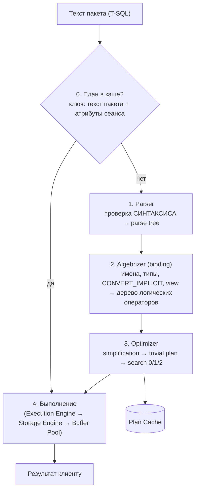
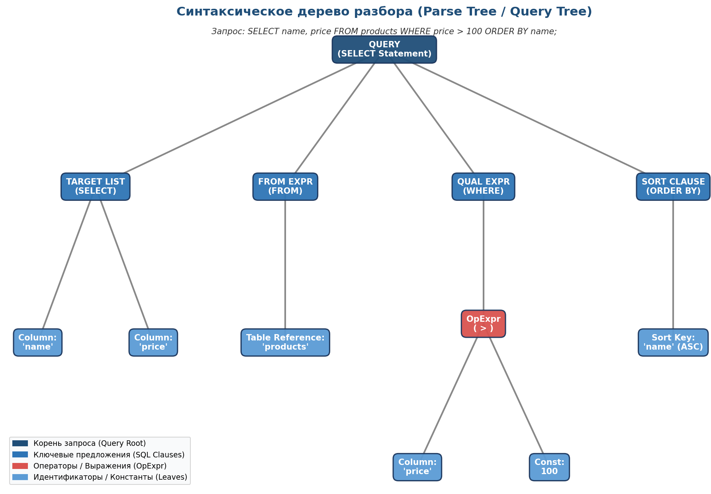
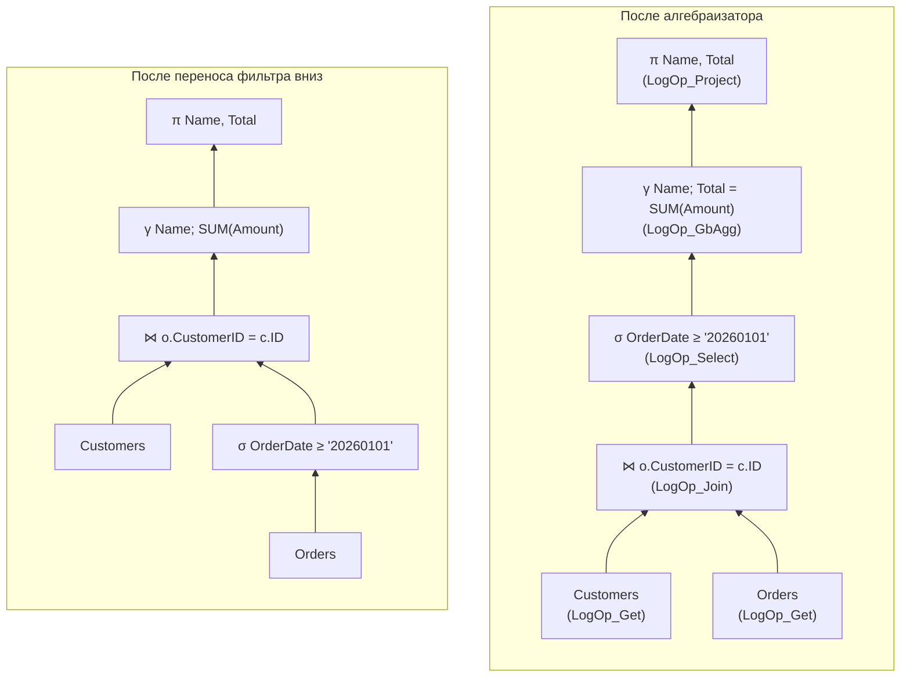
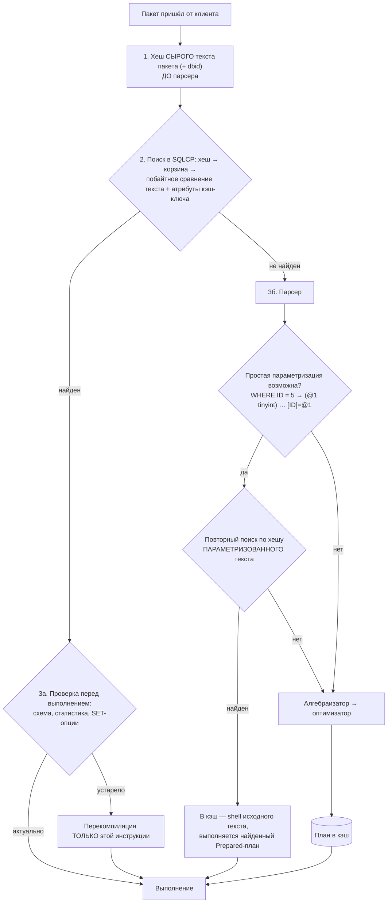
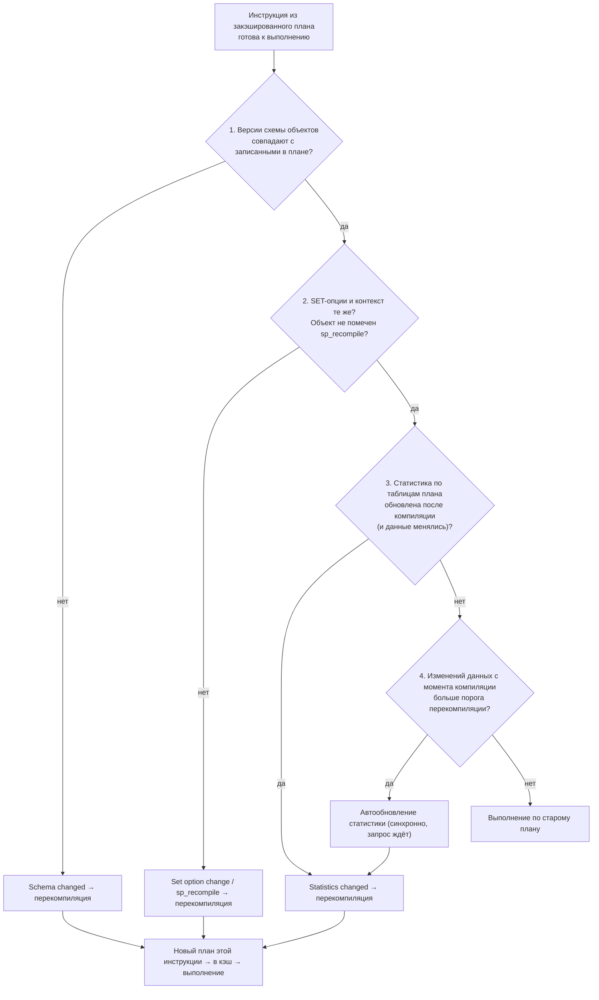

# 2. Путь запроса: от текста до результата

[← Раздел 1](01-storage.md) · [Оглавление](../README.md) · [Раздел 3 →](03-optimizer.md)

Вопросы 11–17. Практика: [`07_plan_cache_top_queries.sql`](../sql/07_plan_cache_top_queries.sql).

---

## 11. Этапы обработки запроса

> **Кратко.** Сначала **поиск готового плана в кэше**. Если плана нет, дальше идут **разбор (parser)** → **привязка (algebrizer)** → **оптимизация** → **выполнение**. Если план найден, всё до выполнения пропускается.



| Этап | Что проверяет / делает | Результат |
|---|---|---|
| Parser | Синтаксис, грамматику. Существование объектов **не** проверяет | Дерево разбора (parse tree) |
| Algebrizer | Разрешение имён, типы, неявные преобразования, раскрытие view и `*`, проверку группировки | Алгебраизированное дерево логических операторов |
| Optimizer | Упрощение, trivial plan, стоимостной перебор с использованием статистики | Физический план, кэшируется |
| Execution | Выполняет итераторы плана, читает страницы через буферный пул | Результат |



*Дерево разбора для `SELECT name, price FROM products WHERE price > 100 ORDER BY name` повторяет грамматику SQL. Имена в нём пока просто строки.*

---

## 12. Этап привязки (algebrizer)

> **Кратко.** Парсер проверяет только **грамматику** текста. Алгебраизатор (algebrizer; в SQL Server 2000 он назывался normalizer) проверяет **смысл**: существуют ли таблицы и столбцы, совместимы ли типы, корректна ли группировка. Затем он переводит запрос из декларативного SQL в **дерево операций реляционной алгебры** — выборка (σ), проекция (π), соединение (⋈), группировка (γ). Внутри SQL Server это операторы `LogOp_Get`, `LogOp_Select`, `LogOp_Join`, `LogOp_GbAgg`, `LogOp_Project`, уже с привязанными объектами и выведенными типами. Это дерево описывает, **что** вычислить, но не **как**: способы соединения и доступа выбирает оптимизатор.

### Парсер и алгебраизатор: грамматика и смысл

Синтаксически правильный запрос может быть бессмысленным. Для парсера `SELECT Amount FROM Orders` — это ключевые слова и идентификаторы на своих местах. Существуют ли таблица `Orders` и столбец `Amount`, он не знает. Это проверяет алгебраизатор. По номеру ошибки видно, на каком этапе запрос упал:

| Этап | Что проверяет | Типичные ошибки |
|---|---|---|
| Парсер | Ключевые слова, скобки, запятые, порядок предложений | `Msg 102: Incorrect syntax near …` |
| Алгебраизатор | Существование объектов, принадлежность столбцов, типы, группировку | `Msg 208: Invalid object name`, `Msg 207: Invalid column name`, `Msg 209: Ambiguous column name`, `Msg 8120: Column … is invalid in the select list because it is not contained in … GROUP BY` |

```sql
SELEC CustomerID FROM dbo.Orders;                               -- 102: парсер (опечатка в SELECT)
SELECT CustomerID FROM dbo.NoSuchTable;                         -- 208: алгебраизатор, нет таблицы
SELECT NoSuchColumn FROM dbo.Orders;                            -- 207: нет столбца
SELECT ID FROM dbo.Orders o JOIN dbo.Customers c
    ON c.ID = o.CustomerID;                                     -- 209: ID есть в обеих таблицах
SELECT CustomerID, Amount FROM dbo.Orders GROUP BY CustomerID;  -- 8120: Amount не сгруппирован

SET PARSEONLY ON;  SELECT Foo FROM NoSuchTable;  SET PARSEONLY OFF;  -- ошибок нет: синтаксис верный
SET NOEXEC ON;     SELECT Foo FROM NoSuchTable;  SET NOEXEC OFF;     -- 208: ошибка привязки
```

### Что делает алгебраизатор

1. **Разрешает имена**: таблицы, столбцы, алиасы, синонимы, схемы. Определяет, к какой таблице относится каждый столбец. Столбец без алиаса, который есть в двух таблицах соединения, — ошибка 209.
2. **Выводит типы** каждого выражения (например, `Amount * 1.1` получает тип `decimal` с определённой точностью). Там, где типы различаются, по правилам **приоритета типов** вставляет `CONVERT_IMPLICIT`, который потом виден в планах. Если в `varchar_col = N'ABC'` приводится **столбец**, проблема с индексом закладывается уже здесь ([вопрос 27](03-optimizer.md#27-неявное-преобразование-типов)).
3. **Проверяет агрегаты и группировку.** В SELECT при GROUP BY допустимы только сгруппированные столбцы и агрегатные функции (ошибка 8120).
4. **Раскрывает представления** и inline TVF в их определения, дальше работа идёт с базовыми таблицами. `*` раскрывается в список столбцов.
5. **Работает в логическом порядке** предложений: FROM → ON → JOIN → WHERE → GROUP BY → HAVING → SELECT → DISTINCT → ORDER BY → TOP. Поэтому алиас из SELECT нельзя использовать в WHERE, а в ORDER BY можно.

### Что такое реляционная алгебра

Реляционная алгебра — математическая модель работы с таблицами. Её предложил Эдгар Кодд в 1970 году вместе с реляционной моделью данных. Таблица в ней называется **отношением**: это множество строк (кортежей) с одинаковым набором атрибутов. Над отношениями определён небольшой набор операций:

| Операция | Обозначение | Смысл | Аналог в SQL | Логический оператор SQL Server |
|---|---|---|---|---|
| Выборка (селекция) | σ | Оставить строки, удовлетворяющие условию | `WHERE`, `HAVING` | `LogOp_Select` |
| Проекция | π | Оставить нужные столбцы, вычислить выражения | список `SELECT` | `LogOp_Project` |
| Соединение | ⋈ | Склеить строки двух таблиц по условию | `JOIN` | `LogOp_Join`, `LogOp_LeftOuterJoin`… |
| Декартово произведение | × | Все комбинации строк | `CROSS JOIN` | `LogOp_Join` без условия |
| Объединение / разность / пересечение | ∪ − ∩ | Теоретико-множественные операции | `UNION`, `EXCEPT`, `INTERSECT` | `LogOp_Union`, `LogOp_UnionAll`… |
| Группировка с агрегацией (расширение) | γ | Свернуть строки в группы | `GROUP BY` + `SUM`, `COUNT`… | `LogOp_GbAgg` |
| Чтение отношения | — | Источник данных, лист дерева | таблица в `FROM` | `LogOp_Get` |

Главное свойство этих операций — **замкнутость**: на вход подаются отношения и на выходе тоже получается отношение. Поэтому операции можно вкладывать друг в друга, и любой запрос записывается как **дерево операций**. В листьях стоят таблицы, в узлах — операции, корень выдаёт результат.

SQL не совпадает с «чистой» алгеброй, поэтому СУБД используют её расширенный вариант:
- таблица SQL — **мультимножество**: дубликаты разрешены, их убирают явно (`DISTINCT`);
- есть **NULL** и трёхзначная логика (TRUE / FALSE / UNKNOWN);
- **порядок** (`ORDER BY`) и `TOP` в алгебре отношений не определены: результат упорядочивается только на выходе.

### Зачем превращать SQL в такое дерево

SQL — **декларативный** язык: он описывает, *что* нужно получить, но не говорит, *в каком порядке и какими действиями*. К тому же порядок записи (SELECT → FROM → WHERE → GROUP BY) не совпадает с логическим порядком выполнения (FROM → WHERE → GROUP BY → SELECT). Дерево операторов показывает, какие операции и в какой логической последовательности нужно применить. Оптимизатору удобно работать именно с ним по двум причинам:

1. Для реляционной алгебры доказаны **правила эквивалентности**. По ним оптимизатор получает много разных, но эквивалентных деревьев:
   - фильтр можно опустить ниже соединения;
   - соединения можно переставлять: A ⋈ B = B ⋈ A, (A ⋈ B) ⋈ C = A ⋈ (B ⋈ C);
   - проекцию можно выполнить раньше.
   
   Правила действуют не всегда: например, фильтр по правой таблице LEFT JOIN нельзя просто опустить ниже соединения, это меняет смысл ([вопрос 23](03-optimizer.md#23-упрощение-simplification)).
2. Для каждого варианта дерева можно выбрать **физическую реализацию** операций и оценить стоимость ([вопросы 24–25](03-optimizer.md#24--memo-и-группы-в-модели-cascades)).

**Пример.**

```sql
SELECT c.Name, SUM(o.Amount) AS Total
FROM dbo.Customers c
JOIN dbo.Orders o ON o.CustomerID = c.ID
WHERE o.OrderDate >= '20260101'
GROUP BY c.Name;
```

После алгебраизатора получается логическое дерево. Данные идут снизу вверх, от таблиц к корню. Слева — дерево в том порядке, как записан запрос. Справа — эквивалентное дерево, которое строит оптимизатор уже на этапе упрощения: фильтр по дате применяется к `Orders` **до** соединения, поэтому соединяется меньше строк.



Это те же деревья в текстовой записи:

```text
После алгебраизатора                    После переноса фильтра
π  Name, Total                          π  Name, Total
└─ γ  Name; Total = SUM(Amount)         └─ γ  Name; Total = SUM(Amount)
   └─ σ  OrderDate >= '20260101'           └─ ⋈  o.CustomerID = c.ID
      └─ ⋈  o.CustomerID = c.ID               ├─ Customers
         ├─ Customers                         └─ σ  OrderDate >= '20260101'
         └─ Orders                               └─ Orders
```

Сравните с [деревом разбора в вопросе 11](#11-этапы-обработки-запроса): там узлы повторяют **грамматику** текста (список SELECT, FROM, WHERE), а здесь — **операции над данными** в порядке их логического выполнения.

### От логических операторов к физическим

Дерево алгебраизатора состоит из **логических** операторов: «соединение», «агрегация», «фильтр». Как именно они будут выполняться, в нём ещё не решено. Способ выполнения выбирает оптимизатор, когда подбирает каждому логическому оператору физический ([вопрос 25](03-optimizer.md#25--логические-и-физические-операторы)):
- логический **Inner Join** → физический **Nested Loops**, **Hash Match** или **Merge Join**;
- логический **Aggregate** → **Stream Aggregate** или **Hash Match (Aggregate)**;
- логическое чтение таблицы → **Table Scan**, **Clustered Index Scan** или **Index Seek**.

В готовом плане у каждого оператора есть оба свойства: `Logical Operation` и `Physical Operation` в SSMS, `LogicalOp` и `PhysicalOp` в XML. Первое показывает, какую операцию реляционной алгебры выполняет узел, второе — каким алгоритмом она реализована.

Увидеть логическое дерево на тестовом сервере можно так: `OPTION (RECOMPILE, QUERYTRACEON 3604, QUERYTRACEON 8605)`. Вывод — дерево узлов `LogOp_…` с отступами на вкладке Messages. Флаги недокументированные.

**Отложенное разрешение имён.** В процедуре несуществующая таблица при `CREATE PROCEDURE` не вызывает ошибку: это сделано ради `#temp`, которые создаются внутри. Привязка таких инструкций выполняется при первом выполнении, и это одна из причин перекомпиляций.

> ⚠️ **Расхождение в источниках.** В одном из ответов сказано, что алгебраизатор вычисляет «хеш запроса», по которому ищется план в кэше. **Это неверно.** Для ad hoc и prepared (в том числе запросов 1С через `sp_executesql`) поиск в кэше идёт **до** разбора, по хешу **текста пакета** (вопрос 13). `query_hash` — отпечаток логической структуры для **анализа** в DMV, в поиске плана он не участвует.

---

## 13. Кэш планов: когда план берётся из кэша, а когда компилируется

> **Кратко.** Кэш планов — область ОЗУ со скомпилированными планами, она очищается при перезапуске. Поиск в кэше выполняется **до парсера**. Ключ поиска: **хеш сырого текста всего пакета** (для ad hoc и prepared) или **object_id** (для процедур) **плюс атрибуты кэш-ключа** (SET-опции, база, пользователь при неуточнённой схеме, язык, формат даты…). Совпало всё → план проверяется на актуальность и выполняется. Не совпало → разбор, попытка автопараметризации и повторный поиск, и только потом привязка и оптимизация. `query_hash` в поиске **не участвует**: это отпечаток для анализа.

### Из чего состоит кэш

Кэш планов — это не одна область, а несколько **хранилищ** (cache stores). Каждое устроено как хеш-таблица с корзинами (buckets):

| Хранилище | Что в нём лежит | По чему ищется |
|---|---|---|
| `CACHESTORE_SQLCP` (SQL Plans) | Ad hoc, подготовленные (`sp_executesql`, prepare/execute), автопараметризованные | Хеш текста пакета (для prepared — вместе со строкой объявления параметров) + атрибуты кэш-ключа |
| `CACHESTORE_OBJCP` (Object Plans) | Хранимые процедуры, функции, триггеры | `object_id` + `database_id` + атрибуты кэш-ключа |
| `CACHESTORE_PHDR` (Bound Trees) | **Результат алгебраизатора** для представлений, ограничений, значений по умолчанию | ID объекта |

`PHDR` нужен, чтобы не алгебраизировать представление заново при каждой компиляции запроса, который его использует. К поиску готового **плана запроса** он отношения не имеет. Вероятно, отсюда и пошла путаница «алгебраизатор считает хеш для поиска в кэше» ([вопрос 12](#12-этап-привязки-algebrizer)).

```sql
SELECT type, name, pages_kb, entries_count
FROM sys.dm_os_memory_cache_counters
WHERE type IN (N'CACHESTORE_SQLCP', N'CACHESTORE_OBJCP', N'CACHESTORE_PHDR');
```

### Путь пакета от получения до выполнения



**Шаг 1. Хеш.** Его считает SQL Manager по **сырому тексту пакета** в том виде, в каком он пришёл от клиента. Разбора ещё не было, поэтому:
- хешируется **весь пакет**, а не отдельная инструкция. Пакет из пяти инструкций — один скомпилированный план с пятью инструкциями внутри;
- сравнение **точное, побайтное**. Лишний пробел, другой регистр (`select` / `SELECT`), изменённый комментарий, другое значение литерала — это другой текст, другой хеш и промах кэша;
- для ad hoc и prepared-планов атрибут `objectid` в `sys.dm_exec_plan_attributes` — это именно хеш текста пакета, а не ID реального объекта.

**Шаг 2. Атрибуты кэш-ключа.** Одинакового текста мало: один текст может иметь **несколько планов**, если различается контекст выполнения. В ключ входят атрибуты с `is_cache_key = 1` в `sys.dm_exec_plan_attributes`:
- **`set_options`** — битовая маска SET-опций соединения (`ANSI_NULLS`, `QUOTED_IDENTIFIER`, `ARITHABORT`…). **Ловушка ARITHABORT:** у SSMS по умолчанию `ARITHABORT ON`, у многих драйверов (и у сервера 1С) — `OFF`. Текст одинаковый, а ключи разные. В SSMS вы получаете **свой** план и не видите «плохой» план приложения. Отсюда эффект «в SSMS быстро, из приложения медленно»;
- **`dbid`** — один текст в разных базах даёт разные планы;
- **`user_id`** — если объекты написаны без схемы (`Orders` вместо `dbo.Orders`), результат разрешения имён зависит от схемы пользователя по умолчанию, и план привязывается к пользователю. Значение `-2` означает, что план от пользователя не зависит и разделяется. Поэтому **всегда указывайте схему**;
- `language_id`, `date_format`, `date_first`, `compat_level` и другие.

**Шаг 3а. План найден.** Перед выполнением каждая инструкция проверяется: не изменилась ли схема затронутых объектов, не превысили ли изменения порог статистики. Если что-то устарело, перекомпилируется **только эта инструкция**, а не весь пакет (так с SQL Server 2005). В Profiler это видно как `SQL:StmtRecompile` с причиной ([вопрос 14](#14-перекомпиляция-и-её-причины)).

**Шаг 3б. План не найден.** Запускается парсер, и для простых запросов сервер пробует **простую параметризацию** ([вопрос 16](#16-простая-и-принудительная-параметризация)):

```sql
SELECT * FROM dbo.Orders WHERE ID = 5
-- превращается в
(@1 tinyint)SELECT * FROM [dbo].[Orders] WHERE [ID]=@1
```

После этого **ещё раз ищется план по хешу текста**, теперь параметризованного. Если он есть, он переиспользуется, а для исходного ad hoc текста в кэш кладётся маленький **shell-план**, который только указывает на параметризованный. Поэтому в `sys.dm_exec_cached_plans` встречаются пары: `Adhoc` небольшого размера (shell) и `Prepared` с реальным планом. Только если и этот поиск ничего не дал, запрос проходит алгебраизатор и оптимизатор, а готовый план попадает в кэш.

### Четыре идентификатора, которые легко перепутать

| Идентификатор | От чего вычисляется | Когда | Для чего |
|---|---|---|---|
| `sql_handle` | Текст пакета | При получении пакета | Идентифицирует **текст**: по нему `sys.dm_exec_sql_text` возвращает текст |
| `plan_handle` | Текст + атрибуты кэш-ключа | При помещении плана в кэш | Идентифицирует **конкретный план** в кэше. У одного `sql_handle` может быть несколько `plan_handle` (например, при разных SET-опциях) |
| `query_hash` | **Логическое дерево** инструкции без значений литералов | При компиляции | **Только анализ**: найти запросы, которые отличаются лишь литералами |
| `query_plan_hash` | **Физический план** | После оптимизации | **Только анализ**: найти одинаковые по форме планы; заметить, что у запроса сменился план |

`query_hash` и `query_plan_hash` появились в SQL Server 2008 как инструмент диагностики. Они есть в `sys.dm_exec_query_stats`, `sys.dm_exec_requests` и в Query Store. Типичная задача: найти тысячу ad hoc запросов, которые засоряют кэш и каждый раз компилируются заново. У них разные `sql_handle`, но одинаковый `query_hash`. Искать план по `query_hash` сервер не может в принципе: чтобы его вычислить, запрос уже нужно разобрать и алгебраизировать, а поиск в кэше нужен как раз для того, чтобы этого не делать.

**Пример на реальных планах 1С: разный текст — один план.** Два запроса 1С отличаются только местом условия по дате: в `ГДЕ` (ббб1) и в условии соединения `ПО` (ббб2). Платформа перевела их в **два разных SQL-текста** ([раздел 13](13-joins-real-plans.md#3-nested-loops-мало-строк-сверху--индекс-снизу-серия-ббб), файлы [`bbb1`](../plans/bbb1_nested_loops_where.sqlplan) и [`bbb2`](../plans/bbb2_nested_loops_on.sqlplan)):

```sql
-- ббб1:  … INNER JOIN _Document15050 T3 ON (T1._Document15050_IDRRef = T3._IDRRef)
--          WHERE (T3._Date_Time > @P1)
-- ббб2:  … INNER JOIN _Document15050 T3 ON (T1._Document15050_IDRRef = T3._IDRRef) AND (T3._Date_Time > @P1)
```

| Идентификатор | ббб1 | ббб2 | Почему |
|---|---|---|---|
| `sql_handle`, `plan_handle` | свой | свой | Тексты разные → **две записи в кэше, две компиляции** |
| `QueryHash` | `0x4F91E2E4A31DF573` | `0x1964509F937F8B51` | Разные логические деревья (условие в разных местах) |
| `QueryPlanHash` | `0x00C71BD3DBEE6C91` | `0x00C71BD3DBEE6C91` | **Одинаковый физический план**: при упрощении условие в обоих случаях опущено к таблице документа ([вопрос 23](03-optimizer.md#23-упрощение-simplification)) |

Второй запрос **не** взял план первого из кэша: он скомпилировался сам и пришёл к такому же плану. В свойствах SELECT видны только `QueryHash` и `QueryPlanHash`, оба — для анализа. Ключ поиска в кэше (текст + атрибуты сеанса) в плане не показывается. Совпадение `QueryPlanHash` не означает, что план переиспользован. Проверка:

```sql
SELECT qs.sql_handle, qs.plan_handle, qs.query_hash, qs.query_plan_hash, qs.execution_count,
       SUBSTRING(st.text, 1, 200) AS text_start
FROM sys.dm_exec_query_stats qs
CROSS APPLY sys.dm_exec_sql_text(qs.sql_handle) st
WHERE st.text LIKE N'%_Document15050_VT61797%_Date_Time%' AND st.text NOT LIKE N'%dm_exec%';
-- ожидаемо: две строки — разные sql_handle / plan_handle / query_hash, одинаковый query_plan_hash
```

**Зачем нужен `query_plan_hash`:**
- найти **разные запросы с одинаковым планом**, как здесь;
- заметить, что у **одного и того же запроса сменился план**: `query_hash` прежний, а `query_plan_hash` после перекомпиляции другой. Классический сигнал parameter sniffing и регрессии плана ([вопросы 57, 60](06-params-cache.md#57-диагностика)).

**Второй пример: место условия меняет и строку параметров.** В серии ббб параметр один, поэтому запросы различаются только текстом. Если параметров несколько, перенос условия меняет ещё и их **нумерацию**. Серия ддд, файлы [`ddd1`](../plans/ddd1_inn_in_where.sqlplan) и [`ddd2`](../plans/ddd2_inn_in_on.sqlplan):

```bsl
// ддд1: отбор по ИНН в ГДЕ
ВЫБРАТЬ Док.Ссылка, Контрагенты.Наименование
ИЗ Документ.УниверсальныйЭлектронныйДокументПоставщика КАК Док
    ВНУТРЕННЕЕ СОЕДИНЕНИЕ Справочник.Контрагенты КАК Контрагенты
    ПО Док.Контрагент = Контрагенты.Ссылка
ГДЕ Док.Дата > &Дата И Контрагенты.ИНН = &ИНН

// ддд2: отбор по ИНН перенесён в ПО
    ПО Док.Контрагент = Контрагенты.Ссылка И Контрагенты.ИНН = &ИНН
ГДЕ Док.Дата > &Дата
```

Платформа нумерует параметры `@P1, @P2…` в порядке их появления в SQL-тексте. Условие на ИНН во втором запросе стоит раньше условия на дату, поэтому параметры поменялись ролями:

| | ддд1 (ИНН в `ГДЕ`) | ддд2 (ИНН в `ПО`) |
|---|---|---|
| `@P1` | дата, `datetime2(3)` | ИНН, `nvarchar(4000)` |
| `@P2` | ИНН, `nvarchar(4000)` | дата, `datetime2(3)` |
| Строка объявления параметров | `@P1` объявлен как `datetime2(3)` | `@P1` объявлен как `nvarchar(4000)` |
| `QueryHash` | `0x4F067F31B5D500DA` | `0x6DB828E15203CD54` |
| `QueryPlanHash` | `0x666F54BAE07F2C71` | `0x666F54BAE07F2C71` |
| `CompileTime` | 34 мс | 4 мс |

Ключ кэша здесь разошёлся **дважды**: и по тексту, и по строке объявления параметров. Вывод для 1С: любая перестановка условий, при которой меняется порядок параметров в SQL, даёт новый ключ, даже если сам запрос «по смыслу тот же».

**Как по плану понять, что компиляций было две.** `CompileTime`, `CompileCPU` и `CompileMemory` хранятся в плане с момента его компиляции, и фактический план, взятый из кэша, показывает их же. Поэтому ненулевой `CompileTime` сам по себе **не доказывает**, что компиляция была именно при этом запуске. Признак в другом: если бы ддд2 взял план ддд1, у него был бы тот же `CompileTime = 34`. Разные значения означают два разных скомпилированных плана. Прямое доказательство даёт трасса (см. «Как увидеть поиск в кэше в трассе» ниже) или `sys.dm_exec_cached_plans`.

> ⚠️ **Два разных кэша.** В этой паре ддд1 выполнялся 5 мс, ддд2 — 0 мс. Это **не** эффект кэша планов: план ддд2 из кэша не брался вовсе. В ддд1 есть физические чтения (`ActualPhysicalReads` 3 и 2) и ожидание `PAGEIOLATCH_SH`: страницы данных поднимались с диска. В ддд2 физических чтений 0, страницы уже были в **буферном пуле**. Логические чтения одинаковые (17). Кэш планов хранит **планы**, буферный пул — **страницы данных** ([вопрос 8](01-storage.md#8-буферный-пул-логические-и-физические-чтения)), и «повтор быстрее» чаще объясняется вторым ([кейс 10](11-case-studies.md#кейс-10-первый-запуск-медленный-повторный-быстрый)). Сравнивать варианты запроса по времени можно только при одинаковом состоянии буферного пула, надёжнее — по логическим чтениям.

### Проверка на практике

```sql
-- 1. Два запроса, отличающихся только литералом
SELECT * FROM dbo.Orders WHERE CustomerID = 1 AND Amount > 100;
GO
SELECT * FROM dbo.Orders WHERE CustomerID = 2 AND Amount > 100;
GO
-- 2. Что оказалось в кэше
SELECT cp.objtype, cp.usecounts, cp.size_in_bytes,
       qs.sql_handle, qs.query_hash, qs.query_plan_hash, st.text
FROM sys.dm_exec_cached_plans cp
CROSS APPLY sys.dm_exec_sql_text(cp.plan_handle) st
LEFT JOIN sys.dm_exec_query_stats qs ON qs.plan_handle = cp.plan_handle
WHERE st.text LIKE N'%dbo.Orders%' AND st.text NOT LIKE N'%dm_exec%';
-- Ожидаемо: два разных sql_handle (тексты разные) и одинаковый query_hash.
-- Если сервер сумел автопараметризовать запрос, увидите два маленьких Adhoc (shell)
-- и один Prepared с usecounts = 2. У shell строк в dm_exec_query_stats нет.

-- 3. Атрибуты кэш-ключа конкретного плана
SELECT attribute, value, is_cache_key
FROM sys.dm_exec_plan_attributes(0x06000500...)   -- подставьте plan_handle
WHERE is_cache_key = 1;
```

Готовые запросы — блоки 1, 3, 4 и 7 в [`07_plan_cache_top_queries.sql`](../sql/07_plan_cache_top_queries.sql).

### Как увидеть поиск в кэше в трассе

Сам момент поиска виден в трассе отдельными событиями. В Profiler они в категории **Stored Procedures** (включите «Show all events»). Несмотря на префикс `SP:`, они срабатывают и для ad hoc, и для prepared-запросов, в том числе запросов 1С:

| Событие Profiler | Событие XE | Что означает |
|---|---|---|
| `SP:CacheMiss` | `sp_cache_miss` | Поиск по ключу (хеш текста + атрибуты) ничего не нашёл |
| `SP:CacheInsert` | `sp_cache_insert` | Скомпилированный план помещён в кэш |
| `SP:CacheHit` | `sp_cache_hit` | План найден в кэше и будет использован |
| `SP:CacheRemove` | `sp_cache_remove` | План удалён из кэша: вытеснение, очистка, перекомпиляция |
| `SQL:StmtRecompile` | `sql_statement_recompile` | План найден, но инструкция перекомпилирована ([вопрос 14](#14-перекомпиляция-и-её-причины)) |

Ожидаемая картина для запроса 1С (сверьте со своей трассой):
- первый запуск: `RPC:Starting` → `SP:CacheMiss` → `SP:CacheInsert` → `RPC:Completed`;
- повторный запуск того же текста: `RPC:Starting` → `SP:CacheHit` → `RPC:Completed`;
- для пары ддд1 / ддд2 при первом запуске каждого — **у обоих** `CacheMiss` и `CacheInsert`.

События частые, поэтому включайте их только с фильтром по SPID своего сеанса ([вопрос 69а](08-1c-specifics.md#69а-практика-как-поймать-свой-запрос-1с-в-profiler-и-получить-его-план)) и на короткое время. То же через Extended Events:

```sql
CREATE EVENT SESSION PlanCacheLookup ON SERVER
ADD EVENT sqlserver.sp_cache_miss  (ACTION (sqlserver.sql_text) WHERE (sqlserver.session_id = 57)),
ADD EVENT sqlserver.sp_cache_insert(ACTION (sqlserver.sql_text) WHERE (sqlserver.session_id = 57)),
ADD EVENT sqlserver.sp_cache_hit   (ACTION (sqlserver.sql_text) WHERE (sqlserver.session_id = 57))
ADD TARGET package0.ring_buffer;
GO
ALTER EVENT SESSION PlanCacheLookup ON SERVER STATE = START;
-- выполнить запрос из 1С дважды, затем:
SELECT x.value('@name', 'sysname')            AS event_name,
       x.value('@timestamp', 'datetime2')     AS ts,
       x.value('(action[@name="sql_text"]/value)[1]', 'nvarchar(max)') AS sql_text
FROM (SELECT CAST(t.target_data AS xml) AS d
      FROM sys.dm_xe_session_targets t
      JOIN sys.dm_xe_sessions s ON s.address = t.event_session_address
      WHERE s.name = N'PlanCacheLookup') q
CROSS APPLY q.d.nodes('RingBufferTarget/event') e(x)
ORDER BY ts;
GO
ALTER EVENT SESSION PlanCacheLookup ON SERVER STATE = STOP;
DROP EVENT SESSION PlanCacheLookup ON SERVER;
```

`57` замените на SPID сеанса 1С. Без трассы попадание видно только косвенно: растёт `usecounts` у записи в `sys.dm_exec_cached_plans`.

### Когда компиляция с нуля

- Запроса нет в кэше: первый вызов, перезапуск, другой текст или другие атрибуты кэш-ключа.
- План вытеснен при нехватке памяти (одноразовые планы вытесняются первыми).
- Кэш очищен: `DBCC FREEPROCCACHE`, `ALTER DATABASE SCOPED CONFIGURATION CLEAR PROCEDURE_CACHE`, некоторые изменения конфигурации, отсоединение или восстановление базы.
- Перекомпиляция инструкции ([вопрос 14](#14-перекомпиляция-и-её-причины)).

> 1С передаёт запросы через `sp_executesql` с параметрами `@P1, @P2…` (в трассе: `exec sp_executesql N'SELECT …', N'@P1 varbinary(16), @P2 datetime2(3)', …`). Поэтому планы 1С имеют тип `Prepared`, и ключ поиска — хеш текста **вместе со строкой объявления параметров**. Значения параметров на ключ не влияют: одинаковый запрос с разными параметрами переиспользует один план. Обратная сторона — план подбирается под значения первого вызова ([parameter sniffing](06-params-cache.md#56-parameter-sniffing)). Другое число элементов в `В (&Массив)` или другие имена временных таблиц — это уже другой текст и другой план.

---

## 14. Перекомпиляция и её причины

> **Кратко.** Перекомпиляция — план найден в кэше, но перед выполнением признан **некорректным** (изменилась схема или SET-опции) или **неоптимальным** (обновилась статистика, превышен порог изменений данных). Такой план отбрасывается и строится заново, причём с SQL Server 2005 — на уровне **отдельной инструкции**, а не всего пакета или процедуры. Заранее план в кэше «устаревшим» не помечается: сервер проверяет его **лениво, перед выполнением каждой инструкции**, сравнивая сохранённый в плане «снимок условий компиляции» с текущим состоянием.

| Группа | Причины |
|---|---|
| Корректность | Изменение схемы: ALTER TABLE, создание/удаление индекса, изменение процедуры. Изменение SET-опций. `sp_recompile` |
| Оптимальность | Обновление статистики по таблицам плана — с SQL Server 2012 только если данные с прошлой компиляции реально менялись (`UPDATE STATISTICS` по неизменной таблице план не сбрасывает). Накопление изменений данных выше порога (recompilation threshold) |
| Явно | `OPTION (RECOMPILE)` (план не кэшируется), `EXEC … WITH RECOMPILE`, `CREATE PROCEDURE … WITH RECOMPILE` |
| Временные таблицы | Отложенная компиляция инструкций с `#temp`, созданной в той же процедуре. Порог изменений у `#temp` маленький: 6 строк, затем 500, затем 500 + 20% |
| Смешение DDL и DML | `CREATE INDEX` на `#temp` посреди процедуры после её заполнения |

### Как сервер определяет, что план устарел

В плане хранится не только «как выполнять», но и **при каких условиях он строился**. Перед выполнением каждой инструкции эти условия сверяются с текущими:



**1. Версия схемы объектов.** У каждой таблицы, представления, процедуры есть внутренний номер версии схемы. Он увеличивается при любом DDL: `ALTER TABLE`, создание или удаление индекса или ограничения, `ALTER PROCEDURE`. В плане записаны версии всех объектов, на которые он ссылается. Не совпало — план некорректен, причина **Schema changed**.

**2. Статистика.** Две проверки:
- **Статистику обновили** после компиляции — автоматически, через `UPDATE STATISTICS` или при `ALTER INDEX … REBUILD`. У статистики тоже есть версия, и план видит, что строился по старой. С SQL Server 2012 это приводит к перекомпиляции, только если данные с момента компиляции реально менялись. Причина — **Statistics changed**.
- **Накопились изменения данных.** В плане запомнен счётчик изменений по таблицам на момент компиляции. Перед выполнением сервер смотрит, насколько он вырос. Если прирост превысил **порог перекомпиляции**, то при включённом `AUTO_UPDATE_STATISTICS` статистика сначала пересчитывается (синхронно — запрос ждёт, если не включён `AUTO_UPDATE_STATISTICS_ASYNC`), а затем инструкция перекомпилируется. Порог тот же, что у автообновления: 500 + 20% строк или √(1000 × n) для больших таблиц ([вопрос 33](04-statistics.md#33-автосоздание-и-автообновление-статистики-порог)). Для временных таблиц — 6 → 500 → 500 + 20%.

**3. Контекст выполнения.** Если посреди пакета или процедуры изменилась SET-опция (`SET ANSI_NULLS`, `SET ARITHABORT`…), план, построенный при других опциях, не подходит. Причина — **Set option change**.

**4. Явная пометка.** `sp_recompile N'dbo.Orders'` помечает объект. Все планы, которые его используют, перекомпилируются при следующем вызове.

**5. Отложенная компиляция.** Инструкции с `#temp`, созданной в той же процедуре, при первом проходе нельзя было скомпилировать: таблицы ещё не существовало. Они компилируются, когда до них доходит выполнение. Причина — **Deferred compile**.

Всё это проверяется **для каждой инструкции отдельно**, поэтому перекомпилируется только она.

**Вытеснение — не устаревание.** Если план удалён из кэша при нехватке памяти или командой `DBCC FREEPROCCACHE`, его просто нет. Следующий вызов компилирует запрос с нуля как новый. В диагностике это видно как **компиляция**, а не перекомпиляция.

### Как увидеть, что перекомпиляция была и почему

**Extended Events** — самый точный способ: показывает инструкцию и причину.

```sql
CREATE EVENT SESSION [Recompiles] ON SERVER
ADD EVENT sqlserver.sql_statement_recompile (
    ACTION (sqlserver.sql_text, sqlserver.database_name, sqlserver.session_id)
    WHERE sqlserver.database_name = N'MyDb')
ADD TARGET package0.ring_buffer;
GO
ALTER EVENT SESSION [Recompiles] ON SERVER STATE = START;
-- SSMS: Management → Extended Events → Sessions → Recompiles → Watch Live Data
-- Поле recompile_cause, самые частые значения:
--   Schema changed, Statistics changed, Deferred compile, Set option change,
--   Temp table changed, Option (recompile) requested
```

В Profiler то же самое — события **SQL:StmtRecompile** и **SP:Recompile**, причина в столбце **EventSubClass**.

**Кэш планов.** В `sys.dm_exec_query_stats` у каждой инструкции есть **`plan_generation_num`** — он увеличивается при каждой перекомпиляции. Большое значение у частого запроса означает, что он постоянно перекомпилируется. Ещё один признак — свежий `creation_time` у давно работающего запроса.

```sql
SELECT TOP (20)
       qs.plan_generation_num, qs.execution_count, qs.creation_time, qs.last_execution_time,
       SUBSTRING(st.text, qs.statement_start_offset / 2 + 1, 200) AS stmt
FROM sys.dm_exec_query_stats qs
CROSS APPLY sys.dm_exec_sql_text(qs.sql_handle) st
ORDER BY qs.plan_generation_num DESC;
```

**Счётчики производительности** — общая картина по серверу:

```sql
SELECT counter_name, cntr_value          -- накопительные значения: смотрите разницу между двумя снимками
FROM sys.dm_os_performance_counters
WHERE object_name LIKE N'%SQL Statistics%'
  AND counter_name IN (N'Batch Requests/sec', N'SQL Compilations/sec', N'SQL Re-Compilations/sec');
```

Если перекомпиляций заметная доля от компиляций, а компиляций заметная доля от запросов (`Batch Requests/sec`), сервер тратит CPU на построение планов. Типичный симптом — высокий CPU при небольшом числе чтений.

Все запросы — блок 10 в [`07_plan_cache_top_queries.sql`](../sql/07_plan_cache_top_queries.sql).

### Практический смысл

- **«Ночью обновили статистику — утром план поменялся».** После обновления статистики и перекомпиляции оптимизатор подсматривает значения параметров первого утреннего вызова — снова срабатывает parameter sniffing ([вопрос 56](06-params-cache.md#56-parameter-sniffing)).
- **1С.** Частые перекомпиляции дают запросы с временными таблицами: заполнение `#tt` быстро превышает маленький порог, особенно в длинных пакетах. В `recompile_cause` это видно как **Temp table changed** или **Deferred compile**.
- **1С: обновление конфигурации базы данных.** Реструктуризация — это DDL: платформа меняет таблицы, индексы, иногда пересоздаёт таблицы целиком. Версии схемы у затронутых объектов меняются, и все планы, которые к ним обращаются, при следующем вызове перекомпилируются с причиной **Schema changed**. Сразу после обновления конфигурации на сервере больше компиляций и выше CPU, это нормально и проходит само. Проверку схемы нельзя отключить ни `KEEPFIXED PLAN`, ни чем-либо ещё: это вопрос корректности плана, а не его оптимальности.

**Как снижать число лишних перекомпиляций:**
- DDL для `#temp` (включая индексы) выполнять в начале процедуры;
- `OPTION (KEEP PLAN)` повышает порог для `#temp`, `OPTION (KEEPFIXED PLAN)` отключает перекомпиляцию из-за статистики (изменения схемы по-прежнему вызывают перекомпиляцию);
- табличные переменные — не вызывают перекомпиляций, но статистики у них нет ([вопрос 38](04-statistics.md#38-временные-таблицы-и-табличные-переменные));
- не держать `OPTION (RECOMPILE)` в запросах, вызываемых тысячи раз в секунду.

---

## 15. Ad hoc, параметризованный запрос и хранимая процедура

> **Кратко.** **Ad hoc** — значения вписаны в текст, план ищется по точному тексту: каждое новое значение даёт новый план. **Параметризованный** (`sp_executesql`, prepared) — текст неизменный, значения отдельно, план общий. **Процедура** — план по `object_id`, самый надёжный повтор. У двух последних есть parameter sniffing.

| | Ad hoc | Параметризованный | Процедура |
|---|---|---|---|
| `objtype` в `sys.dm_exec_cached_plans` | Adhoc | Prepared | Proc |
| Хранилище | SQLCP | SQLCP | OBJCP |
| Критерий повтора | Посимвольное совпадение пакета | Текст + **объявление параметров** | object_id |
| Засорение кэша | Высокое (одноразовые планы) | Низкое | Минимальное |
| Parameter sniffing | Нет (каждое значение со своим планом) | Да | Да |

```sql
-- ad hoc
SELECT OrderID FROM dbo.Orders WHERE ClientID = 42;
-- параметризованный
EXEC sp_executesql N'SELECT OrderID FROM dbo.Orders WHERE ClientID = @c', N'@c int', @c = 42;
-- процедура
EXEC dbo.GetClientOrders @c = 42;
```

**Ловушки:**
- `N'@p nvarchar(10)'` и `N'@p nvarchar(20)'` — **разные ключи**. Драйвер, объявляющий длину параметра по длине значения, плодит планы (подробно — ниже, «Ловушка типов параметров»);
- много строк с одинаковым `query_hash` и разными `sql_handle` в `sys.dm_exec_query_stats` означает, что приложение не параметризует запросы (запрос 3 в [`07_plan_cache_top_queries.sql`](../sql/07_plan_cache_top_queries.sql)).

### Параметризованный запрос: когда план переиспользуется, а когда появляется новый

Пример: `EXEC sp_executesql N'SELECT OrderID FROM dbo.Orders WHERE ClientID = @c', N'@c int', @c = 42;`

> **Суть в одной фразе.** SQL Server кэширует план по **тексту запроса + строке объявления параметров** (и атрибутам кэш-ключа), а **не по значениям**. Поэтому смена значения план не меняет, а изменение чего угодно в тексте создаёт новый план.

**Аналогия.** План — маршрут в навигаторе. Его прокладывают один раз, при первой поездке, с учётом пробок в тот момент. Потом по нему ездят всегда, даже если в другое время по этой дороге ехать плохо.

| Что произошло | Результат |
|---|---|
| Текст и строка `N'@c int'` совпадают **символ в символ** (пробелы, регистр, имена параметров), та же база, те же SET-настройки, план в кэше не устарел | **Переиспользование.** `@c = 42`, `@c = 100`, `@c = 999` работают по одному плану |
| Изменился текст: лишний пробел, другой регистр, `@c` → `@client` | **Новая запись в кэше**, старая остаётся рядом |
| Изменилось объявление: `int` → `bigint`, `nvarchar(5)` → `nvarchar(7)` | **Новая запись в кэше** |
| Другие SET-настройки (SSMS с `ARITHABORT ON`, приложение с `OFF`) | **Новая запись в кэше.** Отсюда «в SSMS быстро, в приложении медленно»: это просто два разных плана ([вопрос 13](#13-кэш-планов-когда-план-берётся-из-кэша-а-когда-компилируется)) |
| Изменились схема таблицы или индексы, обновилась статистика при изменённых данных, `sp_recompile`, план вытеснен или кэш очищен | **Перекомпиляция** на месте старого плана ([вопрос 14](#14-перекомпиляция-и-её-причины)) |
| В тексте `OPTION (RECOMPILE)` | **Компиляция при каждом выполнении**, план для повторного использования не сохраняется |

**Как влияют значения параметров:**
- **На сам факт переиспользования не влияют**: значение не входит в ключ кэша.
- **Влияют на то, каким получится план**, но только в момент компиляции. Оптимизатор «подсматривает» значение (parameter sniffing) и оценивает по гистограмме, сколько будет строк. Это происходит при **любой** компиляции, в том числе после перекомпиляции, а не только при самой первой.
- Отсюда проблема: план, удачный для редкого клиента (1 строка), может быть плохим для крупного (100 000 строк), и наоборот. Особенно когда к Seek добавляется **Key Lookup**. В примере выше выбирается только `OrderID` — если это ключ кластера, индекс по `ClientID` покрывает запрос, и один план хорош для всех. Вредить sniffing начнёт в запросе `SELECT OrderID, OrderDate, Amount …`: 100 000 строк — это 100 000 отдельных походов в кластерный индекс ([вопросы 56–58](06-params-cache.md#56-parameter-sniffing)).
- **SQL Server 2022 (PSP optimization)** может держать несколько вариантов плана для «маленьких» и «больших» значений и выбирать нужный по значению. Работает только при уровне совместимости 160 и только для равенства по столбцу с сильно неравномерным распределением.

**Для сравнения — без параметров:** `… WHERE ClientID = 42` и `… WHERE ClientID = 100` — два разных текста, значит, две компиляции и два плана. На тысячах клиентов кэш забивается одноразовыми планами. Исключение — простая автопараметризация, которая срабатывает только для совсем тривиальных запросов ([вопрос 16](#16-простая-и-принудительная-параметризация)).

**Ловушка типов параметров в приложении.** В ADO.NET `Parameters.AddWithValue("@name", value)` объявляет строковый параметр по длине **значения**: `nvarchar(5)`, `nvarchar(7)`… Строка объявления каждый раз разная, и в кэше плодятся одинаковые планы. К тому же `nvarchar` против `varchar`-столбца даёт `CONVERT_IMPLICIT` на столбце ([вопрос 27](03-optimizer.md#27-неявное-преобразование-типов)). Лечение — задавать тип и длину явно, как у столбца: `Parameters.Add("@name", SqlDbType.VarChar, 50)`.

**Как управлять:**

| Приём | Что делает | Цена |
|---|---|---|
| `OPTION (RECOMPILE)` | План под каждое значение | CPU на каждую компиляцию |
| `OPTIMIZE FOR (@c = 42)` | План всегда строится под «типичное» значение | Для нетипичных значений может быть плохо |
| `OPTIMIZE FOR UNKNOWN` | План строится по «среднему» из статистики (плотность) | Стабильно средне, но не оптимально ни для кого |

Остальные способы и их сравнение — в [вопросе 58](06-params-cache.md#58-способы-борьбы-плюсы-и-минусы).

**Как проверить:**

```sql
SELECT cp.usecounts, cp.objtype, cp.plan_handle, st.text
FROM sys.dm_exec_cached_plans cp
CROSS APPLY sys.dm_exec_sql_text(cp.plan_handle) st
WHERE st.text LIKE N'%dbo.Orders%ClientID%' AND st.text NOT LIKE N'%dm_exec%';
```

- Запрос выполнили 3 раза с разными `@c` → **одна строка**: `objtype = Prepared`, `usecounts = 3`. В `st.text` видна строка объявления: `(@c int)SELECT …`.
- Несколько строк с одинаковым текстом → ищите разницу в объявлении параметров или в SET-настройках (`sys.dm_exec_plan_attributes(plan_handle)`, атрибут `set_options`).
- В фактическом плане, в свойствах корневого SELECT: `Parameter Compiled Value` (под какое значение строили) и `Parameter Runtime Value` (с каким выполнили).

Воспроизведение всех случаев — блок 5 [`08_parameter_sniffing_demo.sql`](../sql/08_parameter_sniffing_demo.sql).

**Средства против засорения кэша ad hoc-планами:**
- **optimize for ad hoc workloads**: при первом выполнении кэшируется заглушка около 300 байт, полный план — только при повторе;
- **PARAMETERIZATION FORCED** (вопрос 16);
- исправить приложение, то есть передавать параметры.

> 1С: запросы платформы — параметризованные (`sp_executesql`, тип `Prepared`), к ним применимо всё сказанное выше. Что меняет ключ кэша у запросов 1С — в конце [вопроса 13](#13-кэш-планов-когда-план-берётся-из-кэша-а-когда-компилируется).

---

## 16. Простая и принудительная параметризация

> **Кратко.** **SIMPLE** (по умолчанию) — сервер сам заменяет литералы параметрами только в «безопасных» запросах, где план не зависит от значения. Обычно это однотабличные запросы с **trivial plan**. **FORCED** (включается на базу) — параметризуются почти все литералы почти во всех запросах. Кэш перестаёт засоряться, но возвращается **риск parameter sniffing**.

| | SIMPLE | FORCED |
|---|---|---|
| Включение | По умолчанию | `ALTER DATABASE … SET PARAMETERIZATION FORCED` или TEMPLATE plan guide на отдельный запрос |
| Какие запросы | Простые, с тривиальным планом (поиск по уникальному ключу). JOIN, агрегаты, TOP, IN, подзапросы и выбор между индексами обычно отключают параметризацию | Почти все SELECT/INSERT/UPDATE/DELETE |
| Риск sniffing | Нет | Да |

Не параметризуются даже при FORCED:
- константы в списке SELECT;
- шаблоны `LIKE`;
- инструкции внутри процедур и функций (они и так параметризованы);
- `INSERT … EXEC`;
- запросы с `OPTION (RECOMPILE)` и некоторые другие случаи.

**Тип параметра при SIMPLE выводится из литерала:** `5` → tinyint, `500` → smallint, `50000` → int. Это три разных параметризованных текста и три плана.

---

## 17. Почему `sp_executesql` лучше конкатенации с `EXEC`

> **Кратко.** `sp_executesql` передаёт **неизменный шаблон + типизированные параметры**. Отсюда повторное использование плана, **защита от SQL-инъекций**, OUTPUT-параметры и отсутствие неявных преобразований. `EXEC(@sql)` со склейкой даёт новый ad hoc-план на каждое значение, открывает дорогу инъекциям и вынуждает руками возиться с кавычками и форматами дат.

```sql
-- Плохо: новый текст на каждое значение, уязвимо
DECLARE @sql nvarchar(max) = N'SELECT * FROM dbo.Orders WHERE Status = ''' + @Status + N'''';
EXEC (@sql);

-- Хорошо: один план, значение никогда не исполняется как код
EXEC sp_executesql
     N'SELECT @cnt = COUNT(*) FROM dbo.Orders WHERE Status = @st',
     N'@st varchar(20), @cnt int OUTPUT',
     @st = @Status, @cnt = @Count OUTPUT;
```

Оговорки:
- если внутри `sp_executesql` всё равно склеивать **значения**, защиты нет. Параметрами передают значения, а имена объектов при необходимости экранируют через `QUOTENAME()`;
- тип параметра нужно объявлять **как у столбца** (`varchar` для `varchar`), иначе будет `CONVERT_IMPLICIT` на столбце;
- у параметризованного запроса есть parameter sniffing. Для «универсальных» поисков с необязательными фильтрами часто лучше динамически собирать только нужные условия (всё равно через `sp_executesql`) или ставить `OPTION (RECOMPILE)`.

---

[← Раздел 1](01-storage.md) · [Оглавление](../README.md) · [Раздел 3 →](03-optimizer.md)
