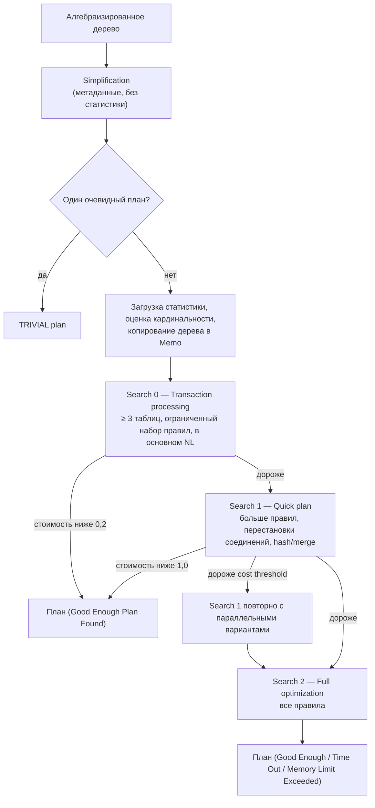
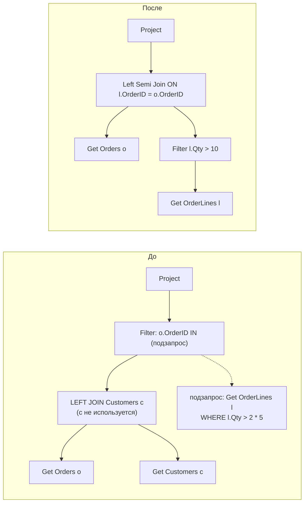
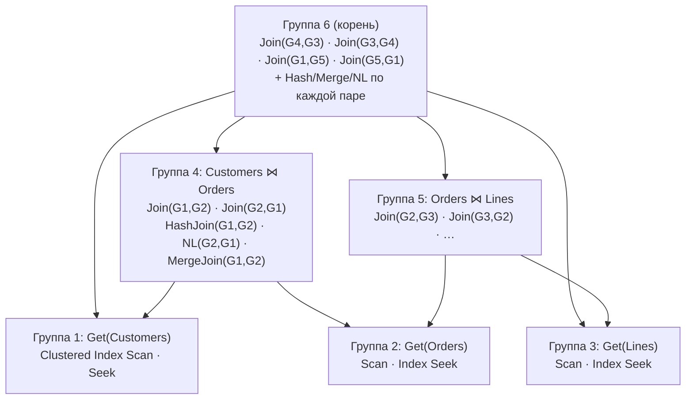
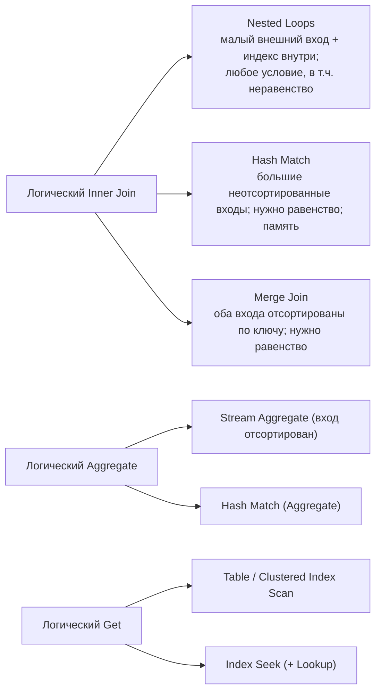

# 3. Оптимизатор

[← Раздел 2](02-query-pipeline.md) · [Оглавление](../README.md) · [Раздел 4 →](04-statistics.md)

Вопросы 18–28. Практика: [`01_scan_vs_seek_demo.sql`](../sql/01_scan_vs_seek_demo.sql) (часть 3 — несаргабельные условия), [`03_plan_warnings_demo.sql`](../sql/03_plan_warnings_demo.sql) (блок A — неявные преобразования).

---

## 18. Стоимостной оптимизатор и оптимизатор на правилах

> **Кратко.** **RBO** выбирает план по фиксированной иерархии правил («есть индекс — используй индекс») и **не знает о данных**. **CBO** порождает множество альтернатив, для каждой **оценивает число строк по статистике** и стоимость (I/O + CPU), а затем берёт самую дешёвую. SQL Server, PostgreSQL и современный Oracle работают как CBO.

| Ситуация | RBO | CBO |
|---|---|---|
| Условию соответствует 90% строк, есть индекс | Seek + миллионы Key Lookup | Скан всей таблицы |
| Выбор соединения | Всегда один и тот же | NL для малого внешнего входа, Hash для больших, Merge для отсортированных |
| Таблица выросла в 1000 раз | План тот же | План меняется |
| Слабое место | Не адаптируется к данным | **Полностью зависит от качества статистики и оценок** |

Отсюда главный вывод всей методички: у CBO большинство плохих планов — следствие **неверной оценки кардинальности** (вопрос 39).

---

## 19. Что такое стоимость плана

> **Кратко.** Стоимость — **безразмерная оценка** ресурсов, которую оптимизатор считает **до** выполнения по своей модели. Для оператора это I/O cost + CPU cost, стоимость плана равна сумме по операторам, стоимость узла включает стоимость его поддерева. Это не секунды и не чтения. Сравнивать стоимости имеет смысл только между **альтернативными планами одного запроса**.

- Историческая справка: в SQL Server 7.0 единица примерно соответствовала секунде на эталонной машине того времени. Отсюда `cost threshold for parallelism = 5`. Сейчас эта связь со временем полностью потеряна.
- Формулы для **Clustered Index Scan** в SQL Server:
  - I/O = 0,003125 + 0,00074074 × (страниц − 1);
  - CPU = 0,0001581 + 0,0000011 × (строк − 1).
  
  Для 121 317 строк на 1 234 страницах: 0,9165 + 0,1336 ≈ **1,05**.
- В PostgreSQL за единицу принята стоимость последовательного чтения страницы (`seq_page_cost = 1`), `random_page_cost = 4`, `cpu_tuple_cost = 0,01`. Пример: Seq Scan по 2 624 страницам и 214 867 строкам = 2 624 + 2 148,67 = **4 772,67**. План показывает пару `cost=startup..total`.
- Все формулы умножаются на **ожидаемое число строк и страниц**. Если оценка строк неверна, неверна и стоимость.
- Проценты в графическом плане считаются из этих оценок, **даже в фактическом плане** (вопрос 55).

---

## 20. «Достаточно хороший» план. Good Enough Plan Found и Time Out

> **Кратко.** Число вариантов растёт комбинаторно: для 10 таблиц только форм дерева соединений около 17,6 млрд. Оптимизатор минимизирует **время компиляции + время выполнения**, поэтому останавливается, как только найден план, который дёшев относительно своей оценки. Причину остановки показывает свойство корневого SELECT `Reason For Early Termination Of Statement Optimization` (`StatementOptmEarlyAbortReason` в XML).

| Значение | Смысл | Что делать |
|---|---|---|
| **Good Enough Plan Found** | Найден достаточно дешёвый план, штатная остановка | Ничего |
| **Time Out** | Исчерпан **бюджет оптимизации** (число применённых преобразований, не секунды). Взят лучший из найденного | Упростить запрос: разбить на шаги через `#temp`, убрать лишние соединения. Это **не** таймаут выполнения |
| **Memory Limit Exceeded** | Не хватило памяти на перебор | Упростить запрос |
| (пусто) | Тривиальный план или полный перебор завершился сам | — |

> 1С: большие запросы с разыменованиями, виртуальными таблицами и RLS легко приходят к `Time Out`. Классический совет «разбить на пакет с временными таблицами» имеет под собой техническую основу: каждый шаг маленький, и оптимизатор успевает его перебрать.

---

## 21. Trivial plan

> **Кратко.** Если после упрощения у запроса **по существу один разумный план**, стоимостной перебор пропускается: Memo не строится, варианты не сравниваются. В свойствах корневого SELECT — `Optimization Level = TRIVIAL` (при полной оптимизации — `FULL`).

Когда применяется:
- `SELECT … FROM T` без условий;
- поиск по уникальному ключу: `WHERE PK = 5`;
- `INSERT … VALUES`.

Когда запрос его теряет:
- появляется соединение;
- агрегат с выбором Stream/Hash;
- на таблице есть альтернативный индекс (выбор между «Seek + Lookup» и сканом);
- условие по неуникальному столбцу, где число строк зависит от значения.

Что любят спрашивать:
- тривиальный план **всегда последовательный**;
- для него **не формируются подсказки Missing Index**;
- именно такие запросы подпадают под **простую автопараметризацию** (вопрос 16).

---

## 22. Фазы оптимизации

> **Кратко.** **Simplification** (всегда) → **Trivial plan** (если подходит) → стоимостная оптимизация: **Search 0** (Transaction processing) → **Search 1** (Quick plan, здесь впервые рассматривается параллелизм) → **Search 2** (Full optimization). После каждой фазы оптимизатор проверяет, не хватит ли уже найденного.

| Фаза | Когда | Порог выхода |
|---|---|---|
| Search 0 | Не меньше 3 таблиц | Стоимость < 0,2 |
| Search 1 | Не прошёл Search 0 или запрос с 1–2 таблицами | Стоимость < 1,0. Если стоимость выше `cost threshold for parallelism`, Search 1 повторяется с параллельными планами |
| Search 2 | Всё остальное | Хороший план, таймаут бюджета или нехватка памяти |

Фазы — это **всё более широкие наборы правил, применяемые к одной и той же Memo** (вопрос 24). Счётчики по серверу: `sys.dm_exec_query_optimizer_info` (`trivial plan`, `search 0/1/2`, `timeout`).

---

## 23. Упрощение (simplification)

> **Кратко.** Переписывание логического дерева в эквивалентное и более простое. Опирается на **метаданные**: ключи, уникальные индексы, **доверенные** FK и CHECK, NULL/NOT NULL. Статистику не использует и выполняется для каждого запроса.

| Преобразование | На что опирается | Что видно в плане |
|---|---|---|
| Удаление LEFT JOIN | Уникальный ключ справа, столбцы справа не используются | Таблицы нет в плане |
| Удаление INNER JOIN | **Доверенный** FK (+ `IS NOT NULL`, если столбец допускает NULL) | Таблицы нет, возможен фильтр IS NOT NULL |
| Свёртка констант | `2 * 5` → `10`, `1 = 1 AND x` → `x` | В предикате уже вычисленное значение |
| Противоречие | Литералы (`Qty > 100 AND Qty < 50`), доверенные CHECK | **Constant Scan** без чтения таблицы |
| Перенос предиката вниз | Фильтр по столбцу, доступному ниже (в т.ч. по столбцу группировки во view) | Фильтр или Seek прямо у чтения таблицы |
| IN / EXISTS | Подзапрос | **Left Semi Join** |
| NOT EXISTS | Подзапрос | **Left Anti Semi Join** |
| Скалярный подзапрос в SELECT | Подзапрос | Left Outer Join (+ Assert, если нет уникальности) |
| OUTER → INNER | WHERE отбрасывает NULL-строки правой стороны | Inner Join вместо Left Outer |

Чего упрощение **не** делает:
- не видит значения переменных и параметров (без `OPTION (RECOMPILE)`);
- не переписывает `YEAR(d) = 2025` в диапазон;
- не использует FK и CHECK, созданные `WITH NOCHECK`. Проверка: `sys.foreign_keys.is_not_trusted`, лечение: `ALTER TABLE … WITH CHECK CHECK CONSTRAINT …`.

**NOT IN и NULL.** Если в подзапросе встречается NULL, `NOT IN` по стандарту вернёт пустой результат, и план получается тяжелее. Для «нет в списке» лучше `NOT EXISTS`.

> 1С не создаёт в базе FK и CHECK. Поэтому удаление INNER JOIN по FK в 1С не работает, а удаление LEFT JOIN по уникальному `_IDRRef` (разыменование, результат которого не используется) — работает.

---

## 24. ★ Memo и группы в модели Cascades

> **Кратко.** **Memo** — структура, в которой оптимизатор компактно хранит все рассмотренные варианты плана. Она состоит из **групп**. Группа — множество **логически эквивалентных** выражений (дающих одинаковый результат). Входы элементов группы — **другие группы**, а не конкретные поддеревья. Поэтому общие части планов хранятся и оцениваются один раз (динамическое программирование). Модель Cascades предложил Гётц Грефе, в SQL Server она используется с версии 7.0.

Пример: `Customers ⋈ Orders ⋈ OrderLines`.

Группы `Customers ⋈ Lines` нет: между ними нет условия соединения, это было бы декартово произведение.

Как заполняется Memo:
1. **Copy in**: упрощённое дерево копируется, каждый оператор становится своей группой.
2. **Правила исследования** (exploration) добавляют логические альтернативы. `JoinCommute`: A⋈B → B⋈A. Ассоциативность: (A⋈B)⋈C → A⋈(B⋈C), и при необходимости создаётся новая группа. Дубли отсекаются по хешу.
3. **Правила реализации** (implementation) добавляют физические операторы: `JNtoHS` (Hash), `JNtoNL`, `JNtoSM` (Merge), `GetToScan`, `GetIdxToRng`. Статистика применения правил: `sys.dm_exec_query_transformation_stats`.
4. **Оценка стоимости только у физических элементов**, снизу вверх. В каждой группе запоминается **победитель**, а для каждого набора требуемых физических свойств (например, «отсортировано по OrderID» для Merge Join) — свой победитель. Операторы, обеспечивающие свойство (Sort), называются **enforcer**.
5. **Branch and bound**: частичный вариант дороже уже найденного плана отбрасывается.
6. **Copy out**: план собирается из победителей начиная с корневой группы.

Важное следствие: **кардинальность — логическое свойство группы** и считается один раз для всех её вариантов. Ошибка в оценке переходит во все варианты сразу, и оптимизатор уверенно выбирает плохой план.

Начальную и итоговую Memo на тестовом сервере показывают флаги `QUERYTRACEON 3604, 8608, 8615` (недокументированные).

---

## 25. ★ Логические и физические операторы

> **Кратко.** **Логический** оператор описывает, **что** сделать (Inner Join, Aggregate, Filter, Union). **Физический** — **как** именно, каким алгоритмом (Nested Loops, Hash Match, Merge Join, Stream Aggregate, Index Seek). Правила реализации превращают один логический оператор в несколько физических кандидатов, и выбирается самый дешёвый. В плане у оператора есть оба свойства: `Physical Operation` и `Logical Operation`.

Один физический оператор может реализовать разные логические. Hash Match — это Inner/Outer Join, Aggregate, Union, Distinct. Nested Loops — Inner, Left Outer, Left Semi (EXISTS), Left Anti Semi (NOT EXISTS). Подробно алгоритмы соединения — в [вопросе 45](05-plans-operators.md#45-nested-loops-merge-join-и-hash-match).

---

## 26. SARGable-предикат

> **Кратко.** SARG = *Search ARGument*. Условие **саргабельно**, если столбец в нём стоит «голым», а значение от столбца не зависит: `столбец оператор значение` (=, <, >, BETWEEN, IN, IS NULL, `LIKE 'abc%'`). Тогда условие может стать **Seek Predicate**. Несаргабельное условие проверяется для **каждой прочитанной строки** (Predicate), то есть требует скана.

Главное правило: **все вычисления переносите на сторону значения, столбец оставляйте голым.**

| Несаргабельно | Саргабельная замена |
|---|---|
| `YEAR(d) = 2025` | `d >= '20250101' AND d < '20260101'` |
| `CONVERT(varchar(8), d, 112) = '20250315'` | `d >= '20250315' AND d < '20250316'` |
| `LEFT(Name, 4) = N'Иван'` | `Name LIKE N'Иван%'` |
| `UPPER(Name) = N'ИВАНОВ'` | `Name = N'Иванов'` (при CI-сортировке UPPER не нужен) |
| `ISNULL(x, 0) = 0` | `x = 0 OR x IS NULL` (OR по одному столбцу — два seek) |
| `Price * 1.2 > 1000` | `Price > 1000 / 1.2` |
| `DATEADD(day, 30, d) < GETDATE()` | `d < DATEADD(day, -30, GETDATE())` |
| `varchar_col = 123` | `varchar_col = '123'` |
| `varchar_col = @nvarchar_param` | параметр типа `varchar` |
| `Name LIKE N'%ов'` | полнотекстовый поиск; вычисляемый `REVERSE(Name)` + индекс |
| `A = 1 OR B = 2` (разные столбцы) | `UNION` двух запросов (или UNION ALL с исключением пересечения) |
| `(@p IS NULL OR Col = @p)` | `OPTION (RECOMPILE)` или динамический SQL только с заданными условиями |
| `Col1 > Col2` | вычисляемый столбец + индекс |

**Особые случаи:**
- `CAST(datetime_col AS date) = '20250315'` формально функция, но SQL Server превращает его в диапазон (dynamic seek через `GetRangeThroughConvert`). Честный диапазон всё равно лучше для оценки строк;
- саргабельность **необходима, но недостаточна** для seek: при большой доле строк оптимизатор всё равно выберет скан ([tipping point](05-plans-operators.md#42-table-scan-clustered-index-scan-index-seek-всегда-ли-scan--плохо));
- «не тот столбец индекса»: условие по второму столбцу `(LastName, FirstName)` само по себе саргабельно, но **этому** индексу не подходит;
- отрицания (`<>`, `NOT IN`, `NOT LIKE`) формально превращаются в два диапазона, но обычно ведут к скану из-за большой доли строк. Помогает фильтрованный индекс;
- в BETWEEN с `datetime` верхнюю границу пишите через `<` следующего дня.

В плане саргабельная часть видна в **Seek Predicates**, несаргабельная — в **Predicate**. Примеры на данных — часть 3 [`01_scan_vs_seek_demo.sql`](../sql/01_scan_vs_seek_demo.sql).

> 1С: `ГДЕ ГОД(Док.Дата) = 2025` → `ГДЕ Док.Дата МЕЖДУ &НачалоГода И &КонецГода`. То же с `ПОДСТРОКА()` над полем и `ПОДОБНО "%…"`.

> ⚠️ **Расхождение в источниках.** В одном из ответов пример «столбец `NVARCHAR`, литерал `'...'` без `N`» назван несаргабельным. Это **неверно**: у `varchar` приоритет ниже, поэтому приводится **литерал**, и seek сохраняется. Плохо обратное сочетание: столбец `varchar`, значение `nvarchar`.

---

## 27. Неявное преобразование типов

> **Кратко.** При сравнении разных типов тип с **меньшим приоритетом** приводится к типу с **большим**: `varchar` < `nvarchar` < … < `int` < … < `datetime`. Если приводится **значение** — проблемы нет. Если **столбец** (`CONVERT_IMPLICIT(nvarchar, col)`), это то же самое, что функция над столбцом: seek невозможен или ухудшен, а гистограмма к выражению неприменима. Решение принимается ещё на этапе привязки.

| Сравнение | Что приводится | Итог |
|---|---|---|
| `int_col = '123'` | Литерал → int | Seek, всё хорошо |
| `varchar_col = 12345` | **Столбец** → int | Scan. Упадёт с ошибкой, если в столбце есть `'A-15'` |
| `varchar_col (SQL_Latin1_…) = N'…'` | **Столбец** → nvarchar | Scan |
| `varchar_col (Cyrillic_General_CI_AS) = N'…'` | Столбец | Dynamic seek (`GetRangeThroughConvert`), но оценка хуже |
| Конвертация только в SELECT | — | Предупреждение CardinalityEstimate бывает, на план не влияет |

**Как обнаружить:**
1. Жёлтый треугольник на SELECT → Warnings → **PlanAffectingConvert**: `Type conversion in expression (CONVERT_IMPLICIT(...)) may affect "SeekPlan" / "CardinalityEstimate"`.
2. Свойство **Predicate** оператора: `CONVERT_IMPLICIT` **вокруг столбца**.
3. Кэш: `qp.query_plan.exist('//Warnings/PlanAffectingConvert') = 1` (блок D в [`03_plan_warnings_demo.sql`](../sql/03_plan_warnings_demo.sql)).

**Лечение:** тип параметра или литерала должен совпадать с типом столбца. Типичный источник проблемы — ORM и драйверы, передающие строки как `nvarchar`. Если тип параметра поменять нельзя, приводите **параметр**: `WHERE col = CAST(@p AS varchar(50))`.

---

## 28. Хинты запросов и таблиц. Почему это крайняя мера

> **Кратко.** Хинт — **приказ**, а не совет: он отключает часть пространства поиска оптимизатора. Хинт фиксирует решение, верное **сегодня на этих данных**. Когда данные вырастут, распределение изменится, появится новый индекс или сменится версия, оптимизатор уже не сможет подстроиться. Недостижимый хинт вообще приводит к ошибке запроса.

| Вид | Примеры | Где пишется |
|---|---|---|
| Табличные | `WITH (INDEX(IX_…))`, `FORCESEEK`, `FORCESCAN`, `NOLOCK` | После имени таблицы |
| Запроса | `OPTION (RECOMPILE)`, `OPTIMIZE FOR (@p = …)`, `OPTIMIZE FOR UNKNOWN`, `MAXDOP n`, `FORCE ORDER`, `HASH/LOOP/MERGE JOIN`, `USE HINT('…')` | В конце запроса |
| Соединения | `INNER HASH JOIN`, `LEFT LOOP JOIN` | В FROM. **Неявно включает FORCE ORDER для всего запроса** |

**Что сделать до хинта:**
1. Сравнить Estimated и Actual rows, при необходимости обновить статистику.
2. Проверить SARGable-условия и типы (нет ли `CONVERT_IMPLICIT`).
3. Проверить индексы (покрывающий?).
4. Упростить запрос: временные таблицы, UNION вместо OR.

**Допустимые «мягкие» хинты:** `OPTION (RECOMPILE)` для редких тяжёлых запросов, `OPTIMIZE FOR`, `MAXDOP`. Если код менять нельзя, хинт навешивают снаружи: Query Store hints (2022), plan guides ([вопрос 60](06-params-cache.md#60-query-store)).

> 1С: вставить хинт в текст запроса платформы нельзя. Остаются индексы, переписывание запроса, статистика и Query Store.

---

[← Раздел 2](02-query-pipeline.md) · [Оглавление](../README.md) · [Раздел 4 →](04-statistics.md)
