# 3. Оптимизатор

[← Раздел 2](02-query-pipeline.md) · [Оглавление](../README.md) · [Раздел 4 →](04-statistics.md)

Вопросы 18–28 и сквозной пример 28а. Практика: [`01_scan_vs_seek_demo.sql`](../sql/01_scan_vs_seek_demo.sql) (часть 3 — несаргабельные условия), [`03_plan_warnings_demo.sql`](../sql/03_plan_warnings_demo.sql) (блок A — неявные преобразования), [`15_negation_filtered_index_demo.sql`](../sql/15_negation_filtered_index_demo.sql), [`17_optimizer_internals_demo.sql`](../sql/17_optimizer_internals_demo.sql) (фазы, бюджет, упрощение, правила трансформации).

---

### Как работает оптимизатор: общая картина

Прежде чем разбирать вопросы по отдельности — весь путь запроса от текста до плана одним взглядом. Вопросы раздела 3 разбирают каждый шаг подробно, а [вопрос 28а](#28а-сквозной-пример-что-делает-оптимизатор-с-запросом-шаг-за-шагом) проводит через все шаги один запрос с конкретными числами.

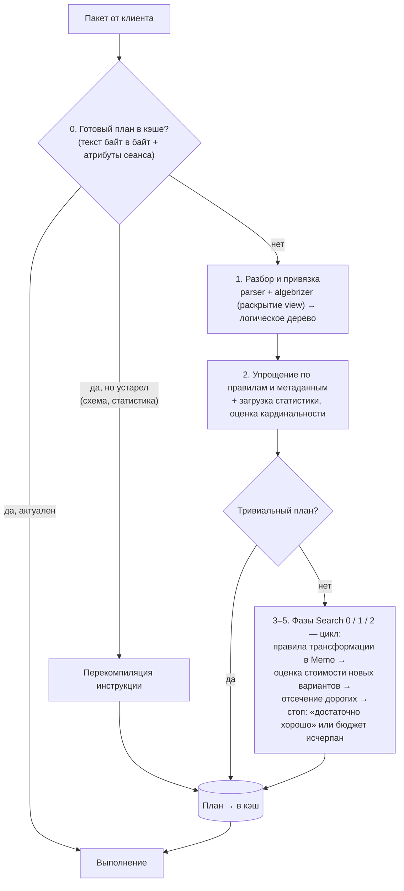

| Шаг | Что происходит | Где подробно |
|---|---|---|
| 0. Кэш | Поиск готового плана **до** компиляции по хешу текста пакета и атрибутам сеанса. Найден и актуален — шаги 1–5 пропускаются. Найден, но устарел — перекомпилируется инструкция | [Вопросы 13–14](02-query-pipeline.md#13-кэш-планов-когда-план-берётся-из-кэша-а-когда-компилируется) |
| 1. Разбор и привязка | Парсер проверяет синтаксис. Алгебраизатор разрешает имена, выводит типы, проверяет группировку, **раскрывает представления**. Результат — дерево логических операторов | [Вопросы 11–12](02-query-pipeline.md#12-этап-привязки-algebrizer) |
| 2. Упрощение | Эквивалентные переписывания по правилам и метаданным: константы, противоречия, лишние соединения, подзапросы → соединения, перенос фильтров. Стоимость не используется. Затем загружается статистика и оцениваются строки | [Вопрос 23](#23-упрощение-simplification) |
| Тривиальный план | Если разумный вариант один, план отдаётся сразу | [Вопрос 21](#21-trivial-plan) |
| 3–5. Поиск по фазам | Не три последовательных шага, а **цикл** внутри каждой фазы: правила трансформации добавляют в Memo логические и физические варианты, оптимизатор сразу оценивает их стоимость (I/O + CPU) по кардинальности, отсекает дорогие и останавливается, когда план «достаточно хорош» или кончился бюджет | [Вопросы 19, 20, 22, 24](#24--memo-и-группы-в-модели-cascades) |
| Кэш и выполнение | План кладётся в кэш **сразу после компиляции**, до выполнения. Исключения: `OPTION (RECOMPILE)` — план не сохраняется; *optimize for ad hoc workloads* — для разового запроса сначала только заглушка | [Вопросы 13, 15](02-query-pipeline.md#15-ad-hoc-параметризованный-запрос-и-хранимая-процедура) |

Практика ко всему разделу — [`17_optimizer_internals_demo.sql`](../sql/17_optimizer_internals_demo.sql): тривиальный и полный план, фазы и бюджет, деревья до и после упрощения, противоречие по CHECK, удаление соединения по FK, транзитивность, сработавшие правила трансформации и сквозной пример вопроса 28а.

> ⚠️ **Уточнения к распространённым описаниям.**
> - Кэш — это не последний шаг, а **первый**: сначала ищется готовый план, а в кэш план попадает сразу после компиляции.
> - «Такой же запрос» — это совпадение текста **байт в байт** (пробелы, регистр) или параметризованный запрос. Поэтому запросы 1С с параметрами хорошо переиспользуют планы, а запросы со склеенными в текст литералами плодят новые.
> - Права доступа проверяются в основном **при выполнении**, а не при привязке: один кэшированный план используют разные пользователи.
> - Представления раскрываются ещё при **привязке**, а не при упрощении.
> - Стоимость плана — это **I/O + CPU**. Оперативная память (memory grant) в неё почти не входит и считается отдельно.
> - «Бюджет времени» точнее называть лимитом **числа задач** трансформации, а не времени ([вопрос 20](#20-достаточно-хороший-план-good-enough-plan-found-и-time-out)).

---

## 18. Стоимостной оптимизатор и оптимизатор на правилах

> **Кратко.** **RBO** (Rule-Based Optimizer, оптимизатор на правилах) выбирает план по фиксированной иерархии правил («есть индекс — используй индекс») и **не знает о данных**. **CBO** (Cost-Based Optimizer, стоимостной оптимизатор) порождает множество альтернатив, для каждой **оценивает число строк по статистике** и стоимость (I/O + CPU), а затем берёт самую дешёвую. SQL Server, PostgreSQL и современный Oracle работают как CBO.

### RBO — оптимизатор на правилах

План выбирается по заранее заданному списку приоритетов способов доступа, например:
1. доступ по адресу строки или первичному ключу — лучше всего;
2. поиск по уникальному индексу;
3. поиск по неуникальному индексу;
4. …
5. полный просмотр таблицы — хуже всего.

Оптимизатор смотрит на текст запроса и на то, какие индексы есть, и берёт вариант с самым высоким приоритетом. **На данные он не смотрит**: сколько строк в таблице и сколько из них подходят под условие, ему неизвестно. Так работал Oracle в ранних версиях. С Oracle 10g (2003) RBO официально не поддерживается.

### CBO — стоимостной оптимизатор

1. **Строит много вариантов** выполнения: разные индексы, порядок соединения таблиц, алгоритмы соединения.
2. **Оценивает каждый вариант по статистике**: сколько строк пройдёт через каждый шаг и какова условная стоимость (ввод-вывод + процессор, [вопрос 19](#19-что-такое-стоимость-плана)).
3. **Выбирает самый дешёвый** вариант.

Так работают SQL Server, PostgreSQL, современный Oracle и практически все промышленные СУБД.

### Пример, на котором видна разница

Таблица заказов на 1 000 000 строк, есть индекс по `Status`, 95% заказов закрыты:

```sql
SELECT * FROM dbo.Orders WHERE Status = 'Closed';
```

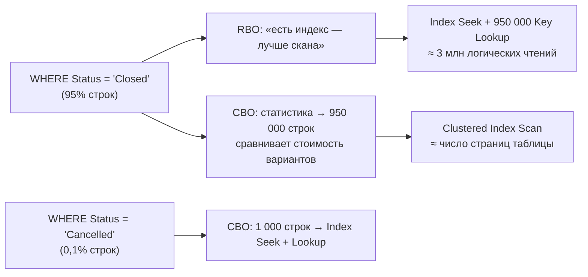

- **RBO:** «есть индекс по Status — значит, поиск по индексу лучше полного просмотра». В итоге 950 000 раз находит строку в индексе и отдельно идёт за ней в таблицу. Это намного медленнее, чем прочитать таблицу целиком ([точка перелома](05-plans-operators.md#42-table-scan-clustered-index-scan-index-seek-всегда-ли-scan--плохо)).
- **CBO:** по статистике видит, что подходит 95% строк, считает стоимость обоих вариантов и выбирает полный просмотр. Для `Status = 'Cancelled'`, где подходит 0,1% строк, тот же CBO выберет индекс.

RBO на один и тот же текст запроса всегда даёт один и тот же план. CBO подстраивает план под реальные данные.

| Ситуация | RBO | CBO |
|---|---|---|
| Условию соответствует 90% строк, есть индекс | Seek + миллионы Key Lookup | Скан всей таблицы |
| Условию соответствует 0,1% строк | Seek по индексу | Seek по индексу |
| Выбор соединения | Всегда один и тот же | NL для малого внешнего входа, Hash для больших, Merge для отсортированных |
| Таблица выросла в 1000 раз | План тот же | План меняется |
| Слабое место | Не адаптируется к данным | **Полностью зависит от качества статистики и оценок** |

### Обратная сторона CBO

CBO хорош ровно настолько, насколько точны его оценки. Если статистика устарела или оценка числа строк сильно ошиблась (ждали 10 строк, пришло 500 000), CBO уверенно выберет плохой план. Отсюда главный вывод всей методички: у CBO большинство плохих планов — следствие **неверной оценки кардинальности** ([вопрос 39](04-statistics.md#39--ошибка-оценки-кардинальности-как-найти-и-почему-она-главная)). Разделы про статистику, parameter sniffing и ошибки оценки — по сути о том, как помочь CBO не ошибаться.

> **Частое недоразумение.** CBO тоже использует правила, но в другой роли. **Правила преобразования** (переставить соединения, опустить фильтр ниже соединения, [вопросы 23–24](#23-упрощение-simplification)) **порождают варианты** плана, а **выбирает** между ними стоимость. У RBO правило само по себе и есть решение.

---

## 19. Что такое стоимость плана

> **Кратко.** Стоимость — **безразмерная оценка** ресурсов, которую оптимизатор считает **до** выполнения по своей модели. Для оператора это I/O cost + CPU cost, стоимость плана равна сумме по операторам, стоимость узла включает стоимость его поддерева. Это не секунды и не чтения. Сравнивать стоимости имеет смысл только между **альтернативными планами одного запроса**.

- Историческая справка: в SQL Server 7.0 единица примерно соответствовала секунде на эталонной машине того времени. Отсюда `cost threshold for parallelism = 5`. Сейчас эта связь со временем полностью потеряна.
- Формулы для **Clustered Index Scan** в SQL Server:
  - I/O = 0,003125 + 0,00074074 × (страниц − 1);
  - CPU = 0,0001581 + 0,0000011 × (строк − 1).
  
  Для 121 317 строк на 1 234 страницах: 0,9165 + 0,1336 ≈ **1,05**.
- В PostgreSQL за единицу принята стоимость последовательного чтения страницы (`seq_page_cost = 1`), `random_page_cost = 4`, `cpu_tuple_cost = 0,01`. Пример: Seq Scan по 2 624 страницам и 214 867 строкам = 2 624 + 2 148,67 = **4 772,67**. План показывает пару `cost=startup..total`.
- Все формулы умножаются на **ожидаемое число строк и страниц**. Если оценка строк неверна, неверна и стоимость.
- Проценты в графическом плане считаются из этих оценок, **даже в фактическом плане** (вопрос 55).


Как стоимость считается для целого запроса и как по ней выбирается план — сквозной пример в [вопросе 28а](#28а-сквозной-пример-что-делает-оптимизатор-с-запросом-шаг-за-шагом).
---

## 20. «Достаточно хороший» план. Good Enough Plan Found и Time Out

> **Кратко.** «Достаточно хороший» план — это план, **дальнейший поиск которого, скорее всего, обойдётся дороже, чем выигрыш от лучшего плана**. Оптимизатор не ищет самый быстрый план из всех возможных: число вариантов растёт комбинаторно, и он минимизирует **время компиляции + время выполнения**. После каждой стадии он сравнивает стоимость лучшего найденного плана с порогом: ниже порога — остановка, **Good Enough Plan Found**. Если закончился **бюджет** стадии (число преобразований, не секунды), берётся лучшее из найденного — **Time Out**. Причину остановки показывает свойство корневого оператора `Reason For Early Termination Of Statement Optimization` (`StatementOptmEarlyAbortReason` в XML).

### Почему полный перебор невозможен

Запрос по оценке выполняется 5 мс — нет смысла тратить 2 секунды на перебор миллиардов вариантов, чтобы сэкономить ещё 1 мс. А вариантов действительно миллиарды. Для **n** таблиц только **форм дерева соединений** (без выбора алгоритмов и индексов) насчитывается (2n − 2)! / (n − 1)!:

| Таблиц | Форм дерева соединений |
|---|---|
| 2 | 2 |
| 3 | 12 |
| 5 | 1 680 |
| 10 | 18! / 9! ≈ **17,6 млрд** |

К этому добавляются выбор алгоритма соединения (Nested Loops, Hash, Merge), индексов, агрегатов, параллелизма.

### Как оптимизатор решает, что пора остановиться

Работают **два взаимодополняющих механизма**: фиксированные пороги стадий и динамический бюджет оптимизации.

**Механизм 1. Пороги стадий.** Оптимизация идёт стадиями, от дешёвых к дорогим ([вопрос 22](#22-фазы-оптимизации)):

1. **Trivial plan** — у запроса по сути один разумный вариант, альтернативы не оцениваются ([вопрос 21](#21-trivial-plan)).
2. **Search 0** (Transaction Processing) — небольшой набор правил для типичных OLTP-запросов, от 3 таблиц.
3. **Search 1** (Quick Plan) — расширенный набор правил преобразования. Если план дороже `cost threshold for parallelism`, здесь впервые рассматриваются параллельные варианты.
4. **Search 2** (Full Optimization) — полный набор правил.

В конце Search 0 и Search 1 стоимость лучшего найденного плана сравнивается с **порогом стадии**. Если она ниже, поиск прекращается — **Good Enough Plan Found**. Пороги — внутренние константы оптимизатора в тех же условных единицах стоимости (оценка CPU + I/O). Microsoft их не документирует. По исследованиям внутреннего устройства оптимизатора (Paul White, Benjamin Nevarez) это примерно **0,2** для Search 0 и **1,0** для Search 1. Смысл простой: дешёвому запросу дорогая оптимизация не нужна.

**Механизм 2. Бюджет оптимизации.** Каждой стадии выделяется **бюджет** — ограниченное число задач-преобразований. Он зависит от стоимости запроса и лучшего найденного плана. Логика экономическая:
- выигрыш от дальнейшего поиска **не может превышать стоимость текущего лучшего плана C**. План стоимостью 0,05 нельзя ускорить больше чем на 0,05, а сам поиск тоже тратит процессор;
- дешёвый план — маленький бюджет. Если продолжение явно не окупится, поиск останавливается с **Good Enough Plan Found**, даже если формальный порог стадии не достигнут;
- бюджет исчерпан, а достаточно хороший план не найден — оптимизатор берёт лучший из найденных. Это **Time Out**;
- бюджет считается в **преобразованиях, а не в секундах**, поэтому Time Out **воспроизводим**: на тех же данных и статистике получится тот же план.

Точная формула бюджета не документирована. Описанная логика — модель, которая согласуется с наблюдаемым поведением оптимизатора.

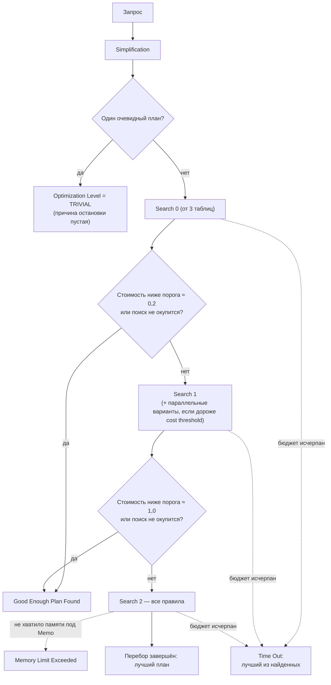

| Значение | Смысл | Что делать |
|---|---|---|
| **Good Enough Plan Found** | Нормальная ситуация: стоимость ниже порога стадии или дальнейший поиск не окупится | Ничего (если оценки верны — см. оговорку ниже) |
| **Time Out** | Сигнал, что запрос слишком сложный для поиска. Лучший план мог просто не попасть в рассмотрение, выбранный может быть заметно хуже возможного | Упростить запрос (ниже). Это **не** таймаут выполнения |
| **Memory Limit Exceeded** | Не хватило памяти под структуру вариантов (Memo, [вопрос 24](#24--memo-и-группы-в-модели-cascades)) | Упростить запрос |
| (пусто) | Тривиальный план или перебор завершился сам | — |

### Стоимость плана и бюджет оптимизации — не одно и то же

| | Стоимость плана | Бюджет оптимизации |
|---|---|---|
| Отвечает на вопрос | Сколько будет стоить **выполнить** запрос этим способом? | Сколько усилий потратить на **поиск** плана? |
| Относится к | Выполнению | Компиляции |
| Единицы | Условные единицы (I/O + CPU), считаются по статистике | Задачи трансформации (шаги перебора в Memo) |
| Где видно | `Estimated Subtree Cost` | Флаг 8675 (`tasks`), `Reason For Early Termination` |

**Аналогия.** Пачку соли за 30 рублей берут в первом магазине: сравнивать цены в пяти магазинах глупо, время дороже возможной экономии. Квартиру выбирают месяцами: удачный выбор сэкономит миллионы. Цена покупки — это стоимость плана, время на выбор — бюджет оптимизации.

**Связь между ними.** Отдельной «стоимости поиска» оптимизатор не считает. Пороги 0,2 и 1,0 — это та же стоимость плана (`Estimated Subtree Cost`) лучшего найденного варианта. По ней оптимизатор решает, продолжать ли поиск и сколько задач выделить. Дешёвый запрос получает маленький бюджет, дорогой — большой. На бюджет влияет и сложность запроса: пять таблиц дают намного больше комбинаций, чем две. Весь путь на числах разобран в [вопросе 28а](#28а-сквозной-пример-что-делает-оптимизатор-с-запросом-шаг-за-шагом).

**Почему бюджет в задачах, а не в секундах.** Если бы лимит был в секундах, на загруженном сервере оптимизатор успевал бы перебрать меньше вариантов, чем на свободном, и один и тот же запрос получал бы разные планы в зависимости от нагрузки. Лимит в задачах делает результат предсказуемым.

> **Про термины на аттестации.** Выражения «Optimization Cost Budget» и «динамический бюджет» в документации Microsoft не встречаются. Это пересказ из книг и статей (Paul White, Benjamin Nevarez). Официальные термины: фазы **search 0 / 1 / 2**, **optimizer timeout** и свойство **Reason For Early Termination Of Statement Optimization**.

### Где это увидеть

Свойства корневого оператора (SELECT, INSERT…) в предполагаемом или фактическом плане:
- **Optimization Level** (`StatementOptmLevel`) — `TRIVIAL` или `FULL`;
- **Reason For Early Termination Of Statement Optimization** (`StatementOptmEarlyAbortReason`) — `GoodEnoughPlanFound`, `TimeOut` или `MemoryLimitExceeded`.

Найти в кэше планы, оптимизация которых закончилась по таймауту:

```sql
WITH XMLNAMESPACES (DEFAULT 'http://schemas.microsoft.com/sqlserver/2004/07/showplan')
SELECT TOP (50)
    qs.total_worker_time / 1000 AS total_cpu_ms,
    qs.execution_count,
    SUBSTRING(st.text, qs.statement_start_offset / 2 + 1, 300) AS statement_start,
    qp.query_plan
FROM sys.dm_exec_query_stats qs
CROSS APPLY sys.dm_exec_sql_text(qs.sql_handle)    st
CROSS APPLY sys.dm_exec_query_plan(qs.plan_handle) qp
WHERE qp.query_plan.exist('//StmtSimple[@StatementOptmEarlyAbortReason="TimeOut"]') = 1
ORDER BY qs.total_worker_time DESC;
```

Сколько раз по серверу оптимизация заканчивалась таймаутом, показывает счётчик `timeout` в `sys.dm_exec_query_optimizer_info` (блоки 6 и 8 в [`07_plan_cache_top_queries.sql`](../sql/07_plan_cache_top_queries.sql)).

### Важная оговорка

«Достаточно хороший» — это **оценка оптимизатора, а не реальность**. Стоимость считается по статистике и модели кардинальности. Если статистика устарела или оценка числа строк сильно ошибается, «хороший» по оценке план может работать очень плохо, даже с `GoodEnoughPlanFound` ([вопрос 39](04-statistics.md#39--ошибка-оценки-кардинальности-как-найти-и-почему-она-главная)).

### Что увеличивает время оптимизации и ведёт к Time Out

Время оптимизации определяется **размером пространства поиска** — тем, сколько альтернатив оптимизатор может построить правилами преобразования ([Memo, вопрос 24](#24--memo-и-группы-в-модели-cascades)). Time Out случается, когда это пространство слишком велико для бюджета. Поэтому главные «виновники» — всё, что добавляет в запрос **соединения, ветки и альтернативные способы доступа**.

| Элемент запроса | Почему расширяет поиск |
|---|---|
| **Много соединений** — фактор номер один | Порядков и форм дерева соединений комбинаторно много (17,6 млрд для 10 таблиц), и каждое соединение ещё умножает варианты по алгоритмам (NL, Hash, Merge). На 8–12 таблицах Time Out — обычное дело |
| **Скрытые соединения** | Не видны в тексте, но оптимизатор их видит: <br/>• **представления** разворачиваются в тело запроса со всеми своими таблицами; <br/>• **CTE не материализуется**: сослались дважды — его текст подставлен дважды; <br/>• **`EXISTS`, `IN`, `NOT EXISTS`** становятся semi / anti semi join и участвуют в перестановках наравне с JOIN; <br/>• **скалярные UDF** с SQL Server 2019 могут встраиваться (UDF inlining) и тоже добавлять соединения |
| **UNION / UNION ALL** | Каждая ветка оптимизируется, через объединение проталкиваются предикаты, агрегаты и соединения. Много веток — много работы |
| **Агрегация** (`GROUP BY`, `DISTINCT`) | Оптимизатор пробует выполнять её до соединения, после него или по частям (локальная + глобальная). Каждое перемещение — новые альтернативы |
| **Сложные предикаты** | `OR` по разным столбцам или таблицам; `CASE` и выражения в условиях соединения; длинные `IN (…)` раскрываются в цепочку `OR`. Из них оптимизатор строит варианты с объединением нескольких поисков по индексам |
| **Много индексов** | Каждый подходящий индекс — отдельный путь доступа (Seek, Scan, Seek + Key Lookup), плюс варианты пересечения индексов (index intersection). В Enterprise ещё проверяется сопоставление с индексированными представлениями |
| **Секционированные таблицы и представления** | Варианты исключения секций и выполнения по секциям |
| **Параллелизм** | Если стоимость выше `cost threshold for parallelism`, Search 1 выполняется повторно, уже с параллельными планами. Это та же работа второй раз |

Внешние соединения (`LEFT` / `RIGHT JOIN`) ограничивают свободу перестановки и сами по себе пространство поиска скорее **сужают**. Но в больших запросах они часто запускают упрощения и переписывания, которые тоже тратят бюджет.

### Почему запросы 1С особенно часто упираются в Time Out

Платформа генерирует SQL, в котором соединений намного больше, чем видно в тексте запроса 1С ([вопрос 68](08-1c-specifics.md#68-как-запрос-1с-транслируется-в-sql-как-понять-объект-по-имени-таблицы)):

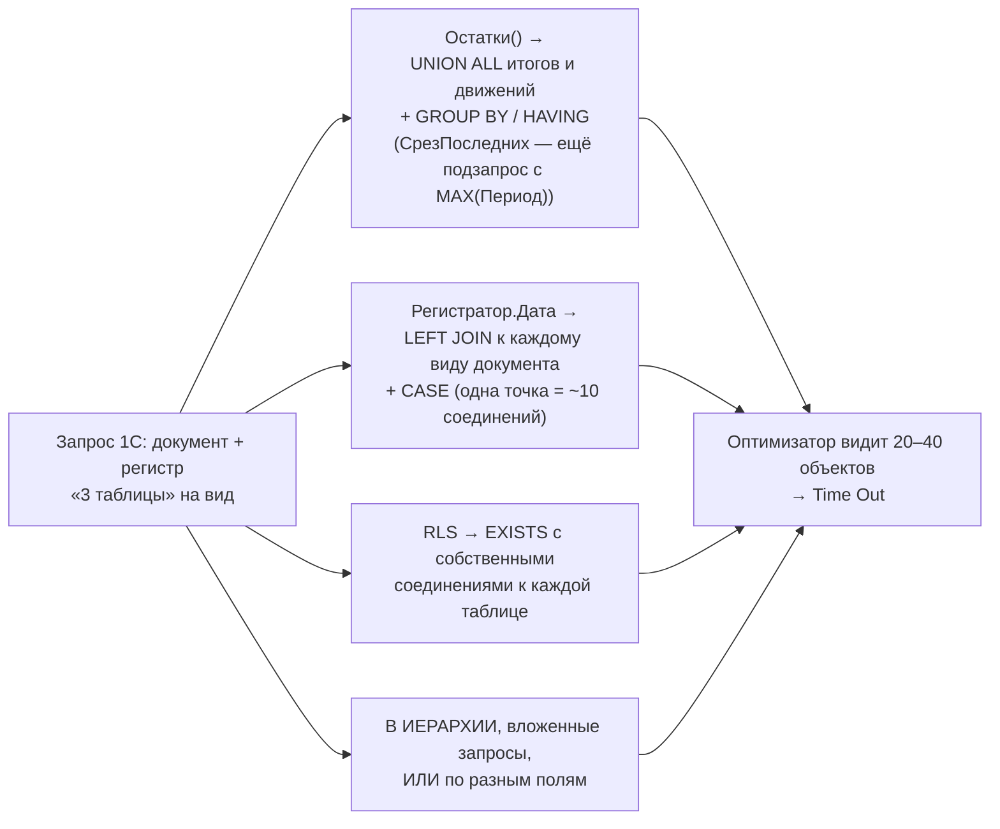

- **Виртуальные таблицы регистров** (`Остатки`, `ОстаткиИОбороты`, `СрезПоследних`) разворачиваются в объединение подзапросов по таблице итогов и таблице движений, а срез — ещё и в подзапрос с `MAX(Период)` ([вопрос 70](08-1c-specifics.md#70-параметры-виртуальных-таблиц--в-скобках-а-не-в-где)).
- **Разыменование составных полей через точку** даёт `LEFT JOIN` к каждой возможной таблице и `CASE` для выбора значения ([вопрос 73](08-1c-specifics.md#73-точка-от-составного-типа-и-выразить)).
- **RLS** (ограничение доступа на уровне записей платформы 1С, а не одноимённый механизм SQL Server) добавляет к каждой ограничиваемой таблице `EXISTS` с собственными соединениями и условиями `ИЛИ` ([вопрос 75](08-1c-specifics.md#75-rls-и-производительность)).
- **`В ИЕРАРХИИ`**, вложенные запросы, `ИЛИ` в условиях по разным полям.

### Что делать при Time Out

Общий принцип — **уменьшить число объектов, которые оптимизатор должен рассматривать одновременно**:

1. **Разбить запрос на пакет с временными таблицами** (`ПОМЕСТИТЬ ВТ_…` / `#temp`). Каждый шаг оптимизируется отдельно, с небольшим пространством поиска, а по заполненной временной таблице у оптимизатора есть настоящая статистика. Повторно используемые фрагменты тоже выносить в ВТ, а не повторять подзапросы и CTE.
2. **Для составных полей** использовать `ВЫРАЗИТЬ(Поле КАК Документ.Конкретный)` вместо разыменования через точку.
3. **Условия на измерения** передавать в параметры виртуальной таблицы, а не в `ГДЕ`.
4. **`ИЛИ` по разным полям** заменять на `ОБЪЕДИНИТЬ ВСЕ`, если это даёт понятные поиски по индексам ([вопрос 74](08-1c-specifics.md#74-или-в-условиях-и-соединениях-замена-на-объединить-все)).
5. **Убрать лишнее:** неиспользуемые соединения и представления, лишние индексы-дубли на таблицах.
6. **Хинты — крайняя мера.** `OPTION (FORCE ORDER)` отключает перебор порядка соединений и резко сокращает компиляцию, но жёстко фиксирует план ([вопрос 28](#28-хинты-запросов-и-таблиц-почему-это-крайняя-мера)). В запросах 1С хинты недоступны. Упрощение самого запроса надёжнее.

> PostgreSQL решает ту же проблему своими средствами. `join_collapse_limit` и `from_collapse_limit` (по умолчанию 8) ограничивают число таблиц, которые планировщик переставляет свободно. При 12 и более таблицах (`geqo_threshold`) включается генетический алгоритм `geqo`, который ищет план приближённо, без полного перебора.

> ⚠️ **Уточнения к исходным ответам.**
> - «Bitmap Scan» при `OR` — термин PostgreSQL. В SQL Server `OR` по разным столбцам обычно даёт скан или объединение нескольких поисков по индексам (Concatenation / Merge Interval, index union).
> - **Невстраиваемые скалярные UDF** для оптимизатора — «чёрный ящик» с фиксированной дешёвой оценкой. Пространство поиска они почти не расширяют, их вред — в выполнении (построчный вызов, запрет параллелизма). Расширяют поиск **встроенные** UDF (SQL Server 2019+), потому что их тело становится частью запроса.

---

## 21. Trivial plan

> **Кратко.** Если после упрощения у запроса **по существу один разумный план**, стоимостной перебор пропускается: Memo не строится, варианты не сравниваются. В свойствах корневого SELECT — `Optimization Level = TRIVIAL` (при полной оптимизации — `FULL`).

Когда применяется:
- `SELECT … FROM T` без условий;
- поиск по уникальному ключу: `WHERE PK = 5`;
- `INSERT … VALUES`.

Когда запрос его теряет:
- появляется соединение;
- агрегат с выбором Stream/Hash;
- на таблице есть альтернативный индекс (выбор между «Seek + Lookup» и сканом);
- условие по неуникальному столбцу, где число строк зависит от значения.

Что любят спрашивать:
- тривиальный план **всегда последовательный**;
- для него **не формируются подсказки Missing Index**;
- именно такие запросы подпадают под **простую автопараметризацию** (вопрос 16).

---

## 22. Фазы оптимизации

> **Кратко.** **Simplification** (всегда) → **Trivial plan** (если подходит) → стоимостная оптимизация: **Search 0** (Transaction processing) → **Search 1** (Quick plan, здесь впервые рассматривается параллелизм) → **Search 2** (Full optimization). После каждой фазы оптимизатор проверяет, не хватит ли уже найденного.

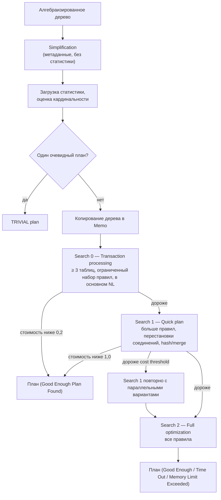

| Фаза | Когда | Порог выхода |
|---|---|---|
| Search 0 | Не меньше 3 таблиц | Стоимость < 0,2 |
| Search 1 | Не прошёл Search 0 или запрос с 1–2 таблицами | Стоимость < 1,0. Если стоимость выше `cost threshold for parallelism`, Search 1 повторяется с параллельными планами |
| Search 2 | Всё остальное | Хороший план, таймаут бюджета или нехватка памяти |

Фазы — это **всё более широкие наборы правил, применяемые к одной и той же Memo** (вопрос 24). Счётчики по серверу: `sys.dm_exec_query_optimizer_info` (`trivial plan`, `search 0/1/2`, `timeout`).


### Как увидеть фазы, стоимость и бюджет

| Способ | Что показывает | Документирован? |
|---|---|---|
| Свойства корневого оператора (F4) | `Optimization Level` (TRIVIAL / FULL), `Estimated Subtree Cost`, `Reason For Early Termination`, а также `CompileTime`, `CompileCPU`, `CompileMemory` (время и память компиляции) | Да |
| `sys.dm_exec_query_optimizer_info` | Счётчики по серверу: сколько было оптимизаций, тривиальных планов, выходов в Search 0/1/2, таймаутов, среднее число задач (`tasks`), таблиц, итоговая стоимость. Снимок **до и после** запроса показывает, что сделал оптимизатор именно для него | Да (счётчики общие на сервер: мерить на тестовом сервере без нагрузки) |
| `OPTION (RECOMPILE, QUERYTRACEON 3604, QUERYTRACEON 8675)` | На вкладке Messages — строки по фазам вида `end search(1), cost: … tasks: …`: стоимость лучшего плана после фазы и **сколько задач (шагов перебора) потрачено**. Это и есть расход бюджета | Нет, только тестовый сервер, нужен sysadmin |

Как читать вывод флага 8675:
- **`cost`** — стоимость лучшего плана после фазы. Её сравнивают с порогом фазы (≈ 0,2 / 1,0);
- **`tasks`** — сколько шагов перебора потрачено. Именно в задачах, а не в секундах измеряется бюджет ([вопрос 20](#20-достаточно-хороший-план-good-enough-plan-found-и-time-out));
- у тривиального запроса строк `search` нет вовсе;
- у запроса из двух таблиц нет `search(0)`, у запроса из пяти таблиц с агрегацией видно, до какой фазы дошёл поиск;
- при `Time Out` последняя фаза заканчивается с исчерпанным бюджетом, а на корневом операторе будет `Reason For Early Termination = Time Out`.

Все три способа на одних данных — блоки 1–3 [`17_optimizer_internals_demo.sql`](../sql/17_optimizer_internals_demo.sql).

---

## 23. Упрощение (simplification)

> **Кратко.** Переписывание логического дерева в эквивалентное и более простое. Опирается на **метаданные**: ключи, уникальные индексы, **доверенные** FK и CHECK, NULL/NOT NULL. Статистику не использует и выполняется для каждого запроса.

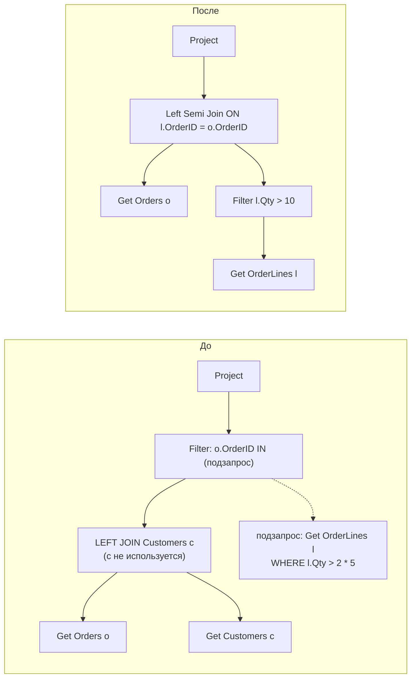

| Преобразование | На что опирается | Что видно в плане |
|---|---|---|
| Удаление LEFT JOIN | Уникальный ключ справа, столбцы справа не используются | Таблицы нет в плане |
| Удаление INNER JOIN | **Доверенный** FK (+ `IS NOT NULL`, если столбец допускает NULL) | Таблицы нет, возможен фильтр IS NOT NULL |
| Свёртка констант | `2 * 5` → `10`, `1 = 1 AND x` → `x` | В предикате уже вычисленное значение |
| Противоречие | Литералы (`Qty > 100 AND Qty < 50`), доверенные CHECK | **Constant Scan** без чтения таблицы |
| Перенос предиката вниз | Фильтр по столбцу, доступному ниже (в т.ч. по столбцу группировки во view) | Фильтр или Seek прямо у чтения таблицы |
| IN / EXISTS | Подзапрос | **Left Semi Join** |
| NOT EXISTS | Подзапрос | **Left Anti Semi Join** |
| Скалярный подзапрос в SELECT | Подзапрос | Left Outer Join (+ Assert, если нет уникальности) |
| OUTER → INNER | WHERE отбрасывает NULL-строки правой стороны | Inner Join вместо Left Outer |

### Особенности фазы упрощения

- **Без статистики и стоимости.** Работают строго заданные правила, метаданные схемы (ключи, уникальные индексы, доверенные `CHECK` и `FOREIGN KEY`, `NOT NULL`) и законы реляционной алгебры. Гистограммы, объёмы данных и стоимость здесь не используются.
- **Выполняется для каждого запроса**, ещё до поиска тривиального плана.
- **Результат** — упрощённое логическое дерево (*simplified tree*). Оно либо сразу даёт тривиальный план, либо становится началом Memo для стоимостной оптимизации ([вопрос 24](#24--memo-и-группы-в-модели-cascades)).

Кроме преобразований из таблицы выше:

| Преобразование | Что делает | Пример |
|---|---|---|
| **Транзитивность предикатов** | Из `A = B AND B = 10` выводит скрытое условие `A = 10` | `… JOIN Customers c ON c.Id = o.CustomerId WHERE o.CustomerId = 42` → по `Customers` тоже Seek `Id = 42` |
| **Удаление неиспользуемых столбцов** (проекции) | Столбцы, которые дальше не нужны, выбрасываются из промежуточных потоков | Узкие строки между операторами, меньше грант памяти |
| **Раскрытие представлений** | Представление подставляется своим определением (это делает ещё алгебраизатор), и дальше к нему применяются все правила упрощения | Соединения из тела view исчезают, если их столбцы не нужны (пример 2) |

### Пример 1. Противоречие с ограничением CHECK

```sql
ALTER TABLE HumanResources.Employee WITH CHECK   -- WITH CHECK: ограничение доверенное
ADD CONSTRAINT CK_Employee_VacationHours CHECK (VacationHours >= -40 AND VacationHours <= 240);

SELECT BusinessEntityID, JobTitle, VacationHours
FROM HumanResources.Employee
WHERE VacationHours > 300;
```

Оптимизатор сравнивает условие `VacationHours > 300` с ограничением `VacationHours <= 240` и видит, что запрос не может вернуть ни одной строки. Чтение таблицы (`LogOp_Get`) и фильтр заменяются одним **Constant Scan**: 0 логических чтений. То же при самопротиворечии в тексте: `WHERE ManagerID > 10 AND ManagerID < 5`.

Условия срабатывания:
- ограничение **доверенное** (`is_not_trusted = 0` в `sys.check_constraints`);
- значение известно при компиляции — **литерал**, а не параметр или переменная. Если запрос параметризован (в том числе автоматически, [вопрос 16](02-query-pipeline.md#16-простая-и-принудительная-параметризация)), сравнивать не с чем. `OPTION (RECOMPILE)` делает значение переменной известным.

### Пример 2. Удаление соединения по внешнему ключу

```sql
CREATE VIEW Sales.vIndividualCustomer AS
SELECT c.CustomerID, p.FirstName, p.LastName, p.EmailPromotion
FROM Sales.Customer c
JOIN Person.Person p ON c.PersonID = p.BusinessEntityID;   -- доверенный FK Customer.PersonID → Person
GO
SELECT CustomerID FROM Sales.vIndividualCustomer WHERE CustomerID = 15000;
```

1. Представление раскрывается в соединение `Customer` и `Person`.
2. Столбцы `Person` в запросе не нужны.
3. Доверенный FK гарантирует, что у каждого `Customer` с заполненным `PersonID` есть ровно одна строка в `Person`, поэтому соединение не может ни отсеять, ни размножить строки.
4. Соединение удаляется. В плане — только Seek по `Customer`. Если `PersonID` допускает NULL, остаётся фильтр `PersonID IS NOT NULL`: внутреннее соединение отбросило бы такие строки.

Поэтому «широкие» представления не всегда вредны: лишние соединения могут исчезнуть на этапе упрощения, если схема описана ограничениями. Но только при **доверенных** FK: ограничение с `WITH NOCHECK` оптимизатор не использует.

### Как увидеть деревья до и после упрощения

Недокументированные флаги трассировки, **только на тестовом сервере** (нужен sysadmin). Вывод — на вкладке Messages.

```sql
SELECT BusinessEntityID, JobTitle, VacationHours
FROM HumanResources.Employee
WHERE VacationHours > 300
OPTION (RECOMPILE, QUERYTRACEON 3604, QUERYTRACEON 8606);
```

Вывод примерно такой:

```text
*** Input Tree: ***                          ← дерево после привязки
LogOp_Project QCOL: [BusinessEntityID] …
    LogOp_Select
        LogOp_Get TBL: HumanResources.Employee …
        ScaOp_Comp x_cmpGt
            ScaOp_Identifier QCOL: [VacationHours]
            ScaOp_Const TI(smallint,ML=2) Value=300

*** Simplified Tree: ***                     ← после упрощения
LogOp_ConstTableGet (0) …                    ← противоречие: вместо чтения — пустая константная таблица
```

- `LogOp_*` — логические операторы (`LogOp_Get` — чтение таблицы, `LogOp_Select` — фильтр, `LogOp_Project` — проекция, `LogOp_Join` — соединение, `LogOp_ConstTableGet` — константная таблица, в плане Constant Scan).
- `ScaOp_*` — скалярные выражения (`ScaOp_Comp` — сравнение, `ScaOp_Const` — константа, `ScaOp_Identifier` — ссылка на столбец).
- Флаг 8606 выводит и другие промежуточные деревья (например, после сборки соединений). Полный список флагов для исследования оптимизатора — в конце [вопроса 24](#24--memo-и-группы-в-модели-cascades).

Все примеры на данных — блок 4 [`17_optimizer_internals_demo.sql`](../sql/17_optimizer_internals_demo.sql).

Чего упрощение **не** делает:
- не видит значения переменных и параметров (без `OPTION (RECOMPILE)`);
- не переписывает `YEAR(d) = 2025` в диапазон;
- не использует FK и CHECK, созданные `WITH NOCHECK`. Проверка: `sys.foreign_keys.is_not_trusted`, лечение: `ALTER TABLE … WITH CHECK CHECK CONSTRAINT …`.

**NOT IN и NULL.** Если в подзапросе встречается NULL, `NOT IN` по стандарту вернёт пустой результат, и план получается тяжелее. Для «нет в списке» лучше `NOT EXISTS`.

> 1С не создаёт в базе FK и CHECK. Поэтому удаление INNER JOIN по FK в 1С не работает, а удаление LEFT JOIN по уникальному `_IDRRef` (разыменование, результат которого не используется) — работает.

---

## 24. ★ Memo и группы в модели Cascades

> **Кратко.** **Memo** — структура, в которой оптимизатор компактно хранит все рассмотренные варианты плана. Она состоит из **групп**. Группа — множество **логически эквивалентных** выражений (дающих одинаковый результат). Входы элементов группы — **другие группы**, а не конкретные поддеревья. Поэтому общие части планов хранятся и оцениваются один раз (динамическое программирование). Модель Cascades предложил Гётц Грефе, в SQL Server она используется с версии 7.0.

Пример: `Customers ⋈ Orders ⋈ OrderLines`.

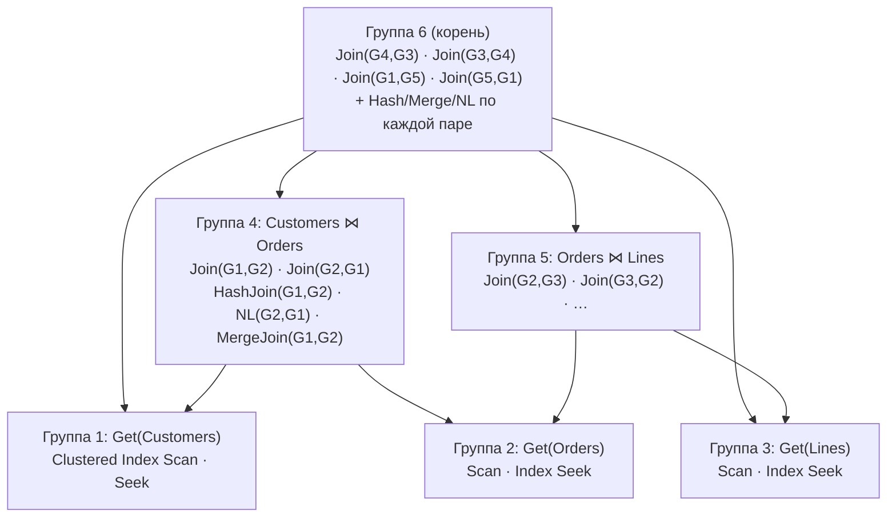

Группы `Customers ⋈ Lines` нет: между ними нет условия соединения, это было бы декартово произведение.

Как заполняется Memo:
1. **Copy in**: упрощённое дерево копируется, каждый оператор становится своей группой.
2. **Правила исследования** (exploration) добавляют логические альтернативы. `JoinCommute`: A⋈B → B⋈A. Ассоциативность: (A⋈B)⋈C → A⋈(B⋈C), и при необходимости создаётся новая группа. Дубли отсекаются по хешу.
3. **Правила реализации** (implementation) добавляют физические операторы: `JNtoHS` (Hash), `JNtoNL`, `JNtoSM` (Merge), `GetToScan`, `GetIdxToRng`. Статистика применения правил: `sys.dm_exec_query_transformation_stats` (подробно — ниже, «Правила трансформации»).
4. **Оценка стоимости только у физических элементов**, снизу вверх. В каждой группе запоминается **победитель**, а для каждого набора требуемых физических свойств (например, «отсортировано по OrderID» для Merge Join) — свой победитель. Операторы, обеспечивающие свойство (Sort), называются **enforcer**.
5. **Branch and bound**: частичный вариант дороже уже найденного плана отбрасывается.
6. **Copy out**: план собирается из победителей начиная с корневой группы.

Важное следствие: **кардинальность — логическое свойство группы** и считается один раз для всех её вариантов. Ошибка в оценке переходит во все варианты сразу, и оптимизатор уверенно выбирает плохой план.

### Правила трансформации

**Правило трансформации** — шаблон, основанный на законах реляционной алгебры. Оно берёт фрагмент дерева и порождает **эквивалентную альтернативу**. У каждого правила две части:
- **Pattern (шаблон)** — какой фрагмент дерева правило ищет;
- **Substitute (замена)** — что порождает на выходе.

| Тип правил | Что делают | Примеры (внутренние имена) |
|---|---|---|
| **Упрощения** (simplification) | Применяются до Memo: константы, противоречия, лишние соединения, подзапросы, перенос предикатов ([вопрос 23](#23-упрощение-simplification)) | — |
| **Исследования** (exploration, логические) | Логический оператор → **эквивалентный логический**: другая форма дерева, другой порядок операций. Результат — новые элементы в той же группе Memo | `JoinCommute`: A ⋈ B → B ⋈ A; ассоциативность (A ⋈ B) ⋈ C → A ⋈ (B ⋈ C); `GbAggBeforeJoin` — агрегация до соединения |
| **Реализации** (implementation, физические) | Логический оператор → **физический алгоритм**. К физическим операторам правила уже не применяются | `JNtoNL` (Nested Loops), `JNtoHS` (Hash Match), `JNtoSM` (Merge Join), `GbAggToStrm` (Stream Aggregate), `GbAggToHS` (Hash Aggregate), `GetToScan`, `GetIdxToRng` (Seek) |

Правил несколько сотен (список — в `sys.dm_exec_query_transformation_stats`, в современных версиях около 400). Применять все к каждому выражению слишком дорого. Поэтому для правила сначала оценивается **Promise** — насколько оно может быть полезно здесь, и заведомо бесполезные правила не применяются. Набор допустимых правил и есть главное отличие фаз Search 0, 1 и 2 ([вопрос 22](#22-фазы-оптимизации)).

**Пример.**

```sql
SELECT c.CustomerID, COUNT(*)
FROM Sales.Customer c
JOIN Sales.SalesOrderHeader o ON c.CustomerID = o.CustomerID
GROUP BY c.CustomerID;
```

1. **Исходная Memo:** группа 1 — чтение `Customer`, группа 2 — чтение `SalesOrderHeader`, группа 3 — соединение, корневая группа — группировка поверх группы 3.
2. **Исследование:** `JoinCommute` добавляет в группу 3 вариант `SalesOrderHeader ⋈ Customer`. `GbAggBeforeJoin` видит, что группировка идёт по столбцу соединения, и порождает вариант «сгруппировать заказы по `CustomerID` **до** соединения», чтобы соединять меньше строк.
3. **Реализация:** для соединений — `JNtoNL`, `JNtoHS`, `JNtoSM`; для группировок — `GbAggToStrm`, `GbAggToHS`; для чтений — Scan и Seek по доступным индексам.
4. **Оценка:** стоимость считается **только у физических** вариантов, в каждой группе выбирается победитель. Какой план победит (Stream Aggregate + Merge Join по упорядоченным индексам или Hash Aggregate + Hash Join), зависит от данных, индексов и статистики.

### Как посмотреть, какие правила сработали

**Снимок `sys.dm_exec_query_transformation_stats` до и после запроса** — самый аккуратный способ. Столбцы: `name` (правило), `promised` (сколько раз оценивалась польза), `succeeded` (сколько раз правило сработало и породило альтернативу). Представление недокументированное, счётчики общие на сервер:

```sql
-- Предварительно «прогреть» сами запросы снимков, чтобы их компиляция не попала в разницу
SELECT * INTO #before FROM sys.dm_exec_query_transformation_stats;
SELECT * INTO #after  FROM sys.dm_exec_query_transformation_stats;
DROP TABLE #before, #after;
GO
SELECT * INTO #before FROM sys.dm_exec_query_transformation_stats;
GO
-- … исследуемый запрос с OPTION (RECOMPILE) …
GO
SELECT * INTO #after FROM sys.dm_exec_query_transformation_stats;
GO
SELECT a.name AS rule_name,
       a.promised  - b.promised  AS times_promised,
       a.succeeded - b.succeeded AS times_succeeded
FROM #before b JOIN #after a ON a.name = b.name
WHERE a.succeeded <> b.succeeded
ORDER BY times_succeeded DESC;
DROP TABLE #before, #after;
```

**Отключить правило, чтобы увидеть, что изменится.** Только для экспериментов на тестовом сервере (недокументировано):

```sql
-- На один запрос
SELECT … OPTION (RECOMPILE, QUERYRULEOFF GbAggBeforeJoin);
-- На сессию
DBCC RULEOFF ('GbAggBeforeJoin');   -- выключить
DBCC TRACEON (3604); DBCC SHOWOFFRULES;   -- список выключенных (DBCC SHOWONRULES — включённых)
DBCC RULEON ('GbAggBeforeJoin');    -- вернуть
```

Без правила оптимизатор теряет соответствующие альтернативы. Если отключить `GbAggBeforeJoin`, пропадут варианты с группировкой до соединения. Если отключить `JNtoHS` и `JNtoSM`, останутся только Nested Loops. Если отключить слишком много, оптимизатор не сможет построить план — ошибка **8622** (*Query processor could not produce a query plan…*).

> ⚠️ **Уточнение к исходному материалу.** В одном из описаний сказано, что без `GbAggBeforeJoin` оптимизатор «будет вынужден выбрать Hash Join и Hash Aggregate». Это не так: это правило отвечает только за перенос агрегации до соединения, выбор алгоритмов соединения и агрегации от него не зависит. Какой план победит в каждом случае, показывает только эксперимент (блок 5 [`17_optimizer_internals_demo.sql`](../sql/17_optimizer_internals_demo.sql)).

### Флаги для исследования оптимизатора

Все флаги ниже **недокументированные**. Используйте их только на тестовом сервере и только вместе с `OPTION (RECOMPILE, QUERYTRACEON 3604, QUERYTRACEON …)`: флаг 3604 выводит результат на вкладку Messages, `RECOMPILE` заставляет заново компилировать запрос. Нужны права sysadmin.

| Флаг | Что выводит | Вопрос |
|---|---|---|
| 8605 | Дерево после привязки (*Converted Tree*) | [12](02-query-pipeline.md#12-этап-привязки-algebrizer) |
| 8606 | Входное дерево, дерево после упрощения и другие промежуточные деревья | [23](#23-упрощение-simplification) |
| 8608 | Начальная Memo | 24 |
| 8615 | Итоговая Memo с физическими вариантами | 24 |
| 8675 | Фазы оптимизации: стоимость и число задач после каждой | [22](#22-фазы-оптимизации) |
| 2373 | Память оптимизатора до и после применения правил (объёмно; используется для поиска «прожорливых» правил) | 24 |

Альтернативы без флагов трассировки: свойства корневого оператора плана, `sys.dm_exec_query_optimizer_info` (документировано) и `sys.dm_exec_query_transformation_stats` (недокументированное, но обычное представление, прав sysadmin не требует — достаточно VIEW SERVER STATE).

---

## 25. ★ Логические и физические операторы

> **Кратко.** **Логический** оператор описывает, **что** сделать (Inner Join, Aggregate, Filter, Union). **Физический** — **как** именно, каким алгоритмом (Nested Loops, Hash Match, Merge Join, Stream Aggregate, Index Seek). Правила реализации превращают один логический оператор в несколько физических кандидатов, и выбирается самый дешёвый. В плане у оператора есть оба свойства: `Physical Operation` и `Logical Operation`.

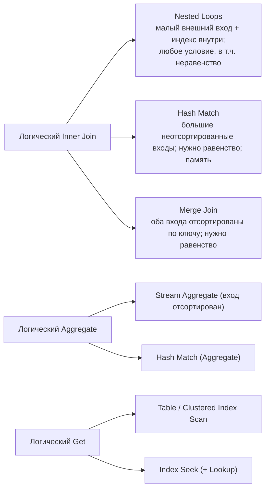

Один физический оператор может реализовать разные логические. Hash Match — это Inner/Outer Join, Aggregate, Union, Distinct. Nested Loops — Inner, Left Outer, Left Semi (EXISTS), Left Anti Semi (NOT EXISTS). Подробно алгоритмы соединения — в [вопросе 45](05-plans-operators.md#45-nested-loops-merge-join-и-hash-match).

---

## 26. SARGable-предикат

> **Кратко.** SARG = *Search ARGument*. Условие **саргабельно**, если столбец в нём стоит «голым», а значение от столбца не зависит: `столбец оператор значение` (=, <, >, BETWEEN, IN, IS NULL, `LIKE 'abc%'`). Тогда условие может стать **Seek Predicate**. Несаргабельное условие проверяется для **каждой прочитанной строки** (Predicate), то есть требует скана.

Главное правило: **все вычисления переносите на сторону значения, столбец оставляйте голым.**

| Несаргабельно | Саргабельная замена |
|---|---|
| `YEAR(d) = 2025` | `d >= '20250101' AND d < '20260101'` |
| `CONVERT(varchar(8), d, 112) = '20250315'` | `d >= '20250315' AND d < '20250316'` |
| `LEFT(Name, 4) = N'Иван'` | `Name LIKE N'Иван%'` |
| `UPPER(Name) = N'ИВАНОВ'` | `Name = N'Иванов'` (при CI-сортировке UPPER не нужен) |
| `ISNULL(x, 0) = 0` | `x = 0 OR x IS NULL` (OR по одному столбцу — два seek) |
| `Price * 1.2 > 1000` | `Price > 1000 / 1.2` |
| `DATEADD(day, 30, d) < GETDATE()` | `d < DATEADD(day, -30, GETDATE())` |
| `varchar_col = 123` | `varchar_col = '123'` |
| `varchar_col = @nvarchar_param` | параметр типа `varchar` |
| `Name LIKE N'%ов'` | полнотекстовый поиск; вычисляемый `REVERSE(Name)` + индекс |
| `A = 1 OR B = 2` (разные столбцы) | `UNION` двух запросов (или UNION ALL с исключением пересечения) |
| `(@p IS NULL OR Col = @p)` | `OPTION (RECOMPILE)` или динамический SQL только с заданными условиями |
| `Col1 > Col2` | вычисляемый столбец + индекс |

**Особые случаи:**
- `CAST(datetime_col AS date) = '20250315'` формально функция, но SQL Server превращает его в диапазон (dynamic seek через `GetRangeThroughConvert`). Честный диапазон всё равно лучше для оценки строк;
- саргабельность **необходима, но недостаточна** для seek: при большой доле строк оптимизатор всё равно выберет скан ([tipping point](05-plans-operators.md#42-table-scan-clustered-index-scan-index-seek-всегда-ли-scan--плохо));
- «не тот столбец индекса»: условие по второму столбцу `(LastName, FirstName)` само по себе саргабельно, но **этому** индексу не подходит;
- отрицания (`<>`, `NOT IN`, `NOT LIKE`) формально превращаются в диапазоны, но обычно ведут к скану из-за большой доли строк. Помогает фильтрованный индекс (подробно — ниже, «Отрицания»);
- в BETWEEN с `datetime` верхнюю границу пишите через `<` следующего дня.

В плане саргабельная часть видна в **Seek Predicates**, несаргабельная — в **Predicate**. Примеры на данных — часть 3 [`01_scan_vs_seek_demo.sql`](../sql/01_scan_vs_seek_demo.sql).

**Пример для 1С: одни и те же отборы — саргабельно и нет.** Дата документа хранится в `_Date_Time`, по ней есть индекс «Дата + Ссылка» ([вопрос 77](08-1c-specifics.md#77-как-индексы-объектов-1с-отображаются-в-индексы-субд)).

| Несаргабельно | В SQL | Саргабельная замена |
|---|---|---|
| `ГОД(Док.Дата) = 2026` | Функция `DATEPART(YEAR, …)` над `_Date_Time` | `Док.Дата МЕЖДУ &НачалоГода И &КонецГода` |
| `НАЧАЛОПЕРИОДА(Док.Дата, ДЕНЬ) = &День` | Функция над столбцом | `Док.Дата МЕЖДУ &НачалоДня И &КонецДня` |
| `ПОДСТРОКА(Номенклатура.Наименование, 1, 4) = "Болт"` | `SUBSTRING(...)` над столбцом | `Номенклатура.Наименование ПОДОБНО "Болт%"` → `LIKE N'Болт%'`, Seek по индексу «Наименование + Ссылка» |
| `Номенклатура.Наименование ПОДОБНО "%болт%"` | `LIKE N'%болт%'` — начало строки неизвестно | Полнотекстовый поиск; отдельный реквизит-ключ для поиска |
| `Док.Контрагент = &К ИЛИ Док.Склад = &С` | `OR` по разным столбцам | `ОБЪЕДИНИТЬ ВСЕ` двух запросов ([вопрос 74](08-1c-specifics.md#74-или-в-условиях-и-соединениях-замена-на-объединить-все)) |

В плане несаргабельное условие видно в **Predicate** (обычно при скане), саргабельное — в **Seek Predicates**.

### Отрицания: `<>`, `NOT IN`, `NOT LIKE`

> **Кратко.** Отрицание логически раскладывается на диапазоны, поэтому индекс **в принципе** может искать по нему: `<>` — это два диапазона, `NOT IN` из трёх значений — четыре. Но **SARGable означает, что поиск возможен, а не что он выгоден**. Отрицание обычно выбирает почти всю таблицу, и оптимизатор разумно предпочитает скан. Если же «все, кроме X» — редкие строки, их выносят в **фильтрованный индекс**.

**Бытовая аналогия.** Телефонный справочник отсортирован по фамилии. Найти всех Ивановых просто: открыть на «И» и читать, пока Ивановы не кончатся (Seek). Найти всех, **кроме** Ивановых, тоже можно «прыжками»: читать с начала до Ивановых, перепрыгнуть их и читать дальше до конца. Но это почти вся книга, и проще пролистать её целиком (Scan).

**Что происходит формально.** На отсортированной оси значений «всё, кроме 5» — это два куска:

```text
... 1  2  3  4 [5] 6  7  8 ...
<------------>     <---------->
   диапазон 1        диапазон 2
```

| Условие | Логически равно | Что может сделать индекс |
|---|---|---|
| `Status <> 5` | `Status < 5 OR Status > 5` | Index Seek с **двумя диапазонами** в Seek Predicates |
| `Status NOT IN (1, 2, 3)` | `<> 1 AND <> 2 AND <> 3` | **Четыре** диапазона: до 1, между 1 и 2, между 2 и 3, после 3 |
| `Name NOT LIKE 'abc%'` | «меньше 'abc'» + «после всех 'abc…'» | На практике SQL Server не строит поиск, а проверяет условие как **Predicate** при скане |

Поэтому формально `<>` и `NOT IN` считаются SARGable.

**Почему на практике всё равно скан.** Отрицание почти всегда выбирает **большую часть** таблицы. В таблице миллион заказов, `Status = 5` у десяти тысяч, значит, `Status <> 5` вернёт 990 000 строк (99%). Дальше решает стоимость:
1. **Индекс не покрывает запрос.** Для каждой строки нужен Key Lookup — случайное чтение. 990 000 лукапов намного дороже одного последовательного чтения всей таблицы. Точка перелома, после которой Seek + Lookup проигрывает скану, — доли процента или единицы процентов строк, а не десятки ([вопрос 42](05-plans-operators.md#42-table-scan-clustered-index-scan-index-seek-всегда-ли-scan--плохо)). Оптимизатор выбирает Clustered Index Scan.
2. **Индекс покрывает запрос.** Seek по двум диапазонам возможен, но прочитает почти весь индекс. По сути это тот же скан, «разрезанный» на две части, выигрыша нет.

Ключевое слово — **«обычно»**. Если отрицание исключает почти всё, картина обратная. `Status <> 'Закрыт'`, где закрытых 99%, выбирает 1% строк. Тогда два диапазона дают маленький результат, и оптимизатор выберет Seek. Решает **статистика распределения**, а не сам оператор.

Если набор значений небольшой и известен, отрицание можно переписать в перечисление: `Status <> 1` → `Status IN (2, 3, 4)`. Смысл тот же (для столбца без NULL), но нагляднее, а для редких значений даёт несколько коротких поисков.

**Фильтрованный индекс.** Это индекс не по всем строкам таблицы, а только по тем, что удовлетворяют условию `WHERE` в его определении. В аналогии со справочником — отдельная тонкая тетрадка, куда выписаны только нужные люди.

```sql
CREATE NONCLUSTERED INDEX IX_Orders_NotClosed
ON dbo.Orders (CustomerID, OrderDate)
INCLUDE (Amount)
WHERE Status <> 'Закрыт';
```

- В индексе лежат **только нужные строки**, например 10 000 вместо миллиона. Он маленький, дешёвый в чтении и обслуживании.
- Запрос `WHERE Status <> 'Закрыт' AND CustomerID = 42` делает обычный точечный Seek по `CustomerID` внутри уже отфильтрованного множества. Отрицание «зашито» в индекс и перестаёт быть проблемой.
- Даже если нужен скан, сканируется маленький индекс, а не вся таблица.
- Лучше всего подходит для «активных» записей: незакрытые заявки, непроведённые документы, необработанные строки очереди. Их мало, а запрашивают их часто.

**Подводные камни фильтрованных индексов:**
- **Условие фильтра ограничено.** Разрешены простые сравнения (`=`, `<>`, `>`, `<`…), `IS NULL`, `IS NOT NULL` и `IN`, соединённые через `AND`. `NOT IN` напрямую нельзя: его переписывают как `Status <> 'A' AND Status <> 'B'`. `LIKE`, функции и `OR` не поддерживаются.
- **Запрос должен явно совпадать с фильтром.** Если в запросе параметр или переменная (`WHERE Status <> @s`), оптимизатор при компиляции не может гарантировать, что `@s = 'Закрыт'`, и индекс не возьмёт. В плане появится предупреждение **UnmatchedIndexes** ([вопрос 53](05-plans-operators.md#53-предупреждения-в-плане)). Помогает литерал в тексте запроса или `OPTION (RECOMPILE)`.
- **Нужны определённые SET-опции** (`ANSI_NULLS`, `QUOTED_IDENTIFIER`, `ANSI_WARNINGS` и др. в `ON`) и при создании индекса, и у сессий, которые изменяют таблицу. Иначе INSERT/UPDATE/DELETE начнут падать с ошибкой.

> 1С: платформа фильтрованные индексы не создаёт, а индекс, добавленный вручную в базе, удаляется при реструктуризации. Использовать его можно только осознанно, с процедурой пересоздания после обновлений конфигурации. Кроме того, значения в запросах 1С обычно приходят параметрами `@P…`, и фильтрованный индекс может не использоваться по причине, описанной выше. Проверяйте по плану. Штатные средства 1С для «редких» строк — отдельный регистр сведений под нужный отбор или индексируемый реквизит-признак.

Все варианты на данных — [`15_negation_filtered_index_demo.sql`](../sql/15_negation_filtered_index_demo.sql).


> 1С: `ГДЕ ГОД(Док.Дата) = 2025` → `ГДЕ Док.Дата МЕЖДУ &НачалоГода И &КонецГода`. То же с `ПОДСТРОКА()` над полем и `ПОДОБНО "%…"`.

> ⚠️ **Расхождение в источниках.** В одном из ответов пример «столбец `NVARCHAR`, литерал `'...'` без `N`» назван несаргабельным. Это **неверно**: у `varchar` приоритет ниже, поэтому приводится **литерал**, и seek сохраняется. Плохо обратное сочетание: столбец `varchar`, значение `nvarchar`.

---

## 27. Неявное преобразование типов

> **Кратко.** При сравнении разных типов тип с **меньшим приоритетом** приводится к типу с **большим**: `varchar` < `nvarchar` < … < `int` < … < `datetime`. Если приводится **значение** — проблемы нет. Если **столбец** (`CONVERT_IMPLICIT(nvarchar, col)`), это то же самое, что функция над столбцом: seek невозможен или ухудшен, а гистограмма к выражению неприменима. Решение принимается ещё на этапе привязки.

| Сравнение | Что приводится | Итог |
|---|---|---|
| `int_col = '123'` | Литерал → int | Seek, всё хорошо |
| `varchar_col = 12345` | **Столбец** → int | Scan. Упадёт с ошибкой, если в столбце есть `'A-15'` |
| `varchar_col (SQL_Latin1_…) = N'…'` | **Столбец** → nvarchar | Scan |
| `varchar_col (Cyrillic_General_CI_AS) = N'…'` | Столбец | Dynamic seek (`GetRangeThroughConvert`), но оценка хуже |
| Конвертация только в SELECT | — | Предупреждение CardinalityEstimate бывает, на план не влияет |

**Как обнаружить:**
1. Жёлтый треугольник на SELECT → Warnings → **PlanAffectingConvert**: `Type conversion in expression (CONVERT_IMPLICIT(...)) may affect "SeekPlan" / "CardinalityEstimate"`.
2. Свойство **Predicate** оператора: `CONVERT_IMPLICIT` **вокруг столбца**.
3. Кэш: `qp.query_plan.exist('//Warnings/PlanAffectingConvert') = 1` (блок D в [`03_plan_warnings_demo.sql`](../sql/03_plan_warnings_demo.sql)).

**Лечение:** тип параметра или литерала должен совпадать с типом столбца. Типичный источник проблемы — ORM и драйверы, передающие строки как `nvarchar`. Если тип параметра поменять нельзя, приводите **параметр**: `WHERE col = CAST(@p AS varchar(50))`.

---

## 28. Хинты запросов и таблиц. Почему это крайняя мера

> **Кратко.** Хинт — **приказ**, а не совет: он отключает часть пространства поиска оптимизатора. Хинт фиксирует решение, верное **сегодня на этих данных**. Когда данные вырастут, распределение изменится, появится новый индекс или сменится версия, оптимизатор уже не сможет подстроиться. Недостижимый хинт вообще приводит к ошибке запроса.

| Вид | Примеры | Где пишется |
|---|---|---|
| Табличные | `WITH (INDEX(IX_…))`, `FORCESEEK`, `FORCESCAN`, `NOLOCK` | После имени таблицы |
| Запроса | `OPTION (RECOMPILE)`, `OPTIMIZE FOR (@p = …)`, `OPTIMIZE FOR UNKNOWN`, `MAXDOP n`, `FORCE ORDER`, `HASH/LOOP/MERGE JOIN`, `USE HINT('…')` | В конце запроса |
| Соединения | `INNER HASH JOIN`, `LEFT LOOP JOIN` | В FROM. **Неявно включает FORCE ORDER для всего запроса** |

**Что сделать до хинта:**
1. Сравнить Estimated и Actual rows, при необходимости обновить статистику.
2. Проверить SARGable-условия и типы (нет ли `CONVERT_IMPLICIT`).
3. Проверить индексы (покрывающий?).
4. Упростить запрос: временные таблицы, UNION вместо OR.

**Допустимые «мягкие» хинты:** `OPTION (RECOMPILE)` для редких тяжёлых запросов, `OPTIMIZE FOR`, `MAXDOP`. Если код менять нельзя, хинт навешивают снаружи: Query Store hints (2022), plan guides ([вопрос 60](06-params-cache.md#60-query-store)).

> 1С: вставить хинт в текст запроса платформы нельзя. Остаются индексы, переписывание запроса, статистика и Query Store.

---

## 28а. Сквозной пример: что делает оптимизатор с запросом, шаг за шагом

> **Зачем этот пример.** Вопросы 11–28 разбирают этапы по отдельности. Здесь один запрос проходит через все этапы — от поиска в кэше до готового плана — с конкретными числами: сколько строк оценено, сколько стоит каждый вариант, почему выбран один и отброшены остальные.
>
> Данные — база `OptDemo` из [`17_optimizer_internals_demo.sql`](../sql/17_optimizer_internals_demo.sql), блок 6 воспроизводит весь пример. Числа стоимости **приблизительные**: модель упрощена, а точные формулы большинства операторов Microsoft не публикует. Порядок величин и логика выбора такие же, как у настоящего оптимизатора. Сверьте их со своим планом.

**Данные:**
- `Customers` — 10 000 строк, первичный ключ `Id`. Столбец `City`: 50 разных значений, по 200 клиентов в городе.
- `Orders` — 200 000 строк, первичный ключ `Id`. У каждого клиента 20 заказов. `OrderDate` — 1 000 разных дат, по 200 заказов на дату.
- Кроме первичных ключей, индексов нет.

**Запрос:**

```sql
SELECT c.City, COUNT(*) AS Cnt, SUM(o.Amount) AS Total
FROM dbo.Customers c
JOIN dbo.Orders o ON o.CustomerId = c.Id
WHERE c.City = N'Город 7'
  AND o.OrderDate >= '20250101'
GROUP BY c.City;
```

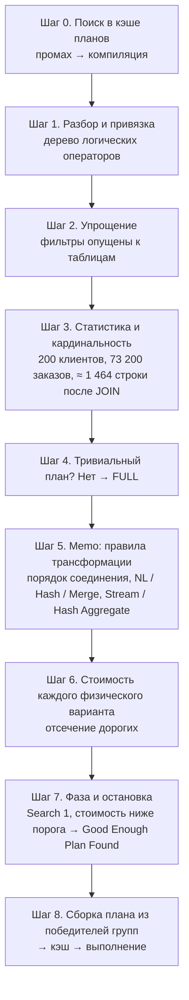

Шаги 5–7 на самом деле не идут строго друг за другом: оптимизатор применяет правила, **сразу** оценивает новые варианты, отбрасывает дорогие и повторяет это внутри каждой фазы. Здесь они разделены только для наглядности.

### Шаг 0. Поиск готового плана в кэше

Хеш текста пакета и атрибутов сеанса ищется в кэше **до** всякого разбора ([вопрос 13](02-query-pipeline.md#13-кэш-планов-когда-план-берётся-из-кэша-а-когда-компилируется)). Запрос выполняется впервые — промах. Простая параметризация к нему не применяется: в нём соединение и агрегат ([вопрос 16](02-query-pipeline.md#16-простая-и-принудительная-параметризация)). Значит, дальше полная компиляция.

### Шаг 1. Разбор и привязка

- **Парсер** проверяет синтаксис и строит дерево разбора.
- **Алгебраизатор** ([вопрос 12](02-query-pipeline.md#12-этап-привязки-algebrizer)):
  - находит таблицы и столбцы, проверяет, что `City` в SELECT есть в GROUP BY;
  - выводит типы. `N'Город 7'` — `nvarchar`, как и столбец `City`: преобразований нет. Литерал `'20250101'` — строка, а `OrderDate` — `date`. У `date` приоритет выше, поэтому приводится **литерал**, а не столбец, и условие остаётся саргабельным ([вопрос 27](#27-неявное-преобразование-типов)).
- Результат — дерево логических операторов **в порядке записи запроса**: фильтр стоит над соединением.

### Шаг 2. Упрощение

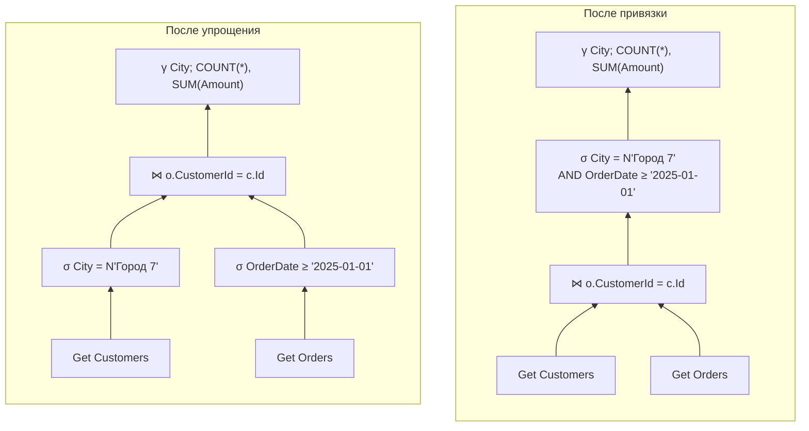

- **Перенос предикатов вниз.** Каждое условие опускается к своей таблице: соединяться будут уже отфильтрованные строки.
- **Удаление лишних столбцов.** Из `Customers` нужны только `Id` и `City`, из `Orders` — `CustomerId`, `OrderDate`, `Amount`. Остальное дальше не передаётся.
- **Чего не произошло.** Соединение с `Customers` не удалено: из неё нужны столбцы и фильтр по `City`. Противоречий нет.

Всё это делается по правилам и метаданным, **без статистики** ([вопрос 23](#23-упрощение-simplification)).

### Шаг 3. Статистика и оценка кардинальности

Значения условий — литералы, поэтому используются **гистограммы** ([вопросы 29–32](04-statistics.md#29-что-такое-статистика-и-из-чего-она-состоит)). Статистики по `City` и `OrderDate` нет, и оптимизатор создаёт её автоматически (`_WA_Sys_…`, [вопрос 33](04-statistics.md#33-автосоздание-и-автообновление-статистики-порог)).

| Что оценивается | Как | Оценка |
|---|---|---|
| `Customers` после `City = N'Город 7'` | Значение — граница шага гистограммы, берётся EQ_ROWS | **200** строк из 10 000 |
| `Orders` после `OrderDate ≥ '2025-01-01'` | Диапазон: сумма шагов гистограммы от 2025-01-01 до максимума, это 366 дат × 200 | **73 200** строк из 200 000 (≈ 37%) |
| Результат соединения | 73 200 заказов, из них заказы 200 клиентов из 10 000: 73 200 × 200 / 10 000 (столбцы считаются независимыми) | **≈ 1 464** строки |
| Число групп | После фильтра у `City` одно значение | **1** группа |

От этих чисел зависит всё дальнейшее. Если бы статистика устарела и оптимизатор ждал, скажем, 10 заказов вместо 73 200, выбор на шаге 6 был бы другим ([вопрос 39](04-statistics.md#39--ошибка-оценки-кардинальности-как-найти-и-почему-она-главная)).

### Шаг 4. Тривиальный план?

Нет. Есть соединение, у которого несколько способов выполнения и два порядка таблиц. Значит, нужна стоимостная оптимизация: `Optimization Level = FULL` ([вопрос 21](#21-trivial-plan)).

### Шаг 5. Memo и правила трансформации

Упрощённое дерево копируется в Memo ([вопрос 24](#24--memo-и-группы-в-модели-cascades)). Каждый оператор становится группой, и правила добавляют в группы альтернативы.

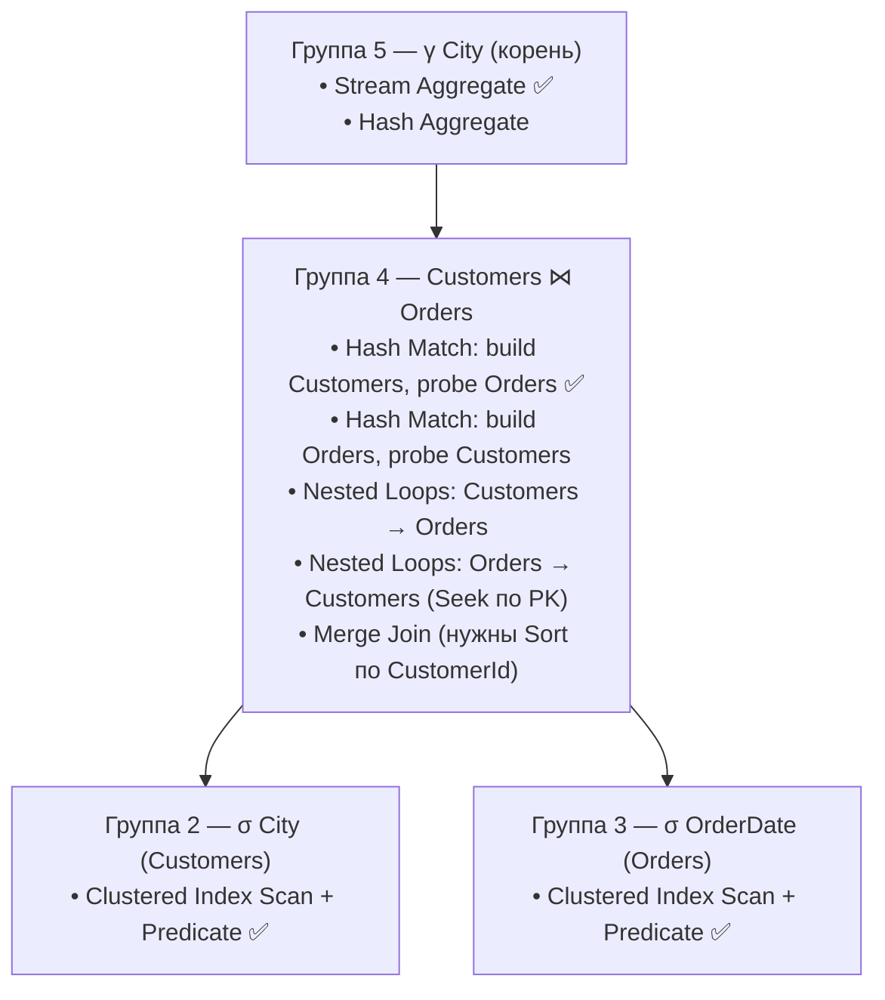

Какие правила сработали:

| Правило | Что сделало |
|---|---|
| `JoinCommute` (исследование) | Добавило вариант с обратным порядком таблиц: Orders ⋈ Customers |
| `GbAggBeforeJoin` (исследование) | Рассмотрело группировку заказов до соединения. Группировка идёт по `City`, а это столбец `Customers`, поэтому выгоды почти нет |
| `JNtoHS`, `JNtoNL`, `JNtoSM` (реализация) | Для каждого порядка таблиц — Hash Match, Nested Loops, Merge Join |
| `GbAggToStrm`, `GbAggToHS` (реализация) | Stream Aggregate и Hash Aggregate для группировки |
| `GetToScan`, `GetIdxToRng` (реализация) | Способы чтения таблиц. Индексов по `City`, `OrderDate`, `CustomerId` нет, поэтому для фильтров остаётся только скан. Seek возможен лишь по первичному ключу `Customers.Id` — на нижнем входе Nested Loops |

Проверить на своём сервере, какие правила сработали, можно блоком 5.1 скрипта 17.

### Шаг 6. Стоимость вариантов

Стоимость считается **только для физических вариантов**, снизу вверх ([вопрос 19](#19-что-такое-стоимость-плана)).

**Чтение таблиц** (формула Clustered Index Scan):

```text
I/O = 0,003125 + 0,000740741 × (страниц − 1)
CPU = 0,0001581 + 0,0000011 × (строк − 1)

Customers: ≈ 70 страниц, 10 000 строк
  I/O = 0,003125 + 0,000740741 × 69     ≈ 0,054
  CPU = 0,0001581 + 0,0000011 × 9 999   ≈ 0,011
  Итого ≈ 0,065

Orders: ≈ 700 страниц, 200 000 строк
  I/O = 0,003125 + 0,000740741 × 699     ≈ 0,521
  CPU = 0,0001581 + 0,0000011 × 199 999  ≈ 0,220
  Итого ≈ 0,74
```

Число страниц — оценка по ширине строки: у `Customers` около 55 байт, примерно 140 строк на страницу; у `Orders` около 28 байт, примерно 290 строк. Проверка фильтра `Predicate` при скане почти ничего не добавляет: строки всё равно читаются.

**Варианты соединения:**

| Вариант | Как работает | Приблизительная стоимость | Решение |
|---|---|---|---|
| **Hash Match**, build = Customers (200 строк), probe = Orders (73 200) | Каждая таблица читается **один раз**. Маленькая хеш-таблица из 200 строк, по ней проверяются 73 200 строк | 0,065 + 0,74 + хеширование (сотые доли) ≈ **0,85** | ✅ самый дешёвый |
| Hash Match, build = Orders | То же чтение, но хеш-таблица из 73 200 строк — больше CPU и память | ≈ 0,9–1,0 | ✗ дороже |
| Merge Join | Входы не отсортированы по `CustomerId` — нужны два Sort, в том числе 73 200 строк | ≈ 2–3 | ✗ Sort дороже |
| Nested Loops: Orders сверху, Seek по `Customers.Id` снизу | 73 200 поисков по кластерному индексу `Customers` | Десятки единиц даже с поправкой на кэширование страниц | ✗ отсечён |
| Nested Loops: Customers сверху, Orders снизу | Для каждого из 200 клиентов — **полный скан** `Orders` (индекса по `CustomerId` нет) | ≈ 200 × 0,74 ≈ **148** | ✗ отсечён сразу |

Branch and bound: как только частичная стоимость варианта превышает уже найденный лучший план (≈ 0,85), вариант дальше не достраивается.

**Агрегация:** на вход приходит ≈ 1 464 строки. После фильтра у `City` одно значение, поэтому вход по ключу группировки уже «упорядочен». Stream Aggregate без Sort и без памяти обычно дешевле Hash Aggregate. Добавка — тысячные доли.

**Итого:** ≈ **0,85–0,9** условных единиц на корневом SELECT.

### Шаг 7. Фаза и момент остановки

- В запросе две таблицы, поэтому Search 0 пропускается (он для трёх и более), и поиск начинается с **Search 1** ([вопрос 22](#22-фазы-оптимизации)).
- Лучший план стоит ≈ 0,85, это ниже порога Search 1 (≈ 1,0). Поиск останавливается: **Good Enough Plan Found**. Полный перебор Search 2 не нужен.
- Стоимость ниже `cost threshold for parallelism` (5), поэтому параллельные варианты даже не рассматриваются ([вопрос 52](05-plans-operators.md#52-параллелизм)).

Здесь видна разница двух величин ([вопрос 20](#20-достаточно-хороший-план-good-enough-plan-found-и-time-out)). **Стоимость** ≈ 0,85 — прогноз цены *выполнения*. **Бюджет** — сколько *шагов перебора* оптимизатор готов потратить на поиск. Для дешёвого запроса он маленький, поэтому флаг 8675 покажет всего десятки задач.

### Шаг 8. Готовый план, кэш, выполнение

План собирается из победителей групп, начиная с корня:

```text
SELECT                                              Estimated Subtree Cost ≈ 0,85
└─ Compute Scalar
   └─ Stream Aggregate  (GROUP BY City)
      └─ Hash Match (Inner Join)  HASH: c.Id = o.CustomerId
         ├─ Clustered Index Scan  Customers   Predicate: City = N'Город 7'           Est. rows 200
         └─ Clustered Index Scan  Orders      Predicate: OrderDate >= '2025-01-01'  Est. rows 73 200
```

- План **сразу** кладётся в кэш (ещё до выполнения) с ключом «текст + атрибуты сеанса». Следующий такой же запрос пропустит шаги 1–8.
- Исполнитель выполняет итераторы: SELECT запрашивает строки у агрегата, агрегат — у соединения, соединение сначала читает Customers целиком (build), потом потоком Orders (probe) ([вопрос 41](05-plans-operators.md#41-направление-чтения-плана-и-движение-данных)).
- В фактическом плане стоит сравнить оценки с фактом: 200, 73 200 и ≈ 1 464 ([вопрос 55а](05-plans-operators.md#55а-анализ-плана-выполнения-по-стоимости-операторов)).

### Что изменится, если добавить индекс

```sql
CREATE INDEX IX_Orders_CustomerId ON dbo.Orders (CustomerId) INCLUDE (OrderDate, Amount);
```

Правило `GetIdxToRng` теперь порождает для `Orders` ещё и **Index Seek по `CustomerId`**, и в группе соединения появляется новый вариант:

| Вариант | Стоимость |
|---|---|
| Hash Match (как раньше) | ≈ 0,85 |
| **Nested Loops**: Customers (скан, 200 строк) сверху → Index Seek по `Orders.CustomerId` снизу, 200 поисков по ~20 строк, фильтр по дате — остаточный | 0,065 + 200 × ≈ 0,003 ≈ **0,7** ✅ |

Оптимизатор выбирает Nested Loops: 200 коротких поисков дешевле полного скана `Orders`. Ровно та же логика, что у CBO в [вопросе 18](#18-стоимостной-оптимизатор-и-оптимизатор-на-правилах): план подстраивается под доступные пути и под **оценку строк**. Если бы клиентов в городе было не 200, а 5 000, выиграл бы снова Hash Match.

### Как повторить на своём сервере

Блок 6 [`17_optimizer_internals_demo.sql`](../sql/17_optimizer_internals_demo.sql):
1. Предполагаемый план (Ctrl+L). На каждом операторе смотрите `Estimated Number of Rows` и `Estimated Operator Cost`, на SELECT — `Estimated Subtree Cost`, `Optimization Level`, `Reason For Early Termination`.
2. Флаг 8675 показывает фазу и число задач.
3. **Стоимость отброшенных вариантов:** тот же запрос с хинтами `OPTION (LOOP JOIN)`, `OPTION (MERGE JOIN)`, `OPTION (HASH JOIN)`. Хинт заставляет построить отвергнутый вариант, и видно, во сколько оптимизатор его оценил.
4. Индекс из последнего раздела — и повторить пункты 1 и 3.

---

[← Раздел 2](02-query-pipeline.md) · [Оглавление](../README.md) · [Раздел 4 →](04-statistics.md)
