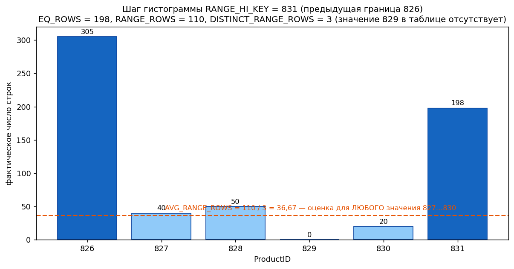
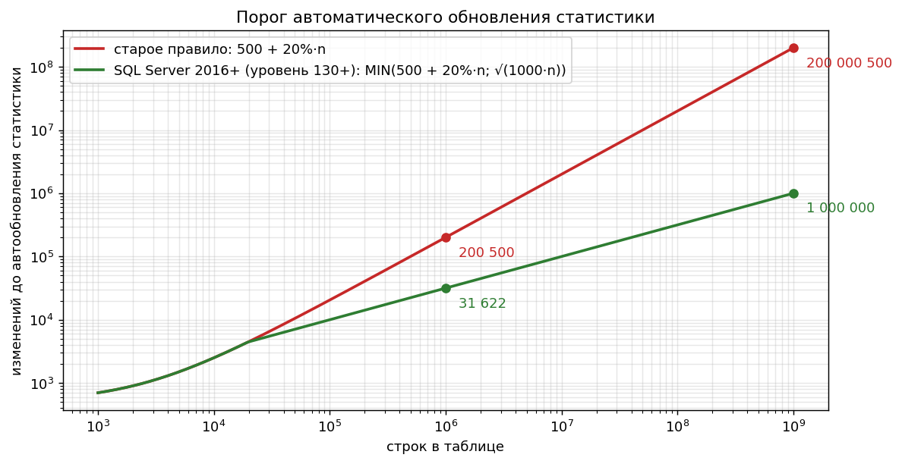

# 4. Статистика и оценка кардинальности

[← Раздел 3](03-optimizer.md) · [Оглавление](../README.md) · [Раздел 5 →](05-plans-operators.md)

Вопросы 29–39. Практика: [`02_statistics_demo.sql`](../sql/02_statistics_demo.sql) (база StatsDemo, 100 000 заказов с перекосом: Москва 50%, клиент №1 около 10%), [`11_temp_table_vs_table_variable.sql`](../sql/11_temp_table_vs_table_variable.sql).

> Главная формула раздела: **кардинальность = селективность × число строк**. Селективность оптимизатор берёт из статистики, а число строк — **текущее**, из метаданных (`sys.partitions`), а не поле Rows заголовка статистики. Если таблица выросла, оценки масштабируются, но о новых **значениях** гистограмма не знает.

---

## 29. Что такое статистика и из чего она состоит

> **Кратко.** Статистика — компактная «справка» о распределении значений в столбце или наборе столбцов. По ней оптимизатор **оценивает число строк** на каждом шаге плана и от этой оценки выбирает Seek или Scan, тип соединения и размер memory grant. Состоит из трёх частей: **заголовок**, **вектор плотности**, **гистограмма** (до 200 шагов, только по **первому** столбцу).

**Откуда берётся:**
- автоматически при создании индекса, по его ключу, с полным сканированием;
- автоматически по столбцу из WHERE/JOIN, если включено `AUTO_CREATE_STATISTICS`. Такие статистики одноколоночные, имя начинается с `_WA_Sys_…`;
- вручную: `CREATE STATISTICS` (можно многоколоночную и фильтрованную).

| Часть | Вопрос, на который отвечает | Когда используется |
|---|---|---|
| Заголовок | Можно ли ей верить? (Updated, Rows, Rows Sampled, Steps) | — |
| Вектор плотности | Сколько строк «в среднем» на значение? Плотность = 1 / число уникальных значений, по каждому префиксу ключа | Значение неизвестно при компиляции (локальная переменная, OPTIMIZE FOR UNKNOWN), GROUP BY / DISTINCT, условия по нескольким столбцам индекса |
| Гистограмма | Как распределены значения первого столбца? | Значение известно (литерал, «подслушанный» параметр) |

---

## 30. Как читать `DBCC SHOW_STATISTICS`

```sql
DBCC SHOW_STATISTICS (N'dbo.Orders', N'IX_Orders_Region_Customer');                     -- все три части
DBCC SHOW_STATISTICS (N'dbo.Orders', N'IX_Orders_Region_Customer') WITH HISTOGRAM;
SELECT * FROM sys.dm_db_stats_properties(OBJECT_ID(N'dbo.Orders'), 2);                  -- заголовок + modification_counter
SELECT * FROM sys.dm_db_stats_histogram(OBJECT_ID(N'dbo.Orders'), 2);                   -- гистограмма (2016 SP1 CU2+)
```

**Заголовок:**
- `Updated` — когда пересчитывали. Важнее даты `modification_counter` из `sys.dm_db_stats_properties`: сколько изменений накопилось с тех пор;
- `Rows` и `Rows Sampled`: если они равны, статистика построена полным сканированием, если нет — по выборке, и цифры дробные и приблизительные;
- `Steps` — число шагов гистограммы (≤ 200);
- `Filter Expression` — у фильтрованной статистики;
- `Density` — устаревшее поле, не используется.

**Вектор плотности** (индекс `(Region, CustomerID)` на данных из скрипта):

| Columns | All density | 1 / density | Rows × density |
|---|---|---|---|
| Region | 0,2 | 5 регионов | 20 000 строк на регион |
| Region, CustomerID | ≈ 0,0000x | десятки тысяч пар | несколько строк на пару |
| Region, CustomerID, OrderID | 1E-05 | 100 000 | 1 строка: ключ кластера неявно в индексе |

Плотность **не видит перекоса**: для неё Москва (50 000) и Владивосток (3 000) одинаковы — по 20 000.

**Гистограмма.** Каждую строку читайте как отрезок **от предыдущего RANGE_HI_KEY (не включая) до текущего (включая)**:

| Столбец | Смысл |
|---|---|
| `RANGE_HI_KEY` | Верхняя граница шага, реальное значение из столбца |
| `EQ_ROWS` | Сколько строк **ровно равны** границе |
| `RANGE_ROWS` | Сколько строк **строго между** предыдущей и текущей границей |
| `DISTINCT_RANGE_ROWS` | Сколько разных значений внутри промежутка |
| `AVG_RANGE_ROWS` | RANGE_ROWS / DISTINCT_RANGE_ROWS — строк на одно значение внутри шага |

Пример (ProductID):

| RANGE_HI_KEY | RANGE_ROWS | EQ_ROWS | DISTINCT_RANGE_ROWS | AVG_RANGE_ROWS |
|---|---|---|---|---|
| 826 | 0 | 305 | 0 | 1 |
| 831 | 110 | 198 | 3 | 36,67 |



Приёмы чтения:
- **перекос** виден по большим `EQ_ROWS`: частые значения алгоритм старается сделать границами шагов;
- широкие шаги с большим `AVG_RANGE_ROWS` — места самых грубых оценок;
- шаг с `RANGE_HI_KEY = NULL` содержит число NULL;
- первый ключ — минимум столбца, последний — максимум **на момент пересчёта**.

---

## 31. Почему не больше 200 шагов и к чему это приводит

> **Кратко.** Это компромисс между точностью и скоростью компиляции и объёмом метаданных: гистограмма должна быть маленькой, потому что её читают при каждой компиляции. На большой таблице с миллионами разных значений один шаг «сжимает» тысячи значений, и внутри шага работает только **среднее** (`AVG_RANGE_ROWS`).

**Последствия:**
- значение внутри шага получает одинаковую оценку, даже если реально у него 1 строка или 50 000. Пики перекоса, не ставшие границами, растворяются в среднем;
- при недооценке: Nested Loops и Key Lookup на сотни тысяч строк, маленький грант памяти и spill;
- при переоценке: лишний параллелизм и огромные гранты (`RESOURCE_SEMAPHORE`).

**Как компенсировать:**
- **фильтрованная статистика** (`CREATE STATISTICS … WHERE OrderDate >= '20260101'`) получает свои 200 шагов на нужный диапазон;
- **инкрементальная статистика** для секционированных таблиц;
- разбиение запроса через `#temp`: у промежуточного набора своя свежая гистограмма.

---

## 32. Оценка предиката равенства

> **Кратко.** Значение **совпало с RANGE_HI_KEY** → оценка = `EQ_ROWS` (точно). Значение **внутри шага** → `AVG_RANGE_ROWS` (среднее, одинаковое для любого значения шага, даже отсутствующего). Значение **неизвестно при компиляции** → `Rows × All density`.

| Ситуация | Оценка | Пример (гистограмма выше) |
|---|---|---|
| `= 831`, совпало с границей | EQ_ROWS | 198 |
| `= 828`, внутри шага | AVG_RANGE_ROWS | 36,67 (и для 829, которого нет) |
| Внутри шага, где RANGE_ROWS = 0 | около 1 строки | — |
| Правее последнего шага | старый CE — 1 строка; новый CE — по плотности (вопрос 35) | — |
| `= @local` (переменная) | Rows × density | для Region: 100 000 × 0,2 = **20 000** |
| Диапазон (`BETWEEN`, `<`, `>`) | Σ (EQ_ROWS + RANGE_ROWS) по захваченным шагам, частично захваченные — пропорционально | — |
| Неравенство с неизвестным значением | Фиксированные **30%** | — |

Блок 6 [`02_statistics_demo.sql`](../sql/02_statistics_demo.sql) на одном условии `Region = N'Москва'` даёт три оценки: 50 000 (литерал, гистограмма), **20 000** (переменная, плотность), снова 50 000 (переменная + `OPTION (RECOMPILE)`).

---

## 33. Автосоздание и автообновление статистики. Порог

> **Кратко.** Создаётся автоматически при `AUTO_CREATE_STATISTICS ON` (по столбцу предиката без статистики, только одноколоночная) и при создании индекса. Обновляется при `AUTO_UPDATE_STATISTICS ON`: **при компиляции** запроса проверяется счётчик изменений ведущего столбца, и если он выше порога, статистика пересчитывается (по выборке). **Порог:** старое правило — **500 + 20% строк**. Новое (SQL Server 2016+ при уровне совместимости 130+, раньше через TF 2371) — **MIN(500 + 20%·n; √(1000·n))**.



| Строк в таблице | Старое правило | Динамическое |
|---|---|---|
| 10 000 | 2 500 | 2 500 (до ~20 тыс. строк правила почти совпадают) |
| 1 000 000 | 200 500 | ≈ 31 623 |
| 5 000 000 | 1 000 500 | ≈ 70 711 |
| 1 000 000 000 | 200 000 500 | 1 000 000 |

Детали:
- для таблиц до 500 строк порог — 500 изменений;
- по умолчанию обновление **синхронное**: запрос ждёт пересчёта. При `AUTO_UPDATE_STATISTICS_ASYNC ON` текущий запрос идёт со старой статистикой, а пересчёт выполняется в фоне;
- после обновления статистики зависимые планы перекомпилируются (вопрос 14);
- вне порога и для важных таблиц статистику обновляют регламентом: `UPDATE STATISTICS`, `sp_updatestats`.

---

## 34. FULLSCAN и SAMPLE

> **Кратко.** `FULLSCAN` читает **все** строки: точная гистограмма, но долго и много I/O. `SAMPLE` читает **выборку** и экстраполирует: быстро, но на перекошенных данных редкие пики могут не попасть в выборку, и гистограмма «сглаживается».

| | FULLSCAN | SAMPLE |
|---|---|---|
| Когда по умолчанию | `CREATE INDEX` / `ALTER INDEX REBUILD` (статистика индекса) | Автообновление и автосоздание (процент выбирается сам, минимум около 8 МБ) |
| Точность | Максимальная | Приемлема для равномерных данных |
| Цена | Высокая | Низкая |

**Практика:**
- по ключевым перекошенным таблицам — ночной `UPDATE STATISTICS … WITH FULLSCAN`;
- **не** запускать после REBUILD общий скрипт с сэмплированием: он перезапишет только что полученную FULLSCAN-статистику менее точной;
- `WITH PERSIST_SAMPLE_PERCENT = ON` (2016 SP1 CU4+) закрепляет процент выборки для будущих автообновлений.

---

## 35. Проблема восходящего ключа

> **Кратко.** У монотонно растущих столбцов (IDENTITY, дата документа, период регистра) все **новые значения лежат правее последнего шага** гистограммы. Пока автообновление не сработало (а на большой таблице это долго), запрос «за сегодня» получает оценку **около 1 строки** при реальных тысячах.

**Проявления:**
- Estimated 1, Actual 10 000;
- Nested Loops и Key Lookup вместо скана или Hash Join;
- маленький memory grant и spill.

**Лечение:**
- **новый CE (120+)** предполагает, что значения за границей существуют, и оценивает их по плотности (и числу изменённых строк), а не как одну строку;
- частое регламентное обновление статистики по «растущим» столбцам и после массовых загрузок;
- фильтрованная статистика по свежему диапазону;
- в старых версиях — TF 2389/2390 (быстрое обновление «хвоста» для столбцов, признанных восходящими).

> 1С: свежие движения регистров (`_Period` за сегодня), свежие документы (`_Date_Time`). Классическая картина: утром отчёт «за сегодня» тормозит, после обновления статистики — летает.

---

## 36. Оценка нескольких предикатов

> **Кратко.** Если есть многоколоночная статистика и равенства по её столбцам, берётся **плотность комбинации**. Иначе селективности отдельных условий комбинируются. **Старый CE (70)** считает столбцы **независимыми**: s1 × s2 × s3. **Новый CE (120+)** применяет **exponential backoff**: условия сортируются от самого селективного, `s1 × s2^(1/2) × s3^(1/4) × s4^(1/8)`, то есть предполагает частичную корреляцию.

Пример: s1 = 5%, s2 = 10%.

| Модель | Формула | Итог |
|---|---|---|
| Старый CE | 0,05 × 0,10 | **0,5%** |
| Новый CE | 0,05 × √0,10 | **≈ 1,6%** |

Для коррелированных столбцов (город и регион, товар и категория) старый CE сильно занижает оценку. Какой вариант точнее, зависит от данных, поэтому смена уровня совместимости базы иногда внезапно меняет планы.

Для **OR** селективность считается примерно как s1 + s2 − s1·s2.

```sql
SELECT COUNT(*) FROM dbo.Orders WHERE CustomerID = 1 AND Amount > 9500
OPTION (RECOMPILE);                                                     -- новый CE
SELECT COUNT(*) FROM dbo.Orders WHERE CustomerID = 1 AND Amount > 9500
OPTION (RECOMPILE, USE HINT('FORCE_LEGACY_CARDINALITY_ESTIMATION'));    -- старый CE: оценка ниже
```

---

## 37. Старая (70) и новая (120+) модель оценки кардинальности

> **Кратко.** Новый CE появился в SQL Server 2014 и включается уровнем совместимости базы ≥ 120. Он меняет допущения: **частичная корреляция** предикатов вместо независимости, **восходящие ключи** оцениваются не одной строкой, иначе оцениваются соединения. Какая модель использована, видно в свойстве корневого SELECT `CardinalityEstimationModelVersion` (70 или 120, 130, 140, 150, 160).

| Допущение | CE 70 | CE 120+ |
|---|---|---|
| Несколько условий AND | Независимость (s1·s2·s3) | Exponential backoff |
| Значение правее гистограммы | ≈ 1 строка | Оценка по плотности (ascending key) |
| Соединения | «Простое сдерживание»: гистограммы сопоставляются по шагам | «Базовое сдерживание»: сопоставляются в основном крайние значения. Часто устойчивее |
| Переключение | `USE HINT('FORCE_LEGACY_CARDINALITY_ESTIMATION')`, `ALTER DATABASE SCOPED CONFIGURATION SET LEGACY_CARDINALITY_ESTIMATION = ON` | Уровень совместимости 120+, `USE HINT('FORCE_DEFAULT_CARDINALITY_ESTIMATION')` |

Новый CE не всегда лучше. При переходе на новую версию SQL Server для отдельных регрессировавших запросов оставляют старый CE: хинтом, настройкой базы или Query Store hint. В SQL Server 2022 появился **CE feedback**, который учится на повторных выполнениях.

---

## 38. Временные таблицы и табличные переменные

> **Кратко.** У `#temp` есть **полноценная статистика** (гистограмма, автообновление), поэтому оценки точные. Плата — перекомпиляции при изменении данных. У `@table` статистики **нет**: до SQL Server 2019 оценка **1 строка** независимо от содержимого. С 2019 (уровень совместимости 150, *table variable deferred compilation*) используется реальное число строк на первом выполнении, но гистограммы всё равно нет.

| | `#temp` | `@table` |
|---|---|---|
| Статистика | Да | Нет |
| Оценка строк | По статистике | 1 (до 2019) / фактическое число на первой компиляции (2019+) |
| Перекомпиляции из-за данных | Да (порог 6 → 500 → 500 + 20%) | Нет |
| Индексы | Любые, в том числе после заполнения | Только при объявлении: PK, UNIQUE, с 2014 — inline `INDEX` |
| Параллелизм при записи | Возможен | `INSERT` в `@table` всегда последовательный |
| Транзакции | Откатываются | Не откатываются по ROLLBACK |
| Когда брать | Средние и большие наборы, соединения, промежуточные шаги | Гарантированно маленькие наборы в очень частых OLTP-вызовах |

> ⚠️ **Уточнение к источникам.** В одном из ответов сказано, что у табличной переменной бывают только PK/UNIQUE. С SQL Server 2014 можно объявлять и обычные индексы inline: `DECLARE @t TABLE (c int, INDEX IX_c (c))`.

> 1С: `ПОМЕСТИТЬ ВТ_…` — это всегда `#tt` со статистикой, а не табличная переменная. Отсюда и польза пакетов с временными таблицами.

---

## 39. ★ Ошибка оценки кардинальности: как найти и почему она главная

> **Кратко.** Оптимизатор **не выполняет** запрос при компиляции, а моделирует его стоимость, и вся модель стоит на ожидаемом числе строк. Неверная оценка тянет за собой неверный выбор всего остального: доступ (Seek + Lookup или Scan), соединение (NL или Hash), порядок соединений, memory grant, параллелизм. К тому же ошибка **размножается вверх** по дереву: оценка выхода одного оператора — это оценка входа следующего.

**Как обнаружить:**
1. **Фактический план**: сравнить `Estimated Number of Rows` и `Actual Number of Rows` у операторов. Расхождение на порядок и больше — ищите первый снизу оператор, где оно появилось.
2. **Ловушка Nested Loops**: на внутреннем входе оценка показывается **на одно выполнение**, а факт — **за все**. Сравнивайте `Estimated Rows × Estimated Executions` с `Actual Rows`.
3. Толщина стрелок: ожидали тонкую, пришла толстая.
4. SSMS → *Analyze Actual Execution Plan* → сценарий *Inaccurate Cardinality Estimation*.
5. Свойство корневого SELECT `OptimizerStatsUsage` (2016 SP2/2017+): какие статистики использованы, когда обновлялись и сколько изменений накопили.

| Недооценка | Переоценка |
|---|---|
| NL на сотни тысяч итераций, Key Lookup вместо скана | Hash Match и скан там, где хватило бы seek |
| Маленький грант → **spill** в tempdb | Огромный грант → другие ждут `RESOURCE_SEMAPHORE` |
| Последовательный план там, где нужен параллельный | Лишний параллелизм на лёгком запросе |

**Типичные причины и лечение:**

| Причина | Лечение |
|---|---|
| Устаревшая статистика, восходящий ключ | UPDATE STATISTICS (FULLSCAN), регламент |
| Несаргабельные условия, `CONVERT_IMPLICIT` | Переписать условие, выровнять типы |
| Локальные переменные, parameter sniffing | RECOMPILE, OPTIMIZE FOR, правильный индекс (раздел 6) |
| Коррелированные столбцы | Многоколоночная статистика или индекс, сравнить CE |
| Табличные переменные | `#temp` |
| Подзапросы и виртуальные таблицы с GROUP BY внутри соединения | Материализовать в `#temp` / `ВТ` |
| Сложные выражения, функции | Вычисляемый столбец со статистикой |

---

[← Раздел 3](03-optimizer.md) · [Оглавление](../README.md) · [Раздел 5 →](05-plans-operators.md)
