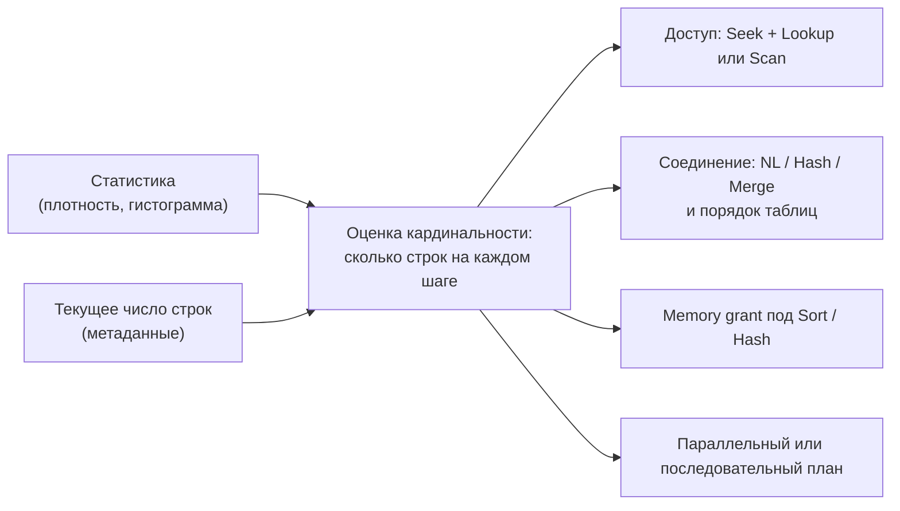
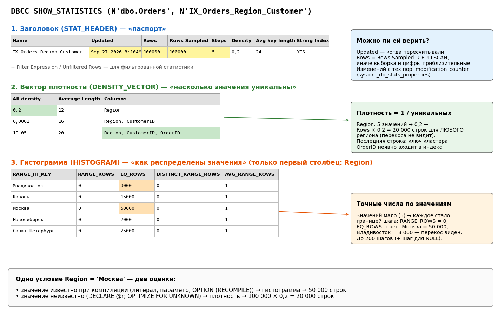
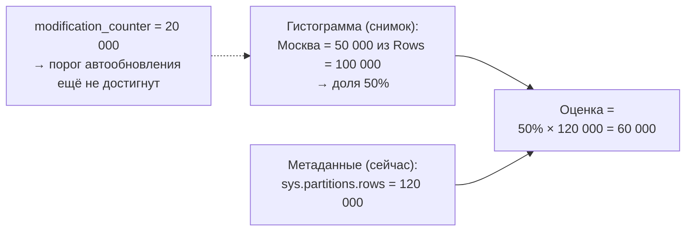
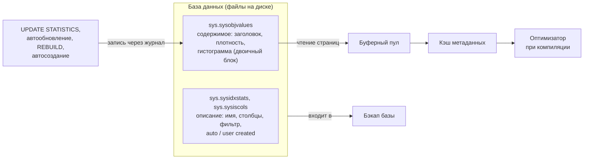
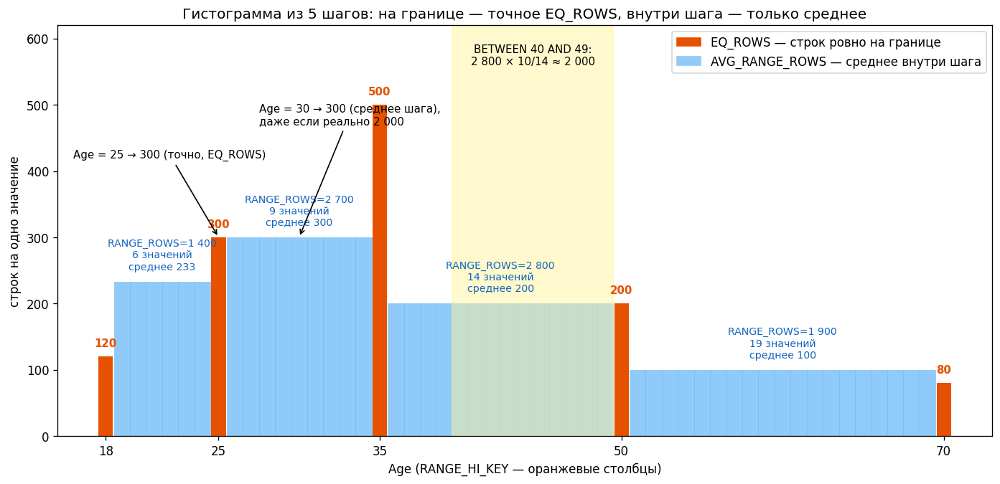
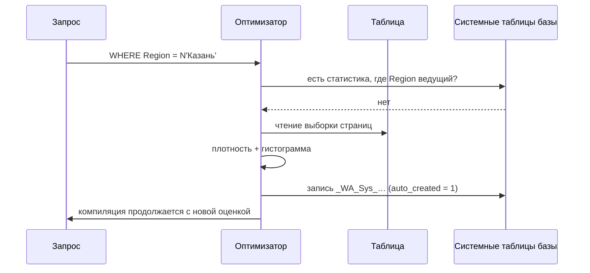
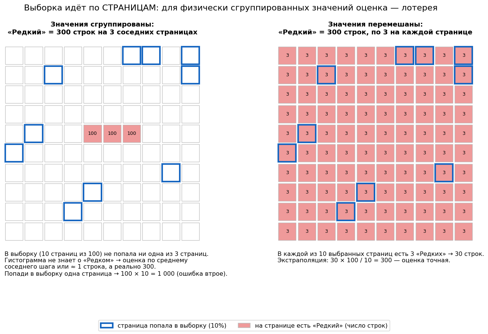
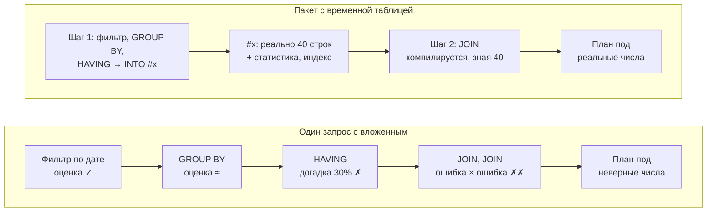

# 4. Статистика и оценка кардинальности

[← Раздел 3](03-optimizer.md) · [Оглавление](../README.md) · [Раздел 5 →](05-plans-operators.md)

Вопросы 29–39 и дополнительные 29а, 29б, 30а, 39а. Практика: [`02_statistics_demo.sql`](../sql/02_statistics_demo.sql) (база StatsDemo, 100 000 заказов с перекосом: Москва 50%, клиент №1 около 10%), [`11_temp_table_vs_table_variable.sql`](../sql/11_temp_table_vs_table_variable.sql), [`18_statistics_storage_sampling_demo.sql`](../sql/18_statistics_storage_sampling_demo.sql).

**Связанные разборы:** [П2 — какая статистика использовалась](12-real-plan-walkthrough.md#7-статистика-какая-использовалась-и-сколько-их-может-быть); [П3, серия ггг — статистика ВТ](13-joins-real-plans.md#серия-ггг-merge-join-через-временную-таблицу); [П5 — автостатистика при компиляции](15-parallelism-real-plan.md#6-попутно-компиляция-624-мс); [кейс 1](11-case-studies.md#кейс-1-вложенный-запрос-коррелированный-подзапрос-выполняется-на-каждую-строку), [кейс 5](11-case-studies.md#кейс-5-select-который-пишет-spill-в-tempdb), [кейс 11](11-case-studies.md#кейс-11-1с-виртуальная-таблица-остатки-с-отбором-в-где).

> Главная формула раздела: **кардинальность = селективность × число строк**. Селективность оптимизатор берёт из статистики, а число строк — **текущее**, из метаданных (`sys.partitions`), а не поле Rows заголовка статистики. Если таблица выросла, оценки масштабируются, но о новых **значениях** гистограмма не знает. Откуда берутся эти числа — [вопрос 29а](#29а-откуда-берётся-число-строк-метаданные-статистика-и-счётчик-изменений).

---

## 29. Что такое статистика и из чего она состоит

> **Кратко.** Статистика — компактная «справка» о том, как распределены значения в столбце или наборе столбцов. Оптимизатор **не читает таблицу** перед выполнением запроса: он открывает эту справку и по ней **оценивает, сколько строк вернёт каждое условие** (кардинальность). От этой оценки зависит почти весь план: Seek или Scan, тип и порядок соединений, размер memory grant, параллелизм. Статистика состоит из трёх частей:
> - **заголовок** — когда и как построена;
> - **вектор плотности** — насколько значения уникальны «в среднем»;
> - **гистограмма** — как распределены конкретные значения, до 200 шагов, только по **первому** столбцу.
>
> Если статистика ошибается, план получается плохим, даже когда индексы правильные.

### Зачем она нужна

Аналогия: чтобы решить, ехать на велосипеде или на грузовике, диспетчеру не нужно взвешивать груз — достаточно накладной. Статистика — такая накладная для оптимизатора.



Ошибка оценки переходит во все эти решения сразу ([вопрос 39](#39--ошибка-оценки-кардинальности-как-найти-и-почему-она-главная)).

### Откуда берётся статистика

| Источник | Как создаётся | Особенности |
|---|---|---|
| Индекс | Автоматически при `CREATE INDEX`, по ключу индекса | Строится с полным сканированием. Имя совпадает с именем индекса. Многоколоночная, если ключ составной |
| Автостатистика | Автоматически при компиляции, если столбец есть в WHERE/JOIN/GROUP BY, статистики по нему нет и включён `AUTO_CREATE_STATISTICS` | Только **одноколоночная**, по выборке. Имя вида `_WA_Sys_00000003_4AB81AF0`: номер столбца и object_id таблицы в шестнадцатеричном виде |
| Вручную | `CREATE STATISTICS` | Можно **многоколоночную** (для коррелированных столбцов), **фильтрованную** (`WHERE …`), с `FULLSCAN` |

Как статистика обновляется и когда устаревает — [вопросы 33–35](#33-автосоздание-и-автообновление-статистики-порог). Список статистик таблицы со столбцами и свежестью — запрос в [вопросе 30](#где-взять-имя-статистики).

### Как выглядит статистика: три части



*Пример — индекс `(Region, CustomerID)` на таблице из [`02_statistics_demo.sql`](../sql/02_statistics_demo.sql): 100 000 заказов, Москва 50%, Владивосток 3%.*

**1. Заголовок (STAT_HEADER) — «паспорт».** Отвечает на вопрос «можно ли этой статистике верить»: когда пересчитывали (`Updated`), сколько строк было и сколько из них прочитали (`Rows`, `Rows Sampled`), сколько шагов в гистограмме (`Steps`). Все поля заголовка — в [вопросе 30](#как-читать-вывод). Современный аналог — `sys.dm_db_stats_properties`, которая дополнительно показывает **`modification_counter`**: сколько изменений накопилось в ведущем столбце с последнего пересчёта.

**2. Вектор плотности (DENSITY_VECTOR) — «насколько значения уникальны».**
- **Плотность = 1 / число уникальных значений.** 5 регионов → 0,2: одно значение встречается в среднем в 20% строк. 100 000 уникальных ID → 0,00001: одна строка на значение.
- Чем меньше плотность, тем выше **селективность** столбца и тем выгоднее по нему искать.
- Строка вектора есть для каждого **префикса** ключа: `Region`, `Region + CustomerID`, `Region + CustomerID + OrderID`. Ключ кластерного индекса неявно входит в некластерный ([вопрос 4](01-storage.md#4-почему-ключ-кластерного-индекса-есть-в-каждом-некластерном-и-к-чему-это-приводит)).
- Оценка по плотности: **Rows × плотность**. Для региона 100 000 × 0,2 = 20 000 строк, **одинаково для любого региона**, хотя на Москву приходится 50 000, а на Владивосток 3 000. Плотность знает только «среднюю температуру по больнице» и перекосов не видит.

**3. Гистограмма (HISTOGRAM) — «как распределены значения».**
- Строится **только по первому столбцу** статистики. Это одна из причин, почему порядок столбцов в индексе так важен ([вопрос 10](01-storage.md#10--порядок-столбцов-и-селективность-в-составном-индексе)).
- Значения сортируются и делятся на шаги — не больше 200 плюс отдельный шаг для NULL ([вопрос 31](#31-почему-не-больше-200-шагов-и-к-чему-это-приводит)).
- Каждый шаг описывается пятью полями: `RANGE_HI_KEY`, `EQ_ROWS`, `RANGE_ROWS`, `DISTINCT_RANGE_ROWS`, `AVG_RANGE_ROWS`.

**Как прочитать шаг гистограммы:** `RANGE_HI_KEY = 100, EQ_ROWS = 25, RANGE_ROWS = 400, DISTINCT_RANGE_ROWS = 20, AVG_RANGE_ROWS = 20` означает: «значение 100 встречается 25 раз; между предыдущей границей и 100 есть ещё 20 разных значений, всего 400 строк, в среднем по 20 на значение».

Если разных значений мало (5 регионов), каждое становится отдельным шагом: `RANGE_ROWS = 0`, а `EQ_ROWS` даёт точное число строк. Подробнее о чтении полей — [вопрос 30](#30-как-читать-dbcc-show_statistics).

### Статистика составного индекса: гистограмма только по первому столбцу — а остальные?

Статистика строится для **всех** столбцов индекса, но по-разному. Для индекса `IX_Orders_Region_Customer (Region, CustomerID)`:

| Часть | По каким столбцам |
|---|---|
| Заголовок | Общий |
| Вектор плотности | По **всем префиксам** ключа: `Region`; `Region, CustomerID`; `Region, CustomerID, OrderID` (ключ кластера неявно входит в индекс) |
| Гистограмма | **Только по `Region`** — первому столбцу |

Распределения значений `CustomerID` в этой статистике нет. Гистограмму для него оптимизатор берёт из **другого** объекта статистики, где `CustomerID` стоит первым:
- **другой индекс**, в котором столбец ведущий, например `(CustomerID)`;
- **автостатистика `_WA_Sys_…`**. При включённом `AUTO_CREATE_STATISTICS` она создаётся, когда столбец встречается в WHERE, JOIN или GROUP BY, а статистики, где он **ведущий**, нет. Статистика составного индекса, где столбец второй, не считается, поэтому для `CustomerID` автостатистика появится, несмотря на индекс `(Region, CustomerID)`;
- **ручная статистика**: `CREATE STATISTICS st_Orders_CustomerID ON dbo.Orders (CustomerID)` — в скрипте 02 создаётся именно она.

Какие статистики есть у таблицы и какой столбец в каждой ведущий, показывает запрос из [вопроса 30](#где-взять-имя-статистики): в списке столбцов статистики ведущий идёт первым. Какие статистики оптимизатор реально использовал для конкретного запроса, показывает свойство корневого оператора плана **`OptimizerStatsUsage`** (SQL Server 2016 SP2 / 2017 и новее): имя статистики, дата обновления, число изменений с тех пор.

**Как собирается оценка:**

| Условие | Откуда оценка |
|---|---|
| `Region = N'Москва'` | Гистограмма статистики индекса: Region в ней первый |
| `CustomerID = 1` | Гистограмма **другой** статистики, где CustomerID ведущий (`_WA_Sys_…`, ручная или индекса `(CustomerID)`) |
| `Region = N'Москва' AND CustomerID = 1` | Доли из двух гистограмм, объединённые с учётом частичной корреляции ([exponential backoff, вопрос 36](#36-оценка-нескольких-предикатов)). В ряде случаев — плотность пары `Region, CustomerID` из вектора составной статистики: она знает, сколько реально разных **комбинаций** |
| `Region = @r AND CustomerID = @c` (значения неизвестны) | Плотность пары: Rows × density(`Region, CustomerID`) |
| `GROUP BY Region, CustomerID` | Плотность пары — сколько будет групп |

Отсюда польза составной статистики, даже когда гистограмма у неё только по первому столбцу. Её вектор плотности знает, как столбцы **связаны друг с другом**. Если столбцы сильно коррелируют (город и регион, товар и категория), отдельные гистограммы этого не видят. Для таких столбцов полезна **многоколоночная** статистика: `CREATE STATISTICS … ON dbo.T (A, B)`.

**Если отдельной статистики нет** (`AUTO_CREATE_STATISTICS` выключен, база только для чтения), для второго столбца гистограммы нет. Оптимизатор оценивает «наугад», по фиксированным долям. В плане появляется предупреждение **ColumnsWithNoStatistics** ([вопрос 53](05-plans-operators.md#53-предупреждения-в-плане)).

Когда оптимизатор берёт гистограмму, а когда плотность (литерал, параметр, локальная переменная, `GROUP BY`) — [вопрос 32](#гистограмма-или-плотность).

> 1С: у регистров индексы идут по периоду и измерениям в порядке конфигуратора, и гистограмма индекса есть только по первому полю. По остальным измерениям работает автостатистика `_WA_Sys_`, поэтому `AUTO_CREATE_STATISTICS` на базах 1С должен быть включён (это и рекомендация 1С).

### Практические выводы

- **Статистика устаревает.** Пока её не пересчитали, гистограмма не знает о новых значениях: для свежих дат или нового региона оценка будет около одной строки при реальных десятках тысяч ([вопросы 33, 35](#35-проблема-восходящего-ключа)).
- **Выборка вместо полного сканирования** может сделать оценку неточной на перекошенных данных (`FULLSCAN` против `SAMPLE`, [вопрос 34](#34-fullscan-и-sample)).
- **Локальная переменная переключает оценку с гистограммы на плотность.** Отсюда классические проблемы с оценками в процедурах. Параметры, наоборот, «подсматриваются», и это даёт свои проблемы ([parameter sniffing](06-params-cache.md#56-parameter-sniffing)).
- Число строк оптимизатор берёт **текущее** из метаданных, а долю строк — из статистики. Если таблица выросла, оценки масштабируются, но о **новых значениях** статистика узнает только после пересчёта.

> 1С: платформа передаёт значения запросов параметрами `@P…` через `sp_executesql`, поэтому работает гистограмма с «подсмотренным» значением первого вызова. Статистика по таблицам итогов и движений устаревает быстрее всего: там растут периоды и новые регистраторы. Регламентное обновление статистики — обязательная часть обслуживания базы 1С.

**Практика — [`02_statistics_demo.sql`](../sql/02_statistics_demo.sql):**
- блок 3 — все три части статистики через `DBCC SHOW_STATISTICS` и DMV;
- блок 4 — ручная проверка: плотность через `1 / COUNT(DISTINCT …)`, сверка EQ_ROWS с `GROUP BY`;
- блоки 5–6 — одно условие `Region = 'Москва'` и три оценки: 50 000 по гистограмме (литерал), 20 000 по плотности (переменная), снова 50 000 с `OPTION (RECOMPILE)`;
- блок 7 — оценка «внутри шага» через AVG_RANGE_ROWS;
- блок 8 — появление автостатистики `_WA_Sys_`;
- блок 9 — устаревание: рост `modification_counter`, неверная оценка, исправление через `UPDATE STATISTICS`.

Включите фактический план (Ctrl+M) и сравнивайте **Estimated Number of Rows** с **Actual Number of Rows**. Нужен SQL Server 2016 SP1 CU2 или новее (`sys.dm_db_stats_histogram`).

---

## 29а. Откуда берётся число строк: метаданные, статистика и счётчик изменений

> **Кратко.** В оценках оптимизатора участвуют **три разных числа строк** из разных мест:
> 1. **Текущее число строк и страниц** — метаданные таблицы (`sys.partitions`, `sys.dm_db_partition_stats`). Движок обновляет их при каждой вставке и удалении.
> 2. **Rows / Rows Sampled статистики** — снимок на момент её пересчёта.
> 3. **Счётчик изменений** (`modification_counter`) — сколько изменений накопилось в ведущем столбце после пересчёта.
>
> Оценка = **доля строк по гистограмме × текущее число строк из метаданных**. Поэтому при росте таблицы оценки масштабируются и без обновления статистики, но о **новых значениях** гистограмма не узнает, пока её не пересчитают.

### 1. Текущее число строк — метаданные таблицы

Для каждого индекса и каждой секции таблицы SQL Server хранит **текущее** число строк и страниц. Движок хранения меняет эти счётчики вместе с данными при каждой вставке и удалении, ничего не пересчитывая. Физически они лежат во **внутренних системных таблицах** (например, `sys.sysrowsets` и `sys.sysallocunits`), которые напрямую видны только через выделенное административное подключение (DAC). Для обычной работы есть представления поверх них:

```sql
-- Число строк по индексам и секциям
SELECT OBJECT_NAME(object_id) AS table_name, index_id, partition_number, rows
FROM sys.partitions
WHERE object_id = OBJECT_ID(N'dbo.Orders');

-- То же + страницы (их использует формула стоимости)
SELECT OBJECT_NAME(object_id) AS table_name, index_id,
       row_count, in_row_data_page_count, used_page_count, reserved_page_count
FROM sys.dm_db_partition_stats
WHERE object_id = OBJECT_ID(N'dbo.Orders');

-- Готовая процедура: строки и место на диске
EXEC sp_spaceused N'dbo.Orders';
```

`index_id = 0` — куча, `1` — кластерный индекс (сама таблица), `2` и больше — некластерные индексы. У каждого индекса своя строка, но число строк у них одинаковое (кроме фильтрованных индексов). Быстрый способ узнать размер огромной таблицы без `COUNT(*)` и без чтения данных:

```sql
SELECT SUM(row_count) AS rows
FROM sys.dm_db_partition_stats
WHERE object_id = OBJECT_ID(N'dbo.Orders') AND index_id IN (0, 1);
```

Оптимизатор использует эти метаданные при компиляции:
- **число строк** — как общую кардинальность таблицы;
- **число страниц** — в формуле стоимости скана ([вопрос 19](03-optimizer.md#19-что-такое-стоимость-плана)). Например, «≈ 700 страниц» в [сквозном примере 28а](03-optimizer.md#28а-сквозной-пример-что-делает-оптимизатор-с-запросом-шаг-за-шагом) — это `in_row_data_page_count`.

Документация называет `sys.partitions.rows` «приблизительным» значением. В современных версиях оно на практике точное. Расхождения бывали в основном у баз, перенесённых со старых версий (SQL Server 2000 и раньше); их исправляет `DBCC UPDATEUSAGE`.

### 2. Число строк в статистике — снимок в прошлом

В заголовке статистики ([вопросы 29–30](#29-что-такое-статистика-и-из-чего-она-состоит)) есть свои поля:
- **Rows** — сколько строк было в таблице, когда статистику пересчитывали;
- **Rows Sampled** — сколько из них реально прочитали для построения гистограммы.

Это **снимок**. Он не меняется, пока статистику не пересчитают, даже если с тех пор в таблицу добавили миллион строк. Гистограмма (EQ_ROWS, RANGE_ROWS) построена на том же снимке.

### 3. Счётчик изменений — сколько накопилось с тех пор

Это `modification_counter` в `sys.dm_db_stats_properties` (запрос — в [вопросе 30](#где-взять-имя-статистики)). Внутри он хранится по каждому столбцу во внутренней таблице `sys.sysrscols` (в старых версиях его называли `colmodctr`). INSERT и DELETE увеличивают счётчик, UPDATE — только если меняется сам столбец. При пересчёте статистики он обнуляется. По нему сервер решает:
- пора ли автоматически обновить статистику — порог 500 + 20% или √(1000 × n) ([вопрос 33](#33-автосоздание-и-автообновление-статистики-порог));
- устарел ли закэшированный план ([вопрос 14](02-query-pipeline.md#14-перекомпиляция-и-её-причины)).

### Как оптимизатор складывает эти числа

Статистика даёт **долю** строк, метаданные — **текущее общее число**:

> **оценка = доля по гистограмме × текущее число строк из метаданных**

Пример:
- Статистику построили, когда в таблице было **100 000** строк. По гистограмме «Москва» — 50 000, то есть 50%.
- Потом добавили ещё 20 000 строк. Статистику не обновляли: 20 000 изменений ещё не достигли порога автообновления.
- Метаданные уже показывают **120 000** строк, статистика по-прежнему говорит 100 000.
- Оптимизатор масштабирует оценку: 50 000 × 120 000 / 100 000 = **60 000** строк для Москвы.



Если новые строки распределены так же, как старые, оценка будет точной и без обновления статистики. Но у масштабирования есть предел: **новых значений**, которых не было в момент снимка, гистограмма не знает. Новый город, свежие даты, новые регистраторы в 1С оцениваются почти в ноль — это проблема восходящего ключа ([вопрос 35](#35-проблема-восходящего-ключа)). Масштабирование меняет величину известных долей, но не добавляет в гистограмму новых значений.

### Сводная таблица

| Число | Где хранится | Как увидеть | Когда меняется | Кто использует |
|---|---|---|---|---|
| Текущее число строк и страниц | Внутренние системные таблицы метаданных | `sys.partitions.rows`, `sys.dm_db_partition_stats`, `sp_spaceused` | Сразу при каждой вставке и удалении | Оптимизатор: общая кардинальность таблицы; формула стоимости (страницы) |
| Rows / Rows Sampled статистики | Объект статистики | `DBCC SHOW_STATISTICS`, `sys.dm_db_stats_properties` | Только при пересчёте статистики | Основа гистограммы и плотности |
| Счётчик изменений | Внутренняя таблица по столбцам | `modification_counter` в `sys.dm_db_stats_properties` | При каждом изменении ведущего столбца; обнуляется при пересчёте | Решение об автообновлении статистики и о перекомпиляции |
| Фактическое число | Сами данные | `COUNT(*)` | — | Только вы: читает всю таблицу или индекс |

> 1С: те же запросы работают для таблиц информационной базы (`_AccumRg…`, `_Document…`). Имена сопоставляются с объектами метаданных через `ПолучитьСтруктуруХраненияБазыДанных()` ([вопрос 68](08-1c-specifics.md#68-как-запрос-1с-транслируется-в-sql-как-понять-объект-по-имени-таблицы)). `sp_spaceused` или `sys.dm_db_partition_stats` быстро покажут, сколько строк в таблице движений регистра и сколько изменений накопилось с последнего обновления статистики. Это полезно, чтобы решить, не пора ли обновить статистику вне регламента.

Все три числа и масштабирование оценки на данных — блок 11 [`02_statistics_demo.sql`](../sql/02_statistics_demo.sql).

---

## 29б. Где хранится статистика: на диске или в памяти

> **Кратко.** Статистика хранится **на диске, в самой базе данных** — во внутренних системных таблицах, как часть метаданных. В оперативной памяти она оказывается, когда её читают: страницы проходят через буферный пул, а загруженная статистика кэшируется вместе с другими метаданными. Автоматически созданная статистика (`_WA_Sys_…`) хранится точно так же, постоянно. Исключения: временные таблицы и базы только для чтения — там статистика живёт в tempdb.



### Постоянное хранение — в базе

- **Описание объекта статистики** (имя, по каким столбцам, фильтр, признаки auto / user created) — во внутренних таблицах `sys.sysidxstats` и `sys.sysiscols`. Поверх них построены привычные представления `sys.stats` и `sys.stats_columns`.
- **Содержимое** — заголовок, вектор плотности и гистограмма — хранится как **двоичный блок** (stats blob) во внутренней таблице `sys.sysobjvalues`.

Напрямую внутренние таблицы видны только через выделенное административное подключение (DAC). Для обычной работы есть `DBCC SHOW_STATISTICS`, `sys.dm_db_stats_properties` и `sys.dm_db_stats_histogram`: они читают двоичный блок и показывают его таблицами. Целиком блок можно увидеть недокументированной командой `DBCC SHOW_STATISTICS (…) WITH STATS_STREAM`.

Блок небольшой: 200 шагов гистограммы и вектор плотности занимают килобайты. Поэтому статистика и может быть «справкой», которую читают при каждой компиляции.

### В памяти — при использовании

Когда оптимизатору нужна статистика, её страницы читаются как любые страницы базы — через **буферный пул** ([вопрос 8](01-storage.md#8-буферный-пул-логические-и-физические-чтения)). Загруженная статистика кэшируется вместе с метаданными, поэтому повторные компиляции обычно не ходят за ней на диск.

При обновлении статистики (`UPDATE STATISTICS`, автообновление, `REBUILD` индекса) новый блок записывается в системную таблицу базы как обычное изменение — через журнал транзакций.

Счётчик строк (`sys.partitions.rows`) и счётчик изменений (`modification_counter`) из [вопроса 29а](#29а-откуда-берётся-число-строк-метаданные-статистика-и-счётчик-изменений) устроены похоже: движок ведёт их в памяти при каждом изменении данных и периодически сохраняет во внутренних таблицах метаданных. Поэтому они переживают перезапуск сервера.

### Где хранится автоматически созданная статистика

Так же, как любая другая: `_WA_Sys_…` записывается в те же системные таблицы базы, в `sys.stats` у неё `auto_created = 1`. Она переживает перезапуск, попадает в бэкап и сама не удаляется. Как и когда она создаётся — [вопрос 33](#как-именно-создаётся-автостатистика).

| Ситуация | Где статистика |
|---|---|
| Обычная таблица | Системные таблицы **этой базы**, постоянно |
| `AUTO_CREATE_STATISTICS OFF` | Автостатистика не создаётся вовсе. Оценка «наугад», в плане предупреждение ColumnsWithNoStatistics |
| База только для чтения, читаемая реплика Always On | Писать в базу нельзя, поэтому недостающая статистика создаётся как **временная в tempdb** (суффикс `_readonly_database_statistic`) и пропадает при перезапуске |
| Временная таблица `#temp` | В **tempdb**, вместе с таблицей, и исчезает вместе с ней |
| Табличная переменная `@t` | Статистики нет ([вопрос 38](#38-временные-таблицы-и-табличные-переменные)) |

### Практические следствия

- **Статистика уезжает вместе с базой.** После восстановления бэкапа на тестовом сервере статистика будет той, что была на рабочей базе в момент бэкапа. Копия из бэкапа хорошо подходит для воспроизведения планов.
- **1С: выгрузка и загрузка через `.dt` — это другое.** Таблицы создаются заново, статистика строится с нуля, все `_WA_Sys_` пропадают и появляются снова по мере выполнения запросов. Планы на такой копии могут отличаться от рабочих даже при тех же данных, а первые запросы идут чуть медленнее.
- **`DBCC CLONEDATABASE`** копирует схему и статистику **без данных** (SQL Server 2014 SP2 / 2016 SP1 и новее). На пустой копии оптимизатор «видит» рабочие объёмы и распределения и строит те же предполагаемые планы. Так разбирают план рабочей базы, не копируя данные.
- **SSMS → Generate Scripts** с параметром *Script Statistics and histograms* выгружает статистику в скрипт для переноса на другой сервер.

Практика — блоки 1 и 4 [`18_statistics_storage_sampling_demo.sql`](../sql/18_statistics_storage_sampling_demo.sql).

---

## 30. Как читать `DBCC SHOW_STATISTICS`

### Параметры команды

```sql
DBCC SHOW_STATISTICS (N'dbo.Orders', N'IX_Orders_Region_Customer');
--                     ^ таблица      ^ какая статистика (target) — ОБЯЗАТЕЛЬНО
```

- **Первый параметр** — таблица или индексированное представление, лучше со схемой: `N'dbo.Orders'`.
- **Второй параметр (target)** — **обязательный**: какую именно статистику показать. У таблицы их обычно много (по каждому индексу и по отдельным столбцам), а команда показывает одну. Без второго параметра будет ошибка. Варианты:
  - **имя индекса** — статистика индекса называется так же, как индекс;
  - **имя статистики** — автоматической (`_WA_Sys_00000003_4AB81AF0`) или ручной (`st_Orders_CustomerID`);
  - **имя столбца** — покажется автоматически созданная статистика по этому столбцу, если она есть.

```sql
DBCC SHOW_STATISTICS (N'dbo.Orders', N'PK_Orders');             -- статистика первичного ключа
DBCC SHOW_STATISTICS (N'dbo.Orders', N'st_Orders_CustomerID');  -- ручная статистика
DBCC SHOW_STATISTICS (N'dbo.Orders', Region);                   -- по имени столбца (если есть _WA_Sys_ по нему)
```

#### Где взять имя статистики

Сначала — список статистик таблицы. Этот запрос используется во всём разделе: имя, происхождение, столбцы (первый — ведущий, по нему гистограмма) и свежесть.

```sql
SELECT s.name AS stats_name, s.auto_created, s.user_created, s.has_filter, s.filter_definition,
       STRING_AGG(c.name, ', ') WITHIN GROUP (ORDER BY sc.stats_column_id) AS columns,   -- 2017+; первый — ведущий
       sp.last_updated, sp.rows, sp.rows_sampled, sp.steps, sp.modification_counter
FROM sys.stats s
JOIN sys.stats_columns sc ON sc.object_id = s.object_id AND sc.stats_id = s.stats_id
JOIN sys.columns c        ON c.object_id = sc.object_id AND c.column_id = sc.column_id
CROSS APPLY sys.dm_db_stats_properties(s.object_id, s.stats_id) sp
WHERE s.object_id = OBJECT_ID(N'dbo.Orders')            -- для 1С: N'dbo._Document45' и т.п.
-- AND s.auto_created = 1                               -- только автостатистика _WA_Sys_
GROUP BY s.name, s.auto_created, s.user_created, s.has_filter, s.filter_definition,
         sp.last_updated, sp.rows, sp.rows_sampled, sp.steps, sp.modification_counter
ORDER BY s.name;
```

Любое имя из `stats_name` подставляется вторым параметром.

**Показать только часть вывода.** По умолчанию выводятся все три части. Можно выбрать нужные:

```sql
DBCC SHOW_STATISTICS (N'dbo.Orders', N'IX_Orders_Region_Customer') WITH STAT_HEADER;     -- заголовок
DBCC SHOW_STATISTICS (N'dbo.Orders', N'IX_Orders_Region_Customer') WITH DENSITY_VECTOR;  -- плотность
DBCC SHOW_STATISTICS (N'dbo.Orders', N'IX_Orders_Region_Customer') WITH HISTOGRAM;       -- гистограмма
DBCC SHOW_STATISTICS (N'dbo.Orders', N'IX_Orders_Region_Customer') WITH STAT_HEADER, HISTOGRAM;
```

**По всей таблице сразу — без имени статистики.** Системные функции принимают не имя, а номер `stats_id`, и через `CROSS APPLY` проходят по всем статистикам таблицы. Их результат — обычная таблица: можно фильтровать, сортировать, соединять. Вывод `DBCC` так обработать нельзя. Заголовки всех статистик даёт запрос выше (`sys.dm_db_stats_properties`), гистограммы — этот:

```sql
-- Гистограммы всех статистик таблицы одним результатом (SQL Server 2016 SP1 CU2+)
SELECT s.name, h.step_number, h.range_high_key, h.equal_rows, h.range_rows,
       h.distinct_range_rows, h.average_range_rows
FROM sys.stats s
CROSS APPLY sys.dm_db_stats_histogram(s.object_id, s.stats_id) h
WHERE s.object_id = OBJECT_ID(N'dbo.Orders')
ORDER BY s.name, h.step_number;
```

**Права.** Достаточно права `SELECT` на таблицу (начиная с SQL Server 2012 SP1). Раньше требовались права владельца таблицы или `db_owner`.

> 1С: имена таблиц и индексов служебные, поэтому порядок такой:
> 1. `ПолучитьСтруктуруХраненияБазыДанных()` — найти таблицу объекта, например `_Document45` ([вопрос 68](08-1c-specifics.md#68-как-запрос-1с-транслируется-в-sql-как-понять-объект-по-имени-таблицы));
> 2. запрос к `sys.stats` выше с `OBJECT_ID(N'dbo._Document45')` — имена статистик, включая индексы платформы и `_WA_Sys_…`;
> 3. `DBCC SHOW_STATISTICS (N'dbo._Document45', N'<имя из списка>')` или функции по всей таблице.

### Как читать вывод

**Заголовок:**
- `Updated` — когда пересчитывали. Важнее даты `modification_counter` из `sys.dm_db_stats_properties`: сколько изменений накопилось с тех пор;
- `Rows` и `Rows Sampled`: если они равны, статистика построена полным сканированием, если нет — по выборке, и цифры дробные и приблизительные;
- `Steps` — число шагов гистограммы (≤ 200);
- `Average key length` — средняя длина ключа в байтах;
- `String Index` — есть ли строковая сводка (помогает оценивать `LIKE`);
- `Filter Expression` и `Unfiltered Rows` — у фильтрованной статистики;
- `Density` — устаревшее поле, не используется.

**Вектор плотности** (индекс `(Region, CustomerID)` на данных из скрипта):

| Columns | All density | 1 / density | Rows × density |
|---|---|---|---|
| Region | 0,2 | 5 регионов | 20 000 строк на регион |
| Region, CustomerID | ≈ 0,0000x | десятки тысяч пар | несколько строк на пару |
| Region, CustomerID, OrderID | 1E-05 | 100 000 | 1 строка: ключ кластера неявно в индексе |

Плотность **не видит перекоса**: для неё Москва (50 000) и Владивосток (3 000) одинаковы — по 20 000.

**Гистограмма.** Каждую строку читайте как отрезок **от предыдущего RANGE_HI_KEY (не включая) до текущего (включая)**:

| Столбец | Смысл |
|---|---|
| `RANGE_HI_KEY` | Верхняя граница шага, реальное значение из столбца |
| `EQ_ROWS` | Сколько строк **ровно равны** границе |
| `RANGE_ROWS` | Сколько строк **строго между** предыдущей и текущей границей |
| `DISTINCT_RANGE_ROWS` | Сколько разных значений внутри промежутка |
| `AVG_RANGE_ROWS` | RANGE_ROWS / DISTINCT_RANGE_ROWS — строк на одно значение внутри шага |

Пример (ProductID):

| RANGE_HI_KEY | RANGE_ROWS | EQ_ROWS | DISTINCT_RANGE_ROWS | AVG_RANGE_ROWS |
|---|---|---|---|---|
| 826 | 0 | 305 | 0 | 1 |
| 831 | 110 | 198 | 3 | 36,67 |


Приёмы чтения:
- **перекос** виден по большим `EQ_ROWS`: частые значения алгоритм старается сделать границами шагов;
- широкие шаги с большим `AVG_RANGE_ROWS` — места самых грубых оценок;
- шаг с `RANGE_HI_KEY = NULL` содержит число NULL;
- первый ключ — минимум столбца, последний — максимум **на момент пересчёта**.

Как строятся шаги — [вопрос 30а](#30а-шаги-гистограммы-что-показывают-как-строятся-и-как-используются), как по ним считаются оценки — [вопрос 32](#32-оценка-предиката-равенства).

---

## 30а. Шаги гистограммы: что показывают, как строятся и как используются

> **Кратко.** Шаг гистограммы — «кусок» оси значений столбца: от предыдущей границы (не включая) до своей (включая). Для каждого шага статистика помнит **точное** число строк на границе (`EQ_ROWS`) и только **сводку** по промежутку: сколько в нём строк (`RANGE_ROWS`) и сколько разных значений (`DISTINCT_RANGE_ROWS`). Поэтому граничные значения и диапазоны, захватывающие шаги целиком, оцениваются точно, а значения внутри широкого шага — по среднему (`AVG_RANGE_ROWS`). Это главный источник ошибок на неравномерных данных.

### Зачем вообще шаги

Оптимизатору нужно быстро ответить «сколько строк вернёт `WHERE Age = 30`?», не читая таблицу. Хранить число строк для **каждого** значения нельзя: в столбце могут быть миллионы разных дат, сумм, кодов, и такая «справка» была бы размером с индекс. Поэтому значения **сортируются и режутся на отрезки — шаги**, не больше 200. Справка получается маленькой и быстро читается при каждой компиляции, но внутри шага точность теряется.

### Пример: столбец `Age`, 10 000 строк

| RANGE_HI_KEY | RANGE_ROWS | EQ_ROWS | DISTINCT_RANGE_ROWS | AVG_RANGE_ROWS |
|---|---|---|---|---|
| 18 | 0 | 120 | 0 | 1 |
| 25 | 1 400 | 300 | 6 | 233,3 |
| 35 | 2 700 | 500 | 9 | 300 |
| 50 | 2 800 | 200 | 14 | 200 |
| 70 | 1 900 | 80 | 19 | 100 |

*Пример сжат для наглядности. В реальности при 53 разных значениях каждое стало бы отдельным шагом (ниже, «Как строятся шаги»). Именно так выглядит гистограмма, когда разных значений больше 200.*

Строка **RANGE_HI_KEY = 35** читается так:
- ровно 35 лет у **500** клиентов (`EQ_ROWS`);
- строго между 25 и 35, то есть 26…34 года, лежит **2 700** строк (`RANGE_ROWS`);
- в этом промежутке **9** разных значений (`DISTINCT_RANGE_ROWS`);
- в среднем **300** строк на значение внутри шага (`AVG_RANGE_ROWS` = 2 700 / 9).

У первого шага (18) — минимального значения столбца — промежутка до него нет, поэтому `RANGE_ROWS = 0`. Сумма всех `EQ_ROWS` и `RANGE_ROWS` даёт всю таблицу: 120 + 1 400 + 300 + 2 700 + 500 + 2 800 + 200 + 1 900 + 80 = 10 000.



Главное: **на границах известна точная цифра, внутри шага — только сумма и среднее**.

### Как строятся шаги

1. Значения столбца сортируются: при `FULLSCAN` — все, при `SAMPLE` — выборка.
2. Если разных значений **не больше 200**, каждое становится отдельным шагом. Тогда `RANGE_ROWS = 0`, а `EQ_ROWS` даёт точное число строк для каждого значения. Так устроена гистограмма по пяти регионам в скрипте 02 ([вопрос 29](#29-что-такое-статистика-и-из-чего-она-состоит)): она абсолютно точная.
3. Если значений больше, алгоритм объединяет соседние значения в шаги. Он старается сделать **границами частые значения** («пики»), а редкие прячет внутрь шагов. Поэтому у значения-пика обычно есть свой точный `EQ_ROWS`.
4. Если в столбце есть NULL, для них заводится отдельный шаг с `RANGE_HI_KEY = NULL`.
5. Гистограмма строится только по **первому** столбцу статистики. Откуда берутся гистограммы для остальных столбцов составного индекса — в [вопросе 29](#статистика-составного-индекса-гистограмма-только-по-первому-столбцу--а-остальные).

Если статистика собрана по выборке, числа в шагах экстраполированы на всю таблицу и получаются дробными: `EQ_ROWS = 298,43`.

Как по этим шагам оптимизатор считает строки для равенств, диапазонов и значений вне гистограммы — [вопрос 32](#32-оценка-предиката-равенства), на этой же гистограмме `Age`.

### Практические выводы

- **Точно** оцениваются значения-границы и диапазоны, захватывающие шаги целиком. **Грубо** — значения внутри широких шагов.
- Если важное значение «утонуло» внутри шага, а его частота сильно отличается от среднего, помогает одно из трёх:
  - `UPDATE STATISTICS … WITH FULLSCAN` — при выборке пик мог не попасть в данные;
  - фильтрованная статистика на нужный диапазон — у неё свои 200 шагов ([вопрос 31](#31-почему-не-больше-200-шагов-и-к-чему-это-приводит));
  - разбиение запроса на временные таблицы.
- Проверить шаги по нужному столбцу и сравнить с реальностью:

```sql
DBCC SHOW_STATISTICS (N'dbo.Orders', N'st_Orders_CustomerID') WITH HISTOGRAM;
-- или (SQL Server 2016 SP1 CU2+)
DECLARE @sid int = (SELECT stats_id FROM sys.stats
                    WHERE object_id = OBJECT_ID(N'dbo.Orders') AND name = N'st_Orders_CustomerID');
SELECT step_number, range_high_key, range_rows, equal_rows, distinct_range_rows, average_range_rows
FROM sys.dm_db_stats_histogram(OBJECT_ID(N'dbo.Orders'), @sid);

-- Реальность для значений внутри «подозрительного» шага
SELECT CustomerID, COUNT(*) FROM dbo.Orders WHERE CustomerID BETWEEN 100 AND 130 GROUP BY CustomerID;
```

Все случаи на реальной гистограмме — блок 12 [`02_statistics_demo.sql`](../sql/02_statistics_demo.sql).

---

## 31. Почему не больше 200 шагов и к чему это приводит

> **Кратко.** Это компромисс между точностью и скоростью компиляции и объёмом метаданных: гистограмма должна быть маленькой, потому что её читают при каждой компиляции. На большой таблице с миллионами разных значений один шаг «сжимает» тысячи значений, и внутри шага работает только **среднее** (`AVG_RANGE_ROWS`).

**Последствия:**
- значение внутри шага получает одинаковую оценку, даже если реально у него 1 строка или 50 000. Пики перекоса, не ставшие границами, растворяются в среднем;
- при недооценке: Nested Loops и Key Lookup на сотни тысяч строк, маленький грант памяти и spill;
- при переоценке: лишний параллелизм и огромные гранты (`RESOURCE_SEMAPHORE`).

**Как компенсировать:**
- **фильтрованная статистика** (`CREATE STATISTICS … WHERE OrderDate >= '20260101'`) получает свои 200 шагов на нужный диапазон;
- **инкрементальная статистика** для секционированных таблиц;
- разбиение запроса через `#temp`: у промежуточного набора своя свежая гистограмма.

---

## 32. Оценка предиката равенства

> **Кратко.** Значение **совпало с RANGE_HI_KEY** → оценка = `EQ_ROWS` (точно). Значение **внутри шага** → `AVG_RANGE_ROWS` (среднее, одинаковое для любого значения шага, даже отсутствующего). Значение **неизвестно при компиляции** → `Rows × All density`. Здесь же — диапазоны, значения вне гистограммы и все случаи, когда вместо гистограммы берётся плотность.

### Оценка по гистограмме

На гистограмме столбца `Age` из [вопроса 30а](#пример-столбец-age-10-000-строк) (10 000 строк, шаги 18, 25, 35, 50, 70):

| № | Условие | Что берётся | Оценка |
|---|---|---|---|
| 1 | `Age = 25` — значение **совпало с границей** | `EQ_ROWS` шага 25 | **300** (точно) |
| 2 | `Age = 30` — значение **внутри шага** (25; 35] | `AVG_RANGE_ROWS` шага 35 | **300**, даже если реально их 2 000 |
| 3 | `Age = 33`, а клиентов 33 лет **нет вовсе** | Тоже среднее шага: гистограмма знает, **сколько** значений внутри шага, но не **какие** | **300** |
| 4 | `Age BETWEEN 26 AND 35` — **шаг целиком** | `RANGE_ROWS` шага 35 + его `EQ_ROWS` | 2 700 + 500 = **3 200** (точно) |
| 5 | `Age > 50` — шаги целиком, граница 50 **не входит** | `RANGE_ROWS` + `EQ_ROWS` шага 70 | 1 900 + 80 = **1 980** |
| 6 | `Age BETWEEN 40 AND 49` — **шаг частично** | Внутри шага строки считаются распределёнными **равномерно**: захвачено 10 значений из 14 | 2 800 × 10 / 14 ≈ **2 000** |
| 7 | `Age < 30` — целые шаги + часть шага | 120 + 1 400 + 300 + 2 700 × 4 / 9 | ≈ **3 020** |
| 8 | `Age = 15` — **меньше минимума** | Вне гистограммы | ≈ **1** |
| 9 | `Age = 75` — **больше максимума** | Старая модель (CE 70) — около 1 строки. Новая (CE 120+) предполагает, что данные за границей могли появиться, и оценивает по плотности | ≈ 1 / по плотности. Отсюда проблема восходящего ключа ([вопрос 35](#35-проблема-восходящего-ключа)) |
| 10 | `Age IS NULL` | `EQ_ROWS` шага с `RANGE_HI_KEY = NULL` | Точно |
| 11 | Значение внутри шага, где `RANGE_ROWS = 0` | Между границами значений нет | ≈ **1** |

Случаи 2 и 3 — главная слабость гистограммы. Реальная частота значения внутри шага может сильно отличаться от среднего, а оптимизатор этого не видит.

### Гистограмма или плотность

| Ситуация | Что используется | Пример: `Region = 'Москва'` (100 000 строк, 5 регионов) |
|---|---|---|
| Значение **известно** при компиляции: литерал, «подсмотренный» параметр процедуры или `sp_executesql`, `OPTION (RECOMPILE)` | **Гистограмма** | 50 000 (EQ_ROWS) |
| Значение **неизвестно**: локальная переменная (`DECLARE @r …; WHERE Region = @r`), `OPTIMIZE FOR UNKNOWN` | **Плотность** | 100 000 × 0,2 = 20 000 |
| Число групп в `GROUP BY` / `DISTINCT` | Плотность по столбцам группировки | 1 / 0,2 = 5 групп |
| Равенства по нескольким столбцам индекса | Плотность комбинации столбцов | — |
| Соединения | Гистограммы столбцов соединения двух таблиц совмещаются шаг за шагом; в некоторых случаях — плотность столбцов соединения | — |
| Неравенство (`>`, `<`) с неизвестным значением | Фиксированная доля — **30%** | 30 000 |
| `LIKE 'Ива%'` | Гистограмма как по диапазону строк, плюс строковая сводка (`String Index` в заголовке) | — |

Блок 6 [`02_statistics_demo.sql`](../sql/02_statistics_demo.sql) на одном условии `Region = N'Москва'` даёт три оценки: 50 000 (литерал, гистограмма), **20 000** (переменная, плотность), снова 50 000 (переменная + `OPTION (RECOMPILE)`).

---

## 33. Автосоздание и автообновление статистики. Порог

> **Кратко.** Создаётся автоматически при `AUTO_CREATE_STATISTICS ON` (по столбцу предиката без статистики, только одноколоночная) и при создании индекса. Обновляется при `AUTO_UPDATE_STATISTICS ON`: **при компиляции** запроса проверяется счётчик изменений ведущего столбца, и если он выше порога, статистика пересчитывается (по выборке). **Порог:** старое правило — **500 + 20% строк**. Новое (SQL Server 2016+ при уровне совместимости 130+, раньше через TF 2371) — **MIN(500 + 20%·n; √(1000·n))**.


| Строк в таблице | Старое правило | Динамическое |
|---|---|---|
| 10 000 | 2 500 | 2 500 (до ~20 тыс. строк правила почти совпадают) |
| 1 000 000 | 200 500 | ≈ 31 623 |
| 5 000 000 | 1 000 500 | ≈ 70 711 |
| 1 000 000 000 | 200 000 500 | 1 000 000 |

Детали:
- для таблиц до 500 строк порог — 500 изменений;
- по умолчанию обновление **синхронное**: запрос ждёт пересчёта. При `AUTO_UPDATE_STATISTICS_ASYNC ON` текущий запрос идёт со старой статистикой, а пересчёт выполняется в фоне;
- после обновления статистики зависимые планы перекомпилируются (вопрос 14);
- вне порога и для важных таблиц статистику обновляют регламентом: `UPDATE STATISTICS`, `sp_updatestats`.

#### Автообновление ленивое: что из этого следует

Статистику обновляет не изменение данных и не расписание, а **запрос**, которому она понадобилась. Счётчик изменений растёт при каждом `INSERT`, `UPDATE`, `DELETE`, но пересчёт запускается, только когда при компиляции или проверке плана ([вопрос 14](02-query-pipeline.md#14-перекомпиляция-и-её-причины)) оптимизатор берёт статистику и видит, что счётчик превысил порог. Отсюда:

- **Залили миллион строк — статистика прежняя**, пока к таблице не обратится запрос с подходящим условием.
- **Платит первый запрос после порога.** При синхронном обновлении (по умолчанию) он ждёт пересчёта, на большой таблице это секунды. Отсюда «иногда простой запрос вдруг долгий». Увидеть — событие XE `auto_stats` (Profiler: **Auto Stats**).
- **Пересчитывается только та статистика, которая нужна запросу**, а не все статистики таблицы. Статистика по столбцу, который давно не встречается в условиях, может годами оставаться устаревшей: регламент нужен в том числе для неё.
- **Маленьким таблицам нужно много изменений относительно размера.** Порог не меньше 500 изменений: справочник на 195 строк получит автообновление, только когда изменений станет больше, чем строк в нём, в 2,5 раза.
- **Предполагаемый план — это тоже компиляция.** Нажав Ctrl+L в SSMS, можно запустить автосоздание или автообновление статистики и незаметно «вылечить» проблему, которую собирались изучить. Для исследования сначала сохраните `OptimizerStatsUsage` и `sys.dm_db_stats_properties` ([вопрос 39](#как-понять-по-плану-что-виновата-именно-устаревшая-статистика)).

### Как именно создаётся автостатистика

1. Приходит запрос, например `WHERE Region = N'Казань'`. Статистики, где `Region` — **ведущий** столбец, нет, а `AUTO_CREATE_STATISTICS` включён. Статистика составного индекса, где столбец второй, не считается ([вопрос 29](#статистика-составного-индекса-гистограмма-только-по-первому-столбцу--а-остальные)).
2. **Прямо во время компиляции** оптимизатор строит статистику: читает выборку строк с **автоматически подобранным процентом** ([вопрос 34](#автоматический-процент-выборки)), считает плотность и гистограмму.
3. Готовый объект **записывается в базу**, в те же системные таблицы, что и остальные статистики ([вопрос 29б](#29б-где-хранится-статистика-на-диске-или-в-памяти)). Имя — `_WA_Sys_<номер столбца hex>_<object_id таблицы hex>`, в `sys.stats` — `auto_created = 1`.
4. Компиляция продолжается уже с новой статистикой.



Особенности:
- **Создание всегда синхронное.** Запрос, который «заказал» статистику, ждёт её построения. Настройка `AUTO_UPDATE_STATISTICS_ASYNC` касается только **обновления** существующей статистики, не создания. Поэтому первый запрос с новым условием на большой таблице иногда выполняется заметно дольше. В 1С это выглядит так: первый раз отчёт долгий, потом нормальный.
- **Только одноколоночная.** Многоколоночную статистику автоматически сервер не создаёт никогда.
- **Живёт постоянно** и сама не удаляется, даже если запрос с таким условием больше не выполнится. Удаляется только вручную: `DROP STATISTICS dbo.Orders._WA_Sys_00000003_4AB81AF0`.
- **Обновляется** по общим правилам: порог изменений (выше) или регламент `UPDATE STATISTICS` / `sp_updatestats`.

Автоматически созданные статистики таблицы и их свежесть — запрос из [вопроса 30](#где-взять-имя-статистики) с условием `s.auto_created = 1`.

> 1С: так появляются гистограммы по второму и следующим измерениям регистров и по реквизитам, которые попадают в отборы. В рабочих базах 1С сотни и тысячи `_WA_Sys_…` — это нормально. Важно, чтобы регламент обновлял **все** статистики, а не только статистики индексов. Скрипт, который перебирает только индексы, оставит автостатистику устаревать.

Практика — блок 2 [`18_statistics_storage_sampling_demo.sql`](../sql/18_statistics_storage_sampling_demo.sql).

### Управление статистикой: команды

Команды «очистить статистику» в SQL Server нет. Статистику можно **посмотреть**, **создать**, **пересчитать**, **удалить** и **включить или выключить ей автообновление**.

| Задача | Команда | Подробнее |
|---|---|---|
| Посмотреть список и свежесть | `SELECT … FROM sys.stats CROSS APPLY sys.dm_db_stats_properties(…)` — дата обновления, строки, выборка, `modification_counter`, флаг `no_recompute` в `sys.stats` | [Вопрос 30](#30-как-читать-dbcc-show_statistics) |
| Посмотреть содержимое | `DBCC SHOW_STATISTICS (N'dbo.T', N'имя')`, `sys.dm_db_stats_histogram` | [Вопрос 30](#30-как-читать-dbcc-show_statistics) |
| Создать вручную | `CREATE STATISTICS st_T_A_B ON dbo.T (A, B) [WHERE …] WITH FULLSCAN;` — многоколоночная, фильтрованная | [Вопросы 29, 31](#29-что-такое-статистика-и-из-чего-она-состоит) |
| Пересчитать одну статистику | `UPDATE STATISTICS dbo.T IX_T_A WITH FULLSCAN;` (или `SAMPLE 20 PERCENT`, `RESAMPLE`) | [Вопрос 34](#34-fullscan-и-sample) |
| Пересчитать все статистики таблицы | `UPDATE STATISTICS dbo.T WITH FULLSCAN;` — все; `…, COLUMNS` — только статистики столбцов (включая `_WA_Sys_`); `…, INDEX` — только статистики индексов | — |
| Пересчитать по всей базе | `EXEC sp_updatestats;` — только статистики, по которым были изменения, с выборкой по умолчанию. `EXEC sp_updatestats 'resample';` — с прежним процентом выборки | [Вопрос 34](#34-fullscan-и-sample) |
| Закрепить процент выборки для автообновлений | `UPDATE STATISTICS dbo.T IX_T_A WITH FULLSCAN, PERSIST_SAMPLE_PERCENT = ON;` | [Вопрос 34](#автоматический-процент-выборки) |
| Удалить | `DROP STATISTICS dbo.T._WA_Sys_00000003_4AB81AF0;` — только автоматическую и созданную вручную. Статистика индекса удаляется только вместе с индексом | [Вопрос 33](#как-именно-создаётся-автостатистика) |
| Выключить автообновление одной статистики | `UPDATE STATISTICS dbo.T IX_T_A WITH NORECOMPUTE;` или `EXEC sp_autostats N'dbo.T', 'OFF', N'IX_T_A';` | Ниже — осторожно |
| Вернуть автообновление | `UPDATE STATISTICS dbo.T IX_T_A;` (без `NORECOMPUTE`) или `EXEC sp_autostats N'dbo.T', 'ON', N'IX_T_A';` | — |
| Посмотреть автообновление по таблице | `EXEC sp_autostats N'dbo.T';` | — |
| Настройки базы | `ALTER DATABASE … SET AUTO_CREATE_STATISTICS ON`, `AUTO_UPDATE_STATISTICS ON`, `AUTO_UPDATE_STATISTICS_ASYNC ON/OFF` | [Вопрос 33](#33-автосоздание-и-автообновление-статистики-порог) |

**Что ещё обновляет статистику:**
- `ALTER INDEX … REBUILD` (и `CREATE INDEX`) пересчитывает статистику **этого индекса** с полным сканированием. Статистики столбцов (`_WA_Sys_` и ручные) он не трогает;
- `ALTER INDEX … REORGANIZE` статистику **не** обновляет.

**Предостережения:**
- **Не запускайте выборочное обновление сразу после `REBUILD`.** `sp_updatestats` или `UPDATE STATISTICS` без `FULLSCAN` перезапишет только что полученную точную статистику менее точной.
- **`NORECOMPUTE` и выключенное автообновление опасны.** Статистика будет устаревать, пока её не обновят вручную, — это прямой путь к проблеме восходящего ключа ([вопрос 35](#35-проблема-восходящего-ключа)). Используют только вместе с собственным регламентом обновления, например для огромной таблицы, которую обновляют ночным заданием.
- **После обновления статистики** зависимые планы перекомпилируются при следующем вызове, если данные с прошлой компиляции менялись ([вопрос 14](02-query-pipeline.md#14-перекомпиляция-и-её-причины)). План может смениться в лучшую или худшую сторону: снова сработает parameter sniffing.
- **`FULLSCAN` по большим таблицам** читает их целиком — выполняйте в окно обслуживания.

> 1С: на базах 1С держите включёнными `AUTO_CREATE_STATISTICS` и `AUTO_UPDATE_STATISTICS` и добавьте регламентное обновление: ежедневно по всей базе (`sp_updatestats` или задача обслуживания «Update Statistics»), а для крупных таблиц движений и итогов регистров — с `FULLSCAN`. Регламент должен обновлять и статистики **столбцов** (`_WA_Sys_`), а не только индексов. Внеочередное обновление — после больших загрузок и закрытия периода.

> ⚠️ **Очистка процедурного кэша после обновления статистики.** В регламентах для 1С на MS SQL (в том числе в рекомендациях ИТС по регламентным операциям на уровне СУБД — сверяйтесь с актуальной статьёй) после ночного обновления статистики выполняют `DBCC FREEPROCCACHE`. Смысл: с SQL Server 2012 план перекомпилируется после обновления статистики, только если данные с момента компиляции менялись ([вопрос 14](02-query-pipeline.md#14-перекомпиляция-и-её-причины)), и часть старых планов могла бы пережить обновление. Очистка гарантирует, что утром все запросы построятся по свежей статистике. Цена — волна компиляций в начале рабочего дня. Это **не противоречит** запрету из [вопроса 58](06-params-cache.md#58-способы-борьбы-плюсы-и-минусы): там речь об очистке всего кэша **днём** как о «лечении» медленного запроса, а здесь — о плановом шаге в окне обслуживания, сразу после обновления статистики.

---

## 34. FULLSCAN и SAMPLE

> **Кратко.** `FULLSCAN` читает **все** строки: точная гистограмма, но долго и много I/O. `SAMPLE` читает **выборку** и экстраполирует: быстро, но на перекошенных данных редкие пики могут не попасть в выборку, и гистограмма «сглаживается».

| | FULLSCAN | SAMPLE |
|---|---|---|
| Когда по умолчанию | `CREATE INDEX` / `ALTER INDEX REBUILD` (статистика индекса) | Автообновление и автосоздание (процент выбирается сам, ниже — «Автоматический процент выборки») |
| Точность | Максимальная | Приемлема для равномерных данных |
| Цена | Высокая | Низкая |

**Практика:**
- по ключевым перекошенным таблицам — ночной `UPDATE STATISTICS … WITH FULLSCAN`;
- **не** запускать после REBUILD общий скрипт с сэмплированием: он перезапишет только что полученную FULLSCAN-статистику менее точной;
- `WITH PERSIST_SAMPLE_PERCENT = ON` (2016 SP1 CU4+) закрепляет процент выборки для будущих автообновлений.

### Автоматический процент выборки

При автосоздании и автообновлении сервер **сам решает, какую долю таблицы прочитать**. Процент не задаётся и зависит от размера таблицы. Точная формула не документирована, но правило такое:
- **маленькая таблица** (примерно до 8 МБ данных, около 1 000 страниц) читается **целиком** — фактически `FULLSCAN`, `Rows Sampled = Rows`;
- **чем больше таблица, тем меньше доля выборки**: объём выборки растёт медленнее таблицы, иначе автоматическое построение статистики на больших таблицах занимало бы слишком много времени. Для таблиц в сотни тысяч строк это обычно десятки процентов, для десятков и сотен миллионов — единицы процентов и меньше.

Цель — уложиться в приемлемое время компиляции: запрос, который «заказал» статистику, ждёт её построения.

### Выборка идёт по страницам, а не по строкам

Сервер берёт случайный набор **страниц** и читает **все строки** на них, а не случайные строки по одной: страница всё равно читается целиком. Если одинаковые значения **физически лежат рядом** (заказы одного клиента или одной даты вставлялись подряд), выборка может пропустить редкий пик целиком или сильно его переоценить. Число разных значений приходится **экстраполировать** с выборки на всю таблицу, и здесь ошибки особенно вероятны.



Отсюда дробные числа в гистограмме (`EQ_ROWS = 298,43`) и неточные оценки на перекошенных данных.

### Как посмотреть, какой процент выбрал сервер

```sql
SELECT s.name, s.auto_created, sp.last_updated,
       sp.rows, sp.rows_sampled,
       CAST(100.0 * sp.rows_sampled / NULLIF(sp.rows, 0) AS decimal(5,2)) AS sample_pct,
       sp.persisted_sample_percent                 -- SQL Server 2016 SP1 CU4+
FROM sys.stats s
CROSS APPLY sys.dm_db_stats_properties(s.object_id, s.stats_id) sp
WHERE s.object_id = OBJECT_ID(N'dbo.Orders');
```

Типичная картина на большой таблице: у статистик индексов `sample_pct = 100` (построены при создании или `REBUILD` индекса), у `_WA_Sys_…` и после автообновления — заметно меньше.

### Какая операция какой объём читает

| Операция | Объём выборки |
|---|---|
| Автосоздание `_WA_Sys_` | Автоматический процент |
| Автообновление статистики | Автоматический процент, если не закреплён свой (`PERSIST_SAMPLE_PERCENT`) |
| `UPDATE STATISTICS dbo.T` без параметров, `sp_updatestats` | Автоматический процент |
| `CREATE INDEX`, `ALTER INDEX … REBUILD` | Всегда 100% |
| `UPDATE STATISTICS … WITH FULLSCAN` | 100% |
| `UPDATE STATISTICS … WITH SAMPLE 20 PERCENT` | Заданный процент |
| `UPDATE STATISTICS … WITH RESAMPLE` | Процент, с которым статистика строилась в прошлый раз |

**Ловушка.** После `REBUILD` индекса статистика точная (100%). Через некоторое время срабатывает автообновление — и статистика снова строится по автоматическому проценту, то есть становится менее точной. Чтобы этого не было:

```sql
UPDATE STATISTICS dbo.Orders IX_Orders_Region_Customer
WITH FULLSCAN, PERSIST_SAMPLE_PERCENT = ON;   -- автообновление тоже будет делать FULLSCAN
```

Закреплять стоит только там, где выборка реально портит оценки: на больших перекошенных таблицах. Для остальных автоматический процент — разумный компромисс.

### Когда автоматического процента мало

- Оценки по столбцу систематически расходятся с фактом, а `sample_pct` маленький.
- Данные сильно перекошены: несколько частых значений среди множества редких.
- Одинаковые значения физически сгруппированы: растущие даты, пакетные загрузки.

Тогда помогает регламентное `UPDATE STATISTICS … WITH FULLSCAN` по ключевым таблицам. В 1С это обычно таблицы движений и итогов крупных регистров.

Эффект выборки по страницам на данных — блок 3 [`18_statistics_storage_sampling_demo.sql`](../sql/18_statistics_storage_sampling_demo.sql).

---

## 35. Проблема восходящего ключа

> **Кратко.** У монотонно растущих столбцов (IDENTITY, дата документа, период регистра) все **новые значения лежат правее последнего шага** гистограммы. Пока автообновление не сработало (а на большой таблице это долго), запрос «за сегодня» получает оценку **около 1 строки** при реальных тысячах.

**Проявления:**
- Estimated 1, Actual 10 000;
- Nested Loops и Key Lookup вместо скана или Hash Join;
- маленький memory grant и spill.

**Лечение:**
- **новый CE (120+)** предполагает, что значения за границей существуют, и оценивает их по плотности (и числу изменённых строк), а не как одну строку;
- частое регламентное обновление статистики по «растущим» столбцам и после массовых загрузок;
- фильтрованная статистика по свежему диапазону;
- в старых версиях — TF 2389/2390 (быстрое обновление «хвоста» для столбцов, признанных восходящими).

> 1С: свежие движения регистров (`_Period` за сегодня), свежие документы (`_Date_Time`). Классическая картина: утром отчёт «за сегодня» тормозит, после обновления статистики — летает.

**Пример для 1С.** Утром загрузили 50 000 документов, а автообновление статистики ещё не сработало:

```bsl
ВЫБРАТЬ Док.Ссылка, Док.Контрагент, Док.СуммаДокумента
ИЗ Документ.РеализацияТоваровУслуг КАК Док
ГДЕ Док.Дата >= &НачалоДня
```

Гистограмма по `_Date_Time` кончается вчерашним днём. Оценка — около 1 строки (старая модель CE) или заниженная (новая), фактически 50 000. Оптимизатор выбирает Index Seek по «Дата + Ссылка» и **50 000 Key Lookup**. Лечение — регламентное или внеочередное обновление статистики по таблице документа после больших загрузок. То же с таблицами движений регистров: у них растёт `_Period`.

---

## 36. Оценка нескольких предикатов

> **Кратко.** Если есть многоколоночная статистика и равенства по её столбцам, берётся **плотность комбинации**. Иначе селективности отдельных условий комбинируются. **Старый CE (70)** считает столбцы **независимыми**: s1 × s2 × s3. **Новый CE (120+)** применяет **exponential backoff**: условия сортируются от самого селективного, `s1 × s2^(1/2) × s3^(1/4) × s4^(1/8)`, то есть предполагает частичную корреляцию.

Пример: s1 = 5%, s2 = 10%.

| Модель | Формула | Итог |
|---|---|---|
| Старый CE | 0,05 × 0,10 | **0,5%** |
| Новый CE | 0,05 × √0,10 | **≈ 1,6%** |

Для коррелированных столбцов (город и регион, товар и категория) старый CE сильно занижает оценку. Какой вариант точнее, зависит от данных, поэтому смена уровня совместимости базы иногда внезапно меняет планы.

Для **OR** селективность считается примерно как s1 + s2 − s1·s2.

```sql
SELECT COUNT(*) FROM dbo.Orders WHERE CustomerID = 1 AND Amount > 9500
OPTION (RECOMPILE);                                                     -- новый CE
SELECT COUNT(*) FROM dbo.Orders WHERE CustomerID = 1 AND Amount > 9500
OPTION (RECOMPILE, USE HINT('FORCE_LEGACY_CARDINALITY_ESTIMATION'));    -- старый CE: оценка ниже
```

Откуда берутся гистограммы для второго и следующих столбцов составного индекса — [вопрос 29](#статистика-составного-индекса-гистограмма-только-по-первому-столбцу--а-остальные).

---

## 37. Старая (70) и новая (120+) модель оценки кардинальности

> **Кратко.** Новый CE появился в SQL Server 2014 и включается уровнем совместимости базы ≥ 120. Он меняет допущения: **частичная корреляция** предикатов вместо независимости, **восходящие ключи** оцениваются не одной строкой, иначе оцениваются соединения. Какая модель использована, видно в свойстве корневого SELECT `CardinalityEstimationModelVersion` (70 или 120, 130, 140, 150, 160).

| Допущение | CE 70 | CE 120+ |
|---|---|---|
| Несколько условий AND | Независимость (s1·s2·s3) | Exponential backoff |
| Значение правее гистограммы | ≈ 1 строка | Оценка по плотности (ascending key) |
| Соединения | «Простое сдерживание»: гистограммы сопоставляются по шагам | «Базовое сдерживание»: сопоставляются в основном крайние значения. Часто устойчивее |
| Переключение | `USE HINT('FORCE_LEGACY_CARDINALITY_ESTIMATION')`, `ALTER DATABASE SCOPED CONFIGURATION SET LEGACY_CARDINALITY_ESTIMATION = ON` | Уровень совместимости 120+, `USE HINT('FORCE_DEFAULT_CARDINALITY_ESTIMATION')` |

Новый CE не всегда лучше. При переходе на новую версию SQL Server для отдельных регрессировавших запросов оставляют старый CE: хинтом, настройкой базы или Query Store hint. В SQL Server 2022 появился **CE feedback**, который учится на повторных выполнениях.

---

## 38. Временные таблицы и табличные переменные

> **Кратко.** У `#temp` есть **полноценная статистика** (гистограмма, автообновление), поэтому оценки точные. Плата — перекомпиляции при изменении данных. У `@table` статистики **нет**: до SQL Server 2019 оценка **1 строка** независимо от содержимого. С 2019 (уровень совместимости 150, *table variable deferred compilation*) используется реальное число строк на первом выполнении, но гистограммы всё равно нет.

| | `#temp` | `@table` |
|---|---|---|
| Статистика | Да | Нет |
| Оценка строк | По статистике | 1 (до 2019) / фактическое число на первой компиляции (2019+) |
| Перекомпиляции из-за данных | Да (порог 6 → 500 → 500 + 20%) | Нет |
| Индексы | Любые, в том числе после заполнения | Только при объявлении: PK, UNIQUE, с 2014 — inline `INDEX` |
| Параллелизм при записи | Возможен | `INSERT` в `@table` всегда последовательный |
| Транзакции | Откатываются | Не откатываются по ROLLBACK |
| Когда брать | Средние и большие наборы, соединения, промежуточные шаги | Гарантированно маленькие наборы в очень частых OLTP-вызовах |

> ⚠️ **Уточнение к источникам.** В одном из ответов сказано, что у табличной переменной бывают только PK/UNIQUE. С SQL Server 2014 можно объявлять и обычные индексы inline: `DECLARE @t TABLE (c int, INDEX IX_c (c))`.

> 1С: `ПОМЕСТИТЬ ВТ_…` — это всегда `#tt` со статистикой, а не табличная переменная. Отсюда и польза пакетов с временными таблицами.

---

## 39. ★ Ошибка оценки кардинальности: как найти и почему она главная

> **Кратко.** Оптимизатор **не выполняет** запрос при компиляции, а моделирует его стоимость, и вся модель стоит на ожидаемом числе строк. Неверная оценка тянет за собой неверный выбор всего остального: доступ (Seek + Lookup или Scan), соединение (NL или Hash), порядок соединений, memory grant, параллелизм. К тому же ошибка **размножается вверх** по дереву: оценка выхода одного оператора — это оценка входа следующего.

**Как обнаружить:**
1. **Фактический план**: сравнить `Estimated Number of Rows` и `Actual Number of Rows` у операторов. Расхождение на порядок и больше — ищите первый снизу оператор, где оно появилось.
2. **Ловушка Nested Loops**: на внутреннем входе оценка показывается **на одно выполнение**, а факт — **за все**. Сравнивайте `Estimated Rows × Estimated Executions` с `Actual Rows`.
3. Толщина стрелок: ожидали тонкую, пришла толстая.
4. SSMS → *Analyze Actual Execution Plan* → сценарий *Inaccurate Cardinality Estimation*.
5. Свойство корневого SELECT `OptimizerStatsUsage` (2016 SP2/2017+): какие статистики использованы, когда обновлялись и сколько изменений накопили.

| Недооценка | Переоценка |
|---|---|
| NL на сотни тысяч итераций, Key Lookup вместо скана | Hash Match и скан там, где хватило бы seek |
| Маленький грант → **spill** в tempdb | Огромный грант → другие ждут `RESOURCE_SEMAPHORE` |
| Последовательный план там, где нужен параллельный | Лишний параллелизм на лёгком запросе |

**Типичные причины и лечение:**

| Причина | Лечение |
|---|---|
| Устаревшая статистика, восходящий ключ | UPDATE STATISTICS (FULLSCAN), регламент |
| Несаргабельные условия, `CONVERT_IMPLICIT` | Переписать условие, выровнять типы |
| Локальные переменные, parameter sniffing | RECOMPILE, OPTIMIZE FOR, правильный индекс (раздел 6) |
| Коррелированные столбцы | Многоколоночная статистика или индекс, сравнить CE |
| Табличные переменные | `#temp` |
| Подзапросы и виртуальные таблицы с GROUP BY внутри соединения | Материализовать в `#temp` / `ВТ` |
| Сложные выражения, функции | Вычисляемый столбец со статистикой |

### Как узнать, по какой статистике построен план

Первый вопрос при расхождении Estimated и Actual: **по какой статистике оптимизатор оценивал строки и насколько она была свежей**.

**1. В самом плане — `OptimizerStatsUsage`** (SQL Server 2016 SP2, 2017 CU3 и новее). Откройте план (предполагаемый, фактический, из кэша или Query Store), выделите **корневой оператор** (SELECT, INSERT…) и нажмите F4. В узле **OptimizerStatsUsage** — список всех статистик, загруженных для этой инструкции:

| Поле | Что показывает |
|---|---|
| `Table`, `Statistics` | Таблица и имя статистики: индекса, `_WA_Sys_…` или ручной |
| `LastUpdate` | Когда статистику пересчитывали |
| `ModificationCount` | Сколько изменений накопилось с тех пор — **на момент компиляции** |
| `SamplingPercent` | С каким процентом выборки она построена |

```xml
<OptimizerStatsUsage>
  <StatisticsInfo Database="[MyDb]" Schema="[dbo]" Table="[Orders]"
                  Statistics="[IX_Orders_CustomerID]" ModificationCount="215000"
                  SamplingPercent="100" LastUpdate="2026-09-20T03:10:05" />
  <StatisticsInfo … Statistics="[_WA_Sys_00000003_4AB81AF0]" ModificationCount="0"
                  SamplingPercent="12.4" LastUpdate="2026-10-01T09:15:44" />
</OptimizerStatsUsage>
```

Что из этого видно:
- **Статистика устарела** — старая `LastUpdate` и большой `ModificationCount` (215 000 изменений на таблице в миллион строк). Первый подозреваемый при недооценке, особенно на растущих датах ([вопрос 35](#35-проблема-восходящего-ключа)).
- **Мала выборка** — низкий `SamplingPercent` на перекошенных данных ([вопрос 34](#34-fullscan-и-sample)).
- **Откуда взята гистограмма для второго столбца** составного индекса — из `_WA_Sys_` или ручной статистики ([вопрос 29](#статистика-составного-индекса-гистограмма-только-по-первому-столбцу--а-остальные)).

Ограничение: список дан **на всю инструкцию**, а не по операторам.

#### Если статистик в списке несколько: как найти нужную

В `OptimizerStatsUsage` попадают **все статистики, которые оптимизатор загружал**, пока рассматривал запрос: статистики индексов-кандидатов, статистики столбцов из условий и соединений. Это не только та, что определила итоговую оценку. Чтобы найти, по какой именно оценено условие:
1. **Сопоставьте имена со столбцами.** Гистограмма есть только по **первому** столбцу статистики. Нужна та, у которой первый столбец — столбец из условия (`WHERE`, `ON`). Столбцы каждой статистики покажет запрос из [вопроса 30](#где-взять-имя-статистики).
2. **Посмотрите индекс в операторе чтения.** Если условие стоит в Seek Predicates индекса `X`, его оценка почти всегда сделана по статистике `X` (её имя совпадает с именем индекса).
3. **Для условий в Predicate и соединений** нужная статистика — по столбцу условия: статистика индекса, где этот столбец первый, `_WA_Sys_…` или ручная.
4. **Точно по каждой оценке** — только инструментами исследования из пункта 3 ниже (XE `query_optimizer_estimate_cardinality`, флаги трассировки).

Пример: план отбора документа по реквизиту `_Fld27355` загрузил 11 статистик (`_Document15050_1`…`_11`), а оценка «94 строки» сделана по `_Document15050_8` — индексу «Реквизит + Ссылка», по которому идёт Seek. Разбор двух реальных планов 1С — [практикум П2](12-real-plan-walkthrough.md).

**2. Из кэша планов или Query Store — без открытия плана:**

```sql
WITH XMLNAMESPACES (DEFAULT 'http://schemas.microsoft.com/sqlserver/2004/07/showplan')
SELECT TOP (50)
       SUBSTRING(st.text, qs.statement_start_offset / 2 + 1, 150) AS stmt,
       s.value('@Table', 'nvarchar(128)')        AS table_name,
       s.value('@Statistics', 'nvarchar(128)')   AS stats_name,
       s.value('@ModificationCount', 'bigint')   AS modifications_at_compile,
       s.value('@SamplingPercent', 'float')      AS sampling_pct,
       s.value('@LastUpdate', 'datetime2')       AS stats_last_update,
       qs.creation_time                          AS plan_compiled
FROM sys.dm_exec_query_stats qs
CROSS APPLY sys.dm_exec_sql_text(qs.sql_handle) st
CROSS APPLY sys.dm_exec_query_plan(qs.plan_handle) qp
CROSS APPLY qp.query_plan.nodes('//OptimizerStatsUsage/StatisticsInfo') AS x(s)
WHERE st.text LIKE N'%dbo.Orders%' AND st.text NOT LIKE N'%dm_exec%'
ORDER BY qs.total_logical_reads DESC;
```

Приём: сравнить `stats_last_update` с `plan_compiled`. Если статистику обновили **после** компиляции плана, план построен по старой статистике и будет перекомпилирован при следующем вызове ([вопрос 14](02-query-pipeline.md#14-перекомпиляция-и-её-причины)). Query Store хранит XML планов, поэтому так же можно посмотреть, по какой статистике был построен **старый** план регрессировавшего запроса ([вопрос 60](06-params-cache.md#60-query-store)).

**3. Какая статистика использовалась для конкретной оценки** — инструменты исследования, **только на тестовом сервере**:

| Средство | Что даёт | Ограничения |
|---|---|---|
| `OPTION (RECOMPILE, QUERYTRACEON 3604, QUERYTRACEON 2363)` | На вкладке Messages — ход оценки кардинальности новой моделью (CE 120+): применённые «калькуляторы» и загруженные статистики | Недокументированный, нужен sysadmin, вывод объёмный |
| `QUERYTRACEON 9292` и `9204` (+ 3604) | Какие статистики оптимизатор счёл «интересными» и какие реально загрузил | Недокументированные, для старой модели (CE 70) |
| Extended Events `query_optimizer_estimate_cardinality` | По каждой оценке: входная статистика, расчёт, результат. Номер в событии совпадает с атрибутом `StatsCollectionId` оператора в XML-плане — так оценка связывается с оператором | Канал Debug, событие тяжёлое: только тест и с фильтром по сессии |

**4. Создавалась ли или обновлялась статистика во время компиляции.** Событие Extended Events `auto_stats` (в Profiler — **Auto Stats**) показывает, что при компиляции запроса статистика создавалась (`_WA_Sys_`) или синхронно обновлялась. Это объясняет «первый запуск долгий» ([вопрос 33](#как-именно-создаётся-автостатистика)). Косвенный признак — большой `CompileTime` у SELECT в фактическом плане.

> 1С: текстовый план из технологического журнала (`plansql`) не содержит `OptimizerStatsUsage`. Нужен **XML-план**: из Profiler или XE (событие Showplan, [вопрос 69а](08-1c-specifics.md#69а-практика-как-поймать-свой-запрос-1с-в-profiler-и-получить-его-план)), из кэша (запрос выше) или из Query Store. Имена таблиц и статистик служебные (`_AccumRg77`, `_InfoRg144_1`, `_WA_Sys_…`) — переводятся через `ПолучитьСтруктуруХраненияБазыДанных()`.

Практика — блок 13 [`02_statistics_demo.sql`](../sql/02_statistics_demo.sql) и блок 11 [`07_plan_cache_top_queries.sql`](../sql/07_plan_cache_top_queries.sql).

### Как понять по плану, что виновата именно устаревшая статистика

Флага «статистика устарела» в плане нет. Вывод делается по сочетанию признаков.

**1. `OptimizerStatsUsage`**: у статистики по столбцу из условия старая `LastUpdate` и большой `ModificationCount`. Большой — значит сопоставимый с порогом автообновления ([вопрос 33](#33-автосоздание-и-автообновление-статистики-порог)) или с заметной долей таблицы. Помните, что `ModificationCount` — снимок **на момент компиляции**: у плана из кэша он мог давно вырасти.

**2. Расхождение Estimated и Actual** в фактическом плане. Это главный симптом, но **само по себе не доказательство**: при свежей статистике оценку портят sniffing (сравните `Parameter Compiled Value` и `Parameter Runtime Value` в свойствах SELECT), коррелированные условия, выражения над столбцом, табличные переменные, грубость 200 шагов гистограммы (таблица причин выше). На статистику указывает сочетание: расхождение **и** большой `ModificationCount` у статистики этого столбца. Особенно если условие — по свежим датам ([вопрос 35](#35-проблема-восходящего-ключа)).

**3. `TableCardinality`** у оператора чтения (Seek, Scan; в SSMS — Table Cardinality) — число строк таблицы из метаданных на момент компиляции. Сравните его с `rows` статистики в `sys.dm_db_stats_properties`: разница показывает, насколько таблица выросла с последнего пересчёта ([вопрос 29а](#29а-откуда-берётся-число-строк-метаданные-статистика-и-счётчик-изменений)).

**Текущее состояние** — не в плане, а в DMV. Запрос заодно считает порог автообновления:

```sql
SELECT OBJECT_NAME(s.object_id) AS tbl, s.name AS stat, sp.last_updated,
       sp.rows, sp.rows_sampled,
       CAST(100.0 * sp.rows_sampled / NULLIF(sp.rows, 0) AS decimal(5,1)) AS sample_pct,
       sp.modification_counter,
       CASE WHEN sp.rows <= 500 THEN 500
            ELSE IIF(500 + 0.2 * sp.rows < SQRT(1000.0 * sp.rows),
                     500 + 0.2 * sp.rows, SQRT(1000.0 * sp.rows)) END AS auto_update_threshold
FROM sys.stats s
CROSS APPLY sys.dm_db_stats_properties(s.object_id, s.stats_id) sp
WHERE s.object_id IN (OBJECT_ID(N'dbo._Document15050'), OBJECT_ID(N'dbo._Reference10'))
ORDER BY tbl, sp.modification_counter DESC;
-- порог по правилу SQL Server 2016+ (уровень совместимости 130+)
```

**Контрольный тест** (на тестовой базе или в окно обслуживания): `UPDATE STATISTICS … WITH FULLSCAN` по подозрительной статистике и повторное выполнение запроса с перекомпиляцией. Оценка выправилась и план сменился — виновата была статистика. Не выправилась — ищите другую причину из таблицы выше.

**Пример: свежая статистика на реальном плане 1С** ([`ddd1`](../plans/ddd1_inn_in_where.sqlplan), документы по контрагенту с отбором по ИНН и дате, [вопрос 13](02-query-pipeline.md#13-кэш-планов-когда-план-берётся-из-кэша-а-когда-компилируется)):

| Что в плане | Значение | Вывод |
|---|---|---|
| `OptimizerStatsUsage` | 33 статистики по двум таблицам | Оптимизатор загрузил статистики всех индексов-кандидатов, у объектов 1С их много |
| `LastUpdate` | у всех — один вечер, интервал в две минуты | Прогон регламентного обновления статистики или перестроения индексов |
| `SamplingPercent` | 100 у всех, в том числе у документов | `TableCardinality` документов — 1,32 млн строк: 100% на такой таблице дают явный `FULLSCAN` или перестроение индексов (`REBUILD`; все статистики в списке — индексные). Автообновление взяло бы выборку |
| `ModificationCount` | 0 у всех | С момента пересчёта данные не менялись |
| Оценка / факт | Seek по ИНН: 1,1 / 1; Seek документов по контрагенту: 1,94 / 3 | Расхождения нет — статистика не виновата ни в чём |

Справочник контрагентов здесь — 195 строк (`TableCardinality`). Для него порог автообновления 500 изменений: без регламента его статистика обновится, только когда изменений станет больше размера таблицы в 2,5 раза.

Почему оценка особенно часто ломается на выходе вложенных запросов и как это лечат временные таблицы — [вопрос 39а](#39а-вложенный-запрос-или-временная-таблица-взгляд-оптимизатора).

---

## 39а. Вложенный запрос или временная таблица: взгляд оптимизатора

> **Кратко.** Вложенный запрос не выполняется отдельно: оптимизатор встраивает его в общее дерево, и весь запрос оценивается как одно целое. У результата вложенного запроса **нет статистики**. Особенно после `GROUP BY` / `HAVING` / `DISTINCT` число строк получается **по модели и догадкам**, ошибки соседних шагов **перемножаются**, и от неверного числа зависят выбор соединений, их порядок и память. Временная таблица **материализует** промежуточный результат: следующий шаг знает реальное число строк, получает **настоящую статистику** и может использовать индекс, а каждый шаг оптимизируется отдельно. Цена — запись в tempdb, перекомпиляции и потеря сквозных оптимизаций. Это не правило «всегда временные таблицы», а инструмент для конкретных случаев.

### Что оптимизатор делает с вложенным запросом

SQL Server **встраивает** вложенный запрос в общее дерево ещё на этапе упрощения ([вопрос 23](03-optimizer.md#23-упрощение-simplification)):
- `IN (SELECT …)` и `EXISTS` становятся полусоединением (semi join);
- простая производная таблица `FROM (SELECT … WHERE …) AS x` растворяется в основном запросе, её фильтры опускаются к таблицам;
- **CTE** — та же текстовая подстановка. Если на CTE сослались дважды, он и **вычисляется дважды**.

Плюс: оптимизатор видит запрос целиком — переставляет соединения, опускает фильтры, убирает лишнее. Минус: всё внутри участвует в **одной цепочке оценок**.

### Почему ошибается оценка: у промежуточного результата нет статистики

Статистика есть только у **базовых таблиц**. У набора «сумма заказов по клиенту за год» её нет и быть не может: этого набора не существует, пока запрос не выполнен. Каждый шаг над ним оценивается **по модели**:

| Операция | Как оценивается | Где ошибается |
|---|---|---|
| Фильтр по столбцу таблицы | Гистограмма | Обычно точно |
| Несколько фильтров | Комбинация долей ([вопрос 36](#36-оценка-нескольких-предикатов)) | Коррелированные столбцы |
| `GROUP BY` — сколько будет групп | Плотность столбцов группировки, пересчитанная на число строк после фильтра | Реальное число разных значений после фильтра может сильно отличаться |
| `HAVING SUM(…) > X` — условие на **вычисленное** значение | Статистики по сумме нет — **фиксированная догадка** (порядка 30% для неравенства) | Реально может пройти 1% или 90% групп |
| Соединение результата с другой таблицей | Модель вложенности значений и гистограммы, но у одной стороны гистограммы нет | Ошибка входа переходит в оценку соединения |
| Выражения, функции, `CASE`, `ISNULL` в условиях | Догадки | Произвольно |

**Пример.** Клиенты, купившие в 2025 году больше чем на 100 000, и их заказы:

```sql
SELECT c.Name, x.Total, o.OrderID, o.OrderDate
FROM (SELECT CustomerID, SUM(Amount) AS Total
      FROM dbo.Orders
      WHERE OrderDate >= '20250101' AND OrderDate < '20260101'
      GROUP BY CustomerID
      HAVING SUM(Amount) > 100000) x
JOIN dbo.Customers c ON c.CustomerID = x.CustomerID
JOIN dbo.Orders o    ON o.CustomerID = x.CustomerID
                    AND o.OrderDate >= '20250101' AND o.OrderDate < '20260101';
```

| Шаг | Оценка | Факт | На чём основана оценка |
|---|---|---|---|
| Заказы 2025 года | 240 000 | 240 000 | Гистограмма по `OrderDate` — точно |
| Групп по клиентам | десятки тысяч | десятки тысяч | Плотность `CustomerID` после фильтра — порядок угадан |
| После `HAVING > 100000` | ≈ 30% групп — тысячи | **40** | Догадка: статистики по суммам нет |
| Соединение с `Customers` и снова с `Orders` | десятки тысяч | ~ 500 | Унаследовали ошибку |

Оптимизатор готовится к десяткам тысяч строк: Hash Match со сканом `Orders` на миллион строк, большой memory grant, возможно параллелизм. Реально хватило бы 40 поисков по индексу `Orders.CustomerID`. Бывает и наоборот: догадка **занижает**, выбирается Nested Loops «на пару строк», а приходят сотни тысяч.



**Ошибки перемножаются.** Если каждый из трёх уровней ошибся в 3 раза, итог отличается в 27 раз ([вопрос 39](#39--ошибка-оценки-кардинальности-как-найти-и-почему-она-главная)).

### Другие причины, кроме оценки

- **Фильтр не проходит внутрь.** Условие снаружи вложенного запроса опускается внутрь не всегда. Через `GROUP BY` — только если оно по столбцам группировки. Через `TOP`, оконные функции и `DISTINCT` — часто нет. Тогда агрегат считается по всем данным, а лишнее отбрасывается потом. Та же история, что с отбором по виртуальной таблице 1С в `ГДЕ` ([вопрос 70](08-1c-specifics.md#70-параметры-виртуальных-таблиц--в-скобках-а-не-в-где)).
- **Повторное вычисление.** Вложенный запрос на нижнем входе Nested Loops выполняется на каждую строку сверху ([кейс 1](11-case-studies.md#кейс-1-вложенный-запрос-коррелированный-подзапрос-выполняется-на-каждую-строку)). CTE, на который сослались дважды, считается дважды.
- **Слишком большое дерево.** Встроенные вложенные запросы увеличивают пространство поиска, и оптимизация заканчивается по `Time Out` ([вопрос 20](03-optimizer.md#20-достаточно-хороший-план-good-enough-plan-found-и-time-out)).

### Что меняет временная таблица

1. **Материализация — реальное число строк.** Следующий шаг компилируется, когда `#x` уже заполнена: оптимизатор не угадывает «тысячи», а знает «40».
2. **Статистика по результату.** У `#temp` настоящая статистика: автоматическая по столбцам из условий и статистика индекса, если он создан. Гистограмма появляется у набора, которого раньше «не существовало». У табличной переменной статистики нет ([вопрос 38](#38-временные-таблицы-и-табличные-переменные)).
3. **Индекс.** `CREATE INDEX` на `#temp` (в 1С — `ИНДЕКСИРОВАТЬ ПО`) даёт Seek и Merge при соединении ([вопрос 72](08-1c-specifics.md#72-индексирование-временных-таблиц)).
4. **Маленькие независимые задачи.** Каждый шаг пакета оптимизируется отдельно, с маленьким пространством поиска: нет таймаута, легче найти хороший план.
5. **Вычисляется один раз.** Результат можно использовать в нескольких следующих шагах без повторного расчёта.

Временная таблица **разрывает цепочку оценок**: каждый следующий шаг начинается с фактов, а не с догадок.

### Когда появляется статистика временной таблицы

Её никто не рассчитывает заранее: она строится **по реальным данным**, когда временная таблица уже заполнена. Пакет:

```sql
-- инструкция 1
SELECT CustomerID, SUM(Amount) AS Total
INTO #x
FROM dbo.Orders WHERE … GROUP BY CustomerID HAVING SUM(Amount) > 100000;

-- инструкция 2
SELECT c.Name, x.Total
FROM #x x JOIN dbo.Customers c ON c.CustomerID = x.CustomerID;
```

```text
1. Пакет пришёл на сервер.
   Инструкция 1 компилируется: она читает только Orders, у Orders статистика есть.
   Инструкцию 2 скомпилировать сейчас НЕЛЬЗЯ: таблицы #x ещё не существует —
   её компиляция откладывается (deferred compilation).

2. Инструкция 1 ВЫПОЛНЯЕТСЯ: #x создана и заполнена, реально 40 строк.
   В метаданных #x сразу rows = 40.

3. Выполнение дошло до инструкции 2 — только теперь она КОМПИЛИРУЕТСЯ:
   • число строк #x — из метаданных: 40;
   • для соединения нужна статистика по #x.CustomerID — её нет, поэтому она
     автоматически создаётся прямо сейчас по реальным 40 строкам
     (маленькая таблица читается целиком);
   • если на #x есть индекс, используется и его статистика.
   План строится под реальные 40 строк с реальной гистограммой.

4. Инструкция 2 выполняется.
```

Итого: статистика `#temp` рассчитывается **после выполнения предыдущего шага, но до выполнения шага, который её читает** — в момент его компиляции. Это та же автостатистика `_WA_Sys_`, что у обычных таблиц ([вопрос 33](#как-именно-создаётся-автостатистика)), только по данным, которые только что получены.

- **Индекс создан до заполнения** (`CREATE TABLE` с индексом, потом `INSERT`): статистика индекса в момент создания пустая. При компиляции следующей инструкции сервер видит, что изменений больше порога (у временных таблиц он маленький, [вопрос 14](02-query-pipeline.md#14-перекомпиляция-и-её-причины)), **пересчитывает** статистику по заполненной таблице и только потом строит план.
- **Повторный вызов процедуры:** план инструкции 2 закэширован, а в `#x` теперь, скажем, 50 000 строк. Порог превышен — статистика пересчитывается, инструкция перекомпилируется под новые числа ([вопрос 14](02-query-pipeline.md#14-перекомпиляция-и-её-причины)). Частые перекомпиляции у временных таблиц — цена за точность.
- **У табличной переменной этого механизма нет:** статистика не создаётся никогда, в SQL Server 2019+ известно только число строк.

### Почему шаги оптимизируются отдельно, хотя связаны каскадом

Каскад — это связь **по данным**, а не **по оптимизации**. Шаг 2 зависит от *результата* шага 1, но не от того, *как* шаг 1 его получил. Для оптимизатора шага 2 таблица `#x` — **обычная готовая таблица**: 40 строк, статистика, может быть, индекс. В его дереве нет `Orders`, `GROUP BY` и `HAVING` — только `#x` и `Customers`.

```text
Один большой запрос:                        Пакет из трёх шагов:
оптимизатор перебирает ВСЁ сразу:            шаг 1: Orders, Products        → #a   (2 таблицы)
Orders, Products, Customers, Regions,        шаг 2: #a, Customers, Regions  → #b   (3 таблицы)
Managers, Prices, Stock… — 10 таблиц         шаг 3: #b, Managers, Prices, Stock    (4 таблицы)
вариантов — миллиарды → Time Out             у каждого шага — десятки или сотни вариантов
```

Временная таблица для оптимизатора — **одна** таблица, сколько бы соединений ни понадобилось, чтобы её получить. Число вариантов растёт комбинаторно от числа таблиц **в одной инструкции** ([вопрос 20](03-optimizer.md#20-достаточно-хороший-план-good-enough-plan-found-и-time-out)). Разбиение превращает одну огромную задачу в несколько маленьких. Решаются они **последовательно**, и каждая начинается с фактов, полученных предыдущей.

**Цена «отдельности».** Оптимизатор шага 1 не знает, что будет в шаге 3, поэтому не может опустить в шаг 1 фильтр из шага 3, остановить шаг 1 раньше из-за `TOP 10` в конце или выбросить из шага 1 соединение, которое шаг 3 не использует. В одном запросе он умел бы это сам, а при разбиении на шаги эту работу делает **разработчик**: отборы — как можно раньше, в первые шаги; в каждую временную таблицу — только нужные столбцы и строки.

### Цена временной таблицы

- **Запись в tempdb** и время на неё. Материализовать миллионы строк ради того, чтобы потом взять десять, — плохая сделка.
- **Перекомпиляции.** У `#temp` маленький порог изменений (6 → 500 → 500 + 20%), запросы к ней перекомпилируются чаще ([вопрос 14](02-query-pipeline.md#14-перекомпиляция-и-её-причины)).
- **Потеря сквозных оптимизаций.** Фильтр из шага 2 не опустится в шаг 1. `TOP 10` в конце не остановит расчёт в начале. Удаление лишних соединений не сработает через границу шагов.
- **Блокирующая точка.** Первая строка результата появится только после полного заполнения временной таблицы. Для «показать первые 50 строк» потоковый план одного запроса лучше.

### Когда что использовать

| Ситуация | Лучше |
|---|---|
| `IN` / `EXISTS` по таблице с индексом | Вложенный запрос: semi join по статистике базовых таблиц работает хорошо |
| Простая производная таблица без агрегатов | Вложенный запрос: растворится в основном |
| Вложенный запрос с `GROUP BY` / `HAVING` / `DISTINCT`, результат **соединяется** с другими таблицами | **Временная таблица** |
| Результат нужен в нескольких местах запроса или пакета (в том числе CTE, на который ссылаются дважды) | **Временная таблица** |
| Запрос из 8–10 и более таблиц, `Time Out` в плане | **Разбить на временные таблицы** |
| Промежуточный результат маленький, исходные таблицы большие | **Временная таблица** — выгода максимальная |
| Промежуточный результат огромный, а нужны первые строки | Один запрос |
| Оценка на выходе вложенного запроса и так верная (проверено по плану) | Оставить как есть |

**Как проверить.** В фактическом плане найдите оператор, где заканчивается вложенный запрос (обычно агрегат или фильтр после него), и сравните Estimated с Actual. Если расхождение на порядок, а выше по плану от этого числа зависят соединения, временная таблица почти наверняка поможет.

### Применительно к 1С

- **Виртуальные таблицы** (`Остатки`, `Обороты`, `СрезПоследних`) — это и есть вложенные запросы с `UNION ALL`, `GROUP BY`, `HAVING`, а оценка их результата — догадка. Отсюда стандарт разработки 1С: не соединять виртуальные таблицы и вложенные запросы с другими таблицами напрямую, а сначала помещать результат во временную таблицу ([вопрос 71](08-1c-specifics.md#71-почему-опасно-соединение-с-подзапросом-или-виртуальной-таблицей)).
- **`ПОМЕСТИТЬ ВТ_…`** — это `#tt` со статистикой, `ИНДЕКСИРОВАТЬ ПО` даёт индекс: всё из раздела «Что меняет временная таблица» работает и в 1С.
- **Как платформа выполняет пакет с ВТ в СУБД** — по одному запросу, по одному соединению, данные ВТ остаются в tempdb — в [вопросе 72](08-1c-specifics.md#как-пакет-1с-с-временными-таблицами-выполняется-в-субд).
- **`В (ВЫБРАТЬ … ИЗ ВТ_…)`** в параметрах виртуальной таблицы — хороший вариант: semi join по уже материализованному маленькому списку.
- **Не надо** складывать во временные таблицы всё подряд: простой запрос из двух таблиц с отбором по индексу от этого только замедлится.

```bsl
// Вместо соединения с вложенным запросом:
ВЫБРАТЬ Продажи.Контрагент КАК Контрагент, СУММА(Продажи.Сумма) КАК Сумма
ПОМЕСТИТЬ ВТ_Крупные
ИЗ РегистрНакопления.Продажи.Обороты(&Начало, &Конец) КАК Продажи
СГРУППИРОВАТЬ ПО Продажи.Контрагент
ИМЕЮЩИЕ СУММА(Продажи.Сумма) > 100000
ИНДЕКСИРОВАТЬ ПО Контрагент
;
ВЫБРАТЬ ВТ.Контрагент, ВТ.Сумма, Док.Ссылка
ИЗ ВТ_Крупные КАК ВТ
    ВНУТРЕННЕЕ СОЕДИНЕНИЕ Документ.РеализацияТоваровУслуг КАК Док
    ПО Док.Контрагент = ВТ.Контрагент
       И Док.Дата МЕЖДУ &Начало И &Конец
```

Второй запрос пакета компилируется, когда `ВТ_Крупные` уже заполнена, и оптимизатор знает, что в ней, например, 40 контрагентов.

Демонстрация «до/после» — [`23_subquery_vs_temp_table_demo.sql`](../sql/23_subquery_vs_temp_table_demo.sql).

---

[← Раздел 3](03-optimizer.md) · [Оглавление](../README.md) · [Раздел 5 →](05-plans-operators.md)
