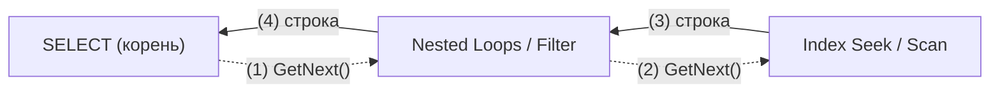
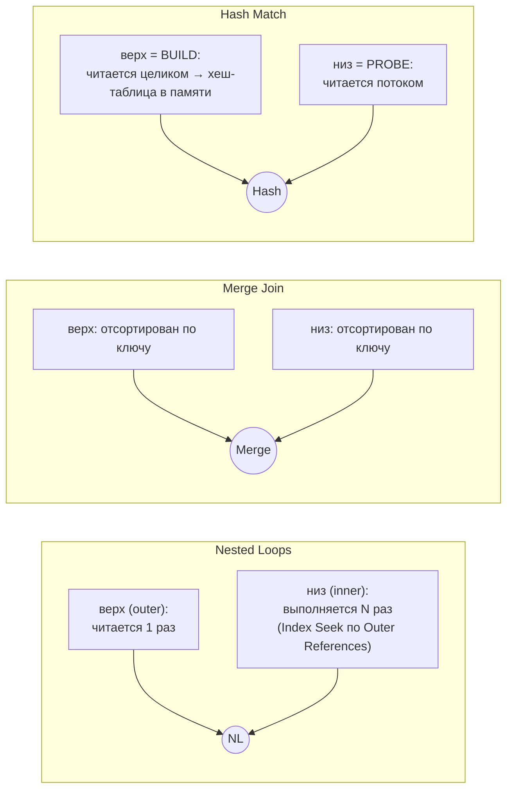
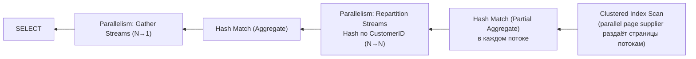

# 5. Операторы плана и чтение плана

[← Раздел 4](04-statistics.md) · [Оглавление](../README.md) · [Раздел 6 →](06-params-cache.md)

Вопросы 40–55. Практика: [`01_scan_vs_seek_demo.sql`](../sql/01_scan_vs_seek_demo.sql), [`03_plan_warnings_demo.sql`](../sql/03_plan_warnings_demo.sql), [`04_parallelism_demo.sql`](../sql/04_parallelism_demo.sql), блок 10 [`02_statistics_demo.sql`](../sql/02_statistics_demo.sql).

---

## 40. Предполагаемый и фактический план

> **Кратко.** **Estimated** (Ctrl+L) строится **без выполнения** и содержит только оценки. **Actual** (Ctrl+M) — **тот же план**, дополненный метриками реального выполнения. Форма плана в обоих случаях обычно одинаковая: оптимизатор строит один план. Различия возможны при перекомпиляции между вызовами (статистика, `#temp`) и при адаптивных механизмах.

**Есть только в фактическом плане:**
- `Actual Number of Rows` (по потокам — в параллельном плане), `Actual Rows Read` / `Number of Rows Read`, `Actual Executions`;
- время по операторам (`Actual Elapsed / CPU ms`) и логические/физические чтения по операторам (2016 SP1+);
- `MemoryGrantInfo`: Requested, Granted, **MaxUsed**, GrantWaitTime;
- **WaitStats** запроса, фактический DOP;
- `Parameter Runtime Value` (в предполагаемом только Compiled);
- предупреждения, которые появляются лишь при выполнении: **spill в tempdb**, Excessive Grant, `Actual Join Type` у Adaptive Join.

В кэше планов и в Query Store хранятся **предполагаемые** планы. Промежуточный вариант — **Live Query Statistics**: план «в движении» во время выполнения, помогает с зависшими запросами. **Проценты стоимости оценочные даже в фактическом плане** (вопрос 55).

---

## 41. Направление чтения плана и движение данных

> **Кратко.** **Данные текут справа налево** (от операторов доступа к корню SELECT), а **управление идёт слева направо**: корень просит строки у дочерних операторов. Модель итераторов: у каждого оператора есть `Open()`, `GetNext()`, `Close()`, и строки идут конвейером по одной (pull-модель).



| Тип оператора | Поведение | Примеры |
|---|---|---|
| Потоковые | Получил строку — сразу отдал | Compute Scalar, Filter, Nested Loops, Merge Join, Stream Aggregate, Top, Seek/Scan |
| Блокирующие | Ничего не отдают, пока не прочитают весь вход. Нужна память | Sort, Hash Match (Aggregate), Eager Spool |
| Частично блокирующие | Hash Match (Join): build-вход читается целиком, probe — потоком | Hash Match |

Следствия:
- `SELECT TOP (10) … WHERE …` над Clustered Index Scan прочитает **10 строк**: Top перестал просить, `Actual Rows = 10`;
- `TOP (10) … ORDER BY Amount` вынужден прочитать **всё**, потому что Sort блокирующий. Блок 10 [`02_statistics_demo.sql`](../sql/02_statistics_demo.sql) показывает оба случая.

Как читать план на практике:
- у соединений **верхний** вход — внешний (NL) или build (Hash), **нижний** — внутренний или probe;
- толщина стрелки показывает число строк;
- `NodeID` нумерует операторы слева направо и сверху вниз;
- в текстовом плане (`SHOWPLAN_TEXT`) больший отступ означает оператор правее, самые вложенные строки отдают данные первыми.

---

## 42. Table Scan, Clustered Index Scan, Index Seek: всегда ли Scan — плохо?

> **Кратко.** **Table Scan** — полное чтение кучи. **Clustered Index Scan** — полное чтение листьев кластерного индекса, то есть всей таблицы. **Index Scan** — полное чтение некластерного индекса (часто намного уже таблицы). **Index Seek** — спуск по B-дереву к нужному месту и чтение только диапазона. **Скан не плох сам по себе.** Плохо, когда прочитано намного больше, чем нужно. Seek тоже бывает плохим.

**Скан уместен, когда:**
- таблица маленькая (1–3 страницы);
- нужна большая доля строк (выше **точки перелома**);
- агрегат по всей таблице. Оптимизатор выберет **самый узкий** подходящий индекс: `COUNT(*)` читает НК-индекс, а не кластерный;
- скан с `TOP`, который остановился рано;
- упорядоченный скан (`Ordered = True`) вместо Sort;
- columnstore: сканирование в batch mode — нормальный план для аналитики.

**Скан — симптом проблемы, когда:**
- прочитано много, возвращено мало, а условие стоит в Predicate. Причины: нет индекса, условие несаргабельно, условие по второму столбцу индекса, неверная оценка;
- Table Scan по большой куче с forwarded records.

**Seek бывает плохим, когда:**
- огромный диапазон: `Region >= N''` формально seek, а читает всё;
- тысячи Key Lookup после него;
- главный фильтр стоит в Predicate, а не в Seek Predicates;
- seek на внутренней стороне NL выполнился миллион раз.

**Точка перелома (tipping point).** Стоимость «Seek + Lookup» растёт примерно как 3 × N чтений, а скан стоит постоянно, как число страниц таблицы. Для таблицы на 1 млн строк и 12 500 страниц перелом наступает уже около **4 000 строк (0,4%)**. Для узких таблиц доля выше, для широких ниже, поэтому универсального процента нет.


**Как оценивать план на практике:** смотрите не на название оператора, а на три вещи.
1. `Actual Rows Read` и `Actual Number of Rows`.
2. `Seek Predicates` и `Predicate`.
3. Логические чтения (`SET STATISTICS IO ON`).

Все варианты на одних данных — [`01_scan_vs_seek_demo.sql`](../sql/01_scan_vs_seek_demo.sql).

---

## 43. Key Lookup и RID Lookup

> **Кратко.** Некластерный индекс нашёл строки, но в нём нет всех нужных столбцов. Тогда **для каждой строки** выполняется дочитывание: **Key Lookup** — поиск по кластерному индексу по ключу (2–4 чтения), **RID Lookup** — переход по физическому адресу в куче. В плане это всегда **Nested Loops**: сверху Seek, снизу Lookup с `Number of Executions` = число строк.

**Чем опасен на большом числе строк:**
- 100 000 строк × 3 = около 300 000 случайных логических чтений, что больше, чем прочитать всю таблицу;
- при недооценке (Estimated 10, Actual 100 000) оптимизатор не переключился на скан. Это классика parameter sniffing и восходящего ключа.

**Как избавиться:**
1. Добавить недостающие столбцы в `INCLUDE` (сделать индекс покрывающим). Столбцы, которые нужны, видны в `Output List` оператора Lookup; фильтры, которые проверяются уже после Lookup, — в его `Predicate`.
2. Убрать лишние столбцы из SELECT (`SELECT *`).
3. Добавить столбец в ключ индекса, если по нему ещё и фильтруют.
4. Фильтрованный покрывающий индекс под частое условие.
5. Для RID Lookup — сделать таблицу кластерной.
6. Если корень проблемы в оценке строк — лечить оценку (раздел 4, раздел 6).

---

## 44. Seek Predicate и Predicate (residual)

> **Кратко.** **Seek Predicate** определяет, **куда прыгнуть в индексе и где остановиться**: строки вне его не читаются вообще. **Predicate** проверяется **для каждой уже прочитанной строки**. Seek predicate уменьшает объём **чтения**, residual predicate — только объём **результата**.

Пример: индекс `(CustomerID, OrderDate) INCLUDE (Status, Amount)`.

| Запрос | Seek Predicates | Predicate |
|---|---|---|
| `CustomerID = 42 AND OrderDate >= '20260101'` | Prefix: CustomerID = 42, Start: OrderDate ≥ … | — |
| `CustomerID = 42 AND Status = 3` | Prefix: CustomerID = 42 | Status = 3 (INCLUDE-столбец) |
| `CustomerID BETWEEN 40 AND 60 AND OrderDate = '20260315'` | Start/End по CustomerID | OrderDate = … (правее диапазона) |
| `OrderDate = '20260315'` | — (**Index Scan**) | OrderDate = … |
| `CustomerID = 42 AND YEAR(OrderDate) = 2026` | Prefix: CustomerID = 42 | YEAR(…) = 2026 (несаргабельно) |

Правило: **seek идёт по ведущим столбцам слева направо: равенства (Prefix), затем максимум один диапазон (Start/End)**. Всё остальное становится residual.

**Признак проблемы:** `Number of Rows Read` ≫ `Actual Number of Rows`. Прочитано 2 000 000, возвращено 50, а на значке гордо написано «Index Seek». Лечится переносом столбца в **ключ** (не в INCLUDE), перестановкой столбцов (равенства вперёд), переписыванием условия в SARGable-вид.

Не путать с **Probe Residual** у Hash Match: это проверка условия соединения после совпадения хешей.

---

## 45. Nested Loops, Merge Join и Hash Match

> **Кратко.** **NL** — для каждой строки верхнего входа ищет пары в нижнем; хорош при маленьком верхнем входе и индексе на нижнем; умеет **любые** условия. **Merge** — синхронный проход по двум входам, **отсортированным** по ключу; нужно равенство. **Hash** — хеш-таблица по верхнему (меньшему) входу и проба нижним; нужно равенство, нужна память, индексы не нужны.



| | Nested Loops | Merge Join | Hash Match |
|---|---|---|---|
| Условие | Любое (неравенства, LIKE, CROSS JOIN, APPLY) | Хотя бы одно равенство | Хотя бы одно равенство |
| Требования | Желателен индекс на нижнем входе | Оба входа отсортированы по ключу | Никаких |
| Стоимость | ≈ N_outer × (цена одного поиска), при seek ≈ N·log M | ≈ N + M (+ N log N, если нужен Sort) | ≈ N + M + хеширование |
| Память | Не нужна | Только для Sort | **Memory grant**, риск spill |
| Блокирующий | Нет, первая строка сразу | Нет (кроме Sort) | Да, на build-фазе |
| Порядок результата | Порядок верхнего входа | Отсортирован по ключу | Не упорядочен |
| Лучше всего | Маленький верх + индекс; TOP, EXISTS, FAST n | Два больших **уже отсортированных** входа | Два больших неотсортированных входа, DWH |
| Главный риск | Недооценка верха → миллионы seek | Дорогой Sort, many-to-many (worktable в tempdb) | Недооценка → spill; переоценка → ожидание памяти |

Грубая картина выбора:
- маленький × что угодно с индексом → NL;
- большой × большой, оба отсортированы → Merge;
- большой × большой без порядка → Hash;
- средние объёмы → решают детали (индексы, покрытие, row goal, параллелизм).

**Что смотреть в плане:**
- `Estimated` и `Actual` на обоих входах;
- у NL — `Number of Executions` и оператор внизу (Seek или Scan/Spool), `Outer References`;
- у Merge — есть ли перед ним Sort, нет ли `Many to Many = True`;
- у Hash — предупреждение о spill, `MemoryGrantInfo`, какой вход в build.

**Adaptive Join** (2017+ в batch mode, 2019+ и для rowstore при уровне 150, Enterprise). Выбор между Hash и NL откладывается до выполнения: если строк пришло меньше `Adaptive Threshold Rows`, работает NL, иначе Hash. Фактический выбор виден в `Actual Join Type`.

**Эксперимент:** `OPTION (LOOP JOIN)` / `(MERGE JOIN)` / `(HASH JOIN)` и сравнение `STATISTICS IO, TIME`. Только для исследования.

> ⚠️ **Уточнение к источникам.** Пример Merge Join в одном из ответов (`ON u.Id = o.OrderId`) соединял несвязанные столбцы. Корректный пример: `Customers c JOIN Orders o ON o.CustomerID = c.CustomerID`, где кластерный индекс Customers(CustomerID) и индекс Orders(CustomerID, …) уже отсортированы по ключу.

---

## 46. Внешний и внутренний вход Nested Loops

> **Кратко.** **Внешний** (outer) — верхний вход, читается **один раз**. **Внутренний** (inner) — нижний вход, **выполняется заново для каждой строки внешнего**, получая её значения через `Outer References`. Стоимость ≈ Cost(outer) + N_outer × Cost(inner), поэтому сверху должен быть **маленький** отфильтрованный набор, а снизу — **дешёвый поиск по индексу**.

| Строк сверху | Seek снизу (~3 чтения) | Итог |
|---|---|---|
| 10 | 30 | мгновенно |
| 10 000 | 30 000 | терпимо |
| 1 000 000 | 3 000 000 | катастрофа (таблица целиком — несколько тысяч страниц) |

Если снизу не seek, а скан, стоимость растёт как «строки сверху × размер нижнего входа». Иногда оптимизатор ставит **Table Spool** (кэширует нижний вход в tempdb) или **Index Spool** (строит временный индекс, вопрос 51).

Логические варианты того же оператора:
- Left Outer Join;
- **Left Semi Join** (EXISTS/IN — останавливается на первом совпадении);
- **Left Anti Semi Join** (NOT EXISTS).

**Key Lookup — это NL таблицы с самой собой.**

---

## 47. Почему Merge Join требует отсортированных входов

> **Кратко.** Алгоритм держит два указателя и двигает меньший. Если `A.key < B.key`, то благодаря сортировке **A.key дальше в B гарантированно не встретится**, и A можно отбросить. Без сортировки это не так, и пришлось бы возвращаться назад. Каждый вход читается **один раз**, последовательно.

```text
Сверху (Customers):  1   2   3   5   8
Снизу  (Orders):     1 1 2 3 3 3 4 5 5 9     ← совпадения идут подряд, назад не возвращаемся
```

**Если входы не отсортированы:**
1. Оптимизатор обычно выбирает Hash (или NL, если один вход маленький).
2. Если Merge всё же выгоден (порядок нужен выше для ORDER BY/GROUP BY, хинт), перед ним ставится **Sort**. Это блокирующий оператор, O(N log N), memory grant и риск spill.

Many-to-many (дубли с обеих сторон) требует **worktable** в tempdb: `Many to Many = True`, в `STATISTICS IO` появляется Worktable. Merge «бесплатен», когда порядок даёт индекс. Если сортировать приходится явно, Merge обычно проигрывает Hash.

---

## 48. Sort и Hash Match (Aggregate): блокирующие операторы и spill

> **Кратко.** **Sort** не может выдать первую строку, не увидев все: вдруг самая маленькая окажется последней. **Hash Aggregate** выдаёт группы только после чтения всего входа: до конца неизвестно, придут ли ещё строки группы. Обоим нужен **memory grant**, который выдаётся **до выполнения, по оценке строк**. Если данных больше, чем памяти, часть уходит в tempdb — это **spill**.

**Как увидеть spill (только в фактическом плане):**
- жёлтый треугольник на Sort или Hash Match. Текст: *Operator used tempdb to spill data during execution with spill level N…* (в новых версиях — число страниц, `SpilledThreadCount`, Reads/Writes to TempDb);
- варианты: **Sort Warning** (`SpillLevel` — число проходов слияния), **Hash Warning** (SpillLevel > 1 — рекурсивное разбиение; *bailout* — хуже всего), **Exchange Spill** у Parallelism;
- `STATISTICS IO`: Worktable/Workfile с чтениями; большие **Writes** у SELECT в трассе;
- Extended Events: `sort_warning`, `hash_warning`, `hash_spill_details`.

**Главная причина** — недооценка кардинальности. Лечить нужно **оценку**, а не память:
- статистика;
- саргабельные условия;
- `#temp` вместо табличных переменных;
- parameter sniffing;
- индекс, который отдаёт данные уже отсортированными и убирает Sort;
- memory grant feedback (2017 batch mode, 2019 row mode, 2022 — сохранение в Query Store).

Воспроизведение: блок B [`03_plan_warnings_demo.sql`](../sql/03_plan_warnings_demo.sql).

---

## 49. Memory grant

> **Кратко.** Рабочая память запроса под **Sort, Hash Join, Hash Aggregate** (не путать с буферным пулом). Размер считается при компиляции: примерно **оценка строк × оценка ширины строки**, с поправками на операторы и DOP. Выдаётся **целиком перед стартом**. Если свободной памяти нет, запрос **ждёт в очереди** (`RESOURCE_SEMAPHORE`).

| Слишком маленький (недооценка) | Слишком большой (переоценка) |
|---|---|
| Spill в tempdb, запрос в разы медленнее | Память простаивает (MaxUsed ≪ Granted) |
| Предупреждения SpillToTempDb | Предупреждение **ExcessiveGrant** на SELECT |
| | Другие запросы ждут `RESOURCE_SEMAPHORE`, сервер «встаёт» при свободном CPU |

**Где смотреть:**
- фактический план → SELECT → `MemoryGrantInfo` (RequestedMemory, GrantedMemory, MaxUsedMemory, GrantWaitTime);
- `sys.dm_exec_query_memory_grants` — в реальном времени (`wait_time_ms > 0` означает ожидание выдачи);
- Query Store — метрика памяти.

**Средства:**
- исправить оценку;
- **Memory Grant Feedback**: корректирует грант между выполнениями;
- хинты `MIN_GRANT_PERCENT` / `MAX_GRANT_PERCENT`;
- ограничения Resource Governor.

---

## 50. Stream Aggregate и Hash Aggregate

> **Кратко.** **Stream Aggregate** требует входа, **отсортированного по ключам группировки**: группы идут подряд, в памяти одна текущая группа. Он потоковый, памяти не нужно, результат упорядочен. **Hash Aggregate** строит хеш-таблицу групп: порядок не нужен, зато нужна память, оператор блокирующий, возможен spill.

| | Stream Aggregate | Hash Match (Aggregate) |
|---|---|---|
| Требование | Вход отсортирован (индекс или Sort) | Нет |
| Память | Минимальная | Memory grant под все группы |
| Выход | Упорядочен | Не упорядочен |
| Типично | Скалярные агрегаты (`COUNT(*)` без GROUP BY — **всегда** Stream), GROUP BY по ведущему столбцу индекса | Большой неупорядоченный вход, относительно мало групп |

В параллельных планах и columnstore агрегация часто двухэтапная: **Partial (local) Aggregate** в каждом потоке → обмен → **Global Aggregate**. Индекс по столбцам GROUP BY может превратить «Hash Aggregate» или «Sort + Stream» в чистый Stream Aggregate без памяти.

---

## 51. Spool: Table Spool, Index Spool

> **Кратко.** Spool сохраняет промежуточный результат поддерева во **worktable** (в tempdb), чтобы прочитать его повторно, а не вычислять заново. **Table Spool** хранит строки. **Index Spool** ещё и **строит на лету индекс** для поиска. **Lazy** — потоковый (строки уходят выше сразу), **Eager** — блокирующий (сначала всё записывает).

| Где встречается | Что означает |
|---|---|
| Внутренний вход NL: Table Spool / **Index Spool** | Повторные выполнения дорогие. **Index Spool почти всегда кричит об отсутствии индекса**: оптимизатор строит временный индекс при каждом выполнении. Решение — постоянный индекс по этим столбцам |
| UPDATE/DELETE: **Eager Table Spool** | **Halloween protection**: зафиксировать список строк до изменения, чтобы не обработать строку дважды. Нормальное поведение |
| Рекурсивный CTE | Index/Table Spool `With Stack = True` — механизм рекурсии |
| Оконные функции | Window Spool / Segment — хранение секции |

В свойствах: `Rebinds` (параметры сменились, поддерево выполняется заново) и `Rewinds` (параметры те же, чтение из спула). Spool при недооценке строк — ещё один симптом проблемы с кардинальностью.

---

## 52. Параллелизм

> **Кратко.** Если **стоимость последовательного плана** выше `cost threshold for parallelism` (по умолчанию **5**), MAXDOP > 1 и нет ингибиторов, оптимизатор рассматривает параллельный вариант и берёт его, если он дешевле. Потоки обмениваются строками через операторы **Parallelism (exchange)**: **Distribute Streams** (1 → N), **Repartition Streams** (N → N), **Gather Streams** (N → 1). **MAXDOP** ограничивает число потоков **на одну ветку** плана.



| Свойство обмена | Значения |
|---|---|
| Partitioning Type | **Hash** (join/group by), **Round Robin**, **Broadcast** (маленькая сторона — копия в каждый поток), Range, Demand |
| Order By у Gather | Order-preserving (merging) exchange: дороже, возможен Exchange Spill |

**Детали:**
- при расчёте стоимости параллельного плана CPU делится на DOP, I/O — нет, плюс стоимость обмена;
- **фактический DOP** выбирается при каждом запуске по свободным потокам;
- потоков у запроса = DOP × число одновременно активных веток + координатор. Отсюда риск `THREADPOOL`;
- в `STATISTICS TIME` у параллельного запроса **CPU time > elapsed time**.

**Настройки:**

| Уровень | Как |
|---|---|
| Сервер | `sp_configure 'max degree of parallelism'`, `'cost threshold for parallelism'` |
| База (2016+) | `ALTER DATABASE SCOPED CONFIGURATION SET MAXDOP = n` |
| Запрос | `OPTION (MAXDOP n)` — перекрывает базу и сервер, но не Resource Governor |
| Resource Governor | `MAX_DOP` группы нагрузки — верхний предел |

**Рекомендации:**
- MAXDOP: до 8 логических CPU на NUMA-узел — не больше их числа; больше 8 — ставить 8; очень большие узлы — половина узла, но не выше 16;
- `cost threshold`: 5 — наследие 90-х, на практике 25–50 и дальше по данным из кэша.

**Ингибиторы** (причина — в `NonParallelPlanReason`):
- не-инлайнящиеся скалярные UDF;
- **запись** в табличную переменную;
- некоторые системные функции, курсоры.

**Ожидания:**
- `CXPACKET` — синхронизация. Сам по себе не диагноз: чаще симптом **перекоса** (skew) или лишнего параллелизма;
- `CXCONSUMER` — обычно безвреден.

> 1С исторически рекомендует `max degree of parallelism = 1` для OLTP-нагрузки (много коротких запросов). Мягкая альтернатива для тяжёлых отчётов: небольшой MAXDOP (2–4) + высокий cost threshold, либо Resource Governor. Хинты в запросы платформы не вставить.

Все виды обменов, skew, cost threshold и NonParallelPlanReason — в [`04_parallelism_demo.sql`](../sql/04_parallelism_demo.sql).

---

## 53. Предупреждения в плане

Жёлтый треугольник на операторе или на корневом SELECT; подробности в `Warnings` (F4), в XML — элемент `<Warnings>`. Часть предупреждений ставится при компиляции (они видны и в предполагаемом плане, и в кэше), часть — только по итогам выполнения.

| Предупреждение | Где видно | Смысл | Действие |
|---|---|---|---|
| **PlanAffectingConvert** (CONVERT_IMPLICIT … SeekPlan / CardinalityEstimate) | Везде | Приводится столбец: нет seek, хуже оценка | Выровнять типы (вопрос 27) |
| **ColumnsWithNoStatistics** | Везде | Нет статистики, выключено автосоздание или read-only база: оценка «наугад» | `AUTO_CREATE_STATISTICS ON` / `CREATE STATISTICS` |
| **SpillToTempDb** (Sort / Hash / Exchange) | Только actual | Не хватило гранта | Исправить оценку, индекс против Sort |
| **MemoryGrantWarning**: ExcessiveGrant, GrantIncrease, UsedMoreThanGranted | Только actual, на SELECT | Грант сильно больше или меньше нужного | Исправить оценку, feedback |
| **Missing Index** (зелёный текст, строго говоря — подсказка) | Везде | «Такой индекс снизил бы стоимость» | Анализировать, а не создавать вслепую (вопрос 54) |
| **NoJoinPredicate** | Везде | Соединение без условия, декартово произведение | Обычно ошибка в запросе |
| **UnmatchedIndexes** | Везде | Фильтрованный индекс не применён из-за параметризации | Литерал / RECOMPILE / другой индекс |
| **Wait** (memory grant) | Actual | Запрос ждал выдачи памяти | См. вопрос 49 |

Поиск планов с предупреждениями в кэше — блок D [`03_plan_warnings_demo.sql`](../sql/03_plan_warnings_demo.sql). Устаревшая статистика предупреждения **не** даёт: её видно только по расхождению оценки и факта.

---

## 54. ★ Почему нельзя слепо создавать индексы по «Missing Index»

> **Кратко.** Подсказка — это взгляд **одного запроса на одну компиляцию**. Она не учитывает ни нагрузку в целом, ни существующие индексы, ни цену записи.

Причины:
1. **Не видит существующих индексов.** Легко наплодить дубли и почти-дубли, хотя часто достаточно добавить столбец в INCLUDE уже имеющегося индекса.
2. **Не видит записи.** Каждый индекс — «налог» на INSERT/UPDATE/DELETE, блокировки, журнал, место на диске и в буферном пуле, обслуживание.
3. **Порядок ключей** механический: «сначала равенства, потом неравенства», без учёта селективности и других запросов.
4. **В INCLUDE** часто попадают почти все столбцы (при `SELECT *`), и получается копия таблицы.
5. **Impact** считается на тех же, возможно ошибочных, оценках.
6. Лечит симптом, а не причину: несаргабельное условие, `CONVERT_IMPLICIT`, лишние столбцы.
7. В графическом плане показана **одна** подсказка, остальные — только в XML. Для тривиальных планов подсказок нет вообще.

**Порядок работы:**
- собрать кандидатов (`sys.dm_db_missing_index_*`);
- сравнить с существующими индексами;
- проверить сам запрос;
- оценить частоту и цену записи (`sys.dm_db_index_usage_stats`);
- объединить похожие подсказки в один индекс;
- проверить на тесте «до/после» по чтениям.

Скрипты — [`10_index_maintenance_audit.sql`](../sql/10_index_maintenance_audit.sql).

---

## 55. ★ Почему процент стоимости оператора может вводить в заблуждение

> **Кратко.** Проценты — это **оценочная стоимость** оператора относительно плана, посчитанная **до выполнения по оценкам кардинальности**. Они одинаковы в предполагаемом и фактическом плане и **не учитывают реальное число строк, время, ожидания и spill**.

Почему им нельзя доверять:
- **неверная оценка = неверные проценты.** Key Lookup с оценкой 1 строка показывает 1%, а фактически выполнился 500 000 раз и занял 95% времени;
- **модель стоимости условна**: I/O считается как для холодного диска, хотя данные в памяти, и фиксированные коэффициенты не соответствуют современному железу;
- **скалярные UDF, многооператорные TVF, удалённые запросы** оцениваются почти бесплатно, хотя могут быть самыми тяжёлыми;
- **spill и ожидания** (блокировки, `PAGEIOLATCH`) в стоимость не входят вообще;
- «Query cost (relative to the batch)» между запросами пакета тоже оценочный. Запрос с 5% может выполняться дольше запроса с 95%.

**На что смотреть вместо процентов:**
- фактические строки и выполнения;
- `Actual Elapsed / CPU ms` по операторам (2016 SP1+);
- `Actual Logical Reads` по операторам;
- `STATISTICS IO/TIME`;
- WaitStats плана;
- метрики в трассе или Query Store.

---

[← Раздел 4](04-statistics.md) · [Оглавление](../README.md) · [Раздел 6 →](06-params-cache.md)
