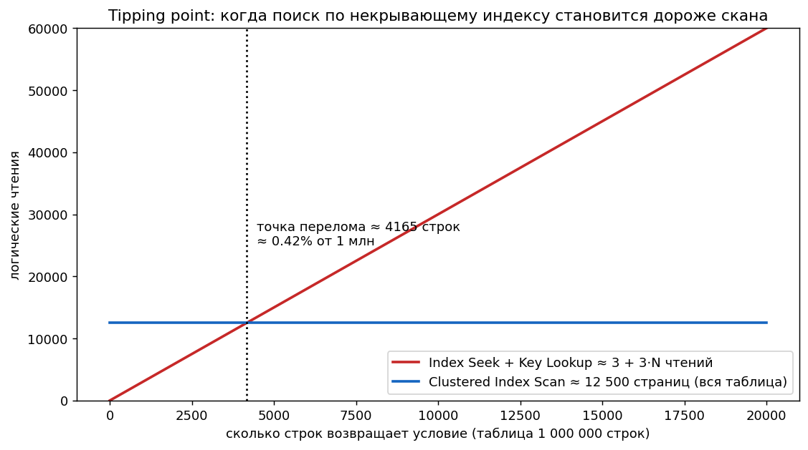
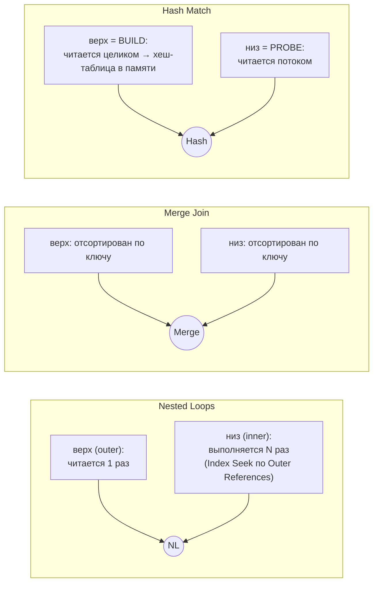
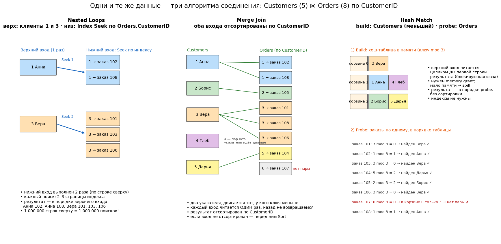
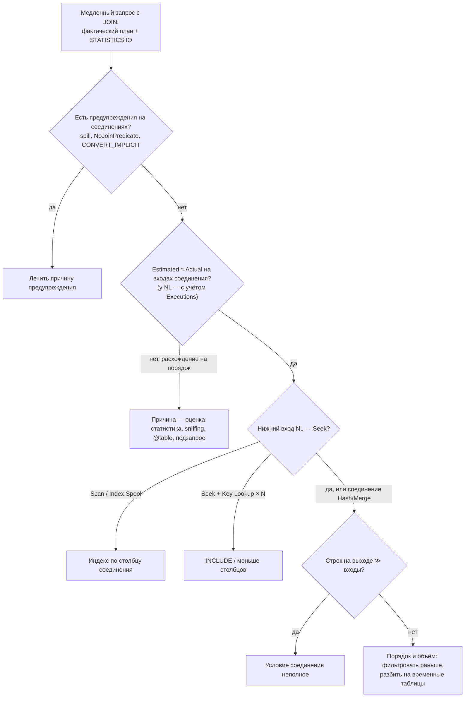
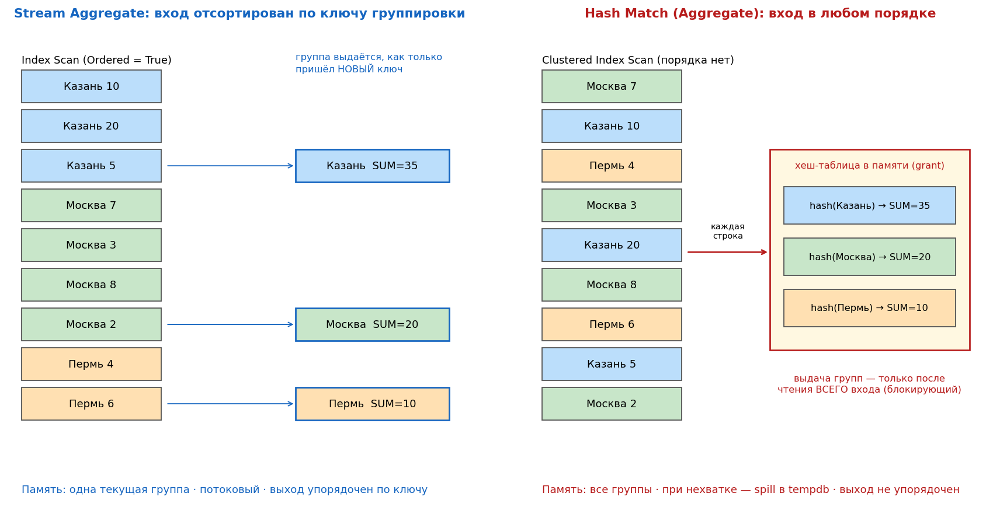
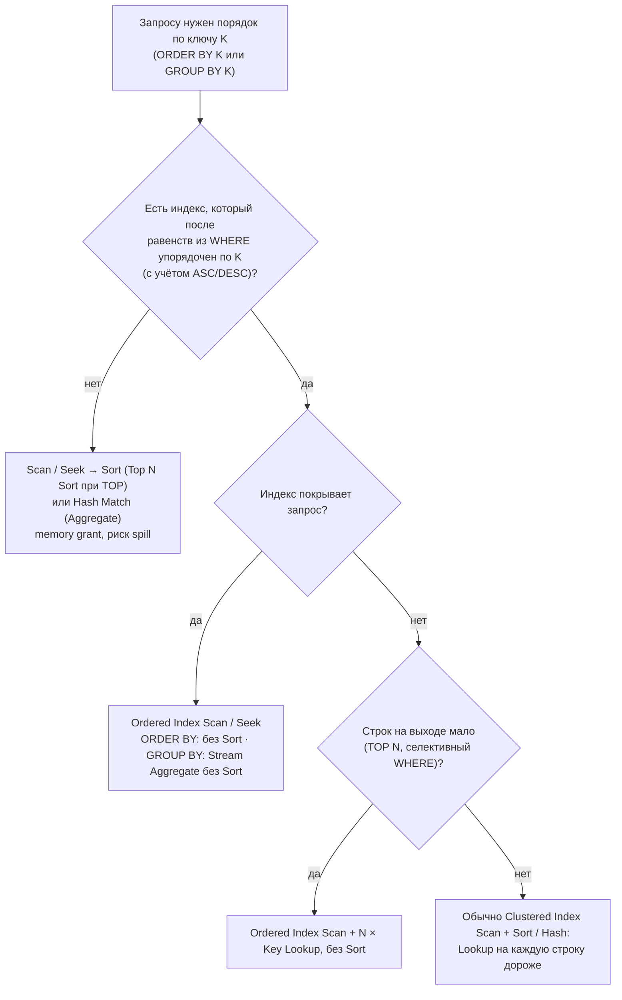
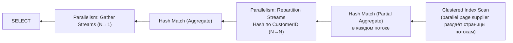
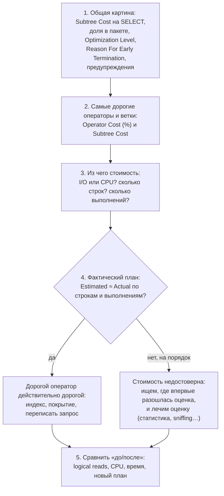

# 5. Операторы плана и чтение плана

[← Раздел 4](04-statistics.md) · [Оглавление](../README.md) · [Раздел 6 →](06-params-cache.md)

Вопросы 40–55 и дополнительные 47а, 50а, 55а. Практика: [`01_scan_vs_seek_demo.sql`](../sql/01_scan_vs_seek_demo.sql), [`03_plan_warnings_demo.sql`](../sql/03_plan_warnings_demo.sql), [`04_parallelism_demo.sql`](../sql/04_parallelism_demo.sql), блок 10 [`02_statistics_demo.sql`](../sql/02_statistics_demo.sql), [`13_order_by_group_by_demo.sql`](../sql/13_order_by_group_by_demo.sql), [`16_join_problems_demo.sql`](../sql/16_join_problems_demo.sql), [`19_seek_predicate_demo.sql`](../sql/19_seek_predicate_demo.sql), [`20_join_algorithms_demo.sql`](../sql/20_join_algorithms_demo.sql), [`21_missing_index_demo.sql`](../sql/21_missing_index_demo.sql).

---

## 40. Предполагаемый и фактический план

> **Кратко.** **Estimated** (Ctrl+L) строится **без выполнения** и содержит только оценки. **Actual** (Ctrl+M) — **тот же план**, дополненный метриками реального выполнения. Форма плана в обоих случаях обычно одинаковая: оптимизатор строит один план. Различия возможны при перекомпиляции между вызовами (статистика, `#temp`) и при адаптивных механизмах.

**Есть только в фактическом плане:**
- `Actual Number of Rows` (по потокам — в параллельном плане), `Actual Rows Read` / `Number of Rows Read`, `Actual Executions`;
- время по операторам (`Actual Elapsed / CPU ms`) и логические/физические чтения по операторам (2016 SP1+);
- `MemoryGrantInfo`: Requested, Granted, **MaxUsed**, GrantWaitTime;
- **WaitStats** запроса, фактический DOP;
- `Parameter Runtime Value` (в предполагаемом только Compiled);
- предупреждения, которые появляются лишь при выполнении: **spill в tempdb**, Excessive Grant, `Actual Join Type` у Adaptive Join.

В кэше планов и в Query Store хранятся **предполагаемые** планы. Промежуточный вариант — **Live Query Statistics**: план «в движении» во время выполнения, помогает с зависшими запросами. **Проценты стоимости оценочные даже в фактическом плане** (вопрос 55).

---

## 41. Направление чтения плана и движение данных

> **Кратко.** **Данные текут справа налево** (от операторов доступа к корню SELECT), а **управление идёт слева направо**: корень просит строки у дочерних операторов. Модель итераторов: у каждого оператора есть `Open()`, `GetNext()`, `Close()`, и строки идут конвейером по одной (pull-модель).


| Тип оператора | Поведение | Примеры |
|---|---|---|
| Потоковые | Получил строку — сразу отдал | Compute Scalar, Filter, Nested Loops, Merge Join, Stream Aggregate, Top, Seek/Scan |
| Блокирующие | Ничего не отдают, пока не прочитают весь вход. Нужна память | Sort, Hash Match (Aggregate), Eager Spool |
| Частично блокирующие | Hash Match (Join): build-вход читается целиком, probe — потоком | Hash Match |

Следствия:
- `SELECT TOP (10) … WHERE …` над Clustered Index Scan прочитает **10 строк**: Top перестал просить, `Actual Rows = 10`;
- `TOP (10) … ORDER BY Amount` вынужден прочитать **всё**, потому что Sort блокирующий. Блок 10 [`02_statistics_demo.sql`](../sql/02_statistics_demo.sql) показывает оба случая.

Как читать план на практике:
- у соединений **верхний** вход — внешний (NL) или build (Hash), **нижний** — внутренний или probe;
- толщина стрелки показывает число строк;
- `NodeID` нумерует операторы слева направо и сверху вниз;
- в текстовом плане (`SHOWPLAN_TEXT`) больший отступ означает оператор правее, самые вложенные строки отдают данные первыми.

---

## 42. Table Scan, Clustered Index Scan, Index Seek: всегда ли Scan — плохо?

> **Кратко.** **Table Scan** — полное чтение кучи. **Clustered Index Scan** — полное чтение листьев кластерного индекса, то есть всей таблицы. **Index Scan** — полное чтение некластерного индекса (часто намного уже таблицы). **Index Seek** — спуск по B-дереву к нужному месту и чтение только диапазона. **Скан не плох сам по себе.** Плохо, когда прочитано намного больше, чем нужно. Seek тоже бывает плохим.

**Скан уместен, когда:**
- таблица маленькая (1–3 страницы);
- нужна большая доля строк (выше **точки перелома**);
- агрегат по всей таблице. Оптимизатор выберет **самый узкий** подходящий индекс: `COUNT(*)` читает НК-индекс, а не кластерный;
- скан с `TOP`, который остановился рано;
- упорядоченный скан (`Ordered = True`) вместо Sort;
- columnstore: сканирование в batch mode — нормальный план для аналитики.

**Скан — симптом проблемы, когда:**
- прочитано много, возвращено мало, а условие стоит в Predicate. Причины: нет индекса, условие несаргабельно, условие по второму столбцу индекса, неверная оценка;
- Table Scan по большой куче с forwarded records.

**Seek бывает плохим, когда:**
- огромный диапазон: `Region >= N''` формально seek, а читает всё;
- тысячи Key Lookup после него;
- главный фильтр стоит в Predicate, а не в Seek Predicates;
- seek на внутренней стороне NL выполнился миллион раз.

**Точка перелома (tipping point).** Стоимость «Seek + Lookup» растёт примерно как 3 × N чтений, а скан стоит постоянно, как число страниц таблицы. Для таблицы на 1 млн строк и 12 500 страниц перелом наступает уже около **4 000 строк (0,4%)**. Для узких таблиц доля выше, для широких ниже, поэтому универсального процента нет.



**Как оценивать план на практике:** смотрите не на название оператора, а на три вещи.
1. `Actual Rows Read` и `Actual Number of Rows`.
2. `Seek Predicates` и `Predicate` (что это такое — [вопрос 44](#44-seek-predicate-и-predicate-residual)).
3. Логические чтения (`SET STATISTICS IO ON`).

**Clustered Index Scan и Nonclustered Index Seek — прямое сравнение** (частый вопрос на аттестации):

| | Clustered Index Scan | Nonclustered Index Seek |
|---|---|---|
| Что читает | **Листья кластерного индекса**, то есть всю таблицу со всеми столбцами | **Часть** некластерного индекса: спуск по B-дереву к началу диапазона и чтение только нужного отрезка листьев |
| Объём чтения | ≈ число страниц таблицы, не зависит от условия (кроме раннего останова по `TOP`) | 2–4 страницы на спуск + страницы диапазона. Растёт с числом подходящих строк |
| Какие столбцы доступны | Все | Только ключ индекса, `INCLUDE` и ключ кластера. Остальные — через **Key Lookup** на каждую строку |
| Условие WHERE | Проверяется для каждой строки (**Predicate**) | Ведущие столбцы — в **Seek Predicates** (навигация), остальное — Predicate |
| Порядок результата | По ключу кластера (если `Ordered = True`) | По ключу некластерного индекса |
| Когда уместен | Маленькая таблица; нужна большая доля строк (выше точки перелома); агрегат по всей таблице; нет подходящего индекса и строк много | Условие селективно и саргабельно; индекс покрывает запрос или строк мало (тогда Lookup дёшев) |
| Признак проблемы | `Actual Rows Read` ≫ `Actual Number of Rows`, условие в Predicate — не хватает индекса или условие несаргабельно | Огромный диапазон (Seek, который читает почти всё); тысячи Key Lookup рядом; главный фильтр в Predicate, а не в Seek Predicates |
| Свойства в плане | `Ordered`, `Scan Direction`, `Actual Rows Read`, `Predicate` | `Seek Predicates` (Prefix / Start / End), `Predicate`, `Actual Rows Read`, `Number of Executions` |

Главный вывод для ответа: **оператор сам по себе не хорош и не плох**. Seek дешевле, только если прочитано мало страниц. Скан всей таблицы бывает дешевле Seek с сотнями тысяч Key Lookup. Сравнивают логические чтения и соотношение прочитанных и возвращённых строк.

Все варианты на одних данных — [`01_scan_vs_seek_demo.sql`](../sql/01_scan_vs_seek_demo.sql).


**Пример для 1С: Seek или Scan по одному и тому же справочнику.**

```bsl
ВЫБРАТЬ Контрагенты.Ссылка, Контрагенты.Наименование
ИЗ Справочник.Контрагенты КАК Контрагенты
ГДЕ Контрагенты.Код = &Код           // (а) индекс «Код + Ссылка»     → Index Seek + Key Lookup
// ГДЕ Контрагенты.ИНН = &ИНН        // (б) ИНН без «Индексировать»   → Clustered Index Scan + Predicate
//                                   // (в) ИНН «Индексировать»       → Index Seek (Реквизит + Ссылка) + Key Lookup
```

В варианте (б) в плане `Number of Rows Read` = все контрагенты, `Actual Number of Rows` = 1. Это и есть «скан, который читает намного больше, чем нужно»: признак, что реквизиту не хватает флага «Индексировать». Обратный случай: отбор `Контрагенты.ЭтоГруппа = ЛОЖЬ` без других условий — скан нормален, нужна почти вся таблица.


**Узкий индекс вместо кластерного.** Если запросу от таблицы нужен только ключ кластеризации (в 1С — Ссылка), его содержит **любой** некластерный индекс, и оптимизатор читает самый **узкий**: меньше страниц. Плата — порядок: узкий индекс отсортирован по своему ключу, поэтому подходит для Hash Match, но не для Merge по ссылке. Пример на реальном плане — [раздел 13](13-joins-real-plans.md#узкий-индекс-вместо-кластерного).
---

## 43. Key Lookup и RID Lookup

> **Кратко.** Некластерный индекс нашёл строки, но в нём нет всех нужных столбцов. Тогда **для каждой строки** выполняется дочитывание: **Key Lookup** — поиск по кластерному индексу по ключу (2–4 чтения), **RID Lookup** — переход по физическому адресу в куче. В плане это всегда **Nested Loops**: сверху Seek, снизу Lookup с `Number of Executions` = число строк.

**Чем опасен на большом числе строк:**
- 100 000 строк × 3 = около 300 000 случайных логических чтений, что больше, чем прочитать всю таблицу;
- при недооценке (Estimated 10, Actual 100 000) оптимизатор не переключился на скан. Это классика parameter sniffing и восходящего ключа.

**Как избавиться:**
1. Добавить недостающие столбцы в `INCLUDE` (сделать индекс покрывающим). Столбцы, которые нужны, видны в `Output List` оператора Lookup; фильтры, которые проверяются уже после Lookup, — в его `Predicate`.
2. Убрать лишние столбцы из SELECT (`SELECT *`).
3. Добавить столбец в ключ индекса, если по нему ещё и фильтруют.
4. Фильтрованный покрывающий индекс под частое условие.
5. Для RID Lookup — сделать таблицу кластерной.
6. Если корень проблемы в оценке строк — лечить оценку (раздел 4, раздел 6).


**Пример для 1С: как получить Key Lookup.** Нужен отбор по **некластерному** индексу и выборка полей, которых в нём нет. Плюс селективность: если строк много, оптимизатор выберет скан ([вопрос 42](#42-table-scan-clustered-index-scan-index-seek-всегда-ли-scan--плохо)). Индексы объектов — по [вопросу 77](08-1c-specifics.md#77-как-индексы-объектов-1с-отображаются-в-индексы-субд).

```bsl
// 1. Регистр накопления: отбор по регистратору, выбираем ресурсы
ВЫБРАТЬ Движения.Номенклатура, Движения.Количество, Движения.Сумма
ИЗ РегистрНакопления.Продажи КАК Движения
ГДЕ Движения.Регистратор = &Документ
```

Таблица движений кластеризована по **Период + Регистратор + НомерСтроки**. Отбор по регистратору идёт по некластерному индексу «Регистратор + НомерСтроки», в котором нет измерений и ресурсов. План: **Index Seek** по этому индексу + **Key Lookup** в кластерный за `Номенклатура`, `Количество`, `Сумма` (Number of Executions = число строк документа).

```bsl
// 2. Справочник: точное наименование, выбираем реквизиты
ВЫБРАТЬ Номенклатура.Артикул, Номенклатура.Вес
ИЗ Справочник.Номенклатура КАК Номенклатура
ГДЕ Номенклатура.Наименование = &Наименование

// 3. Документ: один день, выбираем реквизиты
ВЫБРАТЬ Док.Ссылка, Док.Контрагент, Док.СуммаДокумента
ИЗ Документ.РеализацияТоваровУслуг КАК Док
ГДЕ Док.Дата МЕЖДУ &НачалоДня И &КонецДня
```

Индексы «Наименование + Ссылка» и «Дата + Ссылка» не содержат реквизитов: Index Seek + Key Lookup.

**Где Key Lookup не будет:**
- регистр накопления с отбором **по периоду** (`Период МЕЖДУ …`) — это поле кластерного индекса, все поля читаются прямо из него (Clustered Index Seek);
- отбор по `Ссылка` — Clustered Index Seek;
- широкий отбор (склад, на котором половина движений, или год вместо дня) — скорее Clustered Index Scan.

**Как убрать Key Lookup в 1С:** выбирать только нужные поля, сузить отбор. С лицензией КОРП — дополнительный индекс, где выбираемые поля помечены как «Дополнительные» (включённые столбцы, `INCLUDE`). Ручной индекс в СУБД пропадёт при реструктуризации.

**RID Lookup в 1С практически не встречается:** у всех таблиц объектов есть кластерный индекс. Временная таблица `ПОМЕСТИТЬ ВТ` без `ИНДЕКСИРОВАТЬ ПО` — это куча, но некластерных индексов на ней нет, поэтому её читают Table Scan, а не RID Lookup.

**Как увидеть план:** текст запроса 1С в SSMS не выполнить — нужен SQL, который сгенерировала платформа. Его и план берут из технологического журнала или Profiler/XE с фильтром по SPID ([вопросы 69, 69а](08-1c-specifics.md#69а-практика-как-поймать-свой-запрос-1с-в-profiler-и-получить-его-план)). Ссылку в параметр подставляют значением `0x…` из трассы: строковый `УникальныйИдентификатор` хранится в `binary(16)` с другим порядком байтов.


Разбор реального плана 1С с Key Lookup (отбор документов по дате, 96% стоимости на дочитывании) — [раздел 12](12-real-plan-walkthrough.md).
---

## 44. Seek Predicate и Predicate (residual)

> **Кратко.** Оператор чтения (Index Seek, Index Scan, Clustered Index Scan) применяет условие `WHERE` одним из двух способов. **Seek Predicates** — условие используется для **навигации по индексу**: куда прыгнуть и где остановиться, строки вне этого отрезка не читаются вообще. **Predicate** («остаточный предикат», residual) — условие **проверяется для каждой уже прочитанной строки**. Seek Predicate уменьшает объём **чтения**, Predicate — только объём **результата**. «Условие в Predicate» значит, что оно не помогло сократить чтение, а только отфильтровало результат. Главный признак проблемы — `Number of Rows Read` ≫ `Actual Number of Rows`.

### Аналогия

Телефонный справочник отсортирован по фамилии, а внутри фамилии — по имени. Это индекс `(Фамилия, Имя)`.

| Задача | Что делаете | В терминах плана |
|---|---|---|
| Иванов Пётр | Открываете на «Иванов», внутри сразу на «Пётр» | Оба условия — Seek Predicates |
| Ивановы, у которых телефон кончается на 7 | Открываете на «Иванов», **просматриваете всех Ивановых**, у каждого смотрите телефон | Фамилия — Seek Predicate, телефон — Predicate |
| Все, у кого телефон кончается на 7 | Листаете **весь справочник** и проверяете каждого | Скан + Predicate |

Во втором случае прочитаны все Ивановы (например, 1 000), а подошли 30: работа — 1 000 строк, результат — 30.

### Шесть случаев на одной таблице

`Orders` на 1 млн строк, индекс:

```sql
CREATE INDEX IX_Orders_Cust_Date ON dbo.Orders (CustomerID, OrderDate) INCLUDE (Status, Amount);
```

У клиента 42 — 1 000 заказов, из них 50 за 2026 год и 30 со `Status = 3`. Числа условные, в демо-скрипте свои.

| № | Условие `WHERE` | Seek Predicates | Predicate | Прочитано → отдано | Почему так |
|---|---|---|---|---|---|
| 1 | `CustomerID = 42 AND OrderDate >= '20260101'` | Prefix: `CustomerID = 42`, Start: `OrderDate >= '2026-01-01'` | — | 50 → 50 | Идеально: спуск прямо к «клиент 42, 1 января 2026» |
| 2 | `CustomerID = 42 AND Status = 3` | Prefix: `CustomerID = 42` | `Status = 3` | 1 000 → 30 | `Status` только в `INCLUDE`: по нему индекс не отсортирован, прыгнуть нельзя |
| 3 | `OrderDate >= '20260101'` | — (**Index Scan**) | `OrderDate >= …` | 1 000 000 → 50 000 | Нет условия на первый столбец: даты разбросаны по всему индексу |
| 4 | `CustomerID = 42 AND YEAR(OrderDate) = 2026` | Prefix: `CustomerID = 42` | `YEAR(OrderDate) = 2026` | 1 000 → 50 | Функция над столбцом — условие несаргабельно. Исправление: `OrderDate >= '20260101' AND OrderDate < '20270101'` → 50 → 50 |
| 5 | `CustomerID BETWEEN 40 AND 45 AND OrderDate = '20260315'` | Start: `CustomerID >= 40`, End: `CustomerID <= 45` | `OrderDate = …` | 6 000 → 12 | После **диапазона** по первому столбцу второй для навигации не используется: даты идут «по кругу» у каждого клиента заново |
| 6 | `CustomerID = 42 AND Comment LIKE N'%срочно%'` (`Comment` нет в индексе) | Index Seek: Prefix `CustomerID = 42` | На **Key Lookup**: `Comment LIKE …` | Seek 1 000, Key Lookup **1 000 раз** → 5 | Ради пяти строк — 1 000 походов в кластерный индекс |

Правило навигации: **равенства по ведущим столбцам (Prefix), затем максимум один диапазон (Start / End)**. Всё остальное — в Predicate ([вопрос 10](01-storage.md#10--порядок-столбцов-и-селективность-в-составном-индексе)).

### Где это видно в плане

- всплывающая подсказка или окно свойств (F4) оператора: поля **Seek Predicates** (в них `Prefix`, `Start`, `End`) и **Predicate**;
- XML-план: элементы `<SeekPredicates>` и `<Predicate>`;
- текстовый план (`SET SHOWPLAN_TEXT ON`): `SEEK:(…)` — навигация, `WHERE:(…)` — остаточная проверка;
- **главная метрика** — два числа в фактическом плане (SQL Server 2016 SP1 и новее): **Number of Rows Read** (сколько прочитано) и **Actual Number of Rows** (сколько отдано дальше). Их разница — строки, отброшенные Predicate. Прочитано 1 000 000, отдано 50 — условие работает как фильтр, а не как поиск, даже если на значке написано «Index Seek».

### Predicate внутри оператора и отдельный Filter

Иногда в плане есть отдельный оператор **Filter**. Это тоже проверка строк, но хуже Predicate внутри чтения: строки сначала выходят из оператора чтения, проходят часть плана и только потом отбрасываются. Filter появляется, когда условие нельзя «вдавить» в чтение: оно зависит от результата соединения, агрегата (`HAVING`) или сложного выражения.

Эффективность, от лучшего к худшему:
1. **Seek Predicate** — лишнее не читается.
2. **Predicate** в операторе чтения — прочитано, но сразу отброшено.
3. **Predicate на Key Lookup** — ради проверки каждой строки отдельный поход в таблицу.
4. **Отдельный Filter** — строки прошли часть плана и только потом отброшены.

### Как перенести условие из Predicate в Seek Predicates

- сделать условие саргабельным: убрать функцию над столбцом, выровнять типы ([вопросы 26–27](03-optimizer.md#26-sargable-предикат));
- добавить столбец в **ключ** индекса, а не в `INCLUDE`, если по нему фильтруют;
- выбрать порядок столбцов: сначала те, что с равенством, потом столбец с диапазоном;
- если Predicate стоит на Key Lookup — добавить столбец в индекс, чтобы проверка шла до Lookup ([вопрос 43](#43-key-lookup-и-rid-lookup)).

> 1С: типичная картина — таблица остатков регистра (кластерный индекс «Период + Измерение1 + … + ИзмерениеN») или регистр сведений, а отбор идёт по второму или третьему измерению без первого или после диапазона по периоду. В плане — Seek по периоду и Predicate по измерениям, а Number of Rows Read на порядки больше Actual Number of Rows. Частый обитатель Predicate в таблицах движений — `_Active = 0x01`.

Все шесть случаев и Filter на данных — [`19_seek_predicate_demo.sql`](../sql/19_seek_predicate_demo.sql).

**Пример для 1С: Seek Predicate и Predicate на документе.**

```bsl
ВЫБРАТЬ Док.Ссылка, Док.СуммаДокумента
ИЗ Документ.РеализацияТоваровУслуг КАК Док
ГДЕ Док.Дата МЕЖДУ &Начало И &Конец
    И Док.Контрагент = &Контрагент
```

| Свойство реквизита `Контрагент` | Индекс | Что в плане |
|---|---|---|
| Не индексируется | «Дата + Ссылка» | Seek Predicates: диапазон по `_Date_Time`. Контрагент проверяется **на Key Lookup** (Predicate) — дочитываются все документы периода |
| «Индексировать» | «Контрагент + Ссылка» | Seek Predicates: Prefix по контрагенту. Дата — в Predicate на Key Lookup (дат в индексе нет) |
| «Индексировать **с доп. упорядочиванием**» | «Контрагент + **Дата** + Ссылка» | **Оба** условия в Seek Predicates: Prefix по контрагенту + диапазон по дате. Читаются только нужные документы |

Отсюда практический смысл «доп. упорядочивания»: отбор «по реквизиту за период» целиком становится навигацией по индексу. Это же даёт динамическим спискам готовый порядок по дате.

Не путать с **Probe Residual** у Hash Match: это проверка условия соединения после совпадения хешей ([вопрос 47а](#47а-признаки-неэффективного-join-в-плане-и-что-с-ними-делать)).

---

## 45. Nested Loops, Merge Join и Hash Match

> **Кратко.** **NL** — для каждой строки верхнего входа ищет пары в нижнем; хорош при маленьком верхнем входе и индексе на нижнем; умеет **любые** условия. **Merge** — синхронный проход по двум входам, **отсортированным** по ключу; нужно равенство. **Hash** — хеш-таблица по верхнему (меньшему) входу и проба нижним; нужно равенство, нужна память, индексы не нужны.



| | Nested Loops | Merge Join | Hash Match |
|---|---|---|---|
| Условие | Любое (неравенства, LIKE, CROSS JOIN, APPLY) | Хотя бы одно равенство | Хотя бы одно равенство |
| Требования | Желателен индекс на нижнем входе | Оба входа отсортированы по ключу | Никаких |
| Стоимость | ≈ N_outer × (цена одного поиска), при seek ≈ N·log M | ≈ N + M (+ N log N, если нужен Sort) | ≈ N + M + хеширование |
| Память | Не нужна | Только для Sort | **Memory grant**, риск spill |
| Блокирующий | Нет, первая строка сразу | Нет (кроме Sort) | Да, на build-фазе |
| Порядок результата | Порядок верхнего входа | Отсортирован по ключу | Не упорядочен |
| Лучше всего | Маленький верх + индекс; TOP, EXISTS, FAST n | Два больших **уже отсортированных** входа | Два больших неотсортированных входа, DWH |
| Главный риск | Недооценка верха → миллионы seek | Дорогой Sort, many-to-many (worktable в tempdb) | Недооценка → spill; переоценка → ожидание памяти |

Грубая картина выбора:
- маленький × что угодно с индексом → NL;
- большой × большой, оба отсортированы → Merge;
- большой × большой без порядка → Hash;
- средние объёмы → решают детали (индексы, покрытие, row goal, параллелизм).

**Что смотреть в плане:**
- `Estimated` и `Actual` на обоих входах;
- у NL — `Number of Executions` и оператор внизу (Seek или Scan/Spool), `Outer References`;
- у Merge — есть ли перед ним Sort, нет ли `Many to Many = True`;
- у Hash — предупреждение о spill, `MemoryGrantInfo`, какой вход в build.

**Adaptive Join** (2017+ в batch mode, 2019+ и для rowstore при уровне 150, Enterprise). Выбор между Hash и NL откладывается до выполнения: если строк пришло меньше `Adaptive Threshold Rows`, работает NL, иначе Hash. Фактический выбор виден в `Actual Join Type`.

**Эксперимент:** `OPTION (LOOP JOIN)` / `(MERGE JOIN)` / `(HASH JOIN)` и сравнение `STATISTICS IO, TIME` — готовый скрипт ниже. Хинты только для исследования.

> ⚠️ **Уточнение к источникам.** Пример Merge Join в одном из ответов (`ON u.Id = o.OrderId`) соединял несвязанные столбцы. Корректный пример: `Customers c JOIN Orders o ON o.CustomerID = c.CustomerID`, где кластерный индекс Customers(CustomerID) и индекс Orders(CustomerID, …) уже отсортированы по ключу.

### Как работают алгоритмы: пошагово на пяти клиентах

Одни и те же данные для всех трёх алгоритмов:

| Customers | | Orders (OrderID → CustomerID) |
|---|---|---|
| 1 Анна, 2 Борис, 3 Вера, 4 Глеб, 5 Дарья | | 101 → 3, 102 → 1, 103 → 3, 104 → 5, 105 → 2, 106 → 3, 107 → 6, 108 → 1 |

У Глеба (4) заказов нет, у заказа 107 клиента 6 не существует.



**Nested Loops** — нужны клиенты 1 и 3, на `Orders.CustomerID` есть индекс.

| Шаг | Верхний вход (читается один раз) | Нижний вход (выполняется заново для каждой строки сверху) | Результат |
|---|---|---|---|
| 1 | Анна (1) | Index Seek `CustomerID = 1` → 102, 108 | Анна 102, Анна 108 |
| 2 | Вера (3) | Index Seek `CustomerID = 3` → 101, 103, 106 | Вера 101, Вера 103, Вера 106 |

Нижний вход выполнился **2 раза** — по числу строк сверху. Каждый поиск стоит 2–3 страницы. Первая строка результата появляется сразу. Результат идёт в порядке верхнего входа. Если бы сверху пришёл миллион строк, было бы миллион поисков.

**Merge Join** — все клиенты, оба входа отсортированы по `CustomerID`.

| Шаг | Указатель Customers | Указатель Orders | Сравнение | Действие |
|---|---|---|---|---|
| 1 | 1 Анна | 1 (102) | равны | Выдать «Анна 102», сдвинуть Orders |
| 2 | 1 Анна | 1 (108) | равны | Выдать «Анна 108», сдвинуть Orders |
| 3 | 1 Анна | 2 (105) | 1 < 2 | Сдвинуть Customers |
| 4 | 2 Борис | 2 (105) | равны | Выдать «Борис 105», сдвинуть Orders |
| 5 | 2 Борис | 3 (101) | 2 < 3 | Сдвинуть Customers |
| 6–8 | 3 Вера | 3 (101, 103, 106) | равны | Выдать три строки |
| 9 | 3 Вера | 5 (104) | 3 < 5 | Сдвинуть Customers → 4 Глеб |
| 10 | 4 Глеб | 5 (104) | 4 < 5 | У Глеба пар нет, сдвинуть Customers |
| 11 | 5 Дарья | 5 (104) | равны | Выдать «Дарья 104» |
| 12 | 5 Дарья | 6 (107) | 5 < 6 | Сдвинуть Customers → конец, соединение закончено |

Двигается тот указатель, у которого ключ **меньше**. Благодаря сортировке к пропущенным значениям возвращаться не нужно ([вопрос 47](#47-почему-merge-join-требует-отсортированных-входов)). Каждый вход прочитан **один раз**. Результат отсортирован по `CustomerID`.

**Hash Match** — все клиенты, индексов нет, сортировки нет.

1. **Build.** Меньший вход (Customers) читается **целиком**, и из него строится хеш-таблица в памяти. Для наглядности хеш — остаток от деления на 3: корзина 0 — {3 Вера}, корзина 1 — {1 Анна, 4 Глеб}, корзина 2 — {2 Борис, 5 Дарья}.
2. **Probe.** Заказы читаются потоком по одному, в порядке таблицы. Для каждого считается хеш его `CustomerID` и проверяется только одна корзина:
   - заказ 101: 3 mod 3 = 0 → корзина 0 → Вера ✓;
   - заказ 102: 1 mod 3 = 1 → корзина 1 → сравнить с 1 и 4 → Анна ✓;
   - …
   - заказ 107: 6 mod 3 = 0 → корзина 0 → там только 3, точное сравнение не совпало (это и есть **Probe Residual**) → пары нет ✗.

До окончания build-фазы не выдаётся ни одной строки: фаза блокирующая, ей нужен memory grant. Результат идёт в порядке probe-входа, без сортировки. Индексы не нужны.

### Пример: когда оптимизатор сам выбирает каждый алгоритм

Данные: `Customers` — 50 000 клиентов, `Orders` — 1 000 000 заказов, `Payments` — по платежу на заказ, `Managers` — 500 менеджеров.

| Алгоритм | Запрос | Почему выбран именно он |
|---|---|---|
| **Nested Loops** | `Customers c JOIN Orders o ON o.CustomerID = c.CustomerID WHERE c.CustomerID BETWEEN 1 AND 10` | Сверху 10 строк, на `Orders.CustomerID` есть покрывающий индекс: 10 коротких поисков дешевле любого скана |
| **Merge Join** | `Orders o JOIN Payments p ON p.OrderID = o.OrderID` (все строки) | Обе таблицы кластеризованы по `OrderID`: входы уже отсортированы, Sort не нужен, каждая таблица читается один раз |
| **Hash Match** | `Orders o JOIN Managers m ON m.ManagerCode = o.ManagerCode` | Индексов по `ManagerCode` нет, порядка нет. Маленький build (500 менеджеров) и большой probe (миллион заказов) — классический случай |

Для каждого запроса скрипт навязывает хинтами два других алгоритма и сравнивает: оценочную стоимость, логические чтения и время. Ожидаемая картина: «родной» алгоритм дешевле; Nested Loops на миллионе строк проигрывает на порядки; Merge Join без готовой сортировки получает Sort на миллион строк.

Готовый скрипт — [`20_join_algorithms_demo.sql`](../sql/20_join_algorithms_demo.sql).


Все три алгоритма на **реальных планах 1С** — одни и те же объекты, а алгоритм меняется от отбора и временной таблицы: [раздел 13](13-joins-real-plans.md).
---

## 46. Внешний и внутренний вход Nested Loops

> **Кратко.** **Внешний** (outer) — верхний вход, читается **один раз**. **Внутренний** (inner) — нижний вход, **выполняется заново для каждой строки внешнего**, получая её значения через `Outer References`. Стоимость ≈ Cost(outer) + N_outer × Cost(inner), поэтому сверху должен быть **маленький** отфильтрованный набор, а снизу — **дешёвый поиск по индексу**.

| Строк сверху | Seek снизу (~3 чтения) | Итог |
|---|---|---|
| 10 | 30 | мгновенно |
| 10 000 | 30 000 | терпимо |
| 1 000 000 | 3 000 000 | катастрофа (таблица целиком — несколько тысяч страниц) |

Если снизу не seek, а скан, стоимость растёт как «строки сверху × размер нижнего входа». Иногда оптимизатор ставит **Table Spool** (кэширует нижний вход в tempdb) или **Index Spool** (строит временный индекс, вопрос 51).

Логические варианты того же оператора:
- Left Outer Join;
- **Left Semi Join** (EXISTS/IN — останавливается на первом совпадении);
- **Left Anti Semi Join** (NOT EXISTS).

**Key Lookup — это NL таблицы с самой собой.**

---

## 47. Почему Merge Join требует отсортированных входов

> **Кратко.** Алгоритм держит два указателя и двигает меньший. Если `A.key < B.key`, то благодаря сортировке **A.key дальше в B гарантированно не встретится**, и A можно отбросить. Без сортировки это не так, и пришлось бы возвращаться назад. Каждый вход читается **один раз**, последовательно.

```text
Сверху (Customers):  1   2   3   5   8
Снизу  (Orders):     1 1 2 3 3 3 4 5 5 9     ← совпадения идут подряд, назад не возвращаемся
```

**Если входы не отсортированы:**
1. Оптимизатор обычно выбирает Hash (или NL, если один вход маленький).
2. Если Merge всё же выгоден (порядок нужен выше для ORDER BY/GROUP BY, хинт), перед ним ставится **Sort**. Это блокирующий оператор, O(N log N), memory grant и риск spill.

Many-to-many (дубли с обеих сторон) требует **worktable** в tempdb: `Many to Many = True`, в `STATISTICS IO` появляется Worktable. Merge «бесплатен», когда порядок даёт индекс. Если сортировать приходится явно, Merge обычно проигрывает Hash.


**Ранняя остановка.** Во **внутреннем** соединении Merge прекращает работу, как только закончился **любой** вход: у оставшихся строк другого входа ключи больше последнего ключа закончившегося, и пар у них быть не может. В левом соединении остановиться можно, только если закончился левый вход, в полном — нельзя. Hash Match так не умеет: build-вход он всегда читает целиком. Иллюстрация и реальный план 1С (справочник прочитан на 1 140 из 1 144 строк) — [раздел 13](13-joins-real-plans.md#почему-merge-может-остановиться-раньше).
---

## 47а. Признаки неэффективного JOIN в плане и что с ними делать

> **Формулировка вопроса.** Как понять из плана выполнения, что запрос с JOIN между таблицами выполняется неэффективно, и какие действия можно предпринять для оптимизации?

> **Кратко.** Смотрим на каждый оператор соединения и его **два входа**:
> - сколько строк ожидали и сколько пришло (`Estimated` и `Actual`, у Nested Loops — с учётом числа выполнений);
> - сколько раз выполнился нижний вход и чем он читает данные: Seek, скан или Spool;
> - есть ли **spill**, **Sort** перед Merge, **неявные преобразования** на столбцах соединения, `OR` в условии;
> - не «размножились» ли строки на выходе.
>
> Большинство проблем сводится к трём причинам: **неверная оценка числа строк** (выбран не тот алгоритм или порядок), **нет индекса** под условие соединения на нижнем входе и **несаргабельное условие соединения**. Лечат их статистикой, индексом по столбцам соединения, выравниванием типов, переписыванием условия (`UNION` вместо `OR`, временные таблицы) и только в крайнем случае хинтами.

### Как читать соединение в плане

- У любого соединения **верхний** вход — внешний (Nested Loops) или build (Hash Match), **нижний** — внутренний или probe ([вопросы 45–46](#45-nested-loops-merge-join-и-hash-match)).
- **Толщина стрелок** — число строк. Резкая смена толщины до и после соединения — первый повод присмотреться.
- У **Nested Loops** оценка нижнего входа показана **на одно выполнение**, а факт — **за все**. Сравнивайте `Estimated Rows × Estimated Executions` с `Actual Rows`, и смотрите `Number of Executions` ([вопрос 39](04-statistics.md#39--ошибка-оценки-кардинальности-как-найти-и-почему-она-главная)).
- В `SET STATISTICS IO` таблица с огромным `Scan count` и логическими чтениями — обычно нижний вход Nested Loops, выполненный тысячи раз.

### Симптомы, причины и действия

| Симптом в плане | Что это значит | Что делать |
|---|---|---|
| **Nested Loops, нижний вход выполнился десятки тысяч раз и больше** (`Number of Executions`), у верхнего входа `Estimated` ≪ `Actual` | Оптимизатор ждал мало строк сверху и выбрал NL. Типичные причины: устаревшая статистика, восходящий ключ, табличная переменная, parameter sniffing | Исправить оценку: `UPDATE STATISTICS`, `#temp` вместо `@table`, `OPTION (RECOMPILE)` для проверки. При правильной оценке оптимизатор сам выберет Hash ([вопрос 81](09-practice.md#81-оценка-1-строка-фактически-500-000-внизу-nested-loops-что-пошло-не-так)) |
| **На нижнем входе NL — скан таблицы или Index Spool** вместо Index Seek | Нет индекса по столбцу соединения внутренней таблицы. Index Spool — оптимизатор строит временный индекс при каждом выполнении ([вопрос 51](#51-spool-table-spool-index-spool)) | Создать индекс по столбцу соединения (часто это внешний ключ), при необходимости с `INCLUDE` |
| **Nested Loops + Key Lookup на каждую строку** внутреннего входа | Индекс по столбцу соединения есть, но не покрывает запрос | Добавить нужные столбцы в `INCLUDE`, убрать лишние из SELECT ([вопрос 43](#43-key-lookup-и-rid-lookup)) |
| **Hash Match с предупреждением spill** (жёлтый треугольник, Hash Warning) | Грант памяти по заниженной оценке, хеш-таблица ушла в tempdb | Исправить оценку. Уменьшить build-вход: фильтровать раньше, выбирать меньше столбцов ([вопросы 48–49](#48-sort-и-hash-match-aggregate-блокирующие-операторы-и-spill)) |
| **Hash Match на маленьких входах** или большой грант с `ExcessiveGrant` | Переоценка строк: выбран «тяжёлый» алгоритм там, где хватило бы NL | Исправить оценку. Проверить корреляцию условий, CE ([вопрос 36](04-statistics.md#36-оценка-нескольких-предикатов)) |
| **Sort перед Merge Join** на большом входе | Вход не упорядочен по ключу соединения, сортировка дорогая и блокирующая | Индекс по столбцу соединения даёт готовый порядок. Или позволить оптимизатору выбрать Hash (убрать хинт `MERGE JOIN`) ([вопрос 47](#47-почему-merge-join-требует-отсортированных-входов)) |
| **Merge Join с `Many to Many = True`**, Worktable в `STATISTICS IO` | Дубликаты ключа с обеих сторон, работа через tempdb | Проверить условие соединения и уникальность; соединять по уникальному ключу или предварительно сгруппировать |
| **На выходе соединения строк намного больше, чем на входах** («размножение») | Условие неполное: соединяют по неуникальному столбцу, забыли часть составного ключа. Или предупреждение **NoJoinPredicate** — декартово произведение | Проверить условие соединения по ключу целиком. Часто `DISTINCT` в запросе маскирует именно эту ошибку |
| **`CONVERT_IMPLICIT` на столбце соединения**, предупреждение PlanAffectingConvert | Типы столбцов соединения различаются (`varchar` и `nvarchar`, `int` и `bigint`) — нет seek, хуже оценка | Выровнять типы в схеме; если нельзя — приводить меньшую сторону явно ([вопрос 27](03-optimizer.md#27-неявное-преобразование-типов)) |
| **Hash Match с `Probe Residual`** или Nested Loops, где условие соединения стоит в `Predicate` | Часть условия соединения не используется для поиска: выражение, функция, `OR` | Сделать условие саргабельным. `OR` в `ON` заменить на `UNION ALL` двух соединений ([вопрос 74](08-1c-specifics.md#74-или-в-условиях-и-соединениях-замена-на-объединить-все)) |
| **`OR` в условии соединения** — только Nested Loops, N × M сравнений | Hash и Merge требуют равенства по одному ключу | Разбить на части через `UNION ALL` / `ОБЪЕДИНИТЬ ВСЕ` |
| **Неудачный порядок**: сначала соединяются большие таблицы, а селективный фильтр применяется в самом конце | Ошибка оценки или слишком сложный запрос (`Time Out` на SELECT) | Исправить оценку. Разбить запрос на шаги через временные таблицы, сначала отобрать мало строк ([вопрос 20](03-optimizer.md#20-достаточно-хороший-план-good-enough-plan-found-и-time-out)) |
| **Соединение с подзапросом или виртуальной таблицей** с `GROUP BY` внутри, оценка на выходе агрегата неверна | Оценка результата агрегата грубая, условие соединения не попадает внутрь подзапроса | Материализовать подзапрос во временную таблицу; в 1С — отбор в параметрах виртуальной таблицы ([вопрос 71](08-1c-specifics.md#71-почему-опасно-соединение-с-подзапросом-или-виртуальной-таблицей)) |
| **Параллельное соединение с перекосом**: один поток обработал почти все строки | Неравномерное распределение ключа, ожидания `CXPACKET` | Проверить Actual Rows по потокам (Properties → Actual Number of Rows → по потокам); пересмотреть параллелизм ([вопрос 52](#52-параллелизм)) |
| **Оценка на выходе соединения по ссылке завышена** (Estimated ≈ 91, Actual 12), а на входах оценки точные | Модель вложенности: оптимизатор считает, что каждая ссылка найдётся на другой стороне. В 1С много **пустых** (или битых) ссылок, а внешних ключей нет — сервер не может этого знать | На малых объёмах безвредно. На больших возможны лишняя память и Hash там, где хватило бы Nested Loops. Отсечь пустые ссылки условием `<> ЗНАЧЕНИЕ(….ПустаяСсылка)` до соединения, материализовать набор во ВТ ([раздел 13](13-joins-real-plans.md#3-nested-loops-мало-строк-сверху--индекс-снизу-серия-ббб)) |
| **Таблица участвует в соединении, но из неё не берётся ни одного столбца** (в `Output List` соединения её столбцов нет) и по ней нет отбора | Лишнее соединение: только проверка существования или вообще ничего не отсеивает (строка табличной части всегда принадлежит документу). SQL Server удаляет такие соединения только при доверенном внешнем ключе, а 1С FK не создаёт | Убрать соединение из запроса. Если нужен фильтр существования — заменить проверкой на пустую ссылку ([раздел 13](13-joins-real-plans.md#4-hash-match-всё-со-всем-без-порядка-серия-ввв)) |
| **Hash Match со сканами больших таблиц** и заметным грантом в запросе, где пользователю нужна малая часть данных | Нет селективного отбора: оптимизатор правильно выбрал «всё со всем», но самих строк слишком много | Добавить отбор (период, организация): запрос перейдёт на Nested Loops с Seek и перестанет зависеть от размера базы ([раздел 13](13-joins-real-plans.md#8-выводы)) |

### Порядок диагностики



### Общие действия по оптимизации

1. **Исправить оценку числа строк** — самая частая причина: статистика, восходящий ключ, `#temp` вместо `@table`, лечение parameter sniffing ([раздел 4](04-statistics.md), [раздел 6](06-params-cache.md)).
2. **Индексы по столбцам соединения** на внутренней таблице (обычно внешний ключ), с `INCLUDE` для покрытия.
3. **Одинаковые типы** у столбцов соединения.
4. **Саргабельные условия** в `ON`: без функций, без `OR`.
5. **Сначала отобрать мало строк, потом соединять**: фильтры как можно раньше, промежуточные результаты во временных таблицах.
5а. **Убрать лишние соединения**: таблицы, из которых не берётся ни одного столбца и по которым нет отбора. В 1С сервер не удалит их сам — внешних ключей нет.
6. **Выбирать только нужные столбцы**: меньше Key Lookup, меньше грант под Hash и Sort.
7. **Хинты** (`LOOP JOIN`, `HASH JOIN`, `FORCE ORDER`) — только для эксперимента или как крайняя мера ([вопрос 28](03-optimizer.md#28-хинты-запросов-и-таблиц-почему-это-крайняя-мера)). Хинт соединения неявно фиксирует и порядок всех таблиц.

После каждого изменения сравнивайте логические чтения и фактический план «до/после».

> 1С: в SQL-запросах платформы соединений больше, чем видно в тексте ([вопрос 68](08-1c-specifics.md#68-как-запрос-1с-транслируется-в-sql-как-понять-объект-по-имени-таблицы)). Разыменование через точку даёт `LEFT JOIN`, составной тип — десятки соединений, виртуальная таблица — подзапрос с `GROUP BY`, RLS — дополнительные `EXISTS`. Лечение: временные таблицы с `ИНДЕКСИРОВАТЬ ПО`, `ВЫРАЗИТЬ`, отбор в параметрах виртуальных таблиц, `ОБЪЕДИНИТЬ ВСЕ` вместо `ИЛИ`. Индекс по реквизиту соединения — флаг «Индексировать».

**Пример для 1С: соединение с временной таблицей с индексом и без.**

```bsl
ВЫБРАТЬ Товары.Номенклатура, Товары.Количество
ПОМЕСТИТЬ ВТ_Товары
ИЗ Документ.ЗаказКлиента.Товары КАК Товары
ГДЕ Товары.Ссылка В (&Заказы)          // например, 30 000 строк
ИНДЕКСИРОВАТЬ ПО Номенклатура           // без этой строки #tt — куча
;
ВЫБРАТЬ ВТ.Номенклатура, ВТ.Количество, Цены.Цена
ИЗ ВТ_Товары КАК ВТ
    ЛЕВОЕ СОЕДИНЕНИЕ ВТ_Цены КАК Цены   // ВТ_Цены тоже большая
    ПО ВТ.Номенклатура = Цены.Номенклатура
```

- **Обе ВТ без индекса** — кучи. Для больших входов оптимизатор выберет Hash Match (грант памяти) или, при неверной оценке, Nested Loops со сканом либо Index Spool на нижнем входе.
- **`ИНДЕКСИРОВАТЬ ПО Номенклатура` в обеих ВТ** — входы отсортированы по ключу соединения: возможны Merge Join без Sort или Nested Loops с Seek.
- **ВТ на десятки строк** индексировать незачем: Nested Loops с поиском по кластерному индексу справочника и так дёшев ([вопрос 72](08-1c-specifics.md#72-индексирование-временных-таблиц)).

Проверяйте в плане: алгоритм соединения, есть ли Spool или Sort, `Number of Executions` нижнего входа.

### На реальных планах 1С

Одни и те же объекты 1С — документ, его табличная часть и справочник — дали три разных плана соединения ([раздел 13](13-joins-real-plans.md), файлы планов приложены):

| Серия | Что видно в плане | Оценка ситуации | Что сделали бы |
|---|---|---|---|
| **ббб** — отбор по дате | Nested Loops + Seek; верхний вход 26 документов (оценка точная); справочник — 58 выполнений поиска, 86% стоимости; после соединения оценка ≈ 91, факт 12 | Алгоритм и порядок правильные. Переоценка — из-за пустых ссылок. Справочник служит только фильтром существования | Убрать соединение со справочником, заменив его проверкой на пустую ссылку: минус 86% стоимости |
| **ввв** — без отбора | Hash Match × 2, сканы всех таблиц; грант 2,5 МБ (использовано ≈ 1 МБ); документ читается **узким** индексом, а не кластерным; столбцов документа в результате нет | Для «всего со всем» Hash правильный. Соединение с документом лишнее. На большой базе — большие гранты и риск spill | Убрать соединение с документом; главное — добавить отбор |
| **ггг** — ВТ с `ИНДЕКСИРОВАТЬ ПО` | Merge Join, оба входа `Ordered = True`, Sort нет, грант 0, `Many to Many = False`; статистика ВТ пересчитана по реальным данным | Удачный случай: готовые порядки, точная оценка размера ВТ | Подход для больших промежуточных наборов, которые соединяются дальше |

Ещё два наблюдения из этих планов, которые помогают не ошибиться при анализе:
- **`Time Out` у дешёвого запроса** (стоимость 0,2) — не признак проблемы: бюджет перебора у такого запроса крошечный ([вопрос 20](03-optimizer.md#20-достаточно-хороший-план-good-enough-plan-found-и-time-out)).
- **Условие в `ГДЕ` или в `ПО` у внутреннего соединения** даёт один и тот же план (одинаковый `QueryPlanHash`). У левого соединения место условия меняет результат ([вопрос 23](03-optimizer.md#23-упрощение-simplification)).

### Как ответить на аттестации (1–2 минуты)

> **Как понять.** Смотрю фактический план и у каждого оператора соединения — оба входа. Первое: совпадает ли оценка строк с фактом; у Nested Loops — с учётом числа выполнений нижнего входа. Второе: чем читается нижний вход Nested Loops — Seek или скан и Index Spool, нет ли Key Lookup на каждую строку. Третье: предупреждения и память — spill у Hash, Sort перед Merge, большой грант. Четвёртое: не «размножаются» ли строки и нет ли таблиц, из которых ничего не берётся. Плюс `CONVERT_IMPLICIT` и `OR` в условии соединения.
>
> **Почему так бывает.** Чаще всего — неверная оценка числа строк (устаревшая статистика, параметры, табличные переменные, пустые ссылки в 1С), отсутствие индекса по полю соединения или несаргабельное условие. Алгоритм выбирается по числу строк: при селективном отборе — Nested Loops с поиском, без отбора — Hash со сканами, при готовом порядке на обоих входах — Merge.
>
> **Что делаю.** Исправляю оценку (статистика, временные таблицы вместо вложенных запросов), добавляю индексы по полям соединения (в 1С — «Индексировать», `ИНДЕКСИРОВАТЬ ПО` у ВТ, дополнительные индексы КОРП), выравниваю типы, убираю `OR` через объединение, фильтрую как можно раньше и убираю лишние соединения — в 1С нет внешних ключей, и сервер не уберёт их сам. Хинты — только для эксперимента. Пример: на реальном плане 1С соединение со справочником для «проверки существования» давало 86% стоимости, а без него результат тот же.

Все симптомы на одних данных — [`16_join_problems_demo.sql`](../sql/16_join_problems_demo.sql).

---

## 48. Sort и Hash Match (Aggregate): блокирующие операторы и spill

> **Кратко.** **Sort** не может выдать первую строку, не увидев все: вдруг самая маленькая окажется последней. **Hash Aggregate** выдаёт группы только после чтения всего входа: до конца неизвестно, придут ли ещё строки группы. Обоим нужен **memory grant**, который выдаётся **до выполнения, по оценке строк**. Если данных больше, чем памяти, часть уходит в tempdb — это **spill**.

**Как увидеть spill (только в фактическом плане):**
- жёлтый треугольник на Sort или Hash Match. Текст: *Operator used tempdb to spill data during execution with spill level N…* (в новых версиях — число страниц, `SpilledThreadCount`, Reads/Writes to TempDb);
- варианты: **Sort Warning** (`SpillLevel` — число проходов слияния), **Hash Warning** (SpillLevel > 1 — рекурсивное разбиение; *bailout* — хуже всего), **Exchange Spill** у Parallelism;
- `STATISTICS IO`: Worktable/Workfile с чтениями; большие **Writes** у SELECT в трассе;
- Extended Events: `sort_warning`, `hash_warning`, `hash_spill_details`.

**Главная причина** — недооценка кардинальности. Лечить нужно **оценку**, а не память:
- статистика;
- саргабельные условия;
- `#temp` вместо табличных переменных;
- parameter sniffing;
- индекс, который отдаёт данные уже отсортированными и убирает Sort;
- memory grant feedback (2017 batch mode, 2019 row mode, 2022 — сохранение в Query Store).

Воспроизведение: блок B [`03_plan_warnings_demo.sql`](../sql/03_plan_warnings_demo.sql).

---

## 49. Memory grant

> **Кратко.** Рабочая память запроса под **Sort, Hash Join, Hash Aggregate** (не путать с буферным пулом). Размер считается при компиляции: примерно **оценка строк × оценка ширины строки**, с поправками на операторы и DOP. Выдаётся **целиком перед стартом**. Если свободной памяти нет, запрос **ждёт в очереди** (`RESOURCE_SEMAPHORE`).

| Слишком маленький (недооценка) | Слишком большой (переоценка) |
|---|---|
| Spill в tempdb, запрос в разы медленнее | Память простаивает (MaxUsed ≪ Granted) |
| Предупреждения SpillToTempDb | Предупреждение **ExcessiveGrant** на SELECT |
| | Другие запросы ждут `RESOURCE_SEMAPHORE`, сервер «встаёт» при свободном CPU |

**Где смотреть:**
- фактический план → SELECT → `MemoryGrantInfo` (RequestedMemory, GrantedMemory, MaxUsedMemory, GrantWaitTime);
- `sys.dm_exec_query_memory_grants` — в реальном времени (`wait_time_ms > 0` означает ожидание выдачи);
- Query Store — метрика памяти.

**Средства:**
- исправить оценку;
- **Memory Grant Feedback**: корректирует грант между выполнениями;
- хинты `MIN_GRANT_PERCENT` / `MAX_GRANT_PERCENT`;
- ограничения Resource Governor.

---

## 50. Stream Aggregate и Hash Aggregate

> **Кратко.** **Stream Aggregate** требует входа, **отсортированного по ключам группировки**: группы идут подряд, в памяти одна текущая группа. Он потоковый, памяти не нужно, результат упорядочен. **Hash Aggregate** строит хеш-таблицу групп: порядок не нужен, зато нужна память, оператор блокирующий, возможен spill.

| | Stream Aggregate | Hash Match (Aggregate) |
|---|---|---|
| Требование | Вход отсортирован (индекс или Sort) | Нет |
| Память | Минимальная | Memory grant под все группы |
| Выход | Упорядочен | Не упорядочен |
| Типично | Скалярные агрегаты (`COUNT(*)` без GROUP BY — **всегда** Stream), GROUP BY по ведущему столбцу индекса | Большой неупорядоченный вход, относительно мало групп |

В параллельных планах и columnstore агрегация часто двухэтапная: **Partial (local) Aggregate** в каждом потоке → обмен → **Global Aggregate**. Индекс по столбцам GROUP BY может превратить «Hash Aggregate» или «Sort + Stream» в чистый Stream Aggregate без памяти.

Как индексы убирают Sort и хеширование в запросах с `ORDER BY` и `GROUP BY` — [вопрос 50а](#50а-выполнение-запросов-с-order-by-и-с-агрегацией-операторы-и-роль-индексов).

---

## 50а. Выполнение запросов с ORDER BY и с агрегацией: операторы и роль индексов

> **Формулировка вопроса.** Как физически выполняется запрос с упорядочиванием (`ORDER BY`) и запрос с группировкой и агрегатными функциями (`GROUP BY`, `COUNT/SUM/MIN/MAX`, `DISTINCT`)? Какие операторы плана при этом используются, от чего зависит их выбор и при каких условиях B-tree индекс позволяет обойтись без сортировки и хеширования?

> **Кратко.**
> - **Без подходящего индекса** `ORDER BY` выполняется оператором **Sort**, а при `TOP` — **Top N Sort**. Оба блокирующие: получают memory grant по оценке строк и при нехватке памяти сбрасывают данные в tempdb (spill).
> - Агрегация выполняется оператором **Stream Aggregate** (нужен вход, отсортированный по ключам группировки; перед ним может стоять Sort) или **Hash Match (Aggregate)** (порядок не нужен, нужна память под все группы).
> - **B-tree индекс хранит ключи уже отсортированными.** Если его ключ совпадает с нужным порядком (с учётом равенств в WHERE и направлений), оптимизатор читает индекс по порядку (`Ordered = True`). Тогда Sort исчезает, а агрегация становится потоковой — Stream Aggregate без сортировки и без хеш-таблицы.
> - Чтобы это сработало, индекс должен **покрывать** запрос, иначе Key Lookup на каждую строку может оказаться дороже, чем «скан + Sort/Hash». Исключение — запросы с `TOP`.



### Общая идея: индекс — это готовый порядок

Листья B-дерева отсортированы по ключу и связаны в двусвязный список ([вопрос 3](01-storage.md#3-устройство-b-дерева)). Прочитать индекс «по порядку» — значит получить отсортированный поток **бесплатно**, без сортировки. От порядка зависят обе операции: сортировке он нужен по определению, потоковой агрегации — чтобы строки одной группы шли подряд. Поэтому один и тот же индекс может убрать из плана и Sort, и Hash Aggregate.



### 1. Запрос с ORDER BY

**Без подходящего индекса:**
1. Строки читаются любым доступным способом: Table Scan, Clustered Index Scan, Index Seek по условию WHERE.
2. Все прочитанные строки поступают в оператор **Sort**. Он **блокирующий**: не отдаёт ни одной строки, пока не получит и не упорядочит весь вход ([вопрос 41](#41-направление-чтения-плана-и-движение-данных)). Первая строка результата появляется только после окончания чтения.
3. Память (**memory grant**) выделяется **до старта**, по *оценке* числа строк и их ширины. Если строк больше, чем ожидалось, часть данных уходит в tempdb: Sort Warning, `SpillLevel` ([вопросы 48–49](#48-sort-и-hash-match-aggregate-блокирующие-операторы-и-spill)).
4. При `TOP (N) … ORDER BY` вместо полной сортировки работает **Top N Sort**. Прочитать всё по-прежнему нужно, но в памяти держатся только N лучших строк, поэтому грант намного меньше.

**С подходящим индексом:**
1. Оптимизатор выбирает Index Scan или Index Seek **с сохранением порядка**. В свойствах оператора `Ordered = True` и `Scan Direction = FORWARD/BACKWARD`.
2. Оператора Sort в плане нет. Выдача **потоковая**: первые строки уходят клиенту сразу, памяти под сортировку не нужно.
3. С `TOP (N)` чтение останавливается через N строк (row goal): вместо всей таблицы прочитано несколько страниц.

**Когда индекс действительно убирает Sort.** Пример для индекса `(A, B)`:

| Запрос | Sort? | Почему |
|---|---|---|
| `ORDER BY A` / `ORDER BY A, B` | Нет | Порядок — левый префикс ключа |
| `ORDER BY B, A` | **Да** | Индекс отсортирован сначала по A |
| `WHERE A = @x ORDER BY B` | Нет | Равенство «фиксирует» A, внутри него строки идут по B |
| `WHERE A IN (1, 2) ORDER BY B` / `WHERE A > @x ORDER BY B` | **Да** | Несколько значений A: каждый отрезок отсортирован по B, но вместе — нет |
| `ORDER BY A DESC, B DESC` | Нет | Обратное сканирование (`BACKWARD`). В SQL Server обратный скан не распараллеливается |
| `ORDER BY A ASC, B DESC` | **Да** | Нужен индекс `(A ASC, B DESC)`: он же обслужит и `A DESC, B ASC` |
| `ORDER BY A, B, <ключ кластера>` | Нет | Ключ кластера «хвостом» входит в неуникальный НК-индекс ([вопрос 4](01-storage.md#4-почему-ключ-кластерного-индекса-есть-в-каждом-некластерном-и-к-чему-это-приводит)) |
| `ORDER BY YEAR(A)`, `ORDER BY UPPER(A)` | **Да** | Порядок выражения не совпадает с порядком столбца. Решение: вычисляемый столбец + индекс |
| `ORDER BY A COLLATE <другая сортировка>` | **Да** | Строки в индексе упорядочены по collation столбца |

**Покрытие и tipping point.** Если индекс по столбцам ORDER BY **не покрывает** запрос, «чтение по порядку» означает Key Lookup на каждую строку. Для всей таблицы это дороже, чем Clustered Index Scan + Sort, и оптимизатор выбирает сортировку ([вопросы 42–43](#42-table-scan-clustered-index-scan-index-seek-всегда-ли-scan--плохо)). С `TOP (N)` картина обратная: N lookup'ов дешевле сортировки всего, и берётся упорядоченный индекс. Так устроено чтение порциями в динамических списках 1С.

**Порядок гарантирует только ORDER BY.** Без `ORDER BY` строки могут прийти в любом порядке, даже если «всегда приходили по индексу»: параллельный план, скан в порядке размещения (allocation order), совместное использование сканов в Enterprise, другой индекс после изменения статистики. Если порядок нужен, пишите `ORDER BY` всегда. Если порядок уже есть, оптимизатор сам уберёт лишний Sort.

### 2. Запрос с агрегацией

Логическую операцию «сгруппировать и посчитать» оптимизатор реализует одним из двух физических алгоритмов ([вопрос 50](#50-stream-aggregate-и-hash-aggregate)).

**Stream Aggregate** — вход обязан быть отсортирован по ключам группировки:
1. Строки читаются подряд. Строки одной группы идут друг за другом.
2. Первая строка группы создаёт счётчики, следующие накапливают `SUM/COUNT/MIN/MAX`.
3. Как только пришёл **новый ключ**, готовая группа сразу уходит дальше, и начинается следующая.
4. В памяти хранится **одна текущая группа**. Оператор потоковый, memory grant не нужен, выход **упорядочен** по ключам группировки.
5. Порядок берётся либо **из индекса** (бесплатно), либо от **Sort** перед агрегатом (дорого, блокирующе, с грантом).

**Hash Match (Aggregate)** — порядок входа не важен:
1. В памяти строится **хеш-таблица**: ключ — столбцы GROUP BY, значение — промежуточные агрегаты.
2. Для каждой строки считается хеш ключа. Если группа уже есть, агрегаты обновляются, если нет — создаётся новая запись.
3. Группы выдаются **только после чтения всего входа** (блокирующий оператор). Выход не упорядочен.
4. Память выделяется под **все группы**, и их число оценивается по плотности статистики (1 / All density, [вопрос 29](04-statistics.md#29-что-такое-статистика-и-из-чего-она-состоит)). Недооценка групп приводит к spill (Hash Warning).

**Как оптимизатор выбирает:**

| Ситуация | Обычный выбор |
|---|---|
| Есть покрывающий индекс по столбцам GROUP BY | **Stream Aggregate без Sort** |
| Индекса нет, групп мало относительно строк | Hash Aggregate |
| Индекса нет, групп много или на выходе нужен порядок по тем же столбцам | Sort + Stream Aggregate (или Hash + Sort уже по группам) |
| Скалярный агрегат без GROUP BY (`COUNT(*)`, `SUM(x)`) | Всегда Stream Aggregate: вся таблица — одна группа. Читается **самый узкий** подходящий индекс |
| `MIN(col)` / `MAX(col)` при индексе по `col` | **Top (1)** по индексу (для MAX — backward): 2–3 чтения вместо скана |
| `WHERE A = @x` + `MAX(B)` при индексе `(A, B)` | Index Seek + Top (1) |
| Batch mode (columnstore, в 2019+ и rowstore) | Hash Aggregate в пакетном режиме очень эффективен даже на огромных объёмах |
| Параллельный план | **Partial (local) Aggregate** в каждом потоке → обмен → **Global Aggregate** ([вопрос 52](#52-параллелизм)) |

**Что важно помнить про индексы и GROUP BY:**
- **Порядок столбцов в GROUP BY не важен**, в отличие от ORDER BY. `GROUP BY B, A` использует индекс `(A, B)`: группы одни и те же.
- **Равенства в WHERE работают так же, как для ORDER BY.** `WHERE A = @x GROUP BY B` при индексе `(A, B)` — это Seek + Stream Aggregate.
- **Агрегируемые столбцы тоже должны быть в индексе.** Для `SUM(Amount) … GROUP BY Region` индекс `(Region)` без `Amount` потребует Key Lookup, и оптимизатор скорее выберет скан таблицы + Hash. Решение — `(Region) INCLUDE (Amount)`.
- **GROUP BY + ORDER BY по тем же столбцам.** После Stream Aggregate порядок уже есть. После Hash Aggregate нужен Sort, но сортируются уже **группы** (их обычно на порядки меньше, чем строк).
- **DISTINCT** — это группировка без агрегатов. Варианты: Stream Aggregate по индексу, Sort (Distinct Sort), Hash Match (Aggregate) или потоковый **Hash Match (Flow Distinct)**, который отдаёт новое значение, как только его встретил (удобно с `TOP`).
- **Предварительно посчитанные агрегаты** снимают вопрос вообще: индексированное представление с `GROUP BY` и `COUNT_BIG(*)` в SQL Server, таблицы итогов регистров в 1С ([вопрос 76](08-1c-specifics.md#76-таблицы-итогов-регистров-накопления-и-период-рассчитанных-итогов)).

Для экспериментов агрегацию можно навязать хинтами `OPTION (ORDER GROUP)` (Sort + Stream) и `OPTION (HASH GROUP)` и сравнить чтения и грант. В рабочий код их не переносят.

### 3. Сводная таблица

| Операция | Без подходящего индекса | С подходящим покрывающим B-tree индексом |
|---|---|---|
| `ORDER BY` | Scan/Seek → **Sort**: блокирующий, memory grant, риск spill | Ordered Scan/Seek: **без Sort**, потоковая выдача |
| `TOP (N) … ORDER BY` | Чтение всего входа + **Top N Sort** (в памяти N строк) | Чтение первых N строк индекса. Даже без покрытия — N Key Lookup |
| `GROUP BY` | **Hash Aggregate** или **Sort + Stream Aggregate** | **Stream Aggregate без Sort** и без хеш-таблицы |
| Скалярный агрегат | Скан всей таблицы + Stream Aggregate | `COUNT(*)` — скан самого узкого индекса. `MIN/MAX` — Top (1) по индексу |
| `GROUP BY` + `ORDER BY` по тем же столбцам | Hash + Sort групп или Sort + Stream | Stream Aggregate, дополнительного Sort нет |
| Индекс есть, но не покрывает | — | Для больших выборок оптимизатор обычно предпочтёт скан + Sort/Hash (Lookup дороже). Лечится INCLUDE |

### 4. Применительно к 1С

- `УПОРЯДОЧИТЬ ПО` и `СГРУППИРОВАТЬ ПО` транслируются в `ORDER BY` и `GROUP BY`, правила те же. Упорядочивание по ссылочному полю — это упорядочивание по `_…RRef` (binary), а не по представлению. Для порядка «по наименованию» платформа добавляет соединение со справочником, и индекс по ссылке уже не помогает.
- **Динамические списки** читают данные порциями (`TOP N … ORDER BY` по выбранной сортировке). Флаг **«Индексировать с доп. упорядочиванием»** создаёт индекс «реквизит + поле упорядочивания + ссылка» ([вопрос 77](08-1c-specifics.md#77-как-индексы-объектов-1с-отображаются-в-индексы-субд)): при отборе по реквизиту список читает строки сразу в нужном порядке, без сортировки всей выборки.
- **Виртуальные таблицы** (`Остатки`, `Обороты`) — это агрегация `UNION ALL` итогов и движений с `GROUP BY/HAVING` ([вопрос 70](08-1c-specifics.md#70-параметры-виртуальных-таблиц--в-скобках-а-не-в-где)). Отбор в параметрах уменьшает вход агрегата, а правильный период рассчитанных итогов — число строк движений.
- `ИТОГИ ПО` СУБД не выполняет в одном запросе: платформа строит для них дополнительные запросы с группировкой или досчитывает сама.

**Пример для 1С: упорядочивание из индекса и через Sort.**

```bsl
// (а) Первые 50 документов по дате: порядок даёт индекс «Дата + Ссылка» — Sort нет
ВЫБРАТЬ ПЕРВЫЕ 50 Док.Ссылка, Док.Дата, Док.СуммаДокумента
ИЗ Документ.РеализацияТоваровУслуг КАК Док
УПОРЯДОЧИТЬ ПО Док.Дата УБЫВ

// (б) То же по неиндексированному реквизиту: Top N Sort по всей таблице
ВЫБРАТЬ ПЕРВЫЕ 50 Док.Ссылка, Док.Дата, Док.СуммаДокумента
ИЗ Документ.РеализацияТоваровУслуг КАК Док
УПОРЯДОЧИТЬ ПО Док.СуммаДокумента УБЫВ

// (в) Отбор по реквизиту + сортировка по дате: оба из индекса «Контрагент + Дата + Ссылка»,
//     если у Контрагент установлено «Индексировать с доп. упорядочиванием»
ВЫБРАТЬ ПЕРВЫЕ 50 Док.Ссылка, Док.Дата
ИЗ Документ.РеализацияТоваровУслуг КАК Док
ГДЕ Док.Контрагент = &Контрагент
УПОРЯДОЧИТЬ ПО Док.Дата УБЫВ
```

- (а): обратный упорядоченный проход по индексу и 50 Key Lookup — row goal ([выше](#1-запрос-с-order-by)).
- (б): всю таблицу нужно прочитать и отсортировать; в памяти держатся 50 строк.
- (в): так работает динамический список с отбором по реквизиту. Без «доп. упорядочивания» индекс «Контрагент + Ссылка» даст отбор, но не порядок — понадобится Sort всех документов контрагента.

Упорядочивание по ссылочному полю сортирует по `_…RRef` (binary), а не по представлению. «По наименованию» означает соединение со справочником и сортировку по его `_Description`.

> ⚠️ **Уточнения к исходному ответу.**
> 1. «Index Only Scan» — термин PostgreSQL. В SQL Server это обычный Index Seek/Scan по покрывающему индексу, без отдельного оператора. «Incremental Sort» (PostgreSQL 13+) в SQL Server аналога не имеет.
> 2. «С индексом СУБД отказывается от Hash Aggregate» — **не всегда**. При некрывающем индексе, больших объёмах с малым числом групп, в batch mode и в параллельных планах Hash Aggregate может остаться дешевле.
> 3. Добавлено то, чего в ответе не было:
>    - влияние равенств и диапазонов в WHERE на возможность обойтись без Sort;
>    - безразличие GROUP BY к порядку столбцов;
>    - MIN/MAX через Top (1);
>    - row goal при `TOP`;
>    - роль покрытия и отсутствие гарантии порядка без `ORDER BY`.

Все случаи на одних данных — [`13_order_by_group_by_demo.sql`](../sql/13_order_by_group_by_demo.sql).

---

## 51. Spool: Table Spool, Index Spool

> **Кратко.** Spool сохраняет промежуточный результат поддерева во **worktable** (в tempdb), чтобы прочитать его повторно, а не вычислять заново. **Table Spool** хранит строки. **Index Spool** ещё и **строит на лету индекс** для поиска. **Lazy** — потоковый (строки уходят выше сразу), **Eager** — блокирующий (сначала всё записывает).

| Где встречается | Что означает |
|---|---|
| Внутренний вход NL: Table Spool / **Index Spool** | Повторные выполнения дорогие. **Index Spool почти всегда кричит об отсутствии индекса**: оптимизатор строит временный индекс при каждом выполнении. Решение — постоянный индекс по этим столбцам |
| UPDATE/DELETE: **Eager Table Spool** | **Halloween protection**: зафиксировать список строк до изменения, чтобы не обработать строку дважды. Нормальное поведение |
| Рекурсивный CTE | Index/Table Spool `With Stack = True` — механизм рекурсии |
| Оконные функции | Window Spool / Segment — хранение секции |

В свойствах: `Rebinds` (параметры сменились, поддерево выполняется заново) и `Rewinds` (параметры те же, чтение из спула). Spool при недооценке строк — ещё один симптом проблемы с кардинальностью.

---

## 52. Параллелизм

> **Кратко.** Если **стоимость последовательного плана** выше `cost threshold for parallelism` (по умолчанию **5**), MAXDOP > 1 и нет ингибиторов, оптимизатор рассматривает параллельный вариант и берёт его, если он дешевле. Потоки обмениваются строками через операторы **Parallelism (exchange)**: **Distribute Streams** (1 → N), **Repartition Streams** (N → N), **Gather Streams** (N → 1). **MAXDOP** ограничивает число потоков **на одну ветку** плана.



| Свойство обмена | Значения |
|---|---|
| Partitioning Type | **Hash** (join/group by), **Round Robin**, **Broadcast** (маленькая сторона — копия в каждый поток), Range, Demand |
| Order By у Gather | Order-preserving (merging) exchange: дороже, возможен Exchange Spill |

**Детали:**
- при расчёте стоимости параллельного плана CPU делится на DOP, I/O — нет, плюс стоимость обмена;
- **фактический DOP** выбирается при каждом запуске по свободным потокам;
- потоков у запроса = DOP × число одновременно активных веток + координатор. Отсюда риск `THREADPOOL`;
- в `STATISTICS TIME` у параллельного запроса **CPU time > elapsed time**.

**Настройки:**

| Уровень | Как |
|---|---|
| Сервер | `sp_configure 'max degree of parallelism'`, `'cost threshold for parallelism'` |
| База (2016+) | `ALTER DATABASE SCOPED CONFIGURATION SET MAXDOP = n` |
| Запрос | `OPTION (MAXDOP n)` — перекрывает базу и сервер, но не Resource Governor |
| Resource Governor | `MAX_DOP` группы нагрузки — верхний предел |

**Рекомендации:**
- MAXDOP: до 8 логических CPU на NUMA-узел — не больше их числа; больше 8 — ставить 8; очень большие узлы — половина узла, но не выше 16;
- `cost threshold`: 5 — наследие 90-х, на практике 25–50 и дальше по данным из кэша.

**Ингибиторы** (причина — в `NonParallelPlanReason`):
- не-инлайнящиеся скалярные UDF;
- **запись** в табличную переменную;
- некоторые системные функции, курсоры.

**Ожидания:**
- `CXPACKET` — синхронизация. Сам по себе не диагноз: чаще симптом **перекоса** (skew) или лишнего параллелизма;
- `CXCONSUMER` — обычно безвреден.

> 1С исторически рекомендует `max degree of parallelism = 1` для OLTP-нагрузки (много коротких запросов). Мягкая альтернатива для тяжёлых отчётов: небольшой MAXDOP (2–4) + высокий cost threshold, либо Resource Governor. Хинты в запросы платформы не вставить.

Все виды обменов, skew, cost threshold и NonParallelPlanReason — в [`04_parallelism_demo.sql`](../sql/04_parallelism_demo.sql).

---

## 53. Предупреждения в плане

Жёлтый треугольник на операторе или на корневом SELECT; подробности в `Warnings` (F4), в XML — элемент `<Warnings>`. Часть предупреждений ставится при компиляции (они видны и в предполагаемом плане, и в кэше), часть — только по итогам выполнения.

| Предупреждение | Где видно | Смысл | Действие |
|---|---|---|---|
| **PlanAffectingConvert** (CONVERT_IMPLICIT … SeekPlan / CardinalityEstimate) | Везде | Приводится столбец: нет seek, хуже оценка | Выровнять типы (вопрос 27) |
| **ColumnsWithNoStatistics** | Везде | Нет статистики, выключено автосоздание или read-only база: оценка «наугад» | `AUTO_CREATE_STATISTICS ON` / `CREATE STATISTICS` |
| **SpillToTempDb** (Sort / Hash / Exchange) | Только actual | Не хватило гранта | Исправить оценку, индекс против Sort |
| **MemoryGrantWarning**: ExcessiveGrant, GrantIncrease, UsedMoreThanGranted | Только actual, на SELECT | Грант сильно больше или меньше нужного | Исправить оценку, feedback |
| **Missing Index** (зелёный текст, строго говоря — подсказка) | Везде | «Такой индекс снизил бы стоимость» | Анализировать, а не создавать вслепую (вопрос 54) |
| **NoJoinPredicate** | Везде | Соединение без условия, декартово произведение | Обычно ошибка в запросе |
| **UnmatchedIndexes** | Везде | Фильтрованный индекс не применён из-за параметризации | Литерал / RECOMPILE / другой индекс |
| **Wait** (memory grant) | Actual | Запрос ждал выдачи памяти | См. вопрос 49 |

Поиск планов с предупреждениями в кэше — блок D [`03_plan_warnings_demo.sql`](../sql/03_plan_warnings_demo.sql). Устаревшая статистика предупреждения **не** даёт: её видно только по расхождению оценки и факта.

---

## 54. ★ Почему нельзя слепо создавать индексы по «Missing Index»

> **Кратко.** Подсказка — это взгляд **одного запроса на одну компиляцию**. Она не учитывает ни нагрузку в целом, ни существующие индексы, ни цену записи.

Причины:
1. **Не видит существующих индексов.** Легко наплодить дубли и почти-дубли, хотя часто достаточно добавить столбец в INCLUDE уже имеющегося индекса.
2. **Не видит записи.** Каждый индекс — «налог» на INSERT/UPDATE/DELETE, блокировки, журнал, место на диске и в буферном пуле, обслуживание.
3. **Порядок ключей** механический: «сначала равенства, потом неравенства», без учёта селективности и других запросов.
4. **В INCLUDE** часто попадают почти все столбцы (при `SELECT *`), и получается копия таблицы.
5. **Impact** считается на тех же, возможно ошибочных, оценках.
6. Лечит симптом, а не причину: несаргабельное условие, `CONVERT_IMPLICIT`, лишние столбцы.
7. В графическом плане показана **одна** подсказка, остальные — только в XML. Для тривиальных планов подсказок нет вообще.

**Порядок работы:**
- собрать кандидатов (`sys.dm_db_missing_index_*`);
- сравнить с существующими индексами;
- проверить сам запрос;
- оценить частоту и цену записи (`sys.dm_db_index_usage_stats`);
- объединить похожие подсказки в один индекс;
- проверить на тесте «до/после» по чтениям.

Скрипты — [`10_index_maintenance_audit.sql`](../sql/10_index_maintenance_audit.sql).


### Откуда берутся подсказки

При компиляции запроса оптимизатор замечает: «для этого условия подошёл бы такой индекс, и стоимость плана снизилась бы примерно на N%». Он делает две вещи:
- записывает подсказку **в план** — элемент `MissingIndexes` в XML. В графическом плане из него видна только одна, зелёным текстом над планом;
- **накапливает статистику** в DMV: сколько раз такой индекс пригодился бы (`user_seeks`, `user_scans`), средняя стоимость запросов и ожидаемое снижение.

Свойства этих данных:
- живут **в памяти** и пропадают при перезапуске сервера. По таблице они сбрасываются и при изменении её метаданных, например при создании или удалении индекса;
- число хранимых групп подсказок **ограничено** (несколько сотен). На большой базе часть подсказок просто не попадёт в DMV;
- для тривиальных планов подсказки не формируются ([вопрос 21](03-optimizer.md#21-trivial-plan));
- это оценки оптимизатора: если оценка числа строк неверна, неверен и `avg_user_impact`.

| Представление | Что в нём |
|---|---|
| `sys.dm_db_missing_index_details` | Сама подсказка: таблица (`statement`), `equality_columns`, `inequality_columns`, `included_columns` |
| `sys.dm_db_missing_index_groups` | Связь подсказки с группой |
| `sys.dm_db_missing_index_group_stats` | Польза: `user_seeks`, `user_scans`, `last_user_seek`, `avg_total_user_cost`, `avg_user_impact` (ожидаемое снижение стоимости, %) |
| `sys.dm_db_missing_index_group_stats_query` (SQL Server 2019+) | То же **по каждому запросу**: `query_hash`, `last_sql_handle` — видно, какой именно запрос просил индекс |

### Как читать подсказку

```text
statement:          [MyDb].[dbo].[Orders]
equality_columns:   [CustomerID], [Status]      ← условия на равенство (=, IN с одним значением)
inequality_columns: [OrderDate]                 ← диапазоны и неравенства (>, <, BETWEEN, <>, IS NOT NULL)
included_columns:   [Amount], [Comment]         ← нужны запросу, но не для поиска
```

Механический перевод подсказки в индекс:

```sql
CREATE INDEX IX_… ON dbo.Orders (CustomerID, Status, OrderDate) INCLUDE (Amount, Comment);
--                                [equality …]       [inequality]         [included]
```

Что важно понимать:
- **Порядок внутри `equality_columns` ничего не значит.** Столбцы перечислены по порядку в таблице (по `column_id`), а не по селективности или полезности. Порядок ключа выбираете вы: какие столбцы есть в большинстве запросов, где нужен диапазон ([вопрос 10](01-storage.md#10--порядок-столбцов-и-селективность-в-составном-индексе)).
- **`inequality_columns` после равенств** — правильно для одного запроса. Но если диапазонных столбцов несколько, в навигации поможет только первый ([вопрос 44](#44-seek-predicate-и-predicate-residual)).
- **`included_columns`** часто содержит почти все столбцы таблицы (из-за `SELECT *`): индекс превращается в копию таблицы. Сначала сократите список выбираемых столбцов.
- **Похожие подсказки** для разных запросов нужно **объединять**: `(CustomerID) INCLUDE (Amount)` и `(CustomerID, OrderDate) INCLUDE (Status)` закрываются одним индексом `(CustomerID, OrderDate) INCLUDE (Amount, Status)`, а не двумя.

### Где увидеть все подсказки

- **Графический план** показывает одну подсказку. Правой кнопкой → **Missing Index Details…** — SSMS сгенерирует `CREATE INDEX` с комментарием о пользе. Это черновик для анализа, а не готовое решение.
- **XML плана** — все подсказки: `<MissingIndexGroup Impact="…">`, внутри `<ColumnGroup Usage="EQUALITY | INEQUALITY | INCLUDE">`.
- **Кэш планов** — запросы с подсказками и их стоимость (блок 3б в [`10_index_maintenance_audit.sql`](../sql/10_index_maintenance_audit.sql)).
- **SQL Server 2019+** — `sys.dm_db_missing_index_group_stats_query` связывает подсказку с текстом запроса (блок 3в в том же скрипте).

### Применительно к 1С

- Подсказка указывает на служебные имена: `[_Document45]`, `[_Fld1234RRef]`, `[_Period]`, `[_AccumRg77]`. Перевести их в объекты и реквизиты можно через `ПолучитьСтруктуруХраненияБазыДанных(, Истина)` ([вопрос 68](08-1c-specifics.md#68-как-запрос-1с-транслируется-в-sql-как-понять-объект-по-имени-таблицы)).
- Создавать индекс вручную в СУБД нельзя: он пропадёт при реструктуризации и не поддерживается вендором. Реализовать подсказку можно штатно ([вопрос 77](08-1c-specifics.md#77-как-индексы-объектов-1с-отображаются-в-индексы-субд)):

  | Подсказка | Штатное решение в 1С |
  |---|---|
  | `equality: [_FldN]` на справочнике или документе | Реквизит → «Индексировать» (индекс Реквизит + Ссылка) |
  | `equality: [_FldN]`, `inequality: [_Date_Time]` на документе | Реквизит → «Индексировать **с доп. упорядочиванием**» (Реквизит + Дата + Ссылка) |
  | `equality: [_FldN]` на таблице движений регистра | Измерение или реквизит → «Индексировать» (Измерение + Период + Регистратор + НомерСтроки) |
  | Есть `included_columns`, задача — убрать Key Lookup | **Дополнительный индекс** (лицензия КОРП): поля поиска «Индексируемые», поля из `INCLUDE` — «Дополнительные» |
  | Подсказка повторяет порядок измерений, но первое измерение не то | Пересмотреть порядок измерений регистра или запрос (отбор по первому измерению) |

- Часто правильный ответ на подсказку в 1С — **переписать запрос**: отбор в параметрах виртуальной таблицы, `ВЫРАЗИТЬ` вместо точки по составному типу, временная таблица с `ИНДЕКСИРОВАТЬ ПО`. Подсказка лишь показывает, что запросу нечем искать.

Демонстрация: как подсказка появляется, как её прочитать, почему две подсказки лучше закрыть одним индексом и как проверить результат — [`21_missing_index_demo.sql`](../sql/21_missing_index_demo.sql).

---

## 55. ★ Почему процент стоимости оператора может вводить в заблуждение

> **Кратко.** Проценты — это **оценочная стоимость** оператора относительно плана, посчитанная **до выполнения по оценкам кардинальности**. Они одинаковы в предполагаемом и фактическом плане и **не учитывают реальное число строк, время, ожидания и spill**.

Почему им нельзя доверять:
- **неверная оценка = неверные проценты.** Key Lookup с оценкой 1 строка показывает 1%, а фактически выполнился 500 000 раз и занял 95% времени;
- **модель стоимости условна**: I/O считается как для холодного диска, хотя данные в памяти, и фиксированные коэффициенты не соответствуют современному железу;
- **скалярные UDF, многооператорные TVF, удалённые запросы** оцениваются почти бесплатно, хотя могут быть самыми тяжёлыми;
- **spill и ожидания** (блокировки, `PAGEIOLATCH`) в стоимость не входят вообще;
- «Query cost (relative to the batch)» между запросами пакета тоже оценочный. Запрос с 5% может выполняться дольше запроса с 95%.

**На что смотреть вместо процентов:**
- фактические строки и выполнения;
- `Actual Elapsed / CPU ms` по операторам (2016 SP1+);
- `Actual Logical Reads` по операторам;
- `STATISTICS IO/TIME`;
- WaitStats плана;
- метрики в трассе или Query Store.


Как по шагам анализировать план по стоимости операторов и сверять её с фактом — [вопрос 55а](#55а-анализ-плана-выполнения-по-стоимости-операторов).
---

## 55а. Анализ плана выполнения по стоимости операторов

> **Формулировка вопроса.** Опишите процесс анализа плана выполнения запроса с точки зрения затрат (cost) каждого оператора.

> **Кратко.** Стоимость — **оценка оптимизатора** в условных единицах (I/O + CPU), посчитанная **до выполнения** по оценкам числа строк ([вопрос 19](03-optimizer.md#19-что-такое-стоимость-плана)). Анализ идёт так:
> 1. Смотрим общую стоимость запроса и его долю в пакете.
> 2. Находим операторы с наибольшей **собственной** стоимостью (`Estimated Operator Cost`) и ветки с наибольшей **стоимостью поддерева** (`Estimated Subtree Cost`).
> 3. Разбираемся, из чего стоимость сложена: I/O или CPU, сколько строк и сколько выполнений.
> 4. **Обязательно сверяем с фактом**: реальные строки, выполнения, чтения и время. Если оценка строк неверна, неверна и стоимость ([вопрос 55](#55--почему-процент-стоимости-оператора-может-вводить-в-заблуждение)).
> 5. Оптимизируем ветку, где реально тратятся ресурсы, и сравниваем «до/после» по логическим чтениям и времени.

### Где смотреть стоимость

Наведите курсор на оператор или откройте окно свойств (F4). На корневом операторе (SELECT, INSERT…) — стоимость всей инструкции.

| Свойство | Что означает |
|---|---|
| **Estimated Operator Cost** (и процент под значком) | Стоимость **самого оператора**. Процент = его стоимость / стоимость всей инструкции |
| **Estimated Subtree Cost** | Стоимость оператора **вместе со всем, что под ним** (правее в графическом плане). На корневом операторе — стоимость всей инструкции |
| **Estimated I/O Cost** | Оценка ввода-вывода: сколько страниц прочитать |
| **Estimated CPU Cost** | Оценка процессорной работы: сколько строк обработать |
| **Estimated Number of Rows** | Сколько строк оператор вернёт **за одно выполнение** |
| **Estimated Number of Executions** | Сколько раз оператор выполнится (у нижнего входа Nested Loops — по числу строк сверху) |
| **Estimated Row Size** | Ширина строки — влияет на memory grant и стоимость Sort/Hash |
| **Query cost (relative to the batch)** | Над каждым планом в пакете: доля инструкции в пакете, тоже оценочная |

Связи между ними:
- **Subtree Cost = Operator Cost + Subtree Cost дочерних операторов.** Стоимость накапливается справа налево, от чтения таблиц к корню.
- `Estimated I/O Cost` и `Estimated CPU Cost` в свойствах показаны **на одно выполнение**, а `Estimated Operator Cost` учитывает **все выполнения**. У нижнего входа Nested Loops Operator Cost может быть намного больше, чем I/O + CPU.

### Процесс анализа по шагам



1. **Общая картина.** Стоимость всей инструкции (`Estimated Subtree Cost` на SELECT). Если в пакете несколько запросов — какой из них основной по доле. Там же на корневом операторе: `Optimization Level` (TRIVIAL/FULL), `Reason For Early Termination` (Time Out — повод упрощать запрос, [вопрос 20](03-optimizer.md#20-достаточно-хороший-план-good-enough-plan-found-и-time-out)), предупреждения, `MemoryGrantInfo`, параллелизм.
2. **Самые дорогие операторы.** Сначала — операторы с наибольшим процентом (Operator Cost). Затем ветки: идём от корня вправо по входу с наибольшей Subtree Cost, пока не дойдём до оператора, где стоимость «рождается». Так видно не только дорогой оператор, но и **что его питает**: дорогой Sort часто дорог из-за миллиона строк, пришедших из соседнего скана.
3. **Из чего стоимость.** Большая I/O-часть — чтение большого объёма страниц (скан, много Lookup). Большая CPU-часть — много строк через Sort, Hash, вычисления. Много выполнений — нижний вход Nested Loops. Типичные «дорогие» операторы и их смысл:

   | Дорогой оператор | Обычно означает | Куда смотреть |
   |---|---|---|
   | Clustered Index Scan / Table Scan | Читается вся таблица | Нужна ли большая доля строк? Условие саргабельно? Есть индекс? ([вопрос 42](#42-table-scan-clustered-index-scan-index-seek-всегда-ли-scan--плохо)) |
   | Key Lookup / RID Lookup | Дочитывание строк по одной | Покрытие индексом, число строк ([вопрос 43](#43-key-lookup-и-rid-lookup)) |
   | Sort | Сортировка большого входа, грант памяти | Индекс под нужный порядок ([вопрос 50а](#50а-выполнение-запросов-с-order-by-и-с-агрегацией-операторы-и-роль-индексов)) |
   | Hash Match (Join / Aggregate) | Хеш-таблица большого входа | Размер build-входа, оценка строк, spill ([вопрос 48](#48-sort-и-hash-match-aggregate-блокирующие-операторы-и-spill)) |
   | Index Spool / Table Spool | Временный индекс или кэш в tempdb | Не хватает постоянного индекса ([вопрос 51](#51-spool-table-spool-index-spool)) |
   | Nested Loops с дорогим нижним входом | Нижний вход выполняется много раз | Число строк сверху и способ доступа снизу ([вопрос 47а](#47а-признаки-неэффективного-join-в-плане-и-что-с-ними-делать)) |

4. **Сверка с фактом — ключевой шаг.** Проценты одинаковы в предполагаемом и фактическом плане: это всегда оценки. В фактическом плане сравните для дорогих и «дешёвых» операторов:
   - `Estimated Number of Rows` и `Actual Number of Rows` (у NL — с учётом `Number of Executions`);
   - `Actual Logical Reads`, `Actual Elapsed Time` и `Actual CPU Time` по операторам (SQL Server 2016 SP1+);
   - предупреждения о spill, `WaitStats` и `MemoryGrantInfo` на корне.
   
   Оператор с 1% стоимости, который реально выполнился 500 000 раз и занял 90% времени, — главная находка анализа. Такой оператор найдёт только сверка с фактом.
5. **Оптимизация и проверка.** Меняем индекс, запрос или статистику и сравниваем `SET STATISTICS IO, TIME` и новый план. Снижение стоимости без снижения чтений и времени — не результат: стоимость лишь модель.

### Пример рассуждения

План: `SELECT` (Subtree Cost **12,5**) ← `Nested Loops` (1%) ← верхний вход `Index Seek` (1%), нижний вход `Key Lookup` (**94%**, Estimated Executions 3 800).

- **По стоимости:** почти всё приходится на Key Lookup. 3 800 дочитываний строк — индекс не покрывает запрос. Кандидат на лечение — `INCLUDE`.
- **Сверка с фактом, вариант 1:** Actual Executions ≈ 3 800, чтения ≈ 12 000. Оценка верна, стоимость правдива. Покрывающий индекс уберёт Key Lookup, стоимость и чтения упадут на порядок.
- **Сверка с фактом, вариант 2:** Actual Executions = **380 000**. Реальная проблема в 100 раз больше, чем показывает стоимость. Корень — неверная оценка на верхнем входе (статистика, sniffing). При правильной оценке оптимизатор выбрал бы скан. Лечить нужно и оценку, и покрытие.

### Инструменты

- **SSMS:** всплывающие подсказки и окно свойств (F4), `Ctrl+M` — фактический план, *Compare Showplan* — сравнение двух планов, *Analyze Actual Execution Plan* — поиск расхождений оценки и факта, *Find Node* — поиск оператора по свойству.
- **Plan Explorer** (бесплатный, SolarWinds/SentryOne): таблица всех операторов с сортировкой по стоимости, фактическим строкам, чтениям и времени. Удобно для больших планов.
- **Из кэша:** операторы плана с оценочной стоимостью можно достать запросом к XML-плану — блок 9 в [`07_plan_cache_top_queries.sql`](../sql/07_plan_cache_top_queries.sql).

---

[← Раздел 4](04-statistics.md) · [Оглавление](../README.md) · [Раздел 6 →](06-params-cache.md)
