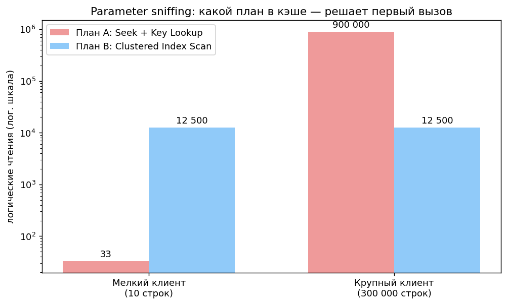
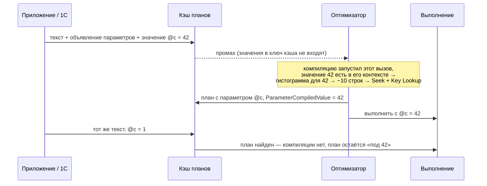

# 6. Параметры и кэш планов

[← Раздел 5](05-plans-operators.md) · [Оглавление](../README.md) · [Раздел 7 →](07-profiler-metrics.md)

Вопросы 56–60. Практика: [`08_parameter_sniffing_demo.sql`](../sql/08_parameter_sniffing_demo.sql), [`07_plan_cache_top_queries.sql`](../sql/07_plan_cache_top_queries.sql), [`05_query_store_practice.sql`](../sql/05_query_store_practice.sql) (сначала выполните [`03_plan_warnings_demo.sql`](../sql/03_plan_warnings_demo.sql): он создаёт базу WarningsDemo).

---

## 56. Parameter sniffing

> **Кратко.** При **компиляции** процедуры или параметризованного запроса (первой и каждой последующей перекомпиляции) оптимизатор «подсматривает» фактические значения параметров, оценивает число строк **по гистограмме именно для них** и кэширует план. Дальше этот план используется для **любых** значений. **Полезно**, когда данные распределены равномерно: план точный и компилируется один раз. **Вредно** при **перекосе**, когда разным значениям нужны разные планы, а какой из них окажется в кэше, решает «кто позвонил первым».

**Аналогия.** Диспетчер по первому заказу («конверт на соседнюю улицу») записывает на доске «на этом маршруте весь день ездим на велосипеде». Следующий заказ — 3 тонны кирпича — возят тем же велосипедом.

**Пример:** 1 млн строк (≈ 12 500 страниц), некрывающий индекс по ClientID. У клиента 7 — 10 заказов, у клиента 1 — 300 000.

| | Клиент 7 (10 строк) | Клиент 1 (300 000 строк) |
|---|---|---|
| План A: Seek + Key Lookup | ~33 чтения ✅ | ~900 000 чтений ❌ (в 70 раз больше всей таблицы) |
| План B: Clustered Index Scan | ~12 500 ❌ | ~12 500 ✅ |



**Почему проблема выглядит «случайной».** План живёт в кэше, пока его не выбросит одно из событий:
- обновление статистики (в том числе ночной регламент);
- изменение схемы;
- вытеснение или очистка кэша;
- `sp_recompile`.

Первый вызов после этого определяет новый план. Отсюда картина «вчера летало, сегодня встало» и ложное «лечение» перестроением индексов: REBUILD обновил статистику и сбросил план.

Sniffing влияет и на **memory grant**: план под 10 строк получит мало памяти (spill на 300 000), план под 300 000 — лишнюю (`RESOURCE_SEMAPHORE`).

### Где оптимизатор «подсматривает» значение

Значение берётся **из самого вызова**. Никакой отдельной «истории значений» у сервера нет: параметры приходят вместе с текстом запроса, и в момент компиляции оптимизатор их просто видит.

```sql
EXEC sp_executesql N'SELECT … WHERE ClientID = @c', N'@c int', @c = 42;   -- значение 42 в вызове
EXEC dbo.GetOrders @CustomerID = 42;                                       -- то же для процедуры
```

1С отправляет запросы именно так: `exec sp_executesql N'…', N'@P1 …', <значения>`.



«Подсматривание» — это оценка кардинальности при компиляции. Компиляцию запускает выполнение конкретного вызова, поэтому его значения оптимизатору известны. Он оценивает строки так, будто вместо `@c` в тексте стоит `42`. **Сам план при этом строится параметризованным**, иначе его нельзя было бы использовать для других значений.

**«При первой компиляции» — не совсем точно.** Точнее — «при **каждой** компиляции». Если план перекомпилируется (обновилась статистика, изменилась схема, план вытеснили из кэша), подсматриваются значения **того вызова, который вызвал перекомпиляцию** ([вопрос 14](02-query-pipeline.md#14-перекомпиляция-и-её-причины)). Поэтому план может смениться внезапно, например утром после ночного обновления статистики.

**Почему локальные переменные не подсматриваются.**

```sql
DECLARE @c int = 42;
SELECT … WHERE ClientID = @c;
```

Пакет компилируется **целиком до выполнения**, и в момент компиляции `SELECT` присваивание `@c = 42` ещё не выполнялось. Значение неизвестно, и оптимизатор оценивает по плотности ([вопрос 32](04-statistics.md#гистограмма-или-плотность)). Исключение — `OPTION (RECOMPILE)`: инструкция компилируется **в момент выполнения**, когда переменная уже заполнена, и её значение используется.

| Что | Подсматривается? | Откуда значение |
|---|---|---|
| Параметр процедуры | Да | Из вызова `EXEC`, при компиляции (первой и каждой перекомпиляции) |
| Параметр `sp_executesql` (в том числе запросы 1С) | Да | Из вызова, так же |
| Литерал при автопараметризации | Да | Из текста запроса, где литерал заменён параметром ([вопрос 16](02-query-pipeline.md#16-простая-и-принудительная-параметризация)) |
| Локальная переменная `DECLARE` | Нет | Неизвестно при компиляции → оценка по плотности |
| Локальная переменная + `OPTION (RECOMPILE)` | Да | Инструкция компилируется в момент выполнения, значение уже есть |

**Где увидеть подсмотренное значение** — `Parameter Compiled Value` в свойствах корневого SELECT, подробно в [вопросе 57](#57-диагностика). Воспроизведение — блоки 1–3 [`08_parameter_sniffing_demo.sql`](../sql/08_parameter_sniffing_demo.sql).

**Пример для 1С.** Регистр накопления «ТоварыНаСкладах», у измерения `Склад` установлено «Индексировать» (индекс «Склад + Период + Регистратор + НомерСтроки»). На центральном складе 90% движений, на остальных — единицы процентов.

```bsl
ВЫБРАТЬ Движения.Номенклатура, СУММА(Движения.Количество) КАК Количество
ИЗ РегистрНакопления.ТоварыНаСкладах КАК Движения
ГДЕ Движения.Склад = &Склад И Движения.Период МЕЖДУ &Начало И &Конец
СГРУППИРОВАТЬ ПО Движения.Номенклатура
```

Платформа отправит запрос через `sp_executesql` с параметром `@P1` для склада. Кто первым выполнит отчёт после перезапуска сервера или обновления статистики, тот и определит план:
- первым был **маленький склад** — Index Seek по складу + Key Lookup. Для центрального склада это миллионы Key Lookup;
- первым был **центральный** — Clustered Index Seek по диапазону периода (кластерный индекс начинается с периода), склад проверяется в Predicate. Для маленьких складов это чтение всех движений за период ради нескольких строк.

Хинт в запрос 1С не вставить. Что можно сделать: дополнительный покрывающий индекс (КОРП), чтобы убрать развилку на Key Lookup; Query Store (закрепить план или подсказку `RECOMPILE`); PSP-оптимизация SQL Server 2022 ([вопрос 58](#58-способы-борьбы-плюсы-и-минусы)).

---

## 57. Диагностика

1. **Parameter Compiled Value и Runtime Value.** Фактический план → корневой SELECT → `Parameter List`. **Compiled Value** — значение, под которое план построен, **Runtime Value** — значение текущего выполнения (есть только в фактическом плане). В XML это `<ColumnReference Column="@ClientID" ParameterCompiledValue="(7)" ParameterRuntimeValue="(1)"/>`. Значения разные, и есть огромное расхождение `Estimated` и `Actual` rows — это классика.
2. **План из кэша** содержит только `ParameterCompiledValue`: он показывает, **под какое значение** план построен.
3. **Разброс метрик одного плана в кэше:** `min_logical_reads` и `max_logical_reads`, `min/max_elapsed_time` в `sys.dm_exec_query_stats` отличаются на порядки (запрос 2 в [`07_plan_cache_top_queries.sql`](../sql/07_plan_cache_top_queries.sql)).
4. **Query Store:** отчёты *Queries With High Variation* и *Regressed Queries*, на *Plan Summary* несколько plan_id у одного query_id.
5. **Исключить ловушку ARITHABORT.** Быстрый запрос в SSMS ничего не доказывает: у SSMS свои SET-опции и **свой** план. Воспроизводите через `sp_executesql` с теми же типами параметров и SET-опциями приложения (`set_options` из `sys.dm_exec_plan_attributes`).

---

## 58. Способы борьбы: плюсы и минусы

| Способ | Как работает | Плюсы | Минусы | Когда |
|---|---|---|---|---|
| `OPTION (RECOMPILE)` | Инструкция компилируется при каждом вызове, план не кэшируется | Идеальный план под значение. Видит и локальные переменные. Упрощает `(@p IS NULL OR col = @p)` | CPU на компиляцию каждый раз | Редкие тяжёлые запросы, отчёты, «универсальные» поиски. **Не** для 1000 вызовов/с |
| `WITH RECOMPILE` у процедуры | Перекомпилируется вся процедура | Просто | Грубее, чем на одной инструкции | Редко |
| `OPTIMIZE FOR (@p = v)` | План всегда под указанное значение | Стабильно, без перекомпиляций | Нетипичные значения работают плохо. Устаревает с изменением данных | Известно «типичное» значение для 95% вызовов |
| `OPTIMIZE FOR UNKNOWN` / `USE HINT('DISABLE_PARAMETER_SNIFFING')` | Оценка по **плотности** (Rows × density) | Предсказуемо, не зависит от первого вызова | «Средне-плохой» план при сильном перекосе | Нужна стабильность, перекос умеренный |
| Локальная переменная | То же, что UNKNOWN | Работает везде | Неявно («уберут лишнюю переменную»). С RECOMPILE эффект пропадает | Устаревший приём, лучше явный хинт |
| **Разделение на разные процедуры** | Своя процедура и свой план на класс значений | Лучшие планы без компиляций | Дублирование кода, нужно знать границы классов | Критичные частые процедуры с 2–3 классами вызовов |
| **Покрывающий индекс** | Убирает саму развилку (Key Lookup) | Один план хорош для всех | Место, цена записи | Когда развилка из-за Lookup, **часто лучший выбор** |
| Query Store: Force Plan / Hints (2022) | Закрепить план или навесить хинт снаружи | Без изменения кода | Нужно пересматривать. Не помогает, если ни один план не хорош для всех | Код менять нельзя (в том числе 1С) |
| `PARAMETER_SNIFFING = OFF` на базу | UNKNOWN для всех запросов | Массово | Теряется польза sniffing везде | Крайняя мера |
| **PSP optimization** (SQL Server 2022, уровень 160) | До 3 вариантов плана на запрос по диапазонам кардинальности | Автоматически | Работает не для всех запросов (равенства по сильно перекошенным столбцам) | Проверить в первую очередь на 2022 |

> ⚠️ **Расхождение в источниках.** В одном из ответов «разделение» описано как IF/ELSE **внутри одной процедуры**. **Это не помогает:** при первом вызове компилируется вся процедура, **обе ветки** получают планы под одно и то же первое значение. Ветки нужно выносить в **отдельные процедуры** (или в `sp_executesql` с разным текстом, или ставить RECOMPILE на ветку).

**Экстренно, пока ищете решение:** `EXEC sp_recompile N'dbo.Proc'` или `DBCC FREEPROCCACHE (plan_handle)`. Это перезапуск лотереи, а не лечение. **Никогда** не выполняйте `DBCC FREEPROCCACHE` без параметра на рабочем сервере.

Все варианты на одних данных — [`08_parameter_sniffing_demo.sql`](../sql/08_parameter_sniffing_demo.sql).

> 1С: запросы платформы идут через `sp_executesql`, значит sniffing к ним полностью применим. Хинт в текст не вставить, поэтому остаются индексы (реквизит «Индексировать», переработка запроса и временных таблиц), регламентное обновление статистики, Query Store и PSP на SQL Server 2022 (если версия платформы поддерживает уровень совместимости 160 — проверьте по документации).

---

## 59. Тяжёлые запросы в кэше через DMV

> **Кратко.** `sys.dm_exec_query_stats` — накопленная статистика **по инструкциям** в кэше: выполнения, CPU, время, чтения, записи, min/max. `sys.dm_exec_sql_text(sql_handle)` — текст пакета, из которого инструкцию вырезают по `statement_start_offset` / `statement_end_offset`. `sys.dm_exec_query_plan(plan_handle)` — XML-план (**предполагаемый**).

```sql
SELECT TOP (20)
    qs.execution_count,
    qs.total_logical_reads,
    qs.total_logical_reads / qs.execution_count         AS avg_reads,
    qs.total_worker_time  / qs.execution_count / 1000.0 AS avg_cpu_ms,
    qs.total_elapsed_time / qs.execution_count / 1000.0 AS avg_ms,
    SUBSTRING(st.text, qs.statement_start_offset / 2 + 1,
        (CASE qs.statement_end_offset WHEN -1 THEN DATALENGTH(st.text)
              ELSE qs.statement_end_offset END - qs.statement_start_offset) / 2 + 1) AS stmt,
    qp.query_plan
FROM sys.dm_exec_query_stats qs
CROSS APPLY sys.dm_exec_sql_text(qs.sql_handle)    st
CROSS APPLY sys.dm_exec_query_plan(qs.plan_handle) qp
ORDER BY qs.total_logical_reads DESC;     -- или total_worker_time / total_elapsed_time / avg_*
```

Практика:
- сортировка по **суммарным** значениям находит то, что грузит сервер: часто это не один долгий запрос, а тот, что выполняется 50 000 раз по 200 мс. Сортировка по **средним** находит медленные сами по себе;
- `sys.dm_exec_procedure_stats` — то же по процедурам;
- группировка по `query_hash` собирает непараметризованные варианты одного запроса.

**Ограничения:**
- только то, что сейчас в кэше: после перезапуска, вытеснения или `RECOMPILE` данных нет;
- только завершённые выполнения (текущие смотрят в `sys.dm_exec_requests`);
- план оценочный, без фактических строк.

Для истории используют Query Store.

### Откуда взять план и сколько он хранится

| Источник | Какой план | Сколько хранится | Как достать |
|---|---|---|---|
| **Кэш планов** | Предполагаемый (без фактических строк) | Пока не вытеснен, не перекомпилирован, кэш не очищен. **Перезапуск сервера — пропадает** | `sys.dm_exec_query_plan(plan_handle)` — запрос выше |
| **Кэш + `LAST_QUERY_PLAN_STATS`** (SQL Server 2019+) | **Последний фактический**: Actual Rows, Executions | Так же, как кэш | `sys.dm_exec_query_plan_stats(plan_handle)` |
| **Query Store** | Предполагаемые, **вся история планов** запроса | В базе: **переживает перезапуск**, уезжает с бэкапом | `sys.query_store_plan.query_plan` ([вопрос 60](#60-query-store)) |
| **Profiler / XE**, сохранённый `.sqlplan` | Фактический (Showplan XML Statistics Profile / `query_post_execution_showplan`) | Это файл | [Вопрос 69а](08-1c-specifics.md#69а-практика-как-поймать-свой-запрос-1с-в-profiler-и-получить-его-план) |

```sql
-- Последний фактический план из кэша (SQL Server 2019+). Включается на базу, накладные расходы небольшие.
ALTER DATABASE SCOPED CONFIGURATION SET LAST_QUERY_PLAN_STATS = ON;

SELECT qs.execution_count, qs.last_execution_time, qps.query_plan
FROM sys.dm_exec_query_stats qs
CROSS APPLY sys.dm_exec_sql_text(qs.sql_handle) st
CROSS APPLY sys.dm_exec_query_plan_stats(qs.plan_handle) qps
WHERE st.text LIKE N'%_Document15050%' AND st.text NOT LIKE N'%dm_exec%';

-- История планов из Query Store (переживает перезапуск)
SELECT q.query_id, p.plan_id, rs.count_executions, rs.avg_logical_io_reads,
       TRY_CAST(p.query_plan AS xml) AS query_plan
FROM sys.query_store_query_text qt
JOIN sys.query_store_query q          ON q.query_text_id = qt.query_text_id
JOIN sys.query_store_plan p           ON p.query_id = q.query_id
JOIN sys.query_store_runtime_stats rs ON rs.plan_id = p.plan_id
WHERE qt.query_sql_text LIKE N'%_Document15050%';
```

**Ловушка для 1С.** Если выполнить скопированный SQL в SSMS, в кэше будет **отдельная** запись с другими SET-опциями (`ARITHABORT ON`). Это ваш план, а не план сервера 1С ([вопрос 13](02-query-pipeline.md#13-кэш-планов-когда-план-берётся-из-кэша-а-когда-компилируется)). Отличить записи можно по `sys.dm_exec_plan_attributes(plan_handle)` → `set_options` и по `execution_count`. Совпадение `QueryPlanHash` у обоих планов означает, что планы одинаковые.

---

## 60. Query Store

> **Кратко.** «Бортовой самописец» внутри **самой базы** (SQL Server 2016+, в 2022 включён по умолчанию для новых баз). Он хранит тексты запросов, **все их планы**, статистику выполнения по интервалам времени и ожидания. Данные переживают перезапуск и уезжают вместе с бэкапом. Умеет **закреплять план** за запросом (plan forcing), а с 2022 — навешивать хинты без изменения кода.

| Что хранит | Представление |
|---|---|
| Тексты | `sys.query_store_query_text` |
| Запросы (текст + контекст SET-опций + объект). Разные SET-опции дают **разные** query_id | `sys.query_store_query`, `sys.query_context_settings` |
| Все планы запроса, признак закрепления, ошибки закрепления | `sys.query_store_plan` |
| Метрики по интервалам: выполнения, длительность, CPU, чтения, записи, память, DOP, строки, tempdb; avg/min/max/stdev; тип завершения (в том числе отменённые по таймауту) | `sys.query_store_runtime_stats(_interval)` |
| Ожидания по категориям (2017+) | `sys.query_store_wait_stats` |
| Хинты и feedback (2022) | `sys.query_store_query_hints`, `sys.query_store_plan_feedback` |

Время хранится в **микросекундах**, объёмы — в **страницах по 8 КБ**.

**Настройки:**

```sql
ALTER DATABASE MyDb SET QUERY_STORE = ON
  (OPERATION_MODE = READ_WRITE, MAX_STORAGE_SIZE_MB = 2048, INTERVAL_LENGTH_MINUTES = 15,
   QUERY_CAPTURE_MODE = AUTO, SIZE_BASED_CLEANUP_MODE = AUTO, WAIT_STATS_CAPTURE_MODE = ON);

SELECT desired_state_desc, actual_state_desc, readonly_reason,
       current_storage_size_mb, max_storage_size_mb
FROM sys.database_query_store_options;   -- при переполнении ТИХО уходит в READ_ONLY!
```

**Отчёты SSMS** (папка Query Store у базы появляется после включения):
- Regressed Queries;
- Top Resource Consuming Queries;
- Queries With High Variation;
- Overall Resource Consumption;
- Query Wait Statistics;
- Queries With Forced Plans;
- Tracked Queries.

Справа в отчётах — **Plan Summary**: точки = план × интервал, цвет = plan_id. Там же кнопки Force/Unforce/Compare Plans.

**Как закрепить хороший план:**
1. Найти query_id: отчёт или представления. Нужен тот query_id, под которым работает **приложение** (помним про SET-опции).
2. Сравнить планы на длинном периоде: **максимум**, а не только среднее, число выполнений, ожидания.
3. **Убедиться, что план хорош для всех типичных значений.** Если ни один план не подходит всем (сильный перекос), закрепление — неверное лечение. Нужен индекс или переработка запроса. Упражнение в [`05_query_store_practice.sql`](../sql/05_query_store_practice.sql) показывает именно такой случай и лечит его покрывающим индексом.
4. `EXEC sp_query_store_force_plan @query_id = …, @plan_id = …;` (или кнопка Force Plan).
5. Проверить: новые точки идут закреплённым планом (галочка в отчёте), в фактическом плане на SELECT `Use plan = True`, `force_failure_count = 0`.
6. Периодически пересматривать решение.

**Механика закрепления:**
- это не «заморозка» XML: при каждой компиляции оптимизатор строит план **той же формы**. Оценки и грант при этом считаются заново;
- если форму построить нельзя (удалён индекс — `NO_INDEX`; `NO_PLAN`), запрос **не падает**, а тихо компилируется обычный план. Ошибка пишется в `last_force_failure_reason_desc` и в XE `query_store_plan_forcing_failed`.

**Автоматика и хинты:**
- `ALTER DATABASE CURRENT SET AUTOMATIC_TUNING (FORCE_LAST_GOOD_PLAN = ON)` (2017+, Enterprise / Azure): сервер сам закрепляет последний хороший план при регрессии и снимает закрепление, если не помогло. Рекомендации видны в `sys.dm_db_tuning_recommendations`;
- Query Store hints (2022): `EXEC sys.sp_query_store_set_hints @query_id = …, @query_hints = N'OPTION (RECOMPILE)';` (снять — `sp_query_store_clear_hints`). Это гибче закрепления: правило, а не зашитая форма;
- **Plan guides** — старый механизм (с 2005): хинт или `USE PLAN` привязывается к **посимвольно совпадающему** тексту и объявлению параметров (`sp_create_plan_guide`, `sp_create_plan_guide_from_handle`, проверка `sys.fn_validate_plan_guide`). Хрупкий, и Query Store имеет над ним приоритет.

> 1С: для баз 1С это один из немногих способов повлиять на план без изменения конфигурации. Особенности:
> - `QUERY_CAPTURE_MODE = AUTO` и запас по размеру: много похожих текстов (разное число параметров в `В (&Массив)`) дают разные query_id;
> - после обновления конфигурации или реструктуризации закрепления надо проверять (`NO_INDEX`, новые query_id);
> - запросы с `#tt` часто перекомпилируются, поэтому проверяйте `force_failure_count`.

---

[← Раздел 5](05-plans-operators.md) · [Оглавление](../README.md) · [Раздел 7 →](07-profiler-metrics.md)
