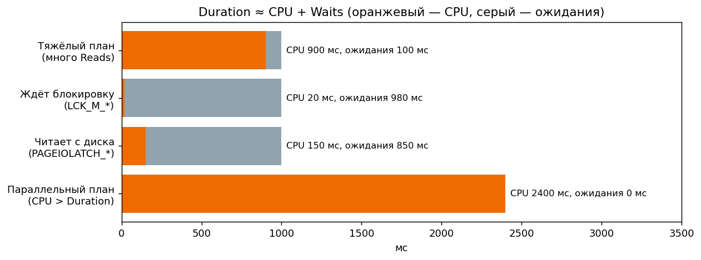

# 7. Профайлер, трассы и метрики

[← Раздел 6](06-params-cache.md) · [Оглавление](../README.md) · [Раздел 8 →](08-1c-specifics.md)

Вопросы 61–67. Практика: [`12_extended_events_long_queries.sql`](../sql/12_extended_events_long_queries.sql), [`09_waits_and_blocking.sql`](../sql/09_waits_and_blocking.sql).

---

## 61. SQL Server Profiler: для чего он и что выбрать для поиска долгих запросов

> **Кратко.** Profiler — графическая утилита трассировки (движок SQL Trace). Она показывает, что **реально** выполняется на сервере: текст, длительность, ресурсы, план, блокировки. Для долгих запросов включают **RPC:Completed** + **SQL:BatchCompleted**, столбцы **TextData, Duration, CPU, Reads, Writes** + контекст, фильтры по **Duration/Reads** и базе. План берут событием **Showplan XML** — коротко и с жёстким фильтром. С SQL Server 2012 Profiler объявлен устаревшим, замена — Extended Events.

**События:**

| Событие | Когда | Замечание |
|---|---|---|
| **RPC:Completed** (Stored Procedures) | Завершился RPC-вызов: `sp_executesql`, `sp_execute`, процедура | **Для 1С — основное**: платформа шлёт запросы через `sp_executesql` |
| **SQL:BatchCompleted** (TSQL) | Завершился пакет без RPC | Запросы из SSMS, служебные команды |
| SP:StmtCompleted / SQL:StmtCompleted | Отдельная инструкция внутри пакета или процедуры | Дорого, включать прицельно |
| **Showplan XML** | План (оценочный) | |
| **Showplan XML Statistics Profile** | **Фактический** план | Самое полезное и самое дорогое |
| Showplan XML For Query Compile | План при компиляции | Для разбора перекомпиляций |
| Lock:Timeout, Deadlock graph, Blocked process report | Блокировки | |

Почему **Completed**, а не Starting: Duration, CPU, Reads и Writes заполняются только по завершении. Starting полезен, чтобы поймать запрос, который так и не закончился.

**Столбцы:**

| Столбец | Смысл | Единицы |
|---|---|---|
| Duration | Полное время, включая ожидания | В файле/SQL Trace — мкс (2005+). В GUI по умолчанию мс (настраивается) |
| CPU | Процессорное время | мс (при параллелизме может быть больше Duration) |
| Reads | **Логические** чтения | Страницы по 8 КБ. 1 000 000 ≈ 7,6 ГБ через память |
| Writes | Физические записи | Страницы. Большие у SELECT → spill или `#temp` |
| RowCounts | Строки | Сравнивать с Reads |
| TextData, SPID, StartTime/EndTime, DatabaseName, ApplicationName, HostName, LoginName, ObjectName, Error | Контекст | У 1С HostName — сервер приложений, ApplicationName — «1CV83 Server» или похожее |

**Фильтры** (Column Filters):
- `Duration ≥ порог` (проверьте единицы) и/или `Reads ≥ 50 000`: ловит «быстрые за счёт кэша», но тяжёлые запросы;
- `DatabaseName`, `ApplicationName LIKE 1CV8%`;
- флажок *Exclude rows that do not contain values*.

**Порядок работы:**
1. RPC:Completed + SQL:BatchCompleted с фильтрами → найти тяжёлые запросы.
2. Добавить Stmt-события, чтобы найти медленную инструкцию.
3. Коротко включить Showplan XML Statistics Profile с фильтром по SPID, или лучше воспроизвести запрос в SSMS.
4. Трассу загрузить в таблицу (`fn_trace_gettable`) и агрегировать по тексту.


Практический пример для 1С — как отфильтровать трассу по SPID своего сеанса и получить фактический план своего запроса: [вопрос 69а](08-1c-specifics.md#69а-практика-как-поймать-свой-запрос-1с-в-profiler-и-получить-его-план).
---

## 62. Почему Profiler нельзя без ограничений запускать на рабочем сервере

> **Кратко.** GUI-трасса передаёт **каждое событие по сети** в окно программы. При большом потоке рабочие потоки SQL Server **ждут**, пока клиент заберёт события: сервер замедляется, либо события теряются (*Trace Skipped Records*). SQL Trace формирует событие целиком и только потом фильтрует. Showplan- и Stmt-события сами по себе очень дорогие, а фильтр по Duration у Showplan не работает: у этих событий нет Duration.

**Как снизить нагрузку:**
1. **Серверная трасса** вместо GUI. В Profiler на тесте: *File → Export → Script Trace Definition*, затем на сервере `sp_trace_create` (файл `.trc` на локальном диске, `@maxfilesize`, rollover) → `sp_trace_setevent` → `sp_trace_setfilter` → `sp_trace_setstatus 1/0/2`.
2. Минимум событий (Completed) и столбцов, жёсткие фильтры по базе, длительности, приложению.
3. Без Stmt и Showplan на постоянной основе. План — точечно и на минуты.
4. Короткое окно сбора (5–15 минут воспроизведения), ограничение размера файлов.
5. Ещё лучше — **Extended Events**.

---

## 63. Extended Events и чем они лучше Profiler

> **Кратко.** Встроенная в SQLOS система событий (2008+, GUI в SSMS с 2012). **Предикат проверяется в момент срабатывания события, до сбора дорогих данных**, запись в приёмник **асинхронная**. Поэтому нагрузка минимальна, и сессию можно держать на проде неделями. Событий больше тысячи против ~180 у Profiler, приёмники гибкие, а сессия **system_health** работает всегда.

| Элемент сессии | Что это | Аналог в Profiler |
|---|---|---|
| Event | `rpc_completed`, `sql_batch_completed`, `sql_statement_completed`, `query_post_execution_showplan`, `xml_deadlock_report`, `wait_info`, `sort_warning`… | Event |
| Fields | Всегда есть у события: duration, cpu_time, logical_reads, writes, row_count | Data columns |
| Actions | Дополнительно «доснять»: sql_text, database_name, client_app_name, session_id, plan_handle | Data columns |
| Predicate | Условие отбора | Filters |
| Target | `event_file` (.xel), `ring_buffer`, `histogram`, `event_counter`, `pair_matching` | Файл / таблица / окно |

**Преимущества:**
- низкие накладные расходы (ранняя фильтрация, асинхронность, собирается только заказанное);
- события, которых нет в Profiler: ожидания конкретного запроса, spill, Query Store, Always On, columnstore;
- агрегация прямо на сервере (`histogram`, `event_counter`) и поиск «непарных» событий (`pair_matching` — начатые, но не завершённые);
- **system_health** уже хранит графы **всех дедлоков**: ничего не нужно включать заранее;
- *Track Causality* связывает цепочки событий;
- Profiler устарел и **не работает в Azure SQL Database**.

**Недостатки:**
- порог входа выше;
- анализ через XML/XQuery (впрочем, `.xel` открывается в SSMS как таблица);
- Replay и DTA исторически завязаны на трассы.

Соответствие событий: RPC:Completed → `rpc_completed`, SQL:BatchCompleted → `sql_batch_completed`, SP/SQL:StmtCompleted → `sp_/sql_statement_completed`, Showplan XML Statistics Profile → `query_post_execution_showplan`, Deadlock graph → `xml_deadlock_report`, Blocked process report → `blocked_process_report`. **В XE duration и cpu_time — в микросекундах.**

Готовая сессия и её разбор — [`12_extended_events_long_queries.sql`](../sql/12_extended_events_long_queries.sql).

---

## 64. Duration, CPU и Reads. Большое Duration при маленьком CPU

> **Кратко.** **Reads** — объём работы (страницы). **CPU** — сколько сервер «думал». **Duration** — сколько ждал пользователь. **Duration ≈ CPU + ожидания.** Большое Duration при маленьком CPU и Reads означает, что запрос **в основном ждал**, и дело не в плане.



| Картина | Что означает | Куда смотреть |
|---|---|---|
| Duration ≫ CPU, Reads маленькие | Ожидания: блокировка (`LCK_M_*`), диск (`PAGEIOLATCH_*`), сеть/клиент (`ASYNC_NETWORK_IO`), грант памяти (`RESOURCE_SEMAPHORE`), латчи | Ожидания и блокировки (вопросы 66–67), а не план |
| Reads огромные | Проблема плана: сканы, неверные соединения, Key Lookup, статистика | План |
| CPU высокий при умеренных Reads | Вычисления, сортировки, хеши, UDF, неявные преобразования, **компиляции** | План, перекомпиляции |
| CPU > Duration | Параллельный план | DOP, нужен ли параллелизм |
| Writes большие у SELECT | Spill или запись в `#temp` | Оценки, гранты |
| Быстро в SSMS, медленно в приложении | Другие SET-опции → другой план; или клиент медленно забирает строки | Вопросы 13, 57 |


Как по этим метрикам расследовать конкретные случаи — [11 разобранных кейсов](11-case-studies.md) с картой сигнатур «соотношение метрик → вероятная причина».
---

## 65. `SET STATISTICS IO` и `SET STATISTICS TIME`

> **Кратко.** Реальные метрики выполнения во вкладке *Messages*. **IO** — по каждой таблице: `Scan count`, **`logical reads`**, `physical reads`, `read-ahead reads`, `lob …`, а также `Worktable`/`Workfile` (tempdb). **TIME** — `parse and compile time` и `execution times`: CPU time и elapsed time в мс.

```text
Table 'Orders'. Scan count 1, logical reads 1250, physical reads 3, read-ahead reads 1244, lob logical reads 0 ...
Table 'Worktable'. Scan count 0, logical reads 0 ...
SQL Server parse and compile time: CPU time = 16 ms, elapsed time = 226 ms.
SQL Server Execution Times:        CPU time = 16 ms, elapsed time = 148 ms.
```

**Как пользоваться:**
- сравнивать варианты по **logical reads**: они не зависят от прогретости кэша и загрузки сервера. Время — вторично;
- `physical reads` > 0 при первом запуске и 0 при втором — это прогрев, а не улучшение;
- Worktable/Workfile с чтениями означают spill, Spool, Merge many-to-many или hash-операции в tempdb;
- большой compile time — признак дорогой оптимизации: огромный запрос, `RECOMPILE` на частом запросе;
- у параллельного запроса CPU time > elapsed time.

Удобно вставлять вывод в statisticsparser.com. В PostgreSQL аналог — `EXPLAIN (ANALYZE, BUFFERS)`.

---

## 66. Ожидания (wait stats)

> **Кратко.** Когда задача не может работать дальше, она встаёт в ожидание конкретного ресурса, и SQL Server считает время по **типам ожиданий**. `sys.dm_os_wait_stats` накапливает их по серверу, `sys.dm_exec_requests` / `sys.dm_os_waiting_tasks` показывают текущие, `sys.dm_exec_session_wait_stats` — по сессии, а WaitStats в фактическом плане — по запросу. Смотрят **на что** уходит время, отбрасывая фоновые «безобидные» ожидания.

| Ожидание | Что означает | Типичная причина / действие |
|---|---|---|
| **PAGEIOLATCH_SH/EX** | Ждём, пока страница прочитается с диска в буферный пул | Много физических чтений: сканы больших таблиц, мало памяти, медленный диск. Сначала сократить чтения (индексы, запросы), потом железо |
| **LCK_M_*** (`LCK_M_S`, `LCK_M_X`, `LCK_M_U`, `LCK_M_IX`…) | Ждём блокировку, которую держит другая транзакция | Длинные транзакции, эскалация, отсутствие индекса под условие UPDATE/DELETE (блокируется больше строк). Искать голову цепочки |
| **CXPACKET / CXCONSUMER** | Синхронизация потоков параллельного запроса | Сам по себе не диагноз. Перекос между потоками, лишний параллелизм на лёгких запросах (cost threshold), неверные оценки. CXCONSUMER обычно безвреден |
| **SOS_SCHEDULER_YIELD** | Задача отработала квант CPU и уступила планировщик | Нагрузка на CPU: сканы в памяти, тяжёлые вычисления, функции |
| WRITELOG | Запись журнала при COMMIT | Медленный диск журнала, много мелких транзакций |
| RESOURCE_SEMAPHORE | Очередь за memory grant | Завышенные гранты (переоценка) |
| ASYNC_NETWORK_IO | Клиент медленно забирает результат | Приложение читает построчно, большие выборки, сеть |
| PAGELATCH_* (не IO!) | Конкуренция за страницу **в памяти** | Горячая последняя страница, конкуренция в tempdb |
| THREADPOOL | Нет свободных рабочих потоков | Параллелизм, блокировки держат потоки |

**Приёмы:**
- смотреть долю ожидания в общем времени и `signal_wait_time_ms`: большая доля сигнальных ожиданий означает нехватку CPU;
- мерить «окно»: снимок до и после, или `DBCC SQLPERF('sys.dm_os_wait_stats', CLEAR)` на тесте;
- связывать ожидания с конкретными запросами через Query Store (`sys.query_store_wait_stats`) или XE (`wait_completed`).

Скрипт с фильтром фоновых ожиданий — [`09_waits_and_blocking.sql`](../sql/09_waits_and_blocking.sql).

---

## 67. ★ Как отличить медленный запрос от запроса, который ждёт блокировку

> **Кратко.** Медленный запрос **работает**: CPU и Reads растут вместе с Duration, ожидания в основном `PAGEIOLATCH`, `SOS_SCHEDULER_YIELD`, `CX*`, а `blocking_session_id = 0`. Заблокированный запрос **спит**: Duration растёт, CPU и Reads стоят на месте, `wait_type = LCK_M_*`, `blocking_session_id <> 0`.

| Признак | Медленный | Ждёт блокировку |
|---|---|---|
| Duration vs CPU | CPU растёт пропорционально | CPU ≈ 0, Duration растёт |
| Logical reads между двумя снимками `sys.dm_exec_requests` | Растут | Не меняются |
| `wait_type` | PAGEIOLATCH_*, SOS_SCHEDULER_YIELD, CXPACKET или пусто (выполняется) | LCK_M_* |
| `blocking_session_id` | 0 | ID блокирующей сессии |
| Live Query Statistics | Счётчики строк движутся | Движение остановилось на операторе чтения |
| WaitStats фактического плана | I/O, CPU, параллелизм | LCK_M_* |
| Ретроспективно | Много Reads/CPU в трассе | Blocked process report (`blocked process threshold`), system_health, Query Store wait category *Lock* |

**Что делать:**
- **медленному** запросу нужна оптимизация плана;
- у **заблокированного** нужно найти **голову цепочки** (`sys.dm_os_waiting_tasks`, `blocking_session_id`, кто кого держит) и лечить её: сократить транзакцию, добавить индекс под условие изменения, пересмотреть порядок доступа, уровень изоляции (RCSI), в 1С — управляемые блокировки.

Бывает и то и другое вместе: медленный запрос внутри длинной транзакции держит блокировки и тормозит других.

Демонстрация в двух окнах — блок 5 [`09_waits_and_blocking.sql`](../sql/09_waits_and_blocking.sql).

---

[← Раздел 6](06-params-cache.md) · [Оглавление](../README.md) · [Раздел 8 →](08-1c-specifics.md)
