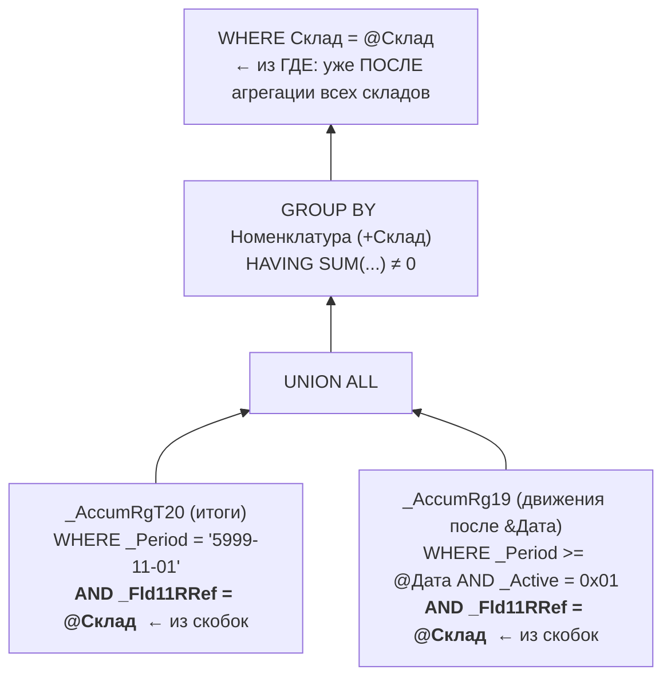

# 8. Специфика 1С

[← Раздел 7](07-profiler-metrics.md) · [Оглавление](../README.md) · [Раздел 9 →](09-practice.md)

Вопросы 68–78 и дополнительный 69а. Практика: [`../1c/logcfg.xml`](../1c/logcfg.xml), [`12_extended_events_long_queries.sql`](../sql/12_extended_events_long_queries.sql).

> Номера таблиц и полей в примерах (`_Reference12`, `_Fld230` и т.п.) условные. В каждой базе они свои.

---

## 68. Как запрос 1С транслируется в SQL. Как понять объект по имени таблицы

> **Кратко.** СУБД ничего не знает о языке 1С. Платформа на сервере 1С разбирает запрос, **подставляет RLS**, **раскрывает виртуальные таблицы** в подзапросы к таблицам движений и итогов, превращает **разыменование через точку в LEFT JOIN**, временные таблицы — в `#tt`, параметры — в `@P1…`, и отправляет T-SQL через **`sp_executesql`**.


```bsl
ВЫБРАТЬ Док.Ссылка, Док.Контрагент.ИНН КАК ИНН
ИЗ Документ.РеализацияТоваров КАК Док
ГДЕ Док.Дата >= &НачалоПериода И Док.Проведен
```

```sql
exec sp_executesql N'SELECT T1._IDRRef, T2._Fld567
FROM dbo._Document45 T1
LEFT OUTER JOIN dbo._Reference12 T2 ON T1._Fld230RRef = T2._IDRRef
WHERE T1._Date_Time >= @P1 AND T1._Posted = 0x01',
N'@P1 datetime2(3)', '4026-01-01 00:00:00'
```

Что видно в этом SQL:
- булево хранится как `binary(1)` и сравнивается с `0x01`;
- **смещение дат +2000 лет** (4026 вместо 2026) в базах MS SQL, созданных с этим режимом;
- текущие итоги регистров лежат с датой **5999-11-01** (3999-11-01 в терминах 1С).

**Префиксы таблиц:**

| Префикс | Объект | Префикс | Объект |
|---|---|---|---|
| `_Reference` | Справочник | `_InfoRg` | Регистр сведений |
| `_Document` | Документ | `_InfoRgSL` / `_InfoRgSF` | Срез последних / первых (если включён) |
| `_DocumentJournal` | Журнал документов | `_AccumRg` | Регистр накопления — **движения** |
| `_Enum` | Перечисление | `_AccumRgT` | Регистр накопления — **итоги остатков** (свой номер!) |
| `_Chrc` | ПВХ | `_AccumRgTn` | Итоги оборотного регистра |
| `_Acc` | План счетов | `_AccumRgOpt` | Настройки итогов |
| `_CKinds` | План видов расчёта | `_AccRg`, `_AccRgAT…`, `_AccRgED` | Регистр бухгалтерии: движения, итоги, субконто |
| `_Node` | План обмена | `_CalcRg` | Регистр расчёта |
| `_BPr`, `_Task` | Бизнес-процесс, задача | `_Seq` | Последовательность |
| `_Const` | Константа | `…_VT…` | Табличная часть (`_Document45_VT230`) |
| `…ChngR…` | Регистрация изменений | Config, Params, DBSchema, _YearOffset… | Системные, не трогать |

**Поля:**
- `_IDRRef` — ссылка (binary(16));
- `_Version`, `_Marked`, `_Code`, `_Description`, `_ParentIDRRef`, `_OwnerIDRRef`;
- `_Folder` — ЭтоГруппа, **инвертировано**: `0x00` — группа;
- `_Date_Time`, `_Number`, `_Posted`;
- в регистрах: `_Period`, `_RecorderTRef` + `_RecorderRRef`, `_LineNo`, `_Active`, `_RecordKind` (0 — приход, 1 — расход), `_Splitter`;
- реквизиты, измерения и ресурсы: `_FldN` (примитив), `_FldNRRef` (ссылка одного типа);
- **составной тип** раскладывается на колонки `_FldN_TYPE` (0x01 Неопределено, 0x02 Булево, 0x03 Число, 0x04 Дата, 0x05 Строка, 0x08 Ссылка), `_L`, `_N`, `_T`, `_S`, `_RTRef` (номер таблицы, hex: `0x0000002D` = 45) и `_RRRef`.

**Точное соответствие** даёт только `ПолучитьСтруктуруХраненияБазыДанных(, Истина)`. Номера выдаются при реструктуризации и **в разных базах разные**:

```bsl
Структура = ПолучитьСтруктуруХраненияБазыДанных(, Истина);   // Истина — имена в терминах СУБД
Для Каждого Строка Из Структура Цикл
    Если Строка.ИмяТаблицыХранения = "_Reference45" Тогда
        Сообщить(Строка.ИмяТаблицы + " — " + Строка.Назначение);
        Для Каждого Поле Из Строка.Поля Цикл
            Сообщить("  " + Поле.ИмяПоляХранения + " = " + Поле.ИмяПоля);
        КонецЦикла;
    КонецЕсли;
КонецЦикла;
```

Раздел `ИТОГИ` запроса СУБД не выполняет: платформа строит для него отдельные запросы или считает сама.

---

## 69. Как получить SQL-текст и план запроса 1С

> **Кратко.** Три инструмента видят запрос с трёх сторон, и их используют **цепочкой**. **Замер производительности** показывает, *какая строка кода* медленная и сколько раз выполнялась. **Технологический журнал** (`DBMSSQL` + `plansql`) даёт *какой SQL* ушёл, *откуда* в коде (`Context`), длительность, план и SPID (`dbpid`). **Profiler / Extended Events** показывают, *как SQL Server* выполнил запрос: Reads, CPU, Writes, графический фактический план. Мост между ТЖ и СУБД: **`dbpid` = SPID**.

| Инструмент | Сторона | Даёт | Ограничения |
|---|---|---|---|
| Замер производительности (отладчик) | Код 1С | Время и количество по строкам. Запрос в цикле виден сразу (быстрая строка × 10 000) | Нужна отладка, тестовая копия. Не показывает Reads и план СУБД (в новых версиях может показывать текст и план запроса, если включён сбор планов) |
| Технологический журнал (`logcfg.xml`) | Сервер 1С | `Sql`, `planSQLText`, `Context` (модуль:строка), `Rows`, `dbpid`, `Usr`, `Trans`, длительность | `plansql` нагружает СУБД: включать ненадолго. Нужны фильтры, иначе гигабайты логов |
| Profiler / XE | СУБД | Reads, CPU, Writes, Estimated/Actual rows, графический план | Не знает, из какого места кода запрос |
| Кэш планов / Query Store | СУБД | Топ тяжёлых запросов без предварительной настройки, история планов | Оценочные планы |

**Настройка ТЖ** (готовый файл — [`../1c/logcfg.xml`](../1c/logcfg.xml)):

```xml
<config xmlns="http://v8.1c.ru/v8/tech-log">
  <log location="D:\1C_TechLog\LongQueries" history="24">
    <event>
      <eq property="name" value="DBMSSQL"/>          <!-- PostgreSQL: DBPOSTGRS -->
      <eq property="p:processName" value="MyBase1C"/>
      <ge property="duration" value="1000000"/>      <!-- единицы зависят от версии платформы -->
    </event>
    <property name="all"/>
  </log>
  <plansql/>                                          <!-- элемент верхнего уровня -->
</config>
```

Для MS SQL `planSQLText` — это текстовый план **с фактическими значениями**: Rows и Executes по операторам, аналог `SET STATISTICS PROFILE`. Estimated в нём нет. Событие `SDBL` показывает запрос на внутреннем языке, до трансляции в SQL.

**Воспроизведение в SSMS — ловушки:**
1. Выполнять **как `sp_executesql`** с теми же типами параметров. Если подставить литералы, будет другой план.
2. Выставить SET-опции соединения 1С, прежде всего `SET ARITHABORT OFF`. Иначе в SSMS будет свой план.
3. Сначала создать и заполнить `#tt` из того же пакета (одинаковый dbpid, близкое время).
4. Даты со смещением (`4026-…`) не «исправлять».
5. Сравнивать по logical reads, а не по времени (кэш данных прогрет).


Пошаговая инструкция «поймать свой запрос в Profiler по SPID через менеджер временных таблиц» — [вопрос 69а](#69а-практика-как-поймать-свой-запрос-1с-в-profiler-и-получить-его-план).
---

## 69а. Практика: как поймать свой запрос 1С в Profiler и получить его план

> **Задача.** На рабочей (или копии рабочей) базе выполнить свой запрос из 1С, поймать именно его в SQL Server Profiler, отбросив тысячи чужих запросов, и получить предполагаемый и фактический план.

> **Кратко.** Сеанс 1С **не привязан** к одному соединению с СУБД: рабочий процесс берёт соединения из пула, и SPID меняется от вызова к вызову. Но пока в сеансе жив **менеджер временных таблиц** с созданной временной таблицей, платформа держит за сеансом **одно и то же соединение**, ведь временная таблица `#tt` существует только в нём. Поэтому:
> 1. Создаём менеджер временных таблиц и держим его открытым.
> 2. В консоли кластера смотрим номер «Соединение с СУБД» — это SPID.
> 3. В Profiler ставим фильтры по имени базы и этому SPID и включаем события с текстом, метриками и планами.
> 4. Выполняем исследуемый запрос в том же сеансе и получаем в трассе только свои события.

### Шаг 1. Зафиксировать соединение с СУБД

Внешняя обработка с обычной формой, запущенная в **толстом клиенте** (так в исходной инструкции). Переменная менеджера объявляется **в модуле формы или обработки**, а не внутри процедуры. Тогда она живёт, пока обработка открыта.

```bsl
Перем МВТ; // переменная модуля: живёт, пока открыта обработка

Процедура ЗафиксироватьСоединение() Экспорт
    МВТ = Новый МенеджерВременныхТаблиц;
    Запрос = Новый Запрос("ВЫБРАТЬ 1 КАК Поле ПОМЕСТИТЬ ВТ_Якорь");
    Запрос.МенеджерВременныхТаблиц = МВТ;
    Запрос.Выполнить();   // в СУБД создана #tt, соединение закреплено за сеансом
КонецПроцедуры

Процедура ОсвободитьСоединение() Экспорт
    МВТ = Неопределено;   // или просто закрыть обработку
КонецПроцедуры
```

- Обработка должна оставаться открытой **всё время отладки**. Закрыли — менеджер уничтожен, соединение вернулось в пул, и SPID может достаться другому сеансу.
- В **тонком клиенте** (управляемая форма) переменные серверного контекста формы между серверными вызовами не сохраняются, и приём в таком виде не работает. Там используйте технологический журнал: событие `DBMSSQL` со свойством `dbpid` ([вопрос 69](#69-как-получить-sql-текст-и-план-запроса-1с)).
- Нужен клиент-серверный вариант на MS SQL Server. В файловой базе СУБД SQL Server нет.

### Шаг 2. Узнать SPID

В **консоли администрирования серверов 1С**: кластер → информационные базы → нужная база → **Сеансы**. Найти свой сеанс (пользователь, приложение «Толстый клиент») и посмотреть колонку **«Соединение с СУБД»**. Это и есть SPID в SQL Server (например, 375). Если колонки не видно, включите её в настройке колонок списка.

Проверить со стороны SQL Server, что это действительно соединение сервера 1С к нужной базе:

```sql
SELECT session_id, login_name, host_name, program_name, DB_NAME(database_id) AS db, status, last_request_end_time
FROM sys.dm_exec_sessions
WHERE session_id = 375;   -- подставьте свой SPID
```

### Шаг 3. Настроить трассу в Profiler

SSMS → «Сервис» → **SQL Server Profiler** → подключиться к серверу → окно «Свойства трассировки» → вкладка **«Выбор событий»**.

1. Установить флажки **«Показать все события»** и **«Показать все столбцы»**. Без второго флажка нужных для фильтра столбцов (`SPID`, `DatabaseName`) может не быть в списке.
2. **Фильтры** («Фильтры столбцов…», или двойной щелчок по заголовку столбца):
   - `DatabaseName` → «Похоже на» → имя базы на SQL Server (не имя информационной базы 1С, а имя базы в СУБД);
   - `SPID` → «Равно» → номер из шага 2.
3. **События:**

   | Группа | Событие | Зачем |
   |---|---|---|
   | Stored Procedures | **RPC:Completed** | Главное для 1С: запросы приходят как `sp_executesql`. Дают TextData, Duration, CPU, Reads, Writes, RowCounts |
   | TSQL | **SQL:BatchCompleted** | Пакеты без RPC: служебные команды, создание временных таблиц |
   | Performance | **Showplan XML** | Предполагаемый план |
   | Performance | **Showplan XML Statistics Profile** | **Фактический** план: реальные строки, выполнения, предупреждения |
   | TSQL / Stored Procedures | SQL:StmtCompleted, SP:StmtCompleted — по желанию | Метрики отдельных инструкций пакета |

4. **Убрать лишнее**: снять «Показать все события» и отключить группу **Security Audit** (Audit Login / Audit Logout) и Sessions → ExistingConnection. Они только засоряют трассу.
5. Нажать **«Запустить»**.

### Шаг 4. Выполнить запрос и прочитать результат

1. В **том же сеансе 1С** (в той же сессии толстого клиента, например через консоль запросов) выполните исследуемый запрос или действие: проведение документа, формирование отчёта.
2. В трассе появятся события только вашего соединения:
   - **RPC:Completed** с текстом `exec sp_executesql N'SELECT … FROM dbo._Document33 T1 LEFT OUTER JOIN dbo._Reference25 T2 …', N'@P1 varbinary(16)', 0x…` — это SQL-текст запроса 1С. Рядом метрики Duration, CPU, Reads, Writes;
   - **Showplan XML** / **Showplan XML Statistics Profile** — при выделении строки план отображается в нижней панели графически.
3. Сохранить план для разбора в SSMS: правой кнопкой по строке Showplan → **«Извлечь данные события»** (Extract Event Data) → файл `.sqlplan`. Или «Файл → Экспорт → Извлечь события SQL Server → Извлечь события Showplan…» для всех планов трассы.
4. Разобрать план: расшифровать таблицы через `ПолучитьСтруктуруХраненияБазыДанных()` ([вопрос 68](#68-как-запрос-1с-транслируется-в-sql-как-понять-объект-по-имени-таблицы)), сравнить оценки и факт, найти дорогие операторы ([вопросы 55а](05-plans-operators.md#55а-анализ-плана-выполнения-по-стоимости-операторов), [47а](05-plans-operators.md#47а-признаки-неэффективного-join-в-плане-и-что-с-ними-делать)).
5. **Остановить трассу** и закрыть обработку, чтобы освободить соединение.

### Предостережения

- **Showplan XML Statistics Profile — одно из самых дорогих событий** ([вопрос 62](07-profiler-metrics.md#62-почему-profiler-нельзя-без-ограничений-запускать-на-рабочем-сервере)). На рабочем сервере включайте его **только с фильтром по SPID** и на минуты. У Showplan-событий нет Duration, поэтому фильтр по длительности их не ограничивает.
- Для Profiler нужно право **ALTER TRACE** (или sysadmin), для консоли кластера — права администратора кластера.
- Фактический план в трассе может отличаться от плана «обычного» пользователя: другие SET-опции, RLS под другим пользователем, другое значение параметра при компиляции. Для проблем конкретного пользователя проверяйте запрос под его учётной записью.
- После закрытия обработки SPID переходит к другим сеансам. Не оставляйте трассу с этим фильтром включённой.

### То же через Extended Events

Современная замена Profiler с меньшими накладными расходами ([вопрос 63](07-profiler-metrics.md#63-extended-events-и-чем-они-лучше-profiler)): тот же фильтр по SPID, просмотр в SSMS через **Watch Live Data**, у события плана есть вкладка Query Plan.

```sql
CREATE EVENT SESSION [My1CQuery] ON SERVER
ADD EVENT sqlserver.rpc_completed          (ACTION (sqlserver.sql_text) WHERE sqlserver.session_id = 375),
ADD EVENT sqlserver.sql_batch_completed    (ACTION (sqlserver.sql_text) WHERE sqlserver.session_id = 375),
ADD EVENT sqlserver.query_post_execution_showplan (WHERE sqlserver.session_id = 375)   -- фактический план
ADD TARGET package0.ring_buffer
WITH (MAX_DISPATCH_LATENCY = 1 SECONDS);
GO
ALTER EVENT SESSION [My1CQuery] ON SERVER STATE = START;
-- SSMS: Management → Extended Events → Sessions → My1CQuery → Watch Live Data
-- ALTER EVENT SESSION [My1CQuery] ON SERVER STATE = STOP;
-- DROP EVENT SESSION [My1CQuery] ON SERVER;
```

### Какой способ выбрать

| Способ | Когда удобен |
|---|---|
| **МВТ + фильтр по SPID** (этот вопрос) | Нужно поймать **свой** запрос на нагруженной базе и получить его фактический план, есть толстый клиент и доступ к консоли кластера |
| **Технологический журнал** (`DBMSSQL`, `plansql`, `dbpid`, [вопрос 69](#69-как-получить-sql-текст-и-план-запроса-1с)) | Любой клиент, в том числе тонкий и веб; нужны контекст кода (`Context`) и запросы других пользователей |
| **Profiler / XE с фильтром по длительности и чтениям** ([вопросы 61–63](07-profiler-metrics.md#61-sql-server-profiler-для-чего-он-и-что-выбрать-для-поиска-долгих-запросов)) | Найти тяжёлые запросы всех пользователей за период |
| **Кэш планов / Query Store** ([вопросы 59–60](06-params-cache.md#59-тяжёлые-запросы-в-кэше-через-dmv)) | Без предварительной настройки, по уже выполненным запросам |


Что делать с пойманным планом дальше — пошаговый разбор реального плана в [разделе 12](12-real-plan-walkthrough.md).
---

## 70. Параметры виртуальных таблиц — в скобках, а не в ГДЕ

> **Кратко.** Виртуальная таблица — это **подзапрос** из двух частей (итоги + движения), соединённых `UNION ALL`, с `GROUP BY` / `HAVING` сверху. **Условие в скобках** платформа вставляет в `WHERE` **каждой части**: строки отсекаются при чтении физических таблиц, можно использовать индекс. **Условие в ГДЕ** стоит **над группировкой**: сначала считаются остатки по всем данным, потом лишнее отбрасывается.



```sql
-- В скобках: Остатки(&Дата, Склад = &Склад)
SELECT T2.Fld10RRef, SUM(T2.Bal) FROM (
    SELECT T3._Fld10RRef AS Fld10RRef, T3._Fld12 AS Bal
    FROM dbo._AccumRgT20 T3
    WHERE T3._Period = '5999-11-01' AND T3._Fld11RRef = @P2 AND T3._Fld12 <> 0
    UNION ALL
    SELECT T4._Fld10RRef, CASE WHEN T4._RecordKind = 0 THEN -T4._Fld12 ELSE T4._Fld12 END
    FROM dbo._AccumRg19 T4
    WHERE T4._Period >= @P1 AND T4._Active = 0x01 AND T4._Fld11RRef = @P2
) T2
GROUP BY T2.Fld10RRef HAVING SUM(T2.Bal) <> 0;
-- В ГДЕ: внутри нет условия по складу, читаются ВСЕ склады, фильтр — снаружи, после GROUP BY
```

**Что пишут где:**
- в параметрах — **период** (без `&Начало`/`&Конец` `Обороты()` читает всю историю) и отбор по **измерениям**. Периодичность задавайте не мельче нужной;
- в ГДЕ — условия на **итоговые ресурсы** (`КоличествоОстаток > 0`: остаток существует только после группировки);
- большие наборы значений передают в параметры через `Номенклатура В (ВЫБРАТЬ … ИЗ ВТ_…)`, а не разыменованием (`Номенклатура.Родитель = &Группа` добавит соединение и RLS в **каждую** ветку);
- индексы таблицы итогов идут по периоду и **измерениям в порядке конфигуратора**, поэтому отбор по первому измерению эффективнее. При проектировании первым ставят измерение, по которому чаще фильтруют.

SQL Server **иногда** сам проталкивает простое равенство внутрь, но не при `ИЛИ`, функциях, `В ИЕРАРХИИ`, разыменовании, RLS или сложных соединениях. Задавая условие в параметрах, вы не зависите от того, догадается ли оптимизатор.

**Это вопрос не только скорости, но и результата.** Регистр цен: 01.01 — цена 100, Актуальность = Истина; 01.02 — цена 120, Актуальность = Ложь. Запрос на 01.03:
- `СрезПоследних(&Дата, Актуальность = ИСТИНА)` → **100**: последняя среди подходящих;
- `СрезПоследних(&Дата) … ГДЕ Актуальность = ИСТИНА` → **товара нет**: последняя запись вообще — неактуальная, и её отбросили.

> ⚠️ **Расхождение в источниках.** В одном из ответов сказано, что «логический результат обоих вариантов одинаков». Для **измерений** это обычно так. Для условий по **ресурсам и реквизитам** в `СрезПоследних` результат может различаться (пример выше).

---

## 71. Почему опасно соединение с подзапросом или виртуальной таблицей

> **Кратко.** Условие соединения **не попадает внутрь** виртуальной таблицы: остатки считаются по всем данным, хотя в документе 5 строк. Результат подзапроса с `GROUP BY` / `HAVING` оптимизатор **оценивает грубо**. При недооценке выбирается NL или Spool, и тяжёлый подзапрос может выполняться **для каждой строки** внешней таблицы. Два таких соединения в одном запросе — ошибки оценок складываются. Большой запрос ещё и упирается в **Time Out** оптимизации.

**Лечение — временные таблицы:**

```bsl
// 1. Что нужно
ВЫБРАТЬ Товары.Номенклатура, СУММА(Товары.Количество) КАК Количество
ПОМЕСТИТЬ ВТ_Товары
ИЗ Документ.РеализацияТоваров.Товары КАК Товары
ГДЕ Товары.Ссылка = &Ссылка
СГРУППИРОВАТЬ ПО Товары.Номенклатура
ИНДЕКСИРОВАТЬ ПО Номенклатура
;
// 2. Остатки только по нужному — отбор ВНУТРИ виртуальной таблицы
ВЫБРАТЬ Остатки.Номенклатура, Остатки.КоличествоОстаток
ПОМЕСТИТЬ ВТ_Остатки
ИЗ РегистрНакопления.ТоварыНаСкладах.Остатки(&Дата,
       Склад = &Склад И Номенклатура В (ВЫБРАТЬ ВТ.Номенклатура ИЗ ВТ_Товары КАК ВТ)) КАК Остатки
ИНДЕКСИРОВАТЬ ПО Номенклатура
;
// 3. Соединение двух маленьких материализованных таблиц
ВЫБРАТЬ ВТ_Товары.Номенклатура, ВТ_Товары.Количество, ЕСТЬNULL(ВТ_Остатки.КоличествоОстаток, 0) КАК Остаток
ИЗ ВТ_Товары КАК ВТ_Товары
    ЛЕВОЕ СОЕДИНЕНИЕ ВТ_Остатки КАК ВТ_Остатки ПО ВТ_Товары.Номенклатура = ВТ_Остатки.Номенклатура
```

**Почему это работает:**
1. `#tt` — настоящая таблица со **статистикой**: оптимизатор знает, что там 5 строк.
2. Маленькие планы вместо одного огромного: нет таймаута оптимизации.
3. Тяжёлое вычисляется **один раз**.
4. Можно добавить индекс.
5. Проще отлаживать: в трассе видно, какой шаг тяжёлый.

Не надо дробить простые запросы и складывать во временные таблицы миллионы строк без нужды (это нагрузка на tempdb, Writes в трассе). `УНИЧТОЖИТЬ` ненужные таблицы, если пакет продолжается долго.


Подробно с точки зрения оптимизатора — почему у результата вложенного запроса нет статистики и что меняет материализация — [вопрос 39а](04-statistics.md#39а-вложенный-запрос-или-временная-таблица-взгляд-оптимизатора).
---

## 72. Индексирование временных таблиц

> **Кратко.** `ИНДЕКСИРОВАТЬ ПО` создаёт на `#tt` индекс (кластерный) по указанным полям. Это даёт **seek** при соединении и `В (ВЫБРАТЬ …)` вместо сканов, **Nested Loops с поиском** или **Merge** вместо неудачных вариантов, и статистику по полям. **Оправдано**, когда таблица заметного размера (сотни строк и больше) **и** по этому полю потом соединяют или отбирают, особенно в нескольких запросах пакета. **Не нужно**, когда строк десятки, таблицу читают один раз целиком или поле не участвует в условиях. Построение индекса стоит CPU и I/O в tempdb.

Правила:
- индексировать по полям **соединения/отбора**, в составном индексе первым — поле с равенством;
- без индекса `#tt` — это **куча** (Table Scan, в соединении часто Hash);
- не создавать несколько индексов «на всякий случай»: это замедляет `ПОМЕСТИТЬ`;
- проверять результат по Reads и плану, а не «на глаз».


**Что происходит в СУБД** (по реальной трассе, [раздел 13](13-joins-real-plans.md#серия-ггг-merge-join-через-временную-таблицу)): `ИНДЕКСИРОВАТЬ ПО` создаёт на `#tt` **кластерный** индекс **до** заполнения. При вставке строки сортируются по его ключу (Sort с небольшим грантом памяти). Перед компиляцией следующего запроса пакета статистика индекса пересчитывается по реальным данным. Отсортированная по полю соединения ВТ позволяет оптимизатору выбрать **Merge Join без Sort**.
---

## 73. Точка от составного типа и `ВЫРАЗИТЬ`

> **Кратко.** Поле составного типа хранится как **тип + номер таблицы + ссылка**. Какая таблица нужна, известно только **при чтении строки**, а SQL-запрос должен перечислить таблицы заранее. Поэтому платформа делает **LEFT JOIN со всеми таблицами из состава типа** и выбирает значение через `CASE`. `Регистратор.Дата` при 30 видах регистраторов — это **30 соединений**. Вторая точка умножает их число, **RLS** добавляется к каждой таблице, фильтр и сортировка по такому выражению не могут использовать индекс, и оптимизатор уходит в таймаут.

```sql
-- Движения.Регистратор.Дата (фрагмент)
SELECT CASE WHEN T1._RecorderTRef = 0x0000002D THEN T2._Date_Time
            WHEN T1._RecorderTRef = 0x0000002E THEN T3._Date_Time
            -- … ещё 28 веток
       END
FROM dbo._AccumRg250 T1
LEFT JOIN dbo._Document45 T2 ON T1._RecorderTRef = 0x0000002D AND T1._RecorderRRef = T2._IDRRef
LEFT JOIN dbo._Document46 T3 ON T1._RecorderTRef = 0x0000002E AND T1._RecorderRRef = T3._IDRRef
-- … ещё 28 LEFT JOIN
```

**Как избежать:**

```bsl
ВЫБРАТЬ
    ВЫРАЗИТЬ(Движения.Регистратор КАК Документ.РеализацияТоваров).Дата КАК ДатаДокумента,
    Движения.Количество
ИЗ РегистрНакопления.ТоварыНаСкладах КАК Движения
ГДЕ Движения.Период МЕЖДУ &Начало И &Конец
    И Движения.Регистратор ССЫЛКА Документ.РеализацияТоваров   // ВЫРАЗИТЬ НЕ фильтрует!
```

В SQL это **одно** соединение, а `ССЫЛКА` превращается в `_RecorderTRef = 0x0000002D`, которое может использовать индекс.

Другие приёмы:
- несколько видов (но не все): `ВЫБОР КОГДА … ССЫЛКА … ТОГДА ВЫРАЗИТЬ(…) … КОНЕЦ`;
- много строк и видов: отобрать ссылки в `ВТ`, по каждому виду отдельный простой запрос с одним соединением, затем `ОБЪЕДИНИТЬ ВСЕ`;
- не фильтровать и не сортировать по реквизитам «через составное поле». Если это нужно постоянно — **денормализация**: отдельный индексируемый реквизит или регистр;
- избегать `ПРЕДСТАВЛЕНИЕ()` по составным полям;
- длинные цепочки точек даже у однотипных ссылок (`Док.Контрагент.ГоловнойКонтрагент.ОсновнойДоговор.Валюта` — 4 соединения + RLS) лучше получать отдельным шагом.

**Динамические списки.** Запрос выполняется при каждой прокрутке (`TOP N … ORDER BY`), сортировке и поиске. Сортировка по выражению от составного поля заставляет соединить и отсортировать **всю** таблицу ради 50 строк. Запрос списка не может быть пакетным. Поэтому колонки дозаполняют для **видимых строк** в `ПриПолученииДанныхНаСервере`: там можно использовать пакет с ВТ и `ВЫРАЗИТЬ`, но сортировка и отбор по таким колонкам не работают. Сложный отбор передают готовым массивом-параметром. Для сортировки и отбора нужна денормализация.

---

## 74. `ИЛИ` в условиях и соединениях, замена на `ОБЪЕДИНИТЬ ВСЕ`

> **Кратко.** `ИЛИ` **по одному полю** безвредно (это то же, что `В`: несколько seek). `ИЛИ` **по разным полям** не покрывается одним индексом, поэтому чаще всего будет скан, а оценки хуже (s1 + s2 − s1·s2). Шаблон **«необязательного параметра»** `(&Склад = Пустая ИЛИ Склад = &Склад)` даёт один план на оба случая, то есть скан, плюс sniffing. **`ИЛИ` в условии соединения — худший случай**: Hash и Merge требуют равенства по одному ключу, остаётся только **Nested Loops**, N × M сравнений. `ОБЪЕДИНИТЬ ВСЕ` разбивает запрос на части с простыми условиями: у каждой свой индекс и нормальное соединение, в плане — Concatenation.

```bsl
// Было: ПО Док.Контрагент = ВТ.Контрагент ИЛИ Док.Грузополучатель = ВТ.Контрагент
ВЫБРАТЬ Док.Ссылка, ВТ.Контрагент
ИЗ Документ.РеализацияТоваров КАК Док
    ВНУТРЕННЕЕ СОЕДИНЕНИЕ ВТ_Контрагенты КАК ВТ ПО Док.Контрагент = ВТ.Контрагент

ОБЪЕДИНИТЬ ВСЕ

ВЫБРАТЬ Док.Ссылка, ВТ.Контрагент
ИЗ Документ.РеализацияТоваров КАК Док
    ВНУТРЕННЕЕ СОЕДИНЕНИЕ ВТ_Контрагенты КАК ВТ ПО Док.Грузополучатель = ВТ.Контрагент
ГДЕ Док.Контрагент <> Док.Грузополучатель      // убрать пересечение, иначе дубли
```

**Ловушка дублей.** `ОБЪЕДИНИТЬ ВСЕ` повторы не убирает. Варианты:
- исключить пересечение во второй части (аккуратно с NULL после левых соединений);
- использовать `ОБЪЕДИНИТЬ` без `ВСЕ` (сортировка или хеш всего результата);
- сгруппировать итог.

Без мер `ОБЪЕДИНИТЬ ВСЕ` годится, только если части заведомо не пересекаются.

**Необязательный параметр** — лучше собирать текст запроса в коде (условие добавляется, только если значение заполнено) или использовать `{…}` в СКД.

**`ИЛИ` появляется «само»:** из RLS, составных типов, `В ИЕРАРХИИ`, поиска по строке в списках. Поэтому смотрите реальный SQL из ТЖ или XE.

**`В (&Массив)`** разворачивается в `IN (…)`. Десятки значений — нормально. Сотни и тысячи дают:
- компиляцию на каждый новый размер списка;
- засорение кэша;
- грубые оценки;
- лимит 2 100 параметров и ошибку 8623 на огромных списках.

Большие наборы передают **типизированной** таблицей значений во `ВТ` (один менеджер временных таблиц) и используют `В (ВЫБРАТЬ …)`, то есть semi join. Данные не гоняют «СУБД → 1С → СУБД». `НЕ В` можно заменить на левое соединение + `ГДЕ ВТ.Поле ЕСТЬ NULL`.

> ⚠️ **Не подтверждено.** В одном из ответов утверждается, что при большом массиве платформа **сама** создаёт временную таблицу вместо `IN`. Поведение зависит от версии платформы и СУБД. Проверяйте реальный SQL в ТЖ (`DBMSSQL`), а надёжнее сразу передавать большие наборы через ВТ.

---

## 75. RLS и производительность

> **Кратко.** Ограничения доступа на уровне записей платформа **встраивает прямо в текст SQL**: дополнительные условия, `EXISTS`, соединения с таблицами прав и ключей доступа. Один и тот же запрос под администратором и под пользователем — **разный SQL и разная скорость**.

**Чем мешает:**
- больше соединений и подзапросов: грубые оценки, риск Time Out;
- в шаблонах часто есть `ИЛИ` (несаргабельно, сканы);
- условия RLS добавляются к **каждой** присоединённой таблице, в том числе ко всем таблицам составного типа и к каждой ветке виртуальной таблицы;
- разные пользователи — разные тексты, больше планов в кэше.

**Как смягчить:**
- проверять тяжёлые запросы **под пользователем с RLS**, а не только под администратором;
- **привилегированный режим** (привилегированный общий модуль, `УстановитьПривилегированныйРежим`) для серверного кода, где проверка прав уже выполнена или не нужна (проведение, регламентные задания) — осознанно, с учётом требований безопасности;
- индексировать поля, по которым идёт ограничение;
- в типовых конфигурациях на БСП — производительный вариант ограничения доступа через **ключи доступа** (права рассчитываются заранее и хранятся в служебных регистрах);
- меньше точек через составные типы и меньше соединений в запросе: каждое соединение тянет своё ограничение.

---

## 76. Таблицы итогов регистров накопления и период рассчитанных итогов

> **Кратко.** У регистра остатков есть таблица движений `_AccumRg` и таблица итогов `_AccumRgT`. Итоги — это **остатки на конец каждого месяца до периода рассчитанных итогов** плюс **текущие итоги** (дата 5999-11-01 при смещении). `Остатки(&Дата)` берёт **ближайшую точку с известным итогом** и досчитывает движения вперёд или назад. Если период рассчитанных итогов давно не сдвигали, приходится читать движения за долгий срок, и отчёты и проверки на прошлые даты тормозят. Если период задан далеко в будущем, **каждое проведение** обновляет итоги за все месяцы до него: запись тяжелее, больше блокировок.

```text
янв   фев   мар   апр   май   …                                сейчас
[T]   [T]   [T]   [T]    │                                    [ТЕКУЩИЕ 5999-11-01]
                         └ период рассчитанных итогов
◄── месячные итоги ──►◄── только движения + текущие итоги ──►
```

| Период рассчитанных итогов | Чтение остатков на прошлые даты | Проведение текущих документов |
|---|---|---|
| Давно в прошлом | **Медленно**: досчёт движений за годы | Быстро |
| **Конец прошлого месяца** (рекомендуется) | Быстро | Быстро: обновляются только текущие итоги |
| Далеко в будущем | Быстро | **Медленно**: обновление итогов всех месяцев, конфликты блокировок |

Практика:
- регламентное задание «Управление итогами и агрегатами» должно работать. `РегистрыНакопления.X.ПолучитьМаксимальныйПериодРассчитанныхИтогов()` — первое, что проверяют при постепенно замедляющихся отчётах;
- массовая загрузка: `УстановитьИспользованиеИтогов(Ложь)` → загрузка → включить → `ПересчитатьИтоги()`. Не забыть включить обратно;
- **разделение итогов** (`_Splitter`) снижает конфликты при конкурентной записи, чтение при этом чуть дороже;
- текущие итоги (`Остатки()` без даты) — самый дешёвый способ получить остаток «на сейчас» при оперативном проведении.

В трассе:
- `_Period = '5999-11-01'` — текущие итоги;
- `_Period = '4026-02-01'` — месячный итог;
- миллионы Reads по `_AccumRg` с широким диапазоном `_Period` — первым делом проверьте период итогов;
- долгие `UPDATE _AccumRgT…` при проведении задним числом.

---

## 77. Как индексы объектов 1С отображаются в индексы СУБД

> **Кратко.** Платформа сама создаёт индексы при реструктуризации, свой набор для каждого вида объекта. Источник — статья ИТС «Индексы таблиц базы данных» (раздел для разработчиков и администраторов, редакция для платформы 8.3.27). У каждой таблицы объекта есть **кластерный** индекс; по нему же некластерные индексы дочитывают строки (Key Lookup). Флаг **«Индексировать»** добавляет индекс, где **первым** идёт это поле, а за ним — служебные поля для уникальности. **«Индексировать с доп. упорядочиванием»** вставляет между ними поле упорядочивания: код или наименование (по основному представлению) у справочника, дату у документа. С лицензией КОРП доступны **дополнительные индексы** — в том числе с включёнными (`INCLUDE`) столбцами, то есть покрывающие.

Ниже — основные таблицы. В скобках `[…]` — необязательные поля. Поля разделителей (ОРНР, ОРРХ), которые добавляются в начало индексов при разделении данных, для простоты опущены.

### Справочник

| Индекс | Когда создаётся |
|---|---|
| **Ссылка** (кластерный) | Всегда |
| Код + Ссылка | Длина кода ≠ 0 |
| Наименование + Ссылка | Длина наименования ≠ 0 |
| Реквизит + Ссылка | Реквизит «Индексировать» |
| Реквизит + Код + Ссылка | «Индексировать с доп. упорядочиванием», основное представление — в виде кода |
| Реквизит + Наименование + Ссылка | «Индексировать с доп. упорядочиванием», основное представление — в виде наименования |
| Владелец + [Код / Наименование / Реквизит] + Ссылка | Подчинённый справочник |
| Родитель + [ЭтоГруппа] + [Код / Наименование / Реквизит] + Ссылка | Иерархический справочник (`ЭтоГруппа` — если «Размещать группы сверху») |

### Документ

| Индекс | Когда создаётся |
|---|---|
| **Ссылка** (кластерный) | Всегда |
| Дата + Ссылка | Всегда |
| Номер + Ссылка; ПрефиксНомера + Номер + Ссылка | Длина номера ≠ 0 |
| Реквизит + Ссылка | Реквизит «Индексировать» |
| Реквизит + Дата + Ссылка | «Индексировать с доп. упорядочиванием» |

### Табличная часть

| Индекс | Когда создаётся |
|---|---|
| **Ссылка + Ключ** (кластерный) | Всегда |
| Реквизит + Ссылка | Реквизит табличной части «Индексировать» (или объект включён в критерий отбора через этот реквизит) |

### Регистр накопления

| Таблица | Индекс | Когда создаётся |
|---|---|---|
| Движения (основная) | **Период + Регистратор + НомерСтроки** (кластерный) | Всегда |
| | Регистратор + НомерСтроки | Всегда |
| | Измерение + Период + Регистратор + НомерСтроки | Измерение «Индексировать» |
| | Реквизит + Период + Регистратор + НомерСтроки | Реквизит «Индексировать» |
| Остатки (итоги) | **Период + Измерение1 + … + ИзмерениеN** [+ DimHash] [+ Splitter] (кластерный) | Регистр остатков |
| | Период + Измерение | Измерение «Индексировать» (начиная со второго) |
| Обороты (итоги) | **Период + Измерение1 + … + ИзмерениеN** [+ DimHash] [+ Splitter] (кластерный) | Регистр оборотов |
| | Измерение + Период | Измерение «Индексировать» (начиная со второго) |

Таблица движений кластеризована **по периоду**, а не по регистратору. Поэтому:
- отбор по **периоду** (`Период МЕЖДУ …`) — это Clustered Index Seek, все поля доступны сразу;
- отбор по **регистратору** — это Index Seek по индексу «Регистратор + НомерСтроки» и **Key Lookup** за ресурсами и измерениями ([вопрос 43](05-plans-operators.md#43-key-lookup-и-rid-lookup)).

### Регистр сведений

| Вид | Индекс | Когда создаётся |
|---|---|---|
| Непериодический, независимый | **Измерение1 + Измерение2 + …** (кластерный) | Есть хотя бы одно измерение |
| Периодический, независимый | **Измерение1 + … + Период** (кластерный) | Есть хотя бы одно измерение |
| | Период + [Измерение1 + …] | Всегда |
| Любой | ИзмерениеN + [Период +] Измерение1 + … | Измерение «Индексировать» или «Ведущее» (не первое) |
| Любой | Реквизит / Ресурс + [Период +] Измерение1 + … | Реквизит или ресурс «Индексировать» |
| Подчинённый регистратору | Регистратор + НомерСтроки (кластерный, если регистр непериодический) | Всегда |

### Регистр бухгалтерии (основная таблица)

**Период + Регистратор + НомерСтроки** (кластерный); Регистратор + НомерСтроки; Счёт + Период + Регистратор (или СчётДт / СчётКт при корреспонденции); Измерение / Реквизит + Период + Регистратор + НомерСтроки при флаге «Индексировать».

### Дополнительные индексы (лицензия КОРП)

В актуальных версиях платформы для объектов, журналов документов и регистров можно описать **дополнительные индексы** прямо в метаданных:
- поля бывают **«Индексируемыми»** (ключевые столбцы индекса) и **«Дополнительными»** — это **включённые столбцы (`INCLUDE`)**. Если СУБД включённые столбцы не поддерживает, такие поля игнорируются;
- источник полей — сам объект, его табличная часть или **виртуальная таблица**. Индекс по полям виртуальной таблицы `Остатки` создаёт индексы и на таблице движений, и на таблице итогов;
- поля из разных источников в одном индексе смешивать нельзя (но можно сделать несколько индексов);
- нельзя индексировать поля типа «Двоичные данные» и строки неограниченной длины;
- не больше 16 физических столбцов на индекс.

Это единственный штатный способ сделать в 1С **покрывающий** индекс и убрать Key Lookup, не трогая СУБД вручную.

### Пример: что видно в SSMS для справочника и регистра сведений

Справочник и периодический регистр сведений с двумя измерениями и одним реквизитом с флагом «Индексировать». Свойства индексов в SSMS:

| Таблица | Индекс | Тип | Ключевые столбцы | Что это по ИТС |
|---|---|---|---|---|
| `_Reference135` | (кластерный) | Clustered | `_IDRRef` | Ссылка |
| `_Reference135` | `_Reference135_3` | Nonclustered, Unique | `_Description` + `_IDRRef` | Наименование + Ссылка |
| `_InfoRg144` | `_InfoRg144_2` | **Clustered**, Unique | `_Fld145RRef` + `_Fld146RRef` + `_Period` | Измерение1 + Измерение2 + Период |
| `_InfoRg144` | `_InfoRg144_1` | Nonclustered, Unique | `_Period` + `_Fld145RRef` + `_Fld146RRef` | Период + Измерения |
| `_InfoRg144` | `_InfoRg144_3` | Nonclustered, Unique | `_Fld148` + `_Period` + `_Fld145RRef` + `_Fld146RRef` | Реквизит + Период + Измерения |

**Частый вопрос:** «В некластерном индексе всегда есть ключ кластеризации. Почему у регистра сведений в индекс по реквизиту подставился другой некластерный индекс?»

Ничего не подставилось, правило работает. Ключ кластеризации регистра — это `_Fld145RRef + _Fld146RRef + _Period`. Все три столбца есть и в `_InfoRg144_1`, и в `_InfoRg144_3`: платформа вписала их **явно**, поставив период перед измерениями. Поэтому `_InfoRg144_3` выглядит как «реквизит + индекс `_1`»: оба содержат полный ключ кластеризации в одном и том же порядке. Раз столбцы ключа уже объявлены, SQL Server ничего не добавляет. Зачем платформа делает это явно (уникальность и свой порядок столбцов) — в [вопросе 4](01-storage.md#ключ-кластеризации-в-индексе-неявно-или-явно).

**Что из этого следует для запросов:**
- отбор по реквизиту с выборкой только периода и измерений **покрыт** индексом `_InfoRg144_3`: только Index Seek;
- если выбрать ещё и **ресурсы**, добавится Key Lookup в кластерный `_InfoRg144_2`: ресурсов в индексе по реквизиту нет;
- запрос к справочнику по наименованию, который выбирает только `Ссылка`, — один Index Seek по `_Reference135_3`, без Key Lookup.

### Как проверить на своей базе

Точный состав зависит от вида объекта, его свойств (иерархия, владельцы, «Ведущее», периодичность, разделители) и версии платформы. Проверяйте:
- `ПолучитьСтруктуруХраненияБазыДанных()` — колонка «Индексы» с именами полей в терминах СУБД;
- в SSMS — `sp_helpindex` или запрос 4 из [`10_index_maintenance_audit.sql`](../sql/10_index_maintenance_audit.sql).

### Практические выводы

- Индекс по реквизиту имеет смысл, если по нему есть **селективные** отборы или соединения. Каждый индекс — налог на запись.
- «Индексировать **с доп. упорядочиванием**» нужен там, где по реквизиту отбирают **и** сортируют (динамические списки, отбор с сортировкой по дате или наименованию): тогда и отбор, и порядок берутся из одного индекса ([вопрос 50а](05-plans-operators.md#50а-выполнение-запросов-с-order-by-и-с-агрегацией-операторы-и-роль-индексов)).
- В таблице итогов и в регистре сведений порядок полей индекса задаётся **порядком измерений** — первым ставят измерение, по которому чаще отбирают.
- Индексы, созданные вручную в СУБД, пропадут при реструктуризации и не поддерживаются вендором. Штатные пути: свойства метаданных, дополнительные индексы (КОРП), изменение структуры (например, отдельный регистр под отбор) или запроса.

---

## 78. ★ Почему запрос быстрый в файловой базе и медленный в клиент-серверной (и наоборот)

> **Кратко.** Это **разные движки**. В файловом варианте запрос выполняет встроенный движок 1С (`DBV8DBEng`) в процессе клиента или веб-сервера, с его собственной, более простой стратегией выполнения, без сети и без конкуренции. В клиент-серверном варианте запрос транслируется в SQL, выполняется оптимизатором СУБД по статистике, с кэшем планов и параллельными пользователями.

| Почему в клиент-серверном **медленнее** | Почему в клиент-серверном **быстрее** |
|---|---|
| **Запрос в цикле**: каждый вызов — сетевой обмен клиент ↔ сервер 1С ↔ СУБД. 10 000 мелких запросов заметно дороже, чем в файловом варианте | Большие объёмы: оптимизатор выбирает Hash/Merge, параллелизм, эффективные индексы, большой буферный пул |
| **Неверная оценка кардинальности** (устаревшая статистика, восходящий ключ, виртуальные таблицы в соединениях): план хуже, чем «прямолинейное» выполнение | Много соединений и агрегатов на больших таблицах, где простая стратегия файлового движка деградирует |
| **Parameter sniffing**: в кэше «чужой» план | Конкурентная работа: блокировки гранулярнее (строки, а не таблицы целиком) |
| **Блокировки и ожидания** других пользователей (`LCK_M_*`), в файловой базе тестировали в одиночку | Мощное железо сервера, tempdb, память |
| **RLS** под пользователем, **разная статистика и данные** на копии и в рабочей базе | |
| **Сложный запрос** упирается в Time Out оптимизации | |
| Настройки СУБД (MAXDOP, cost threshold), нагрузка на tempdb | |

**Вывод для практики:** производительность проверяют **в том варианте, где база работает**, на объёме данных, похожем на рабочий, и под пользователем с реальными правами. Инструменты — ТЖ, Profiler/XE, план (вопрос 69), а не замер в файловой копии.

---

[← Раздел 7](07-profiler-metrics.md) · [Оглавление](../README.md) · [Раздел 9 →](09-practice.md)
