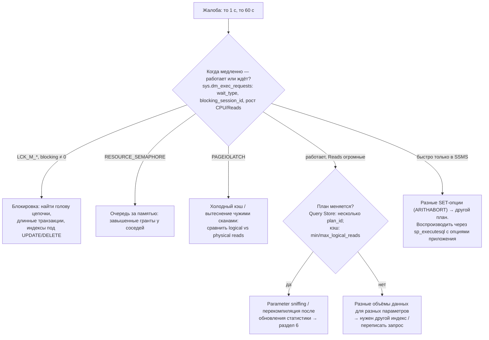
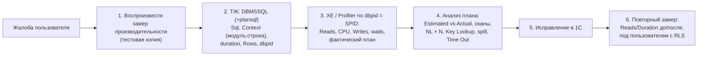

# 9. Практические задания

[← Раздел 8](08-1c-specifics.md) · [Оглавление](../README.md) · [Шпаргалка →](10-cheatsheet.md)

Вопросы 79–83. Здесь нет новой теории: разбирается **ход рассуждения**, который ждут на аттестации. Ссылки ведут на разделы с подробностями. Больше разобранных случаев с метриками трассы — в [расследованиях](11-case-studies.md).

---

## 79. Index Scan по таблице в 1 млн строк, предикат по неиндексированному полю. Предложите индекс

**Ход ответа:**

1. **Посмотреть, что реально прочитано и возвращено.** `Actual Rows Read` = 1 000 000, `Actual Number of Rows` = 120, условие в `Predicate`. Индекс нужен.
2. **Проверить, что условие саргабельно.** Если там `YEAR(d) = …`, `CONVERT_IMPLICIT`, `LIKE '%…'` или `ИЛИ` по разным полям, сначала переписать условие ([вопрос 26](03-optimizer.md#26-sargable-предикат)). Иначе индекс не поможет.
3. **Составить ключ по условиям WHERE/JOIN:** сначала равенства, потом максимум один диапазон. Ведущим ставить столбец, который есть в большинстве запросов ([вопрос 10](01-storage.md#10--порядок-столбцов-и-селективность-в-составном-индексе)).
4. **Решить про покрытие:** столбцы из SELECT (и ORDER BY, если он не совпадает с ключом) — в `INCLUDE`, если выборка не крошечная и запрос частый. Иначе будет Key Lookup.
5. **Проверить существующие индексы**: нельзя ли расширить имеющийся вместо создания нового. Оценить нагрузку записи на таблицу.
6. **Проверить результат:** Index Seek, `Rows Read ≈ Rows`, логические чтения «до/после».

```sql
-- Было: SELECT OrderID, Amount FROM dbo.Orders WHERE Status = 3 AND OrderDate >= @d;
--       Clustered Index Scan, Predicate: Status = 3 AND OrderDate >= @d
CREATE INDEX IX_Orders_Status_Date
ON dbo.Orders (Status, OrderDate)   -- равенство, затем диапазон
INCLUDE (Amount);                   -- OrderID (ключ кластера) уже в индексе неявно
```

Оговорки, которые стоит проговорить:
- если условию соответствует большая доля таблицы, скан — правильный план, и индекс не нужен ([tipping point](05-plans-operators.md#42-table-scan-clustered-index-scan-index-seek-всегда-ли-scan--плохо));
- у низкоселективного поля может помочь **фильтрованный** индекс (`WHERE Status = 3`);
- в 1С вместо `CREATE INDEX` используют флаг «Индексировать», порядок измерений регистра или переработку запроса.

---

## 80. Key Lookup на 100 000 строк. Что сделать?

1. **Проверить оценку.** Если `Estimated` ≈ 100 строк, а `Actual` = 100 000, то основная проблема — **кардинальность**: sniffing, устаревшая статистика, восходящий ключ, табличная переменная. При правильной оценке оптимизатор сам выбрал бы скан. Лечить нужно оценку (разделы [4](04-statistics.md), [6](06-params-cache.md)).
2. **Сделать индекс покрывающим**: столбцы из `Output List` оператора Key Lookup добавить в `INCLUDE`. Если Key Lookup имеет `Predicate`, его столбец — в ключ или INCLUDE, чтобы фильтровать до Lookup.
3. **Убрать лишние столбцы** из SELECT (`SELECT *`).
4. Если выборка действительно большая и покрыть нельзя, **скан** может быть дешевле. Сравнить по логическим чтениям с `WITH (INDEX(0))` в тестах.
5. Для RID Lookup (куча) — рассмотреть кластерный индекс.

Ожидаемый результат: Nested Loops и Key Lookup исчезают, остаётся один Index Seek, чтения падают с ~300 000 до сотен-тысяч страниц листьев.

---

## 81. Оценка «1 строка», фактически 500 000, внизу Nested Loops. Что пошло не так?

**Что произошло:** оптимизатор выбрал NL потому, что ожидал 1 строку на верхнем входе. Нижний вход (Seek/Lookup, а то и скан или спул) выполнился **500 000 раз**, отсюда миллионы чтений. Заодно вероятны маленький memory grant и spill выше по плану.

**Как найти причину (от самых частых):**

| Причина | Как узнать | Исправление |
|---|---|---|
| Восходящий ключ / устаревшая статистика | Значение правее последнего шага гистограммы. Большой `modification_counter`, старая дата в `OptimizerStatsUsage` | `UPDATE STATISTICS … WITH FULLSCAN`, регламент, новый CE |
| Parameter sniffing | `Compiled Value` ≠ `Runtime Value` | RECOMPILE / OPTIMIZE FOR / индекс / Query Store (раздел 6) |
| Табличная переменная | Оценка ровно 1 на `@t` | `#temp` или 2019+ (deferred compilation) |
| Несаргабельное условие, `CONVERT_IMPLICIT`, функция | Предупреждение, выражение в Predicate | Переписать условие, выровнять типы |
| Коррелированные условия | Каждое условие по отдельности оценено верно, комбинация — нет | Многоколоночная статистика или индекс, сравнить CE 70/120 |
| Подзапрос или виртуальная таблица с GROUP BY внутри соединения | Ошибка появляется на выходе агрегата | Материализовать во `#temp` / `ВТ` |

Проверка после исправления: `Estimated` ≈ `Actual`, оптимизатор сам выбирает Hash Match или скан, чтения падают на порядки. Если нужно быстро снять пожар — `OPTION (RECOMPILE)` или `HASH JOIN` **временно**, как диагностика, а не как решение.

---

## 82. Запрос иногда выполняется за секунду, иногда за минуту. Ход диагностики



**Порядок действий:**
1. Поймать медленный случай: XE-сессия ([`12_…sql`](../sql/12_extended_events_long_queries.sql)), Query Store или ТЖ.
2. **Ожидания или работа?** CPU и Reads медленного случая против быстрого ([вопросы 64, 67](07-profiler-metrics.md#67--как-отличить-медленный-запрос-от-запроса-который-ждёт-блокировку)).
3. Если Reads различаются на порядки при одном тексте — **смотреть планы**. Query Store: *Queries With High Variation*, *Regressed Queries*, Plan Summary. Кэш: `ParameterCompiledValue`.
4. Если план один, а значения параметров разные — проблема в данных и развилке: покрывающий индекс, разделение сценариев.
5. Если план меняется после ночного обслуживания — это смена плана после обновления статистики + sniffing.
6. Исключить внешние причины: блокировки, память, tempdb, параллельные тяжёлые отчёты, вытеснение буферного пула.
7. Исправить **причину** и проверить на обоих значениях параметров (`sp_executesql` с правильными SET-опциями).

---

## 83. «Долго проводится документ» (1С): от ТЖ до плана и исправления



**Шаги:**
1. **Где в коде.** Замер производительности на копии: строка `Запрос.Выполнить()` в `ОбработкаПроведения` с большой долей времени, или быстрая строка, выполненная тысячи раз (это запрос в цикле — чинить алгоритм). На рабочей базе сразу переходите к шагу 2.
2. **Какой SQL.** ТЖ с фильтром по базе и длительности ([`logcfg.xml`](../1c/logcfg.xml)): `Sql`, `Context`, `planSQLText`, `dbpid`, `Trans=1` (внутри транзакции проведения, значит держит блокировки).
3. **Как выполнил SQL Server.** XE с фильтром по `session_id = dbpid` и времени; Reads, CPU, Writes, ожидания. Большое Duration при маленьком CPU означает, что дело в **блокировках**, а не в плане: смотрим, кто держит (другие проведения, итоги регистров, `LCK_M_*`).
4. **Разбор плана** (или `planSQLText`): где расходятся оценка и факт, что сканируется, сколько раз выполнялся нижний вход NL, какие таблицы (`_AccumRg…`, `_AccumRgT…`, `_Reference…` — расшифровать через `ПолучитьСтруктуруХраненияБазыДанных()`).
5. **Типичные причины при проведении и исправления:**

| Находка | Исправление |
|---|---|
| Соединение документа с `Остатки()` напрямую, отбор в ГДЕ | ВТ со строками документа → `Остатки(&Дата, … В (ВЫБРАТЬ … ИЗ ВТ))` → соединение ВТ ([вопросы 70–71](08-1c-specifics.md#70-параметры-виртуальных-таблиц--в-скобках-а-не-в-где)) |
| Миллионы Reads по `_AccumRg` с широким `_Period` | Сдвинуть **период рассчитанных итогов**. Для оперативного проведения — остатки без даты ([вопрос 76](08-1c-specifics.md#76-таблицы-итогов-регистров-накопления-и-период-рассчитанных-итогов)) |
| Долгие `UPDATE _AccumRgT` при проведении задним числом | Период итогов не должен быть далеко в будущем. Разделение итогов при конкуренции |
| Десятки LEFT JOIN от `Регистратор.…` | `ВЫРАЗИТЬ` + `ССЫЛКА` ([вопрос 73](08-1c-specifics.md#73-точка-от-составного-типа-и-выразить)) |
| `ИЛИ` в соединении или отборе | `ОБЪЕДИНИТЬ ВСЕ` ([вопрос 74](08-1c-specifics.md#74-или-в-условиях-и-соединениях-замена-на-объединить-все)) |
| Сканы по реквизиту отбора | «Индексировать», порядок измерений, ВТ с `ИНДЕКСИРОВАТЬ ПО` |
| Estimated 1 / Actual много по свежим датам | Обновление статистики (восходящий ключ) |
| Медленно только у пользователя | RLS: сократить соединения; при допустимости — привилегированный режим для серверной части |
| Запрос в цикле | Один запрос по всем строкам + ВТ |

6. **Проверка:** Reads и Duration до/после в XE или ТЖ, Estimated ≈ Actual, нет Time Out и spill. Проверить **под пользователем с RLS** и при параллельной работе (блокировки).

---

[← Раздел 8](08-1c-specifics.md) · [Оглавление](../README.md) · [Шпаргалка →](10-cheatsheet.md)
