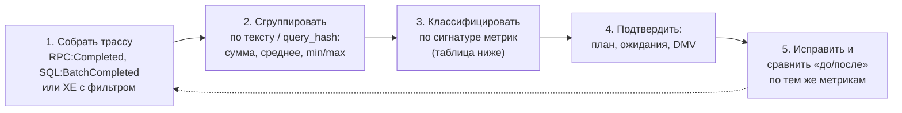

# 11. Расследования: кейсы по метрикам Profiler и Extended Events

[← Шпаргалка](10-cheatsheet.md) · [Оглавление](../README.md) · [Разбор реального плана →](12-real-plan-walkthrough.md)

Практикум: «запрос тормозит — как разобраться». Каждый кейс построен одинаково:
- **жалоба** и **запрос**;
- **что видно в трассе** — метрики Duration, CPU, Reads, Writes, RowCount;
- **что говорят метрики** — какая гипотеза из них следует;
- **как подтвердить** — план, ожидания, DMV;
- **причина** и **исправление** (T-SQL и 1С);
- **как проверить** результат.

Числа в трассах **условные**, но соотношения между ними типичные. Большинство кейсов воспроизводит [`22_case_studies_demo.sql`](../sql/22_case_studies_demo.sql): он сам собирает трассу Extended Events и строит по ней сводку метрик.

---

## Метод расследования: пять шагов



**1. Собрать трассу.** Profiler: события **RPC:Completed** (запросы 1С и `sp_executesql`) и **SQL:BatchCompleted**, столбцы TextData, Duration, CPU, Reads, Writes, RowCounts, SPID, StartTime, фильтры по базе и Duration / Reads ([вопрос 61](07-profiler-metrics.md#61-sql-server-profiler-для-чего-он-и-что-выбрать-для-поиска-долгих-запросов)). Лучше — Extended Events с действием `query_hash` ([`12_extended_events_long_queries.sql`](../sql/12_extended_events_long_queries.sql)). Если нужен свой запрос из 1С — фильтр по SPID ([вопрос 69а](08-1c-specifics.md#69а-практика-как-поймать-свой-запрос-1с-в-profiler-и-получить-его-план)).

**Единицы измерения:**

| Метрика | Profiler (GUI) | Файл трассы `.trc` | Extended Events |
|---|---|---|---|
| Duration | мс (по умолчанию) | мкс | мкс |
| CPU | мс | мс | мкс (`cpu_time`) |
| Reads / Writes | страницы по 8 КБ | страницы | страницы (`logical_reads`, `writes`) |
| RowCount | строки | строки | строки (`row_count`) |

**2. Сгруппировать.** Одиночная долгая строка в трассе — не всегда главная проблема. Часто сервер нагружает запрос, выполненный 40 000 раз по 20 мс. Группируйте по тексту (у запросов 1С текст стабилен, значения — в параметрах) или по `query_hash`, считайте количество, сумму, среднее, минимум и максимум:

```sql
-- Сохранённая трасса Profiler (.trc): топ по суммарным чтениям
SELECT TOP (30)
       LEFT(CAST(TextData AS nvarchar(max)), 200) AS query_start,   -- начало текста: у 1С без значений параметров
       COUNT(*)                    AS executions,
       SUM(Duration) / 1000        AS total_duration_ms,            -- Duration в файле — микросекунды
       AVG(Duration) / 1000        AS avg_duration_ms,
       SUM(CPU)                    AS total_cpu_ms,
       SUM(Reads)                  AS total_reads,
       MIN(Reads)                  AS min_reads,
       MAX(Reads)                  AS max_reads,                    -- min ≪ max у одного текста → sniffing
       SUM(Writes)                 AS total_writes,
       SUM(RowCounts)              AS total_rows
FROM sys.fn_trace_gettable(N'D:\Trace\my_trace.trc', DEFAULT)
WHERE EventClass IN (10, 12)          -- 10 = RPC:Completed, 12 = SQL:BatchCompleted
GROUP BY LEFT(CAST(TextData AS nvarchar(max)), 200)
ORDER BY total_reads DESC;            -- или total_duration_ms / total_cpu_ms / executions
```

**3. Классифицировать по сигнатуре метрик.** Уже соотношение пяти чисел сужает круг причин:

| Сигнатура | Что это значит | Кейс |
|---|---|---|
| Reads ≫ RowCount, CPU ≈ Duration | Работает много ради малого: скан, несаргабельное условие, нет индекса, Key Lookup | [2](#кейс-2-несаргабельное-условие-читаем-всю-таблицу-ради-40-строк), [1](#кейс-1-вложенный-запрос-коррелированный-подзапрос-выполняется-на-каждую-строку), [11](#кейс-11-1с-виртуальная-таблица-остатки-с-отбором-в-где) |
| Reads огромные, и на каждую строку результата их сотни и тысячи | Нижний вход Nested Loops или подзапрос выполняются на каждую строку | [1](#кейс-1-вложенный-запрос-коррелированный-подзапрос-выполняется-на-каждую-строку) |
| Один текст: то Reads 40, то 900 000 | Разные планы или развилка Seek/Scan в зависимости от значения | [3](#кейс-3-один-и-тот-же-запрос-то-мгновенно-то-минуты) |
| Duration ≫ CPU, Reads маленькие | Запрос **ждал**: блокировку, диск, сеть, память | [4](#кейс-4-запрос-висит-35-секунд-не-потребляя-ресурсов), [7](#кейс-7-огромный-результат-сервер-ждёт-клиента), [10](#кейс-10-первый-запуск-медленный-повторный-быстрый) |
| Writes > 0 у SELECT | Spill в tempdb, Spool, запись во временную таблицу | [5](#кейс-5-select-который-пишет-spill-в-tempdb) |
| Каждый вызов быстрый, но их десятки тысяч | Запрос в цикле, N+1 | [6](#кейс-6-тысячи-быстрых-запросов-запрос-в-цикле) |
| RowCount огромный, CPU умеренный, Duration большой | Клиент забирает много строк | [7](#кейс-7-огромный-результат-сервер-ждёт-клиента) |
| CPU > Duration | Параллельный план | [8](#кейс-8-cpu-больше-duration-тяжёлый-параллельный-отчёт) |
| CPU высокий при маленьких Reads, вызовов много | Компиляции и перекомпиляции, построчные функции | [9](#кейс-9-высокий-cpu-при-малых-чтениях-компиляции) |
| Duration ≫ CPU при больших Reads, при повторе быстро | Физические чтения с диска (холодный кэш) | [10](#кейс-10-первый-запуск-медленный-повторный-быстрый) |

**4. Подтвердить.** Трасса показывает *симптом*, а *причину* показывают:
- фактический план — оценки против факта, `Number of Executions`, Seek или Scan, предупреждения ([вопросы 55а](05-plans-operators.md#55а-анализ-плана-выполнения-по-стоимости-операторов), [47а](05-plans-operators.md#47а-признаки-неэффективного-join-в-плане-и-что-с-ними-делать));
- ожидания запроса — `sys.dm_exec_requests`, WaitStats в фактическом плане ([вопросы 66–67](07-profiler-metrics.md#66-ожидания-wait-stats));
- DMV и Query Store — история, разброс метрик, разные планы ([вопросы 59–60](06-params-cache.md#59-тяжёлые-запросы-в-кэше-через-dmv)).

**5. Исправить и проверить** по **тем же** метрикам. Главные — Reads и CPU: они не зависят от прогретости кэша и нагрузки на сервер. Duration — итоговый результат для пользователя.

---

## Кейс 1. Вложенный запрос: коррелированный подзапрос выполняется на каждую строку

**Жалоба.** Отчёт «последний заказ по клиентам региона» строится 18 секунд.

```sql
SELECT c.CustomerID, c.Name,
       (SELECT TOP (1) o.OrderDate
        FROM dbo.Orders o
        WHERE o.CustomerID = c.CustomerID
        ORDER BY o.OrderDate DESC) AS LastOrderDate
FROM dbo.Customers c
WHERE c.Region = N'Москва';
```

**Что в трассе:**

| Duration | CPU | Reads | Writes | RowCount |
|---|---|---|---|---|
| 18 000 мс | 17 400 мс | 9 800 000 | 0 (или тысячи, если Spool) | 10 000 |

**Что говорят метрики.**
- CPU ≈ Duration — запрос **работал**, а не ждал.
- Reads / RowCount ≈ 980 страниц на **каждую** строку результата. Что-то выполняется заново для каждой строки.
- Если Writes > 0 — оптимизатор строил временный индекс (Index Spool) во worktable.

**Как подтвердить.** Фактический план:
- Nested Loops (Left Outer Join / Apply): сверху 10 000 клиентов;
- снизу Clustered Index Scan по `Orders` + Top N Sort с **Number of Executions = 10 000**, либо Index Spool;
- у нижнего входа `Actual Rows Read` в миллионы.

**Причина.** Коррелированный подзапрос — это нижний вход Nested Loops: он выполняется для каждой строки внешнего запроса. Индекса по `Orders.CustomerID` нет, поэтому каждое выполнение сканирует таблицу или пользуется построенным на лету временным индексом.

**Исправление:**
- **Индекс под подзапрос:** `CREATE INDEX IX_Orders_Customer_Date ON dbo.Orders (CustomerID, OrderDate DESC);`. Каждое выполнение становится Seek + Top 1 — две-три страницы.
- **Или переписать** в одно множество, без построчного выполнения:
  ```sql
  SELECT c.CustomerID, c.Name, lo.LastOrderDate
  FROM dbo.Customers c
  LEFT JOIN (SELECT CustomerID, MAX(OrderDate) AS LastOrderDate
             FROM dbo.Orders GROUP BY CustomerID) lo ON lo.CustomerID = c.CustomerID
  WHERE c.Region = N'Москва';
  ```
  Одна агрегация по `Orders` (Hash или Stream Aggregate) и одно соединение.

**Как проверить.** Reads падают с миллионов до десятков тысяч (вариант с индексом — до 2–3 страниц на клиента), Duration — до сотен миллисекунд. В плане у нижнего входа Index Seek, Spool исчез.

> **1С.** В языке запросов 1С подзапросов в списке `ВЫБРАТЬ` нет, но тот же эффект дают **вложенные запросы в соединении** и разыменование через точку. Типичный вариант:
> ```bsl
> ВЫБРАТЬ Контрагенты.Ссылка, Последние.Дата
> ИЗ Справочник.Контрагенты КАК Контрагенты
>     ЛЕВОЕ СОЕДИНЕНИЕ (ВЫБРАТЬ Док.Контрагент КАК Контрагент, МАКСИМУМ(Док.Дата) КАК Дата
>                       ИЗ Документ.РеализацияТоваровУслуг КАК Док
>                       СГРУППИРОВАТЬ ПО Док.Контрагент) КАК Последние
>     ПО Последние.Контрагент = Контрагенты.Ссылка
> ```
> Оценка строк результата вложенного запроса грубая. При недооценке оптимизатор выбирает Nested Loops, и группировка по всем документам повторяется много раз. Лечение — вынести вложенный запрос в `ПОМЕСТИТЬ ВТ_Последние … ИНДЕКСИРОВАТЬ ПО Контрагент` ([вопрос 71](08-1c-specifics.md#71-почему-опасно-соединение-с-подзапросом-или-виртуальной-таблицей)). Если по `Контрагент` установлено «Индексировать с доп. упорядочиванием» (индекс «Контрагент + Дата + Ссылка»), `МАКСИМУМ(Дата)` по каждому контрагенту берётся из индекса.

---

## Кейс 2. Несаргабельное условие: читаем всю таблицу ради 40 строк

**Жалоба.** Выборка заказов клиента за год идёт больше секунды, хотя строк в результате несколько десятков.

```sql
SELECT OrderID, Amount
FROM dbo.Orders
WHERE CustomerID = 42 AND YEAR(OrderDate) = 2025;     -- индекс: (OrderDate) INCLUDE (CustomerID, Amount)
```

**Что в трассе:**

| Duration | CPU | Reads | Writes | RowCount |
|---|---|---|---|---|
| 1 200 мс | 1 150 мс | 120 000 | 0 | 40 |

**Что говорят метрики.** Reads / RowCount = 3 000 страниц на строку. 120 000 страниц — это примерно весь индекс или вся таблица: сравните с `sp_spaceused`. Запрос не ищет, а **перебирает**. CPU ≈ Duration: работа, не ожидание.

**Как подтвердить.** В плане Index Scan (не Seek), в свойствах **Predicate**: `datepart(year, OrderDate) = 2025`, `Number of Rows Read` = все строки ([вопрос 44](05-plans-operators.md#44-seek-predicate-и-predicate-residual)).

**Причина.** Функция над столбцом: индекс отсортирован по `OrderDate`, а не по `YEAR(OrderDate)`, и прыгнуть в нужное место нельзя ([вопрос 26](03-optimizer.md#26-sargable-предикат)). Та же картина при `CONVERT_IMPLICIT` на столбце ([вопрос 27](03-optimizer.md#27-неявное-преобразование-типов)) и при `LIKE '%…'`.

**Исправление.** Условие — диапазоном, столбец «голый»:

```sql
WHERE CustomerID = 42 AND OrderDate >= '20250101' AND OrderDate < '20260101';
```

Для частого запроса лучше индекс `(CustomerID, OrderDate) INCLUDE (Amount)`: оба условия попадут в Seek Predicates.

**Как проверить.** Reads — единицы или десятки, Number of Rows Read ≈ RowCount, в плане Index Seek.

> **1С.** `ГДЕ ГОД(Док.Дата) = 2025` → `ГДЕ Док.Дата МЕЖДУ &НачалоГода И &КонецГода`. `ПОДСТРОКА(Наименование, 1, 4) = "Болт"` → `Наименование ПОДОБНО "Болт%"`. В трассе 1С подозрение вызывает `DATEPART`, `SUBSTRING` или `LIKE N'%…'` по столбцу таблицы в тексте `sp_executesql`.

---

## Кейс 3. Один и тот же запрос то мгновенно, то минуты

**Жалоба.** «Отчёт по клиенту то летает, то висит». Пользователи разные, запрос один.

```sql
EXEC sp_executesql N'SELECT OrderID, OrderDate, Amount FROM dbo.Orders WHERE CustomerID = @c',
                   N'@c int', @c = 1;
```

**Что в трассе (сгруппировано по тексту):**

| Выполнений | Duration min / max | Reads min / max | RowCount min / max |
|---|---|---|---|
| 1 240 | 2 мс / 4 100 мс | 40 / 900 000 | 10 / 300 000 |

**Что говорят метрики.**
- Текст один, а Reads различаются в **десятки тысяч раз**.
- Долгие выполнения — те, где RowCount большой, но Reads при этом **несоразмерно** больше: 900 000 страниц ради 300 000 строк, хотя вся таблица — 12 500 страниц.
- Это развилка «Seek + Key Lookup» и «Scan»: план построен под маленького клиента и применён к большому.

**Как подтвердить.**
- В фактическом плане долгого вызова: `Parameter Compiled Value = 7`, `Parameter Runtime Value = 1`, Estimated 10 строк против Actual 300 000, Key Lookup на 300 000 выполнений ([вопрос 57](06-params-cache.md#57-диагностика)).
- В кэше: `min_logical_reads` и `max_logical_reads` одной инструкции различаются на порядки.
- В Query Store: Queries With High Variation.

**Причина.** Parameter sniffing: план подсмотрен под значение первого вызова после компиляции ([вопрос 56](06-params-cache.md#56-parameter-sniffing)).

**Исправление** ([вопрос 58](06-params-cache.md#58-способы-борьбы-плюсы-и-минусы)):
- лучшее — **покрывающий индекс** `(CustomerID) INCLUDE (OrderDate, Amount)`: Key Lookup исчезает, один план хорош для всех;
- `OPTION (RECOMPILE)` для редкого тяжёлого запроса;
- Query Store hints или закрепление плана, PSP-оптимизация в SQL Server 2022.

**Как проверить.** В новой трассе разброс Reads пропорционален RowCount: 10 строк — десятки страниц, 300 000 строк — тысячи, но не сотни тысяч.

> **1С.** Типичный пример — отбор по складу или организации с сильным перекосом ([вопрос 56, пример для 1С](06-params-cache.md#56-parameter-sniffing)). Хинт в запрос не вставить. Помогают дополнительный покрывающий индекс (лицензия КОРП), Query Store, разделение сценариев (отдельный запрос для «большого» склада).

---

## Кейс 4. Запрос висит 35 секунд, не потребляя ресурсов

**Жалоба.** Простейшая запись или чтение одного документа иногда «зависает» на десятки секунд.

```sql
SELECT Status, Amount FROM dbo.Orders WHERE OrderID = 12345;
```

**Что в трассе:**

| Duration | CPU | Reads | Writes | RowCount |
|---|---|---|---|---|
| 35 000 мс | 0 мс | 3 | 0 | 1 |

**Что говорят метрики.** Три чтения и ноль CPU — запрос сам по себе мгновенный. Duration ≫ CPU: **35 секунд он ждал** ([вопросы 64, 67](07-profiler-metrics.md#67--как-отличить-медленный-запрос-от-запроса-который-ждёт-блокировку)). Что именно он ждал, трасса не покажет — нужны ожидания.

**Как подтвердить.**
- Пока запрос висит: `sys.dm_exec_requests` → `wait_type = LCK_M_S`, `blocking_session_id = 87`. Цепочку блокировок покажет `sys.dm_os_waiting_tasks` (блок 3 [`09_waits_and_blocking.sql`](../sql/09_waits_and_blocking.sql)).
- Задним числом: событие **Blocked process report** (Profiler, XE `blocked_process_report`). Нужна настройка `sp_configure 'blocked process threshold', 10`. Событие содержит XML с текстом заблокированного запроса и того, кто держит блокировку.
- В той же трассе по SPID блокирующего: его транзакция началась давно и ещё не закончилась.

**Причина.** Чужая длинная транзакция держит блокировку на строке или странице. Частые варианты:
- долгий расчёт или ожидание пользователя внутри транзакции;
- UPDATE или DELETE без подходящего индекса: сканирует и блокирует много строк, вплоть до эскалации до блокировки таблицы.

**Исправление:**
- лечится **блокирующий**, а не заблокированный запрос: короче транзакция, индекс под условие UPDATE/DELETE, единый порядок доступа к таблицам;
- для читателей — уровень изоляции на версиях строк (`READ_COMMITTED_SNAPSHOT`), если это допустимо для приложения.

**Как проверить.** В трассе у этого запроса Duration ≈ CPU, Blocked process report больше не появляется. Разбор реального отчёта и отличие от управляемых блокировок 1С — [кейс 12](#кейс-12-1с-расследование-возможных-блокировок).

> **1С.** Блокировки СУБД при проведении документов, особенно на таблицах итогов регистров. Короткие транзакции проведения: не держать открытой транзакцию на время долгих расчётов, проверок или обращений к внешним системам; использовать управляемые блокировки; не проводить задним числом в рабочее время; включить разделение итогов на конкурентно записываемых регистрах ([вопрос 76](08-1c-specifics.md#76-таблицы-итогов-регистров-накопления-и-период-рассчитанных-итогов)).

---

## Кейс 5. SELECT, который пишет: spill в tempdb

**Жалоба.** Отчёт с сортировкой и группировкой иногда идёт секунду, иногда шесть.

```sql
SELECT CustomerID, COUNT(*) AS Cnt, SUM(Amount) AS Total
FROM @RecentOrders                 -- табличная переменная на 500 000 строк
GROUP BY CustomerID
ORDER BY Total DESC;
```

**Что в трассе:**

| Duration | CPU | Reads | Writes | RowCount |
|---|---|---|---|---|
| 6 000 мс | 2 100 мс | 52 000 | **31 000** | 50 000 |

**Что говорят метрики.**
- **Writes у SELECT** — запрос что-то записывал. Это либо spill Sort/Hash в tempdb, либо Spool, либо явная запись во временную таблицу.
- Duration заметно больше CPU — время ушло на ввод-вывод в tempdb.

**Как подтвердить.**
- Фактический план: жёлтый треугольник на Sort или Hash Match — **SpillToTempDb**, Sort Warning или Hash Warning ([вопрос 48](05-plans-operators.md#48-sort-и-hash-match-aggregate-блокирующие-операторы-и-spill)).
- `MemoryGrantInfo` на SELECT: Granted маленький, MaxUsed упёрся в него ([вопрос 49](05-plans-operators.md#49-memory-grant)).
- Оценка у источника: Estimated 1 строка (табличная переменная), Actual 500 000.
- XE: `sort_warning`, `hash_warning`, `hash_spill_details`.

**Причина.** Memory grant выдаётся по **оценке** строк. Недооценка — мало памяти — данные ушли в tempdb.

**Исправление** — лечить оценку, а не память:
- `#temp` вместо табличной переменной ([вопрос 38](04-statistics.md#38-временные-таблицы-и-табличные-переменные));
- обновить статистику, убрать несаргабельные условия;
- индекс, который отдаёт данные уже отсортированными, — тогда Sort не нужен.

Хинт `MIN_GRANT_PERCENT` — только временная мера.

**Как проверить.** Writes = 0, предупреждения исчезли, `GrantedMemory` соответствует `MaxUsedMemory`.

> **1С.** Временные таблицы 1С (`ПОМЕСТИТЬ`) — это `#tt`, у них есть статистика. Поэтому spill чаще дают огромные группировки и сортировки в отчётах, неверные оценки после виртуальных таблиц и соединений, устаревшая статистика. Writes у SELECT в трассе 1С может означать и законную запись в `#tt`: смотрите, какой именно оператор пишет.

---

## Кейс 6. Тысячи быстрых запросов: запрос в цикле

**Жалоба.** Обработка «Перезаполнить цены» работает 4 минуты, но в трассе нет ни одного долгого запроса.

```sql
-- То, что видно в трассе: один и тот же запрос с разными значениями, 40 000 раз подряд
exec sp_executesql N'SELECT T1._Fld123 FROM dbo._Reference45 T1 WHERE T1._IDRRef = @P1', N'@P1 varbinary(16)', 0x8A3F…
```

**Что в трассе:**

| Сгруппировано по тексту | Выполнений | Duration: одно / сумма | Reads: одно / сумма | RowCount |
|---|---|---|---|---|
| Запрос выше | **40 000** | 1 мс / 48 000 мс | 3 / 120 000 | по 1 |

**Что говорят метрики.**
- Каждый вызов идеален: Seek по ключу, 3 страницы, 1 строка. План лечить не нужно.
- Проблема в **количестве**. 40 000 обращений, и у каждого своя дорога «сервер 1С ↔ СУБД» по сети. Время уходит на круговые поездки, а не на работу СУБД.
- Сумма Duration в трассе (48 с) меньше времени обработки (240 с): остальное — сеть и работа сервера 1С.

**Как подтвердить.** Группировка трассы по тексту (запрос выше) или по `query_hash` в XE. Один SPID, тысячи одинаковых запросов подряд с интервалом в миллисекунды. В 1С — замер производительности: быстрая строка с огромным количеством выполнений ([вопрос 69](08-1c-specifics.md#69-как-получить-sql-текст-и-план-запроса-1с)).

**Причина.** Чтение данных **в цикле**: запрос внутри цикла или обращение через точку к реквизиту ссылки (`Строка.Номенклатура.Цена`) — каждое такое обращение читает объект из базы.

**Исправление.** Один запрос на все строки:
```bsl
// Было: Для Каждого Строка Из Товары Цикл ... Строка.Номенклатура.ЕдиницаИзмерения ... КонецЦикла
Запрос = Новый Запрос(
"ВЫБРАТЬ Т.Номенклатура КАК Номенклатура ПОМЕСТИТЬ ВТ_Товары ИЗ &Товары КАК Т
|ИНДЕКСИРОВАТЬ ПО Номенклатура
|;
|ВЫБРАТЬ ВТ.Номенклатура, ВТ.Номенклатура.ЕдиницаИзмерения КАК ЕдиницаИзмерения
|ИЗ ВТ_Товары КАК ВТ");
Запрос.УстановитьПараметр("Товары", Товары.Выгрузить(, "Номенклатура"));
```
Дальше — работа с результатом в памяти (соответствие или поиск по таблице значений).

**Как проверить.** В трассе вместо 40 000 вызовов — 2–3 запроса с Reads в тысячи страниц, общее время обработки — секунды.

---

## Кейс 7. Огромный результат: сервер ждёт клиента

**Жалоба.** «Выгрузка» или отчёт без отборов идёт 25 секунд, а сервер при этом почти не нагружен.

```sql
SELECT * FROM dbo.Orders WHERE OrderDate >= '20200101';
```

**Что в трассе:**

| Duration | CPU | Reads | Writes | RowCount |
|---|---|---|---|---|
| 25 000 мс | 1 500 мс | 80 000 | 0 | **2 500 000** |

**Что говорят метрики.**
- RowCount — миллионы строк. Reads соразмерны: это один скан, план тут ни при чём.
- Duration ≫ CPU: сервер **ждал**, пока клиент заберёт данные.

**Как подтвердить.** Ожидание **ASYNC_NETWORK_IO** у этой сессии в `sys.dm_exec_requests` или в WaitStats фактического плана ([вопрос 66](07-profiler-metrics.md#66-ожидания-wait-stats)). Клиент (сервер 1С, приложение, SSMS) медленно принимает или обрабатывает строки.

**Причина.** Объём результата. Ускорить сервер здесь нечем: узкое место — передача и обработка на клиенте.

**Исправление:**
- выбирать только нужные столбцы и строки: отборы, `TOP`, постраничная выдача;
- агрегировать на сервере, а не на клиенте;
- не тянуть в клиент то, что потом фильтруется в коде.

**Как проверить.** RowCount и Duration падают пропорционально. ASYNC_NETWORK_IO в ожиданиях исчезает.

> **1С.** Отчёт без обязательных отборов, `Запрос.Выполнить().Выгрузить()` на сотни тысяч строк с последующей фильтрацией в цикле, большие табличные документы. Переносите отборы и группировки в запрос, используйте `ПЕРВЫЕ`, а в динамических списках не отключайте порционное чтение.

---

## Кейс 8. CPU больше Duration: тяжёлый параллельный отчёт

**Жалоба.** Отчёт сам выполняется за 3 секунды, но пока он работает, «тормозят все».

**Что в трассе:**

| Duration | CPU | Reads | Writes | RowCount |
|---|---|---|---|---|
| 3 000 мс | **22 000 мс** | 2 000 000 | 0 | 150 |

**Что говорят метрики.**
- CPU / Duration ≈ 7: запрос шёл **параллельно** примерно на 7–8 ядрах.
- 2 миллиона страниц ради 150 строк — тяжёлый план, который параллелизм просто «размазал» по ядрам.
- Пока он работает, остальным запросам не хватает CPU.

**Как подтвердить.** В плане операторы Parallelism (Gather/Repartition Streams), `Degree of Parallelism` на SELECT ([вопрос 52](05-plans-operators.md#52-параллелизм)). Как читать счётчики по потокам — в [разделе 15](15-parallelism-real-plan.md). На сервере в это время ожидания `CXPACKET` / `CXCONSUMER`, у других сессий — `SOS_SCHEDULER_YIELD`.

**Причина.** Высокая стоимость плана из-за больших чтений: нет индекса, несаргабельное условие, неудачное соединение. Параллелизм — следствие, а не причина.

**Исправление:**
- сначала уменьшить **Reads**: индекс, переписанное условие, разбиение на временные таблицы. После этого запрос может перестать быть параллельным вовсе;
- поднять `cost threshold for parallelism` и ограничить MAXDOP на уровне сервера, базы или Resource Governor, чтобы один отчёт не забирал все ядра.

**Как проверить.** Reads и CPU падают, CPU ≈ Duration (или чуть больше при умеренном DOP), у соседей пропадают ожидания CPU.

> **1С.** Для баз 1С часто ставят `max degree of parallelism = 1` — это рекомендация 1С для OLTP-нагрузки. Тогда та же проблема видна как CPU ≈ Duration, но очень большие. Лечение то же: сокращать чтения.

---

## Кейс 9. Высокий CPU при малых чтениях: компиляции

**Жалоба.** Сервер загружен по CPU на 80%, а тяжёлых по чтениям запросов в трассе нет.

**Что в трассе:**

| Сгруппировано | Выполнений | CPU на вызов | Reads на вызов | Duration на вызов |
|---|---|---|---|---|
| Тексты, отличающиеся только литералами (`… WHERE CustomerID = 1`, `= 2`, …) | 30 000 разных текстов | 150 мс | 20 | 160 мс |

**Что говорят метрики.** 20 страниц не могут стоить 150 мс процессора. Время уходит **не на выполнение**, а на построение плана: каждый текст новый, и каждый компилируется.

**Как подтвердить.**
- Счётчики `SQL Compilations/sec` и `SQL Re-Compilations/sec` относительно `Batch Requests/sec` (блок 10 [`07_plan_cache_top_queries.sql`](../sql/07_plan_cache_top_queries.sql)).
- В кэше: много одноразовых Adhoc-планов, один `query_hash` у тысяч разных `sql_handle` ([вопросы 13, 15](02-query-pipeline.md#15-ad-hoc-параметризованный-запрос-и-хранимая-процедура)).
- Profiler: события **SQL:StmtRecompile**, в XE — `sql_statement_recompile` с причиной.
- В фактическом плане: `CompileCPU` и `CompileTime` на SELECT.

**Причина** — одна из трёх:
- значения склеены в текст запроса вместо параметров;
- `OPTION (RECOMPILE)` в очень частом запросе;
- постоянные перекомпиляции из-за временных таблиц или изменений данных.

**Исправление:**
- параметры (`sp_executesql`) вместо склейки строк;
- убрать `RECOMPILE` из частых запросов;
- *optimize for ad hoc workloads* или `PARAMETERIZATION FORCED`, если код менять нельзя ([вопрос 16](02-query-pipeline.md#16-простая-и-принудительная-параметризация)).

**Как проверить.** CPU на вызов падает до единиц миллисекунд, число компиляций в секунду — на порядки.

> **1С.** Значения, вставленные в **текст** запроса строковой склейкой, вместо `УстановитьПараметр`. Тексты, которые постоянно меняются: условия, динамически собранные в коде, `В (&Массив)` с разным числом элементов, разные имена временных таблиц.

---

## Кейс 10. Первый запуск медленный, повторный быстрый

**Жалоба.** Утром отчёт строится 20 секунд, при повторе — 2.

**Что в трассе:**

| Запуск | Duration | CPU | Reads | Writes | RowCount |
|---|---|---|---|---|---|
| Первый | 20 000 мс | 1 800 мс | 300 000 | 0 | 500 |
| Повторный | 2 000 мс | 1 750 мс | 300 000 | 0 | 500 |

**Что говорят метрики.** Reads и CPU одинаковые — тот же план и та же работа. Разница в Duration — ожидание **диска**: в первый раз страниц не было в буферном пуле. Profiler показывает только логические чтения, физические нужно смотреть отдельно.

**Как подтвердить.**
- `SET STATISTICS IO ON` в SSMS: `physical reads` и `read-ahead reads` при первом запуске ([вопрос 65](07-profiler-metrics.md#65-set-statistics-io-и-set-statistics-time)).
- XE `sql_statement_completed` — поле `physical_reads`.
- Ожидания `PAGEIOLATCH_SH` у сессии.

**Причина.** 300 000 страниц (около 2,3 ГБ) нужно поднять с диска в память. За ночь их вытеснили другие задачи (обслуживание, выгрузки), или памяти сервера мало для рабочего набора.

**Исправление:**
- главное — уменьшить сам объём **Reads** (индекс, отборы): то, что не читается, не надо поднимать с диска;
- проверить достаточность памяти (`max server memory`), не вытесняют ли буферный пул ночные задачи, и скорость дисков.

Прогревать кэш «заранее» — обходной путь, а не лечение.

**Как проверить.** Reads упали — и первый запуск стал быстрым тоже. Ожидания PAGEIOLATCH у этого запроса исчезли.

---

## Кейс 11. 1С: виртуальная таблица Остатки с отбором в ГДЕ

**Жалоба.** Проверка остатков при проведении документа идёт 9 секунд.

```bsl
ВЫБРАТЬ Остатки.Номенклатура, Остатки.КоличествоОстаток
ИЗ РегистрНакопления.ТоварыНаСкладах.Остатки(&Момент) КАК Остатки
ГДЕ Остатки.Склад = &Склад
    И Остатки.Номенклатура В (&СписокТоваров)
```

**Что в трассе** (RPC:Completed, `exec sp_executesql N'SELECT … FROM (SELECT … FROM dbo._AccumRgT… UNION ALL SELECT … FROM dbo._AccumRg…) … GROUP BY … HAVING …'`):

| Duration | CPU | Reads | Writes | RowCount |
|---|---|---|---|---|
| 9 000 мс | 8 500 мс | 1 500 000 | 0 | 20 |

**Что говорят метрики.** 20 строк результата ценой 1,5 млн страниц, CPU ≈ Duration. Внутренний подзапрос считает остатки **по всем складам и товарам**, а отбор срабатывает уже после группировки.

**Как подтвердить.**
- В тексте SQL из трассы условие на склад стоит **снаружи** `GROUP BY`, а не внутри частей `UNION ALL`.
- В плане сканы `_AccumRgT…` и `_AccumRg…` с огромным `Number of Rows Read`, Hash Aggregate на миллионы строк ([вопрос 70](08-1c-specifics.md#70-параметры-виртуальных-таблиц--в-скобках-а-не-в-где)).

**Причина.** Условие по измерениям задано в `ГДЕ`, а не в параметрах виртуальной таблицы.

**Исправление:**

```bsl
ВЫБРАТЬ Остатки.Номенклатура, Остатки.КоличествоОстаток
ИЗ РегистрНакопления.ТоварыНаСкладах.Остатки(&Момент,
       Склад = &Склад И Номенклатура В (&СписокТоваров)) КАК Остатки
```

Если список товаров большой — сначала `ПОМЕСТИТЬ ВТ_Товары … ИНДЕКСИРОВАТЬ ПО Номенклатура`, а в параметрах `Номенклатура В (ВЫБРАТЬ … ИЗ ВТ_Товары)`. Если чтения всё равно велики — проверить период рассчитанных итогов ([вопрос 76](08-1c-specifics.md#76-таблицы-итогов-регистров-накопления-и-период-рассчитанных-итогов)).

**Как проверить.** Reads — тысячи вместо миллиона, в SQL условие по складу внутри обеих частей `UNION ALL`, в плане Seek по индексу итогов.

---

## Кейс 12. 1С: расследование возможных блокировок

**Жалоба.** Пользователи периодически получают «Конфликт блокировок при выполнении транзакции», запись или проведение подвисает на десятки секунд.

**Сначала — какой уровень блокировки.** У 1С их два, и Profiler видит только один:

| | Блокировки СУБД | Управляемые блокировки 1С |
|---|---|---|
| Кто ставит | SQL Server при записи строк (и при чтении в автоматическом режиме) | Сервер 1С: `БлокировкаДанных`, неявно — запись наборов, объектов, документов |
| Видно в Profiler / XE | Да | **Нет**: сеанс ждёт на сервере 1С, в СУБД запроса ещё нет |
| Где смотреть | Blocked process report, Deadlock graph, Lock:Timeout, DMV | Технологический журнал: `TLOCK`, `TTIMEOUT`, `TDEADLOCK` (свойство `WaitConnections` — кого ждали) |
| Текст ошибки | Есть ошибка SQL Server: native 1222 (lock timeout) или 1205 (deadlock) | Только «Превышено максимальное время ожидания предоставления блокировки» |

В управляемом режиме на MS SQL платформа читает с версионированием строк (`READ_COMMITTED_SNAPSHOT`): **читатели не ждут писателей**. На уровне СУБД остаются конфликты «запись против записи», эскалации и внешние участники. Поэтому чаще всего в типовой конфигурации ждут управляемую блокировку, и расследование начинают с ТЖ. Profiler нужен, когда в ошибке есть текст SQL Server или ожидание есть, а `TLOCK` чистый.

**Что включить для СУБД-уровня.**
- `sp_configure 'blocked process threshold (s)', 5` — без этого Blocked process report не генерируется (после исследования вернуть 0).
- События: **Blocked process report**, **Deadlock graph**, **Lock:Timeout (timeout > 0)**, Lock:Escalation, для контекста — RPC:Completed. Фильтр по базе. Lock:Acquired / Lock:Released не включать: они срабатывают на каждую строку.
- В XE: `blocked_process_report`, `xml_deadlock_report`; прошлые дедлоки уже лежат в сессии `system_health`.

**Что видно в трассе.** Реальный отчёт: окно SSMS держит открытую транзакцию с `UPDATE` строки регистра сведений, а 1С записывает набор с тем же ключом (сокращено):

```xml
<blocked-process>
  <process spid="64" clientapp="1CV83 Server" status="suspended" lockMode="X"
           waitresource="KEY: 8:72057595990573056 (75cdabf133d3)" waittime="5712"
           lockTimeout="20000" isolationlevel="read committed (2)" trancount="2">
    <inputbuf>(@P1 nvarchar(4000))DELETE FROM T1 FROM dbo._InfoRg46793 T1 WHERE T1._Fld46794 = @P1</inputbuf>
  </process>
</blocked-process>
<blocking-process>
  <process spid="55" clientapp="Microsoft SQL Server Management Studio - Query"
           status="sleeping" trancount="1" lastbatchcompleted="2026-10-07T20:11:34.933">
    <executionStack/>
    <inputbuf>BEGIN TRAN; UPDATE dbo._InfoRg46793 SET _Fld46794 = _Fld46794 WHERE _Fld46794 = N'20A0…'</inputbuf>
  </process>
</blocking-process>
```

**Что говорят поля.**

| Поле | Значение |
|---|---|
| `inputbuf` ждущего | `Набор.Записать()` платформа выполняет как `DELETE` старых записей + `INSERT`. Застрял `DELETE`, ему нужен `X` |
| `waitresource` | `KEY` — строка индекса: база 8, `hobt_id`, в скобках хеш ключа. `PAGE` — страница, `OBJECT` — вся таблица (часто эскалация) |
| `lockTimeout="20000"` | Таймаут блокировки информационной базы, 20 с. По его истечении — ошибка 1222 и событие Lock:Timeout |
| `isolationlevel` | RCSI — настройка базы, в отчёте он называется просто read committed. Запись всё равно ждёт другого писателя |
| `status="sleeping"` + `trancount=1` + пустой `executionStack` у блокирующего | **Главная сигнатура**: транзакция открыта, СУБД простаивает. В рабочей базе — сервер 1С внутри транзакции занят расчётом, внешним вызовом, ожиданием |
| `inputbuf` блокирующего | **Последний** пакет, а не обязательно тот, что взял блокировку. Историю SPID восстанавливают по RPC:Completed или `DBMSSQL` в ТЖ с `lasttranstarted` |

**Как подтвердить.**

```sql
-- таблица и индекс по hobt_id из waitresource
SELECT OBJECT_NAME(p.object_id) AS table_name, i.name AS index_name, i.index_id
FROM sys.partitions p
JOIN sys.indexes i ON i.object_id = p.object_id AND i.index_id = p.index_id
WHERE p.hobt_id = 72057595990573056;

-- конкретная строка по хешу ключа (недокументированный %%lockres%%)
SELECT * FROM dbo._InfoRg46793 WITH (NOLOCK, INDEX(<index_id>))
WHERE %%lockres%% = N'(75cdabf133d3)';
```

- Таблица → объект 1С: `ПолучитьСтруктуруХраненияБазыДанных()`.
- SPID → пользователь и строка кода: консоль кластера (колонка «Соединение с СУБД») или ТЖ, событие `DBMSSQL` со свойствами `dbpid`, `Usr`, `Context`.
- Прямо сейчас, без трассы: `sys.dm_exec_requests` (`blocking_session_id`, `wait_type = LCK_M_*`), `sys.dm_tran_locks`.

**Почему в простом опыте Profiler пуст.** Два сеанса 1С с `БлокировкаДанных` на один ключ: второй ждёт на сервере 1С и до СУБД не доходит. Только чтение в транзакции СУБД тоже не блокирует (версии строк). Чтобы воспроизвести блокировку СУБД, нужен участник в обход 1С: транзакция с `UPDATE` в SSMS, а в 1С — запись того же ключа. Только чтение того же ключа из 1С при этом выполнится мгновенно.

**Причина и исправление** — лечить **голову цепочки**, а не ждущих:

| Что видно | Что делать |
|---|---|
| Блокирующий `sleeping` в транзакции | Короче транзакции: расчёты, проверки, внешние вызовы — вне транзакции |
| Блокирующий `running` с большими Reads | Оптимизировать запрос внутри транзакции по плану |
| Ресурс `OBJECT`, рядом Lock:Escalation | Индекс под условие изменения, меньшие порции |
| Конфликты на `_AccumRgT…` | Разделение итогов, проведение задним числом вне рабочего времени ([вопрос 76](08-1c-specifics.md#76-таблицы-итогов-регистров-накопления-и-период-рассчитанных-итогов)) |
| Deadlock graph: оба держат `S`, просят `X` | Управляемый режим; `БлокировкаДанных` «Исключительный» до чтения остатков; единый порядок записи |

**Как проверить.** Blocked process report и Lock:Timeout по этому ресурсу больше не появляются, у запроса Duration ≈ CPU, в ТЖ нет `TTIMEOUT`.

> В рабочей базе сервер 1С не должен подключаться к СУБД под `sa` — отдельная учётная запись с минимально нужными правами.

---

## Сводка: сигнатура → причина → исправление

| Сигнатура метрик | Подтверждение | Типичное исправление |
|---|---|---|
| Reads ≫ RowCount, CPU ≈ Duration | План: Scan / Predicate, Rows Read ≫ Actual Rows | Индекс, саргабельное условие, покрытие |
| Reads на строку — сотни и тысячи | NL: Executions нижнего входа = числу строк, Spool | Индекс под соединение или подзапрос, переписать на множество |
| Один текст, Reads min ≪ max | Compiled ≠ Runtime Value, разные планы в Query Store | Покрывающий индекс, RECOMPILE, Query Store |
| Duration ≫ CPU, Reads малы | LCK_M_* / ASYNC_NETWORK_IO / RESOURCE_SEMAPHORE | Лечить блокирующего, уменьшить результат, исправить гранты |
| Writes > 0 у SELECT | SpillToTempDb, MemoryGrantInfo | Исправить оценку, индекс под порядок |
| Много быстрых одинаковых вызовов | Группировка трассы по тексту / query_hash | Один запрос на множество вместо цикла |
| CPU > Duration | Parallelism в плане, CXPACKET | Сократить Reads, cost threshold, MAXDOP |
| CPU ≫ Reads на вызов | Compilations/sec, StmtRecompile, одноразовые планы | Параметры, без RECOMPILE на частых запросах |
| Duration ≫ CPU при больших Reads, повтор быстрый | physical reads, PAGEIOLATCH | Сократить Reads, память, диски |
| 1С: «Конфликт блокировок», ошибка без текста SQL Server, в трассе пусто | ТЖ: `TLOCK`, `TTIMEOUT`, `WaitConnections` | Управляемая блокировка: короче транзакции, порядок блокировок |
| 1С: ошибка 1222 / 1205, Duration ≫ CPU | Blocked process report, Deadlock graph: `waitresource`, `sleeping` + `trancount` | Лечить блокирующего (кейс 12) |

---

[← Шпаргалка](10-cheatsheet.md) · [Оглавление](../README.md) · [Разбор реального плана →](12-real-plan-walkthrough.md)
