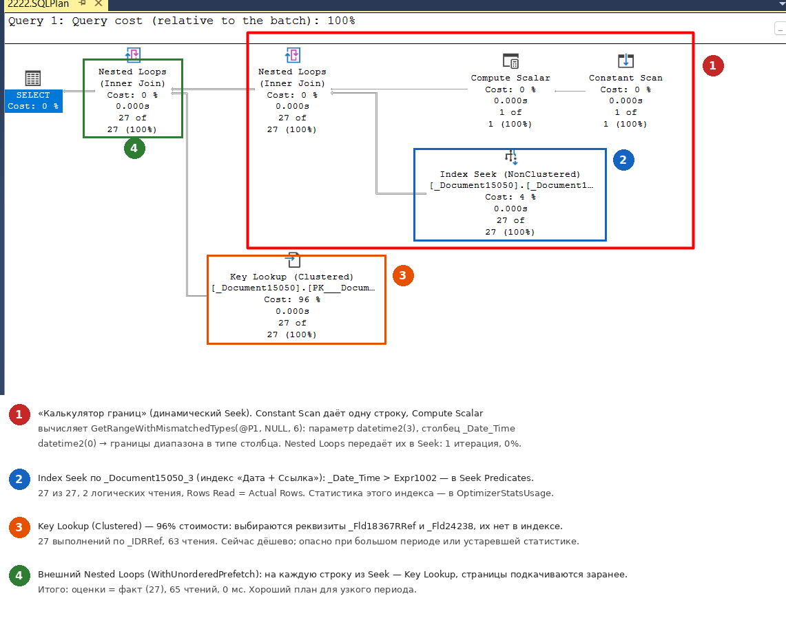
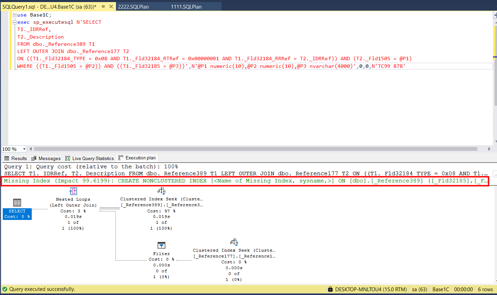

# П2. Разборы реальных планов запросов 1С

[← Кейсы](11-case-studies.md) · [Оглавление](../README.md) · [Соединения на реальных планах →](13-joins-real-plans.md)

Два пошаговых разбора **фактических** планов запросов 1С, пойманных в SQL Server Profiler (событие Showplan XML Statistics Profile, [вопрос 69а](08-1c-specifics.md#69а-практика-как-поймать-свой-запрос-1с-в-profiler-и-получить-его-план)). Учебные базы 1С, SQL Server 2019.

- **[Разбор 1](#разбор-1-отбор-документов-по-дате-key-lookup-и-динамический-seek)** — отбор документов по дате. На одном небольшом плане видно почти всё из методички: оценки и факт, Seek Predicates, Key Lookup, стоимость, статистика, параметры и характерная для 1С конструкция «динамический Seek».
- **[Разбор 2](#разбор-2-missing-index-где-искать-подсказку-и-почему-её-может-не-быть)** — отбор справочника по неиндексированному реквизиту: где искать подсказку Missing Index, почему её может не быть и как Seek по разделителю на деле читает всю таблицу.

**Файлы планов** (откройте в SSMS двойным щелчком — появится графический план, свойства по F4):
- [`plans/2222_date_range_key_lookup.sqlplan`](../plans/2222_date_range_key_lookup.sqlplan) — основной разбор: отбор документов по дате с Key Lookup;
- [`plans/11111_covered_index_seek.sqlplan`](../plans/11111_covered_index_seek.sqlplan) — для сравнения: отбор по реквизиту, покрывающий индекс;
- `plans/mi1…mi4_*.sqlplan` — разбор 2 (список — в его начале).

---

## Разбор 1. Отбор документов по дате: Key Lookup и динамический Seek



### 1. Что за запрос

Из плана восстанавливается примерно такой SQL:

```sql
SELECT T1._Fld18367RRef, T1._Fld24238
FROM dbo._Document15050 T1
WHERE T1._Date_Time > @P1             -- @P1 datetime2(3) = '4026-07-01 00:00:00.000'
```

В языке 1С это примерно `ВЫБРАТЬ Док.<Ссылочный реквизит>, Док.<Строковый реквизит> ИЗ Документ.… КАК Док ГДЕ Док.Дата > &Дата`. Дата `4026-07-01` — это 01.07.2026 со смещением +2000 лет ([вопрос 68](08-1c-specifics.md#68-как-запрос-1с-транслируется-в-sql-как-понять-объект-по-имени-таблицы)). Какие объекты и реквизиты скрываются за `_Document15050`, `_Fld18367RRef`, `_Fld24238`, покажет `ПолучитьСтруктуруХраненияБазыДанных()`.

### 2. Общая картина: свойства корневого SELECT

Выделите SELECT и нажмите F4 ([вопрос 55а](05-plans-operators.md#55а-анализ-плана-выполнения-по-стоимости-операторов), шаг 1):

| Свойство | Значение | Вывод |
|---|---|---|
| `Optimization Level` / `Reason For Early Termination` | FULL / GoodEnoughPlanFound | Полная оптимизация, штатная остановка, не Time Out |
| `Estimated Subtree Cost` | 0,082 | Дешёвый запрос |
| `CardinalityEstimationModelVersion` | 150 | Новая модель оценки (SQL Server 2019) |
| `CompileTime` / `CompileCPU` | 0 мс | — |
| `MemoryGrantInfo` | 0 | Sort и Hash нет, память не нужна |
| `Degree of Parallelism` | 1 | Последовательный план |
| `OptimizerStatsUsage` | `_Document15050_3`, обновлена 02.10.2026 19:33, `ModificationCount = 0`, выборка 100% | Свежая статистика, построена полным сканированием |
| `Parameter List` → `@P1` | `datetime2(3)`, Compiled = Runtime = `4026-07-01` | План строился под это же значение, sniffing без последствий ([вопрос 56](06-params-cache.md#56-parameter-sniffing)) |

### 3. Дерево плана

Данные идут справа налево ([вопрос 41](05-plans-operators.md#41-направление-чтения-плана-и-движение-данных)):

```text
SELECT
└─ Nested Loops (Inner Join), WithUnorderedPrefetch              ④  27 строк
   ├─ Nested Loops (Inner Join)                                  ①  27 строк
   │  ├─ Compute Scalar: GetRangeWithMismatchedTypes(@P1,NULL,6) ①   1 строка
   │  │  └─ Constant Scan                                        ①   1 строка
   │  └─ Index Seek [_Document15050_3] (Дата + Ссылка)           ②  27 строк, 2 чтения
   │        Seek: _Date_Time > Expr1002 AND _Date_Time < Expr1003
   └─ Key Lookup (Clustered Index Seek, Lookup = 1)              ③  27 выполнений, 63 чтения
         Seek: _IDRRef = T1._IDRRef;  Output: _Fld18367RRef, _Fld24238
```

| Оператор | Est. строк | Факт строк | Выполнений | Логических чтений | Стоимость |
|---|---|---|---|---|---|
| Constant Scan + Compute Scalar ① | 1 | 1 | 1 | — | 0% |
| Index Seek ② | 27 | 27 | 1 | 2 | ≈ 4% |
| Key Lookup ③ | 1 на выполнение × 27 | 27 | 27 | 63 | ≈ 96% |
| Nested Loops ④ | 27 | 27 | 1 | — | 0% |

Оценки везде совпали с фактом. Всего 65 логических чтений, 0 мс.

### 4. Фрагмент 1: «калькулятор границ» — динамический Seek

Самое непривычное место плана, и в планах 1С оно встречается постоянно. Параметр `@P1` — `datetime2(3)` (1С передаёт даты с миллисекундами), столбец `_Date_Time` — `datetime2(0)`. Поэтому перед Index Seek стоит связка **Constant Scan → Compute Scalar `GetRangeWithMismatchedTypes(@P1, NULL, 6)` → Nested Loops**: границы диапазона вычисляются в момент выполнения, поиск по индексу выполняется **один раз**, условие по дате остаётся в **Seek Predicates**.

Это безвредно. Тревожный признак другой — `CONVERT_IMPLICIT(…, _Date_Time)` в **Predicate**. Как устроена связка и что значит каждый оператор на этом плане — [вопрос 44а](05-plans-operators.md#44а-merge-interval-и-динамический-seek-гора-операторов-перед-index-seek).

### 5. Фрагмент 2: Index Seek по индексу «Дата + Ссылка»

- Индекс `_Document15050_3` — по ИТС это индекс документа «Дата + Ссылка» ([вопрос 77](08-1c-specifics.md#77-как-индексы-объектов-1с-отображаются-в-индексы-субд)).
- Условие по дате — в **Seek Predicates**, **Predicate** пуст. `Actual Rows Read = Actual Rows = 27`: прочитано ровно столько, сколько нужно ([вопрос 44](05-plans-operators.md#44-seek-predicate-и-predicate-residual)).
- 2 логических чтения: спуск по дереву и одна страница листьев.

### 6. Фрагмент 3: Key Lookup — 96% стоимости

- Запрос выбирает `_Fld18367RRef` (ссылочный реквизит) и `_Fld24238` (строковый). В индексе «Дата + Ссылка» их нет. Поэтому для каждой найденной строки — поход в кластерный индекс по `_IDRRef`: **27 выполнений, 63 чтения** (≈ 2,3 страницы на строку, [вопрос 43](05-plans-operators.md#43-key-lookup-и-rid-lookup)).
- `WithUnorderedPrefetch = 1` у внешнего Nested Loops ④ — сервер заранее подкачивает страницы кластерного индекса для дочитываний. Обычная оптимизация для Key Lookup.
- `AvgRowSize = 1027` у Key Lookup: оптимизатор считает строку широкой, около 1 КБ. Вероятно, `_Fld24238` — длинная строка ограниченной длины (LOB-чтений нет). В запросе с сортировкой такая ширина раздула бы memory grant ([вопрос 49](05-plans-operators.md#49-memory-grant)).

**Проверка формулы стоимости** ([вопрос 19](03-optimizer.md#19-что-такое-стоимость-плана)) на Key Lookup: одно выполнение — `EstimateIO = 0.003125` (одна страница) + `EstimateCPU = 0.0001581` (одна строка), это ровно первые слагаемые формул. Для 27 выполнений с поправками на кэширование страниц получаются 96% стоимости плана.

### 7. Статистика: какая использовалась и сколько их может быть

В этом плане в `OptimizerStatsUsage` **одна** статистика — `_Document15050_3`: статистика того самого индекса, по которому идёт Seek. Статистика индекса называется так же, как индекс. Её гистограмма построена по первому столбцу индекса, `_Date_Time`, — по ней и оценены «27 строк с датой больше 01.07.2026». Для Key Lookup статистика не нужна: поиск по уникальному ключу всегда даёт одну строку на выполнение.

**Статистик в списке может быть больше одной.** Например, в плане [`11111_covered_index_seek.sqlplan`](../plans/11111_covered_index_seek.sqlplan) (отбор по одному реквизиту) их **одиннадцать**, с `_Document15050_1` по `_Document15050_11`. В `OptimizerStatsUsage` попадают **все статистики, которые оптимизатор загружал**, пока рассматривал пути доступа, а не только та, что определила итоговую оценку. Как найти нужную — в [вопросе 39](04-statistics.md#если-статистик-в-списке-несколько-как-найти-нужную).

### 8. Где ещё лежит этот план

Этот разбор сделан по файлу из Profiler. Тот же план можно достать запросом: из кэша (предполагаемый), из кэша с `LAST_QUERY_PLAN_STATS` (последний фактический, SQL Server 2019+) или из Query Store (вся история, переживает перезапуск). Подробности и запросы — в [вопросе 59](06-params-cache.md#откуда-взять-план-и-сколько-он-хранится).

### 9. Итог и что может пойти не так

**Сейчас план хороший:** точная оценка, свежая статистика, условие в Seek Predicates, 65 чтений, 0 мс. Для выборки из 27 строк Seek + Key Lookup — правильный выбор.

**Когда станет плохим:**
1. **Период растёт.** «Больше 01.07.2026» на рабочей базе — это, например, не 27, а 30 000 документов: 30 000 Key Lookup, около 70 000 чтений. При **правильной** оценке оптимизатор сам перейдёт на скан за точкой перелома ([вопрос 42](05-plans-operators.md#42-table-scan-clustered-index-scan-index-seek-всегда-ли-scan--плохо)).
2. **Оценка неверная — главный риск этого запроса.** Условие «дата больше недавней» — классика **восходящего ключа** ([вопрос 35](04-statistics.md#35-проблема-восходящего-ключа)). Если статистику по дате давно не обновляли, свежих документов в гистограмме нет: оценка около 1 строки, план «Seek + Key Lookup», а фактически приходят тысячи строк. На рабочей базе первым делом смотрите `LastUpdate` и `ModificationCount` в `OptimizerStatsUsage`.

**Как убрать Key Lookup средствами 1С:**
- выбирать только нужные поля;
- дополнительный индекс (лицензия КОРП): ключ — «Дата», `_Fld18367RRef` и `_Fld24238` — «Дополнительные» поля (`INCLUDE`). Тогда план — один Index Seek;
- не создавать индекс вручную в СУБД: он пропадёт при реструктуризации.

### 10. Сравнение с планом 11111

| | План 11111: `_Fld27355 = @P1` | План 2222: `_Date_Time > @P1` |
|---|---|---|
| Индекс | `_Document15050_8`: Реквизит + Ссылка | `_Document15050_3`: Дата + Ссылка |
| Покрытие | **Да**: выбиралась только `_IDRRef` — она в индексе ([вопрос 4](01-storage.md#ключ-кластеризации-в-индексе-неявно-или-явно)) | **Нет**: выбираются реквизиты → Key Lookup |
| Тип параметра | `nvarchar(4000)` = тип столбца → обычный Seek | `datetime2(3)` ≠ `datetime2(0)` → динамический Seek |
| Оценка / факт | 94 / 94 | 27 / 27 |
| Логических чтений | 6 | 65 (2 Seek + 63 Lookup) |
| Статистик в `OptimizerStatsUsage` | 11 | 1 |
| Проверка формулы CPU | `EstimateCPU = 0.0002604` = 0,0001581 + 0,0000011 × 93 ✓ | Key Lookup: 0,0001581 на выполнение ✓ |
| Главный риск | Минимальный | Восходящий ключ при устаревшей статистике |

В плане 11111 условию соответствуют 94 строки из 194 — почти половина таблицы, и всё равно выбран Seek. Индекс **покрывает** запрос: Key Lookup не нужен, и точки перелома нет. Покрывающему индексу доля строк не страшна.

### 11. Чек-лист разбора любого плана (по этому примеру)

1. **SELECT, F4:** Optimization Level, причина остановки, стоимость, MemoryGrant, параметры (Compiled и Runtime), `OptimizerStatsUsage` (свежесть статистики).
2. **Справа налево по операторам:** оценка против факта, число выполнений, логические чтения.
3. **Операторы чтения:** Seek или Scan, Seek Predicates или Predicate, `Rows Read` против `Actual Rows`.
4. **Key Lookup / RID Lookup:** сколько выполнений, какие столбцы дочитываются (`Output List`), нет ли Predicate на Lookup.
5. **Нестандартные фрагменты:** динамический Seek (`GetRange…`) — норма, `CONVERT_IMPLICIT` на столбце — проблема, Spool, Sort, Hash — смотреть грант и spill.
6. **Риски:** что будет при росте данных, при устаревшей статистике, при другом значении параметра.

---

## Разбор 2. Missing Index: где искать подсказку и почему её может не быть

Теория — в [вопросе 54](05-plans-operators.md#54--почему-нельзя-слепо-создавать-индексы-по-missing-index): откуда берутся подсказки, как их читать и почему нельзя создавать индексы вслепую. Здесь — как это выглядит на реальной базе 1С.

Учебная база 1С (SQL Server 2019, база с разделителем `_Fld1505`), справочник `ТранспортныеСредства` (`_Reference389`), 100 000 элементов. Реквизит `Марка` (`_Fld32185`, строка) **не индексирован**, все значения уникальны. Задача — отобрать один элемент по марке и увидеть, что сервер просит индекс.

**Где смотреть.** Подсказка — это **зелёная строка над графическим планом**, сразу под текстом запроса («Missing Index (Impact 99.6199): CREATE NONCLUSTERED INDEX …»). Значков на операторах нет, жёлтого треугольника тоже.



Строка обрезается по ширине окна. Полный текст: правой кнопкой по плану → **Missing Index Details…** (SSMS откроет готовый `CREATE INDEX` в новом окне) или **Show Execution Plan XML…** → найти `<MissingIndexes>`. В свойствах SELECT (F4) подсказка тоже есть, в разделе Missing Indexes.

**Почему подсказки может не быть** — три ловушки, на которые легко наткнуться при первом опыте:

| Что делали | Что в SQL | Почему нет подсказки |
|---|---|---|
| Простой отбор из одной таблицы: `ГДЕ ТС.Марка = &Марка` | `SELECT T1._IDRRef FROM _Reference389 T1 WHERE T1._Fld32185 = @P1` | Индексов с `_Fld32185` нет, выбирать не из чего — запрос может получить **тривиальный план** (`Optimization Level = TRIVIAL` в свойствах SELECT), а для него подсказки не формируются ([вопрос 21](03-optimizer.md#21-trivial-plan)) |
| Отбор через точку от составного реквизита: `ГДЕ ТС.Составной.Наименование = &Имя` | `LEFT JOIN` ко всем таблицам типа по `_IDRRef` + условие на `CASE WHEN … THEN T2._Description … END` | Соединения идут по кластерному индексу (`_IDRRef`) — им нечего подсказывать, а условие на `CASE` несаргабельно, и под выражение индекс не предлагается ([вопрос 73](08-1c-specifics.md#73-точка-от-составного-типа-и-выразить)) |
| План взят из технологического журнала (`plansql`) | Текстовый план | В текстовом плане раздела Missing Index нет. Подсказки есть только в **XML-плане** (SSMS, Profiler — Showplan XML, XE) и в DMV |

**Как получить подсказку.** Дать оптимизатору выбор, чтобы план стал `FULL`. Достаточно соединения — например, взять поле из другого справочника через `ВЫРАЗИТЬ` от составного реквизита:

```bsl
ВЫБРАТЬ
    ТС.Ссылка,
    ВЫРАЗИТЬ(ТС.<СоставнойРеквизит> КАК Справочник.<Справочник>).Наименование
ИЗ Справочник.ТранспортныеСредства КАК ТС
ГДЕ ТС.Марка = &Марка
```

```sql
exec sp_executesql N'SELECT T1._IDRRef, T2._Description
FROM dbo._Reference389 T1
LEFT OUTER JOIN dbo._Reference177 T2
ON ((T1._Fld32184_TYPE = 0x08 AND T1._Fld32184_RTRef = 0x000000B1 AND T1._Fld32184_RRRef = T2._IDRRef)) AND (T2._Fld1505 = @P1)
WHERE ((T1._Fld1505 = @P2)) AND ((T1._Fld32185 = @P3))',
N'@P1 numeric(10),@P2 numeric(10),@P3 nvarchar(4000)', 0, 0, N'ТС99 878'
```

Проверить можно и без изменения запроса: в SSMS добавить к тексту `OPTION (QUERYTRACEON 8757)` (отключает тривиальный план, нужны права sysadmin, только на тестовом сервере).

**Что получилось** — файлы планов из трассы Profiler (Showplan XML Statistics Profile):

| Файл | Что это |
|---|---|
| [`mi1_statman_composite_rtref.sqlplan`](../plans/mi1_statman_composite_rtref.sqlplan), [`mi2_…_type`](../plans/mi2_statman_composite_type.sqlplan), [`mi3_…_rrref`](../plans/mi3_statman_composite_rrref.sqlplan) | **Не наш запрос.** Автосоздание статистики `_WA_Sys_` по трём частям составного реквизита `_Fld32184` (`_RTRef`, `_TYPE`, `_RRRef`): Clustered Index Scan → Segment → Sequence Project → Sort → Stream Aggregate с функцией `STATMAN`. Выборка 51 388 строк из 100 000, по 1 205 чтений. Появляются в трассе **перед** планом запроса при первой компиляции и пропадают при повторном выполнении ([вопрос 33](04-statistics.md#как-именно-создаётся-автостатистика)). Missing Index в них искать бесполезно |
| [`mi4_missing_index_separator_seek.sqlplan`](../plans/mi4_missing_index_separator_seek.sqlplan) | Наш запрос: `Optimization Level = FULL`, Missing Index с Impact 99.62 |

Разбор плана `mi4`:

1. **Подсказка.** `<MissingIndexGroup Impact="99.6199">`, таблица `_Reference389`, EQUALITY: `[_Fld32185], [_Fld1505]`. Порядок — по `column_id` (11 и 17), а не рекомендация. В подсказку попал и разделитель `_Fld1505`, потому что в `WHERE` он тоже стоит равенством.
2. **Seek, который на деле Scan.** Оператор у T1 называется **Clustered Index Seek**, стоимость 97%, но `Estimated Number of Rows to be Read = 100000` и **2 340 логических чтений** ради одной строки. Кластерный индекс `_Reference389_S_HPK` начинается с разделителя; Seek Predicate `_Fld1505 = @P2 (0)` подходит **всем** строкам, а условие по марке проверяется остаточным Predicate на каждой. Название оператора обманывает — смотрите Rows Read против Actual Rows ([вопрос 44](05-plans-operators.md#44-seek-predicate-и-predicate-residual)). На базах 1С с разделителями это типичная картина.
3. **Соединение не выполнялось.** Перед Seek по `_Reference177` стоит Filter по `_Fld32184_TYPE = 0x08 AND _Fld32184_RTRef = 0x000000B1` с `Actual Rows = 0`: у найденного ТС составной реквизит пуст или указывает на другую таблицу, поэтому нижняя ветка не запускалась (0 сканов, 0 чтений), а `_Description` = NULL.
4. **Жёлтого треугольника нет** — и не должно быть: неявных преобразований нет (`nvarchar` ↔ `nvarchar`, `numeric` ↔ `numeric`), статистика по всем столбцам создана автоматически (планы `mi1–mi3`), Sort и Hash нет — значит, и spill нет ([вопрос 53](05-plans-operators.md#53-предупреждения-в-плане)).

**Что делать с подсказкой в 1С.** Не `CREATE INDEX` в SSMS (пропадёт при реструктуризации), а реквизит `Марка` → **«Индексировать»**. Платформа создаст индекс `(_Fld1505, _Fld32185, _IDRRef)` — для двух равенств порядок не важен, а `_IDRRef` уже в ключе, поэтому Key Lookup не понадобится. Ожидаемый результат «после»: Index Seek по новому индексу, единицы логических чтений вместо 2 340, зелёная строка исчезнет.

Демонстрация на учебных данных: как подсказка появляется, как её прочитать и как проверить результат — [`21_missing_index_demo.sql`](../sql/21_missing_index_demo.sql).

---

[← Кейсы](11-case-studies.md) · [Оглавление](../README.md) · [Соединения на реальных планах →](13-joins-real-plans.md)
