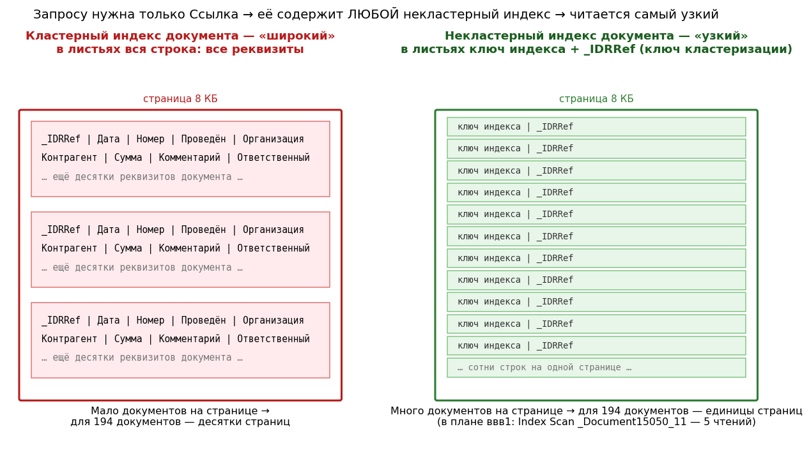
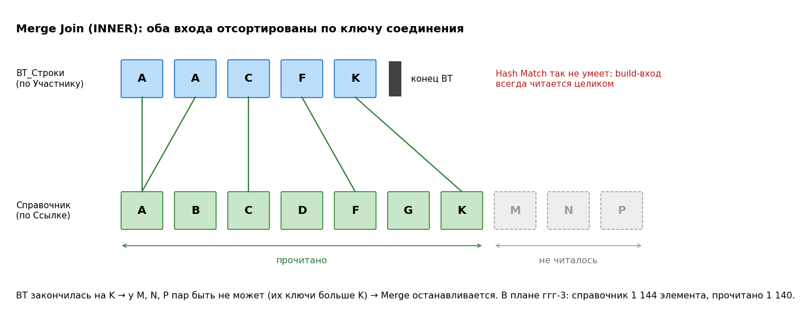

# 13. Соединения на реальных планах 1С: Nested Loops, Hash Match, Merge Join

[← Разборы реальных планов](12-real-plan-walkthrough.md) · [Оглавление](../README.md) · [RLS на реальных планах →](14-rls-real-plans.md)

Сводный разбор четырёх серий **фактических** планов одной учебной базы (SQL Server 2019, уровень совместимости 150), пойманных в Profiler ([вопрос 69а](08-1c-specifics.md#69а-практика-как-поймать-свой-запрос-1с-в-profiler-и-получить-его-план)). Объекты одни и те же, а запросы отличаются отбором, выбираемыми полями и использованием временной таблицы. От этого меняется алгоритм соединения. Теория — в [вопросах 45–47](05-plans-operators.md#45-nested-loops-merge-join-и-hash-match), здесь — как она выглядит на настоящих планах 1С.

**Файлы планов** (открываются в SSMS двойным щелчком, свойства — F4):

| Серия | Файлы | Что иллюстрирует |
|---|---|---|
| ббб | [`bbb1_nested_loops_where.sqlplan`](../plans/bbb1_nested_loops_where.sqlplan), [`bbb2_nested_loops_on.sqlplan`](../plans/bbb2_nested_loops_on.sqlplan) | Nested Loops; условие в `ГДЕ` и в `ПО` — один план; `Time Out` у дешёвого запроса |
| ввв | [`vvv1_hash_match.sqlplan`](../plans/vvv1_hash_match.sqlplan) | Hash Match; узкий индекс вместо кластерного; лишнее соединение |
| ггг | [`ggg1_service_check_temp_table.sqlplan`](../plans/ggg1_service_check_temp_table.sqlplan), [`ggg2_insert_into_temp_table.sqlplan`](../plans/ggg2_insert_into_temp_table.sqlplan), [`ggg3_merge_join.sqlplan`](../plans/ggg3_merge_join.sqlplan) | Пакет по шагам: служебная проверка, вставка в ВТ с Sort, Merge Join без Sort; статистика ВТ |

---

## 1. Объекты и данные

| Объект 1С | Таблица СУБД | Строк | Кластерный индекс (по ИТС) |
|---|---|---|---|
| Документ «УниверсальныйЭлектронныйДокументПоставщика» | `_Document15050` | 194 | Ссылка (`_IDRRef`) |
| Его табличная часть «УчастникиДО» | `_Document15050_VT61797` | 408 | Ссылка документа + Ключ |
| Справочник «ЭдоОбщийУчастникиДО» | `_Reference61214` | 1 144 | Ссылка (`_IDRRef`) |

Есть и некластерные индексы документа: «Дата + Ссылка» (`_Document15050_3`) и узкие индексы по реквизитам или номеру (например, `_Document15050_11`). Индекса по реквизиту табличной части `Участник` (`_Fld61800RRef`) нет, по этому столбцу есть только автостатистика `_WA_Sys_` ([вопрос 33](04-statistics.md#как-именно-создаётся-автостатистика)).

## 2. Четыре эксперимента — сводка

| Серия | Что менялось | Алгоритм соединения | Строк в результате | Логических чтений | Память |
|---|---|---|---|---|---|
| **ббб** | Отбор `Дата > &НачалоПериода` (26 документов); со справочника — только Ссылка | **Nested Loops + Seek** | 12 | 160 | 0 |
| **ввв** | Без отбора; со справочника — Наименование, ИНН, КПП | **Hash Match + Scan** | 358 | 129 | 2,5 МБ |
| **Merge (хинт)** | Запрос ввв с `OPTION (MERGE JOIN)` в SSMS — эксперимент | Одно слияние без Sort, второе с Sort | 358 | — | Под Sort |
| **ггг** | Пакет: ВТ из табличной части с `ИНДЕКСИРОВАТЬ ПО Участник`, затем соединение со справочником | **Merge Join без Sort** | 358 | 9 + 5 + 115 | 1 МБ под Sort при вставке, у SELECT 0 |

---

## 3. Nested Loops: «мало строк сверху + индекс снизу» (серия ббб)

```bsl
ВЫБРАТЬ
    УчастникиДО.Ссылка КАК Ссылка,
    Участники.Ссылка КАК Ссылка1
ИЗ
    Документ.УниверсальныйЭлектронныйДокументПоставщика.УчастникиДО КАК УчастникиДО
        ВНУТРЕННЕЕ СОЕДИНЕНИЕ Справочник.ЭдоОбщийУчастникиДО КАК Участники
        ПО УчастникиДО.Участник = Участники.Ссылка
        ВНУТРЕННЕЕ СОЕДИНЕНИЕ Документ.УниверсальныйЭлектронныйДокументПоставщика КАК Док
        ПО УчастникиДО.Ссылка = Док.Ссылка
ГДЕ
    Док.Дата > &НачалоПериода
```

```text
Nested Loops                                                  12 строк (оценка ≈ 91)
├─ Nested Loops                                               58 строк (оценка ≈ 91)
│  ├─ [динамический Seek] Index Seek _Document15050_3          26 документов (оценка 26), 2 чтения
│  │     (Дата + Ссылка), _Date_Time > @P1
│  └─ Clustered Index Seek _Document15050_VT61797_SK           26 выполнений → 58 строк, 54 чтения
│        табличная часть, по ссылке документа
└─ Clustered Index Seek PK _Reference61214                     58 выполнений → 12 строк, 104 чтения
      справочник, по Участнику
```

- **Почему Nested Loops.** Отбор по дате даёт мало строк сверху (26 из 194). На каждом шаге снизу есть точный поиск по кластерному индексу: табличная часть — по ссылке документа, справочник — по ссылке. 26 + 58 коротких поисков дешевле, чем читать таблицы целиком ([вопрос 46](05-plans-operators.md#46-внешний-и-внутренний-вход-nested-loops)).
- **Порядок выбран правильно:** начать с самого селективного условия (дата), идти от документов к их строкам, от строк к справочнику. Перед поиском по дате — знакомый «калькулятор границ» — динамический Seek ([вопрос 44а](05-plans-operators.md#44а-merge-interval-и-динамический-seek-гора-операторов-перед-index-seek)).
- **Стоимость:** ≈ 86% — поиски по справочнику (58 выполнений, 104 из 160 чтений), ≈ 12% — табличная часть, ≈ 2% — поиск документов.

**Оценки расходятся, но в безопасную сторону:**

| Шаг | Оценка | Факт | Почему |
|---|---|---|---|
| Документов по дате | 26 | 26 | Гистограмма по `_Date_Time`, свежая статистика |
| Строк табличной части | ≈ 91 | 58 | 26 документов × 3,5 строки в среднем (плотность) |
| После соединения со справочником | ≈ 91 | **12** | Модель вложенности: оптимизатор считает, что каждый `Участник` найдётся в справочнике. На деле у многих строк реквизит **пустой** (или ссылка «битая»). Внешних ключей 1С не создаёт, поэтому оптимизатор не может знать этого заранее |

**Статистики** (`OptimizerStatsUsage`) — пять, у каждой своя роль ([вопрос 39](04-statistics.md#если-статистик-в-списке-несколько-как-найти-нужную)):

| Статистика | Для чего использована |
|---|---|
| `_Document15050_3` | Оценка «Дата > @P1»: гистограмма по `_Date_Time` |
| `_Document15050_VT61797_SK` | Соединение «документ → строки табличной части» по ссылке |
| `_WA_Sys_00000005_…` на табличной части | Автостатистика по пятому столбцу — `Участник`, для соединения со справочником |
| `PK…` справочника | Сторона «одного» в соединении `Участник = Ссылка` |
| `PK…` документа | Соединение табличной части с документом |

**Условие в `ГДЕ` или в `ПО` — один план.** Во втором варианте запроса (ббб2) условие по дате перенесено из `ГДЕ` в условие соединения: `ПО (УчастникиДО.Ссылка = Док.Ссылка) И (Док.Дата > &НачалоПериода)`. `QueryHash` у вариантов разный, `QueryPlanHash` — одинаковый; что это значит для кэша планов (две записи и две компиляции, а не переиспользование) — в [вопросе 13](02-query-pipeline.md#13-кэш-планов-когда-план-берётся-из-кэша-а-когда-компилируется), там же значения хешей.

Для **внутреннего** соединения условие в `WHERE` и в `ON` логически эквивалентно: при упрощении оптимизатор опускает его к таблице документа ([вопрос 23](03-optimizer.md#23-упрощение-simplification)). Для **левого** соединения место условия **меняет результат**:
- в `ПО` строки без подходящего документа останутся с `NULL`;
- в `ГДЕ` они отсеются, и левое соединение фактически станет внутренним.

Это прямая аналогия с параметрами виртуальных таблиц ([вопрос 70](08-1c-specifics.md#70-параметры-виртуальных-таблиц--в-скобках-а-не-в-где)).

**`StatementOptmEarlyAbortReason = TimeOut` — здесь безвреден.** Запрос стоит 0,2 единицы, бюджет перебора у него крошечный, и найденный план при этом хороший. Почему у дешёвого запроса это норма — в [вопросе 20](03-optimizer.md#20-достаточно-хороший-план-good-enough-plan-found-и-time-out).

**Возможная оптимизация: соединение как фильтр существования.** Со справочника берётся только `Участники.Ссылка`, а это то же значение, что `УчастникиДО.Участник`. Соединение лишь отсеивает строки, чей участник в справочнике не найден. Если цель — отсеять пустые ссылки, соединение можно убрать:

```bsl
ВЫБРАТЬ
    УчастникиДО.Ссылка КАК Ссылка,
    УчастникиДО.Участник КАК Ссылка1
ИЗ
    Документ.УниверсальныйЭлектронныйДокументПоставщика.УчастникиДО КАК УчастникиДО
        ВНУТРЕННЕЕ СОЕДИНЕНИЕ Документ.УниверсальныйЭлектронныйДокументПоставщика КАК Док
        ПО УчастникиДО.Ссылка = Док.Ссылка
ГДЕ
    Док.Дата > &НачалоПериода
    И УчастникиДО.Участник <> ЗНАЧЕНИЕ(Справочник.ЭдоОбщийУчастникиДО.ПустаяСсылка)
```

Это минус 58 поисков по справочнику — около 86% стоимости. Оговорка: «битые» ссылки на удалённые элементы этот вариант не отсечёт, а внутреннее соединение отсекало. SQL Server не убрал соединение сам: для этого нужен **доверенный внешний ключ** ([вопрос 23](03-optimizer.md#23-упрощение-simplification)), а 1С их не создаёт.

---

## 4. Hash Match: «всё со всем, без порядка» (серия ввв)

Тот же запрос **без отбора**, со справочника — реквизиты:

```bsl
ВЫБРАТЬ
    УчастникиДО.Ссылка КАК Ссылка,
    Участники.НаименованиеПолное КАК НаименованиеПолное,
    Участники.ИНН КАК ИНН,
    Участники.КПП КАК КПП
ИЗ
    Документ.УниверсальныйЭлектронныйДокументПоставщика.УчастникиДО КАК УчастникиДО
        ВНУТРЕННЕЕ СОЕДИНЕНИЕ Справочник.ЭдоОбщийУчастникиДО КАК Участники
        ПО УчастникиДО.Участник = Участники.Ссылка
        ВНУТРЕННЕЕ СОЕДИНЕНИЕ Документ.УниверсальныйЭлектронныйДокументПоставщика КАК Док
        ПО УчастникиДО.Ссылка = Док.Ссылка
```

```text
Hash Match (Inner Join)  build: результат ниже ⟵ probe: справочник       358 строк (оценка 408)
├─ Hash Match (Inner Join)  build: документ ⟵ probe: табличная часть     408 строк
│  ├─ Index Scan _Document15050_11  (узкий индекс документа)            194 строки, 5 чтений
│  └─ Clustered Index Scan _Document15050_VT61797_SK                    408 строк, 9 чтений
└─ Clustered Index Scan PK _Reference61214  (строки ≈ 1 106 байт)        1 144 строки, 115 чтений
```

| Свойство | Значение |
|---|---|
| Стоимость | 0,165 |
| Причина остановки | GoodEnoughPlanFound |
| Memory grant | Запрошено и выдано 2 520 КБ, использовано максимум 976 КБ; `IsMemoryGrantFeedbackAdjusted = No: First Execution` |
| Логических чтений | 5 + 9 + 115 = 129 |

- **Почему Hash.** Нужны **все** строки трёх таблиц. Один скан каждой (129 чтений) плюс сопоставление в памяти дешевле, чем 408 поисков по справочнику (≈ 1 000 чтений) и 408 поисков по документу.
- **Build и probe выбраны правильно.** Нижнее соединение: build — документы (194 узкие строки), probe — табличная часть. Верхнее: build — результат первого соединения (408 строк по 39 байт), probe — широкие строки справочника (1 144 по 1 106 байт). Хеш-таблица строится по меньшему и узкому входу ([вопрос 45](05-plans-operators.md#45-nested-loops-merge-join-и-hash-match)).
- **Справочник — 115 из 129 чтений:** строки широкие из-за `НаименованиеПолное` и других длинных строк. На 1 144 элементах это пустяк. На справочнике в сотни тысяч элементов это кандидат на отбор или на дополнительный покрывающий индекс (КОРП).
- **Память выдана с запасом:** 2 520 КБ при максимальном использовании 976 КБ. Это первое выполнение; при повторах SQL Server 2019 может скорректировать грант сам (memory grant feedback, [вопрос 49](05-plans-operators.md#49-memory-grant)). На больших таблицах переоценка грантов приводит к ожиданиям `RESOURCE_SEMAPHORE`, а недооценка — к spill в tempdb ([вопрос 48](05-plans-operators.md#48-sort-и-hash-match-aggregate-блокирующие-операторы-и-spill)).
- **Оценка 408 против факта 358** — та же модель вложенности, что в ббб: у 50 строк участник пустой.

### Узкий индекс вместо кластерного

**Ширина индекса** — сколько байт занимает одна его строка на листовом уровне. От неё зависит, сколько строк помещается на страницу 8 КБ, а значит, сколько страниц придётся прочитать при скане.



| | Кластерный индекс документа | Некластерный индекс документа |
|---|---|---|
| Что лежит в листьях | **Вся строка**: дата, номер, проведён, все реквизиты (у документа 1С их десятки) | Только **ключ индекса + ключ кластеризации** (`_IDRRef`) |
| Ширина строки | Сотни байт и больше | Десятки байт |
| Строк на страницу | Единицы — десятки | Сотни |
| Страниц для 194 документов | Десятки | Единицы |

**Почему выбран `_Document15050_11`.** От документа запросу нужна была **только ссылка** — для соединения с табличной частью. А ссылка есть в **каждом** некластерном индексе документа: это ключ кластеризации, он всегда попадает в некластерный индекс ([вопрос 4](01-storage.md#ключ-кластеризации-в-индексе-неявно-или-явно)). Значит, запрос покрывает **любой** из индексов документа, и оптимизатор выбрал тот, у которого меньше всего страниц: 5 логических чтений. Читать кластерный индекс значило бы поднять все реквизиты всех документов ради одного столбца. Тот же приём у `SELECT COUNT(*)`: строки считаются по самому узкому индексу таблицы ([вопрос 42](05-plans-operators.md#42-table-scan-clustered-index-scan-index-seek-всегда-ли-scan--плохо)).

**Плата за узость — порядок.** `_Document15050_11` отсортирован по своему ключу (реквизиту или номеру), а **не** по ссылке. Для Hash Match порядок не нужен, поэтому узкий индекс подошёл идеально. Для Merge Join по ссылке нужен порядок по `_IDRRef`, а его даёт только кластерный индекс (раздел 5).

**Лишнее соединение с документом.** От документа в этом запросе не берётся ни одного поля, и по нему нет отбора. Строка табличной части **всегда** принадлежит существующему документу, поэтому соединение ничего не отсеивает. SQL Server не может убрать его сам (нет внешнего ключа), а разработчик может:

```bsl
ВЫБРАТЬ
    УчастникиДО.Ссылка КАК Ссылка,
    Участники.НаименованиеПолное, Участники.ИНН, Участники.КПП
ИЗ
    Документ.УниверсальныйЭлектронныйДокументПоставщика.УчастникиДО КАК УчастникиДО
        ВНУТРЕННЕЕ СОЕДИНЕНИЕ Справочник.ЭдоОбщийУчастникиДО КАК Участники
        ПО УчастникиДО.Участник = Участники.Ссылка
```

Минус один Hash Match и один скан. В серии ббб соединение с документом было **нужно**: там по нему шёл отбор по дате.

**Главное на рабочей базе — отбор.** Запрос без отбора тянет **все** строки табличной части всех документов. Сейчас их 408, в рабочей базе могут быть миллионы — тогда хеш-таблицам нужен большой грант, а при недооценке возможен spill. С отбором по периоду, как в ббб, запрос переходит на точечные поиски и почти не зависит от размера базы.

---

## 5. Merge Join: «два готовых порядка»

**Условие Merge** — оба входа отсортированы по ключу соединения ([вопрос 47](05-plans-operators.md#47-почему-merge-join-требует-отсортированных-входов)).

### Почему в запросе ввв Merge не выбран

| Соединение | Порядок входов | Merge возможен? |
|---|---|---|
| Табличная часть ⋈ документ (по ссылке документа) | Табличная часть кластеризована по ссылке документа, документ — по ссылке: **оба готовы** | Да, без Sort. Но документ пришлось бы читать **кластерным** (широким) индексом, а Hash обошёлся узким на 5 страниц — дешевле |
| Табличная часть ⋈ справочник (по участнику) | Справочник отсортирован по ссылке, табличная часть — **нет** (порядок по документу, а не по участнику) | Только с Sort по `_Fld61800RRef` |

Два Merge подряд «бесплатно» не получатся: после первого соединения поток отсортирован по ссылке документа, а второму нужен порядок по участнику.

**Как узнать цену Merge — хинт в SSMS (только для эксперимента):**

```sql
SELECT T1._Document15050_IDRRef, T2._Fld61236, T2._Fld61237, T2._Fld61238
FROM dbo._Document15050_VT61797 T1
JOIN dbo._Reference61214 T2 ON T1._Fld61800RRef = T2._IDRRef
JOIN dbo._Document15050  T3 ON T1._Document15050_IDRRef = T3._IDRRef
OPTION (MERGE JOIN);     -- все соединения — только слиянием; порядок таблиц выбирает оптимизатор
```

Ожидаемая картина: «табличная часть ⋈ документ» — Merge без Sort по двум упорядоченным кластерным индексам; соединение со справочником — Merge **с Sort** на стороне табличной части; на SELECT — грант под Sort и стоимость выше 0,165. Это и есть ответ, почему оптимизатор Merge не выбрал. `OPTION (MERGE JOIN)` ограничивает только алгоритм. Хинт в `FROM` (`INNER MERGE JOIN`) фиксирует ещё и порядок всех таблиц ([вопрос 28](03-optimizer.md#28-хинты-запросов-и-таблиц-почему-это-крайняя-мера)). В запрос 1С хинт не вставить.

### Как получить Merge «естественно» средствами 1С

1. **Индекс по полю соединения.** Убрать лишнее соединение с документом и установить у реквизита табличной части `Участник` флаг «Индексировать» — по ИТС появится индекс «Реквизит + Ссылка» ([вопрос 77](08-1c-specifics.md#77-как-индексы-объектов-1с-отображаются-в-индексы-субд)). Оба входа станут упорядочены по участнику. Будет ли выбран Merge, решит стоимость: на сотнях строк скорее нет, на десятках или сотнях тысяч — обычно да.
2. **Временная таблица с `ИНДЕКСИРОВАТЬ ПО`** — серия ггг ниже.

### Серия ггг: Merge Join через временную таблицу

```bsl
ВЫБРАТЬ
    УчастникиДО.Ссылка КАК Ссылка,
    УчастникиДО.Участник КАК Участник
ПОМЕСТИТЬ ВТ_Строки
ИЗ
    Документ.УниверсальныйЭлектронныйДокументПоставщика.УчастникиДО КАК УчастникиДО
ИНДЕКСИРОВАТЬ ПО
    УчастникиДО.Участник
;
ВЫБРАТЬ
    ВТ.Ссылка КАК Ссылка,
    Участники.НаименованиеПолное, Участники.ИНН, Участники.КПП
ИЗ
    ВТ_Строки КАК ВТ
        ВНУТРЕННЕЕ СОЕДИНЕНИЕ Справочник.ЭдоОбщийУчастникиДО КАК Участники
        ПО ВТ.Участник = Участники.Ссылка
```

В трассе этот пакет дал **три плана** — подтверждение того, что пакет 1С выполняется в СУБД по шагам ([вопрос 39а](08-1c-specifics.md#как-пакет-1с-с-временными-таблицами-выполняется-в-субд)).

**План ггг-1 — служебная проверка платформы:**

```text
Compute Scalar (1)
└─ Filter [StartupExpression]: object_id(N'tempdb..#tt1') IS NOT NULL       0 строк
   └─ Constant Scan                                                         не выполнялся
```

Это не ваш запрос, а служебный запрос платформы «существует ли уже `#tt1` в этом соединении». `Filter` с `StartupExpression` проверяет условие **один раз, до** чтения своего входа. Условие ложно, поэтому Constant Scan даже не запускался (выполнений — 0). Стоимость практически нулевая. Сами `CREATE TABLE` и `CREATE INDEX` планов не дают — это DDL.

**План ггг-2 — заполнение ВТ (первый запрос пакета):**

```text
Clustered Index Insert [#tt1].[idx1]                    408 строк
└─ Sort  ORDER BY _Fld61800RRef (Участник)              408 строк, грант 1 МБ (использовано 32 КБ)
   └─ Clustered Index Scan _Document15050_VT61797_SK    408 строк, 9 чтений
```

- **`ИНДЕКСИРОВАТЬ ПО` — это кластерный индекс `idx1` на `#tt1`, созданный до заполнения.** Вставка идёт сразу в упорядоченную структуру (`Clustered Index Insert`).
- **Sort перед вставкой** (`DMLRequestSort = 1`): строки сортируются по ключу индекса, чтобы вставлять их подряд, а не вразброс по страницам. Под это нужен небольшой грант.
- **`Optimization Level = TRIVIAL`:** один источник и, по сути, один способ его прочитать ([вопрос 21](03-optimizer.md#21-trivial-plan)).

**План ггг-3 — второй запрос пакета: Merge Join:**

```text
Merge Join (Inner Join)   Many to Many = False                    358 строк (оценка 408)
├─ Clustered Index Scan PK _Reference61214   Ordered = True       1 140 строк, 115 чтений
│     справочник, отсортирован по _IDRRef
└─ Clustered Index Scan [#tt1].[idx1]        Ordered = True       408 строк, 5 чтений
      ВТ_Строки, отсортирована по Участнику (_Q_000_F_001RRef)
```

- **Оба входа уже отсортированы по ключу соединения:** справочник — кластерным индексом по `_IDRRef`, временная таблица — кластерным `idx1` по участнику. Оба скана с `Ordered = True`, **Sort перед слиянием нет**.
- **`Many to Many = False`:** на стороне справочника ключ уникален, worktable в tempdb не нужен.
- **Memory grant = 0** (у Hash Match в ввв — 2,5 МБ): Merge без Sort памяти не требует.
- **Справочника прочитано 1 140 строк из 1 144** — см. ниже, почему.
- Поля временной таблицы в SQL — `_Q_000_F_000RRef`, `_Q_000_F_001RRef`: так платформа именует поля ВТ (запрос 0, поля 0 и 1).
- Оценка 408 против 358 — та же модель вложенности.

**Статистика временной таблицы.** В `OptimizerStatsUsage` плана ггг-3 есть статистика самой ВТ:

| Статистика | LastUpdate | ModificationCount | SamplingPercent |
|---|---|---|---|
| `#tt1 … idx1` | момент выполнения пакета | 0 | 100 |
| PK справочника | 02.10.2026 19:35 | 0 | 100 |

Индекс `idx1` создан **до** заполнения, значит, в момент создания его статистика была пустой. Но при компиляции второго запроса пакета сервер увидел превышение порога изменений, **пересчитал статистику по заполненной таблице** и только потом построил план. Ровно так, как описано в [вопросе 39а](04-statistics.md#когда-появляется-статистика-временной-таблицы), — теперь на реальном плане. Оптимизатор знал точный размер `ВТ_Строки`, а не оценивал результат соединения.

### Почему Merge может остановиться раньше

Merge Join двигает два указателя по отсортированным входам и всегда сдвигает тот, у которого ключ **меньше**. Для **внутреннего** соединения следствие такое: если один вход закончился, у оставшихся строк другого входа **пар быть не может** — их ключи больше последнего ключа закончившегося входа. Читать их бессмысленно, и оператор останавливается.



Пример с буквенными ключами:

```text
ВТ_Строки (по Участнику):   A   A   C   F   K
Справочник (по Ссылке):     A   B   C   D   F   G   K   M   N   P
```

| Шаг | ВТ | Справочник | Сравнение | Действие |
|---|---|---|---|---|
| 1–2 | A, A | A | равны | Две пары; сдвигать ВТ |
| 3–4 | C | A, B | меньше C | Сдвигать справочник |
| 5 | C | C | равны | Пара; сдвинуть ВТ |
| 6–7 | F | C, D | меньше F | Сдвигать справочник |
| 8 | F | F | равны | Пара; сдвинуть ВТ |
| 9–10 | K | F, G | меньше K | Сдвигать справочник |
| 11 | K | K | равны | Пара; сдвинуть ВТ → **ВТ закончилась** |
| — | — | M, N, P | — | **Не читаются**: любой из них больше K. Соединение завершено |

На реальном плане ггг-3: в справочнике 1 144 элемента, а скан прочитал **1 140** (`Actual Rows Read = 1140`). Четыре последних элемента — те, чьи ссылки в порядке сортировки (`binary(16)`) больше самой большой ссылки-участника во ВТ. Здесь выигрыш мизерный. Но если во временной таблице 50 участников из начала диапазона, а в справочнике 500 000 элементов, Merge прочитает только начало справочника.

**Когда остановиться нельзя:**

| Соединение | Можно ли остановиться, когда один вход закончился |
|---|---|
| Внутреннее (`INNER`) | Да, когда закончился **любой** вход |
| Левое (`LEFT OUTER`) | Если закончился **левый** (сохраняемый) вход — да. Если **правый** — нет: остаток левого нужно дочитать и выдать с `NULL` |
| Полное (`FULL OUTER`) | Нет: оба входа читаются до конца |

**Для сравнения:**
- **Hash Match** всегда читает build-вход **целиком**: без этого хеш-таблица не готова. Исключение — пустой build, тогда probe не читается вовсе.
- **Nested Loops** останавливается, когда кончился **верхний** вход, а нижний никогда не читается целиком: только поисками.

---

## 6. Сравнение ввв и ггг: один и тот же результат

| | ввв1: один запрос, три таблицы | ггг: пакет с ВТ и `ИНДЕКСИРОВАТЬ ПО` |
|---|---|---|
| Соединение | Hash Match × 2 | Merge Join × 1 (лишнее соединение с документом убрано) |
| Sort | Нет | Один, при заполнении ВТ (408 строк) |
| Память | Грант 2,5 МБ | 1 МБ под Sort вставки; у SELECT 0 |
| Логических чтений | 129 | 9 + 5 + 115 = 129, плюс запись 408 строк в tempdb |
| Стоимость | 0,165 | 0,042 (вставка) + 0,102 (выборка) ≈ 0,144 |
| Служебные команды | — | Проверка `#tt1`, создание таблицы и индекса, очистка |

На учебных объёмах выигрыша почти нет. На больших объёмах Merge по двум упорядоченным входам не требует большой хеш-таблицы и не рискует spill. Временная таблица даёт **реальную** статистику и маленький запрос для оптимизатора. Цена — запись в tempdb и Sort при вставке ([вопрос 39а](04-statistics.md#цена-временной-таблицы)).

## 7. Сводное сравнение алгоритмов на этих данных

Общие свойства алгоритмов (память, блокирование, риски) — в таблице [вопроса 45](05-plans-operators.md#45-nested-loops-merge-join-и-hash-match). Здесь — что показали эти планы и как получить каждый алгоритм в 1С.

| | Nested Loops (ббб) | Hash Match (ввв) | Merge Join (ггг) |
|---|---|---|---|
| Почему выбран здесь | Отбор по дате: 26 документов сверху, поиск по кластерным индексам снизу | Без отбора: нужны все строки, порядка нет | Оба входа отсортированы по ключу: справочник — кластерным индексом, ВТ — `ИНДЕКСИРОВАТЬ ПО` |
| Чтений в эксперименте | 160 при 12 строках | 129 при 358 строках | 129 + запись ВТ при 358 строках |
| Память | 0 | Грант 2,5 МБ | 0 у SELECT (1 МБ под Sort при вставке в ВТ) |
| Как получить в 1С | Селективный отбор + поиск по полям соединения (ссылки — всегда кластерные индексы) | Ничего не делать: выбирается сам на больших неотсортированных наборах | Оба входа упорядочены индексами: «Индексировать» у реквизита или `ИНДЕКСИРОВАТЬ ПО` у ВТ, плюс достаточно строк |

## 8. Выводы

1. **Алгоритм соединения выбирает число строк, а не текст запроса.** Те же таблицы и индексы дают Nested Loops при отборе на 26 документов и Hash Match без отбора. Отбор (период, организация) — самый сильный рычаг в 1С: он переводит запрос на точечные поиски, почти не зависящие от размера базы.
2. **Чтения — не всё.** План, вернувший в 30 раз больше строк (ввв), прочитал меньше страниц (129 против 160): на маленьких таблицах один скан дешевле десятков поисков.
3. **Merge Join нельзя включить — его можно сделать выгодным:** готовые порядки на обоих входах и достаточный объём. На учебных объёмах Hash и Nested Loops почти всегда дешевле.
4. **Лишние соединения стоят дорого, и SQL Server их не уберёт:** 1С не создаёт внешних ключей. Соединение «для проверки существования» или с документом без полей и отбора остаётся в плане — убирать должен разработчик.
5. **Оценка соединений по ссылкам завышается, если ссылки пустые** (91 против 12, 408 против 358). Оптимизатор считает, что каждая ссылка найдётся. На больших выборках это может дать лишнюю память и Hash там, где хватило бы Nested Loops.
6. **Временная таблица с `ИНДЕКСИРОВАТЬ ПО`** даёт реальную статистику и готовый порядок для следующего шага, а значит, точную оценку и возможность Merge. Стоит записи в tempdb и Sort при вставке. Оправдана, когда промежуточный набор соединяется дальше и особенно когда он заметно меньше исходных таблиц.
7. **Узкий индекс выигрывает, если порядок не нужен.** Когда запросу нужна только ссылка, подходит любой некластерный индекс, и оптимизатор возьмёт самый узкий.

## 9. Что проверять у соединения в любом плане

Полный список симптомов с причинами и действиями и готовый ответ для аттестации — [вопрос 47а](05-plans-operators.md#47а-признаки-неэффективного-join-в-плане-и-что-с-ними-делать).

- `Estimated` против `Actual` на обоих входах; у Nested Loops — с учётом `Number of Executions` ([вопрос 47а](05-plans-operators.md#47а-признаки-неэффективного-join-в-плане-и-что-с-ними-делать)).
- Перед Merge: `Ordered = True` у сканов (Sort не нужен) и `Many to Many`.
- У Hash: `MemoryGrantInfo`, предупреждения о spill, какой вход в build.
- У операторов чтения: какой индекс выбран и почему (узкий без порядка или кластерный с порядком).
- `Filter` с `StartupExpression` — служебные проверки платформы, не путать с отбором данных.
- `StatementOptmEarlyAbortReason`: Time Out у дешёвого запроса — норма, у дорогого — повод упрощать запрос.

---

[← Разборы реальных планов](12-real-plan-walkthrough.md) · [Оглавление](../README.md) · [RLS на реальных планах →](14-rls-real-plans.md)
