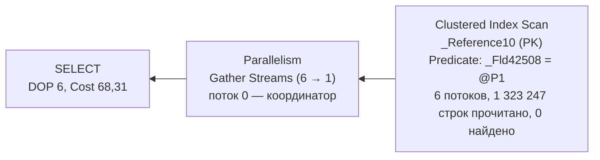
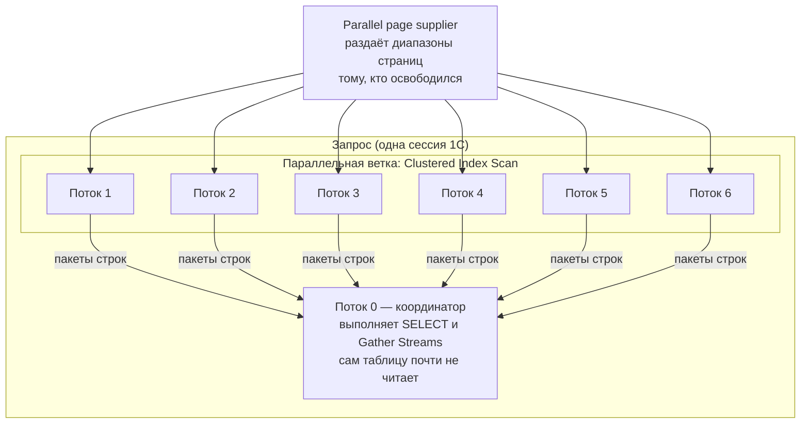
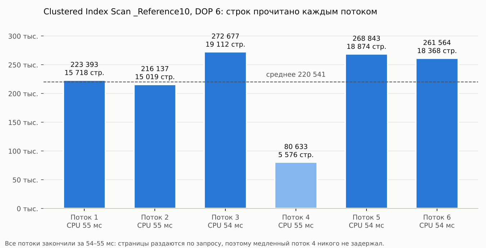
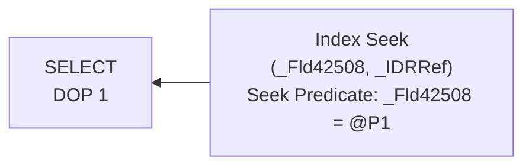

# 15. Параллелизм на реальном плане 1С

[← RLS на реальных планах](14-rls-real-plans.md) · [Оглавление](../README.md)

Разбор **фактического** параллельного плана простого запроса 1С: поиск элемента справочника по значению неиндексированного реквизита. Справочник на 1,32 млн элементов, SQL Server 2019. На этом плане видно всё, что нужно знать о параллелизме для аттестации: как сервер решает распараллелить запрос, как работа делится между потоками, что значат счётчики по потокам и почему параллелизм здесь не помогает, а только прячет настоящую проблему.

Теория — в [вопросе 52](05-plans-operators.md#52-параллелизм). Здесь — практика.

**Файл плана** (откройте в SSMS двойным щелчком, свойства по F4):
- [`plans/parallel_scan_reference_no_index.sqlplan`](../plans/parallel_scan_reference_no_index.sqlplan) — Clustered Index Scan справочника в 6 потоков, 0 найденных строк.

---

## 1. Что за запрос

Из плана восстанавливается такой SQL:

```sql
SELECT T1._IDRRef
FROM dbo._Reference10 T1
WHERE T1._Fld42508 = @P1        -- @P1 nvarchar(4000) = N'253007001'
```

В языке 1С это примерно:

```bsl
ВЫБРАТЬ
	Спр.Ссылка
ИЗ
	Справочник.<Имя> КАК Спр
ГДЕ
	Спр.<СтроковыйРеквизит> = &Значение
```

Обычный «найти ссылку по реквизиту». Значение из 9 цифр похоже на КПП, а 1,3 млн элементов — на справочник контрагентов, но для разбора это не важно. Важно другое: **по реквизиту `_Fld42508` нет индекса**. Ниже видно, как это следует из плана.

## 2. Общая картина: свойства корневого SELECT

| Свойство | Значение | Вывод |
|---|---|---|
| `Estimated Subtree Cost` | **68,31** | Дорого. Порог параллелизма по умолчанию — 5 |
| `Degree of Parallelism` | **6** | План выполнялся в 6 рабочих потоков |
| `ThreadStat` | `Branches = 1`, `UsedThreads = 6`, `ReservedThreads = 6` | Одна параллельная ветка, на неё зарезервировано и использовано 6 потоков |
| `EstimatedAvailableDegreeOfParallelism` | 3 | DOP, с которым оптимизатор **считал стоимость**. Фактический DOP выбирается при запуске и здесь оказался больше |
| `QueryTimeStats` | Elapsed **56 мс**, CPU **331 мс** | CPU в 6 раз больше времени: работали 6 ядер одновременно |
| `MemoryGrant` | 104 КБ, `SerialRequiredMemory = 0` | Sort и Hash нет, последовательному плану память не нужна. 104 КБ — буферы обмена между потоками |
| `CompileTime` / `CompileCPU` | 624 мс / 6 мс | Компиляция почти целиком **ждала** — синхронного построения статистики (раздел 6) |
| `MissingIndexes` | `_Reference10 (_Fld42508)`, Impact **96,17%** | Сервер сам говорит: индекс убрал бы почти всю стоимость |
| `OptimizerStatsUsage` | `_WA_Sys_0000002E_…`, создана 09.10.2026 09:03, выборка 3,64% | Статистика по колонке создана автоматически в момент компиляции — индекса по полю нет |
| `Parameter List` → `@P1` | `nvarchar(4000)` | Тип параметра совпадает с типом колонки, `CONVERT_IMPLICIT` нет |

## 3. Дерево плана

План из двух операторов:



- **Clustered Index Scan** — чтение всей таблицы. Условие `_Fld42508 = @P1` стоит в `Predicate`, а не в `Seek Predicates`: искать по нему нечем, каждая строка проверяется ([вопрос 44](05-plans-operators.md#44-seek-predicate-и-predicate-residual)). Флаг `Parallel = True`.
- **Parallelism (Gather Streams)** — оператор обмена. Собирает строки из шести потоков в один поток координатора и отдаёт их клиенту. В графическом плане у параллельных операторов жёлтый кружок с двумя стрелками.

## 4. Как работа поделена между потоками

### Кто есть кто



- **Рабочий поток (worker)** — поток SQL Server, который выполняет часть плана. Каждый поток привязан к **планировщику (scheduler)**, а планировщик — к логическому ядру процессора. Поэтому «запрос идёт в 6 потоков» на практике означает «запрос занял 6 ядер».
- **Поток 0 (координатор)** — основной поток сессии. Он запускает параллельную ветку, ждёт строки от рабочих потоков и выполняет то, что стоит левее Gather Streams.
- **Parallel page supplier** — механизм, который раздаёт потокам страницы таблицы. Он не режет таблицу заранее на шесть равных кусков, а выдаёт **очередную порцию тому потоку, который закончил предыдущую** (demand-based).

### Счётчики по потокам

В фактическом плане у каждого оператора есть счётчики **отдельно по каждому потоку** (в SSMS: свойство `Actual Number of Rows` → раскрыть, в XML — `RunTimeCountersPerThread`). Для Clustered Index Scan:

| Поток | Строк прочитано | Логических чтений | CPU, мс | Время, мс |
|---|---:|---:|---:|---:|
| 1 | 223 393 | 15 718 | 55 | 55 |
| 2 | 216 137 | 15 019 | 55 | 55 |
| 3 | 272 677 | 19 112 | 54 | 54 |
| 4 | **80 633** | **5 576** | 55 | 55 |
| 5 | 268 843 | 18 874 | 54 | 54 |
| 6 | 261 564 | 18 368 | 54 | 55 |
| 0 (координатор) | 0 | 2 | 0 | 0 |
| **Итого** | **1 323 247** | **92 669** | **327** | — |



Что отсюда следует:

1. **Сумма строк = размер таблицы.** 1 323 247 прочитанных строк совпадает с `TableCardinality`. Каждую строку прочитал ровно один поток, работа не дублировалась.
2. **92 669 логических чтений ≈ 724 МБ страниц.** Все страницы были в памяти (`ActualPhysicalReads = 0`). На проде при холодном кэше это будет чтение с диска.
3. **Поток 4 прочитал в 3,4 раза меньше страниц, чем поток 3, но работал столько же времени и CPU.** Значит, он обрабатывал каждую страницу медленнее. Причину план не показывает: например, соседняя нагрузка на его планировщике или логическое ядро, которое делит физическое ядро с другим потоком (Hyper-Threading).
4. **Перекоса по времени нет.** Все потоки закончили за 54–55 мс. Медленный поток просто взял меньше страниц, остальные разобрали его долю. Так работает раздача по запросу: при параллельном **чтении** таблицы перекос по времени бывает редко.

> **Где настоящий перекос (skew).** Он появляется после **Repartition Streams** по хешу ключа: если 90% строк имеют одно значение ключа, все они уйдут в один поток, и остальные будут ждать его, накапливая `CXPACKET`. Пример — в [`04_parallelism_demo.sql`](../sql/04_parallelism_demo.sql). В этом плане обмена Repartition нет, поэтому и перекоса нет.

### CPU и время

```text
Последовательно:  [████████████████████████████████████]  ≈ 330 мс на одном ядре
Параллельно:      [██████]  поток 1  ┐
                  [██████]  поток 2  │
                  [██████]  поток 3  ├─ ≈ 55 мс по часам,
                  [██████]  поток 4  │   ≈ 330 мс CPU суммарно
                  [██████]  поток 5  │
                  [██████]  поток 6  ┘
```

Параллелизм **не уменьшает работу**, он распределяет её по ядрам. Отсюда главный признак параллельного запроса в трассе и в ТЖ: **CPU больше Duration** ([вопрос 64](07-profiler-metrics.md#64-duration-cpu-и-reads-большое-duration-при-маленьком-cpu), [кейс 8](11-case-studies.md#кейс-8-cpu-больше-duration-тяжёлый-параллельный-отчёт)). Здесь 331 / 56 ≈ 5,9 — почти идеальное ускорение на 6 потоках.

## 5. Почему сервер выбрал параллельный план

### Стоимость выше порога

Оптимизатор сначала оценивает последовательный план. Если его стоимость выше `cost threshold for parallelism`, он строит и параллельный вариант и берёт более дешёвый ([вопрос 22](03-optimizer.md#22-фазы-оптимизации)).

Проверим по формулам стоимости скана ([вопрос 55а](05-plans-operators.md#55а-анализ-плана-выполнения-по-стоимости-операторов)):

| Часть | Формула | Последовательно | Параллельно (DOP 3 для расчёта) |
|---|---|---:|---:|
| I/O | 0,003125 + 0,00074074 × (страниц − 1) | 67,59 | 67,59 — **не делится** |
| CPU | 0,0001581 + 0,0000011 × (строк − 1) | 1,456 | 1,456 / 3 = **0,485** |
| Обмен | Gather Streams | — | ≈ 0,03 + накладные |
| **Итого** | | **≈ 69,0** | **68,31** |

Значение 0,485 в плане (`EstimateCPU` у скана) совпадает с расчётом: оптимизатор поделил CPU на `EstimatedAvailableDegreeOfParallelism = 3`. Это условное число потоков для расчёта стоимости; фактические 6 сервер выбрал уже при запуске ([кто и когда выбирает число потоков](05-plans-operators.md#кто-и-когда-выбирает-число-потоков)).

Выводы:
- стоимость 69 многократно выше порога 5, поэтому параллельный вариант рассматривался;
- параллельный план дешевле **всего на ~1%**: модель считает, что потоки ускоряют только CPU, а I/O — нет. Но этого «чуть дешевле» достаточно, чтобы его выбрать;
- на деле скан из памяти — это почти чистый CPU, поэтому реальный выигрыш по времени оказался почти шестикратным.

### Какие настройки это разрешили

- `max degree of parallelism` на сервере (или `MAXDOP` на уровне базы) равен 0 или не меньше 6 — иначе DOP 6 не получился бы;
- `cost threshold for parallelism` ниже 68 — скорее всего, стоит значение по умолчанию 5.

Проверить у себя:

```sql
SELECT name, value_in_use
FROM sys.configurations
WHERE name IN (N'max degree of parallelism', N'cost threshold for parallelism');

SELECT name, value
FROM sys.database_scoped_configurations
WHERE name = N'MAXDOP';
```

## 6. Попутно: компиляция 624 мс

`CompileTime = 624 мс` при `CompileCPU = 6 мс`: 618 мс компиляция **ждала**. Причина — в `OptimizerStatsUsage`: статистика `_WA_Sys_0000002E_590663B3` создана в 09:03:56, то есть прямо при компиляции этого запроса ([вопрос 33](04-statistics.md#33-автосоздание-и-автообновление-статистики-порог)). Индекса по полю нет, статистики по нему тоже не было; автосоздание статистики синхронное, и оптимизатор ждал, пока сервер прочитает 3,64% таблицы.

Следствия:
- первый запуск запроса после создания базы или очистки статистики дороже последующих;
- оценка 1 150 строк против фактических 0 — результат грубой выборки 3,64%. Здесь это не влияет на план: при любой оценке пришлось бы читать всю таблицу.

## 7. Что здесь не так на самом деле

Параллелизм в этом плане — **не проблема, а симптом**. Шесть ядер дружно перебрали 1,3 млн строк, чтобы ничего не найти. Настоящая причина — отсутствие индекса по реквизиту.


Чем это плохо в рабочей базе 1С:
- **ресурсы на один запрос.** Каждый вызов занимает 6 рабочих потоков. Если такой поиск выполняется часто — при загрузке документов, обмене, проверке контрагентов, — процессор забивается, у соседних сессий растёт `SOS_SCHEDULER_YIELD`;
- **дефицит потоков.** Число рабочих потоков на сервере ограничено (`max worker threads`). Много одновременных параллельных запросов — и новые запросы ждут свободный поток, появляются ожидания `THREADPOOL`, сервер «зависает» целиком;
- **маскировка.** По времени запрос выглядит быстрым (56 мс), и в ТЖ по `Duration` его можно не заметить. Выдаёт его только CPU и Reads.

## 8. Как исправить

**1. Убрать причину — индекс.** В конфигураторе у реквизита включить свойство **«Индексировать»**. Платформа создаст индекс `(_Fld42508, _IDRRef)` ([вопрос 77](08-1c-specifics.md#77-как-индексы-объектов-1с-отображаются-в-индексы-субд)). Запрос возвращает только ссылку, а ссылка входит в индекс, поэтому он будет **покрывающим**. Ожидаемый план:



- несколько логических чтений вместо 92 669;
- стоимость порядка 0,003 — далеко ниже порога, поэтому план будет **последовательным**, параллелизм просто не понадобится.

Это ожидаемый результат по модели стоимости. Проверьте его на своей базе, сняв план после добавления индекса.

**2. Проверить, правильно ли ищут.** Если реквизит — КПП, искать только по нему странно: КПП не уникален. Обычно ищут по ИНН или по ИНН + КПП. ИНН в типовых конфигурациях, как правило, уже проиндексирован, и тогда новый индекс не нужен — достаточно поменять отбор.

**3. Настройки сервера — только после пунктов 1–2.** Для баз 1С традиционно ставят `max degree of parallelism = 1` или поднимают `cost threshold for parallelism`, чтобы параллельными становились только действительно тяжёлые запросы ([вопрос 52](05-plans-operators.md#52-параллелизм)). Но настройка не уменьшит чтения: с MAXDOP 1 тот же запрос будет читать те же 92 669 страниц, только на одном ядре и около 330 мс.

**Как сравнить в SSMS.** Запрос 1С хинтом не изменить, но SQL из плана можно выполнить в SSMS на тестовой копии:

```sql
SET STATISTICS IO, TIME ON;

DECLARE @P1 nvarchar(4000) = N'253007001';

SELECT T1._IDRRef FROM dbo._Reference10 T1
WHERE T1._Fld42508 = @P1;                      -- как есть: параллельно

SELECT T1._IDRRef FROM dbo._Reference10 T1
WHERE T1._Fld42508 = @P1
OPTION (MAXDOP 1);                             -- то же последовательно
```

Ожидание: logical reads одинаковые, `CPU time` примерно равный, а `elapsed time` у второго запроса в несколько раз больше. Это наглядно показывает, что параллелизм меняет только время по часам, но не объём работы.

## 9. Чек-лист: параллелизм в любом плане

1. **SELECT, F4:** `Degree of Parallelism` больше 1? `ThreadStat`: сколько веток и потоков зарезервировано.
2. **Значки** параллелизма на операторах; где стоят обмены: Gather, Repartition, Distribute Streams.
3. **Стоимость плана** против `cost threshold for parallelism`. Из-за чего она высокая: скан большой таблицы, Hash по миллионам строк, Sort?
4. **Счётчики по потокам** у самого тяжёлого оператора:
   - сумма строк — сколько работы всего;
   - распределение между потоками — есть ли перекос;
   - время потоков — ждал ли кто-то самого медленного.
5. **CPU против Elapsed** в `QueryTimeStats`: отношение ≈ DOP — потоки работали равномерно; намного меньше DOP — потоки простаивали (перекос, ожидания).
6. **Memory grant** при отсутствии Sort и Hash — это буферы обмена; при большом DOP и многих обменах он растёт.
7. **Причина, а не симптом:** можно ли уменьшить чтения (индекс, саргабельное условие, временная таблица)? Если да — сначала это. После этого план часто становится последовательным сам.
8. **Только потом** — настройки MAXDOP и cost threshold.

---

[← RLS на реальных планах](14-rls-real-plans.md) · [Оглавление](../README.md)
